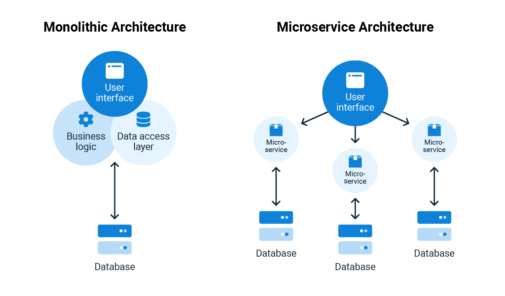

# 整体服务对微服务——章鱼部署

> 原文：<https://octopus.com/blog/monoliths-vs-microservices>

单片和微服务是构建软件的两种方法。您选择哪一个可以显著影响开发和性能。

在这篇文章中，我讨论了:

*   单片和微服务的区别
*   对于企业软件应用程序，哪一个更好
*   两种方法的挑战

## 什么是单片和微服务？

monolith 是一个单一的可执行软件应用程序。它包含一个代码库，用于定义运行应用程序所需的用户界面、应用程序逻辑和数据库。整体式应用程序是作为一个单一的、不可分割的单元构建和维护的，并从一个中心位置提供服务。例如，使用数据库存储客户记录的内部会计软件、用于保存记录的 web 服务器以及其他组件，所有这些都由内部服务器提供。

相比之下，微服务架构将应用程序分解成更小的独立单元。微服务通过应用编程接口(API)连接起来，做成整个应用。

API 允许微服务相互通信来执行任务。例如，一个微服务向另一个微服务发送输入数据。第二个微服务将输入数据发送给其他几个微服务，依此类推。相同的会计软件可以运行在云上，数据库、web 服务器和其他组件分布在多个地理区域。

微服务是模块化的。它们的组件是独立构建的，只有在需要创建应用程序时才会关联起来。通过软件重用，为微服务构建的数据库组件可以是两个不同软件应用程序的一部分。

下图直观地展示了单片和微服务之间的区别。关键的一点是，monoliths 是具有若干服务的大型单元，而使用微服务的应用程序是由若干独立的微服务组成的。

## 企业软件应用哪个好？

传统上，软件应用程序是作为整体构建的。然而，随着云技术的进步，特别是容器化，微服务在交付软件方面变得流行起来。谷歌趋势显示，微服务在 2013 年后开始流行。也是在 2013 年，领先的集装箱化技术 Docker 发布。

微服务比单片更灵活，因为微服务之间有更多的隔离。构建、测试和部署一个单一的应用程序涉及到整个代码库。您可以构建每个微服务并独立测试，而无需构建更大的应用程序。微服务的灵活性也意味着它们比整体服务更具可重用性。要重用来自 monolith 的代码，您需要为新的应用程序创建接口。通过 API，微服务可以与其他应用程序直接交互，从而更容易重用。

容器是一个轻量级的、可移植的计算环境，其中包含了独立运行所需的所有文件。容器化是使应用程序作为容器运行的过程。容器化有助于微服务通过扩展获得普及和广泛采用。微服务应用利用 Kubernetes 等云编排工具来调度和扩展工作负载。

假设一个应用程序包含一个数据库和一个 web 前端，但是这个数据库还服务于另一个应用程序。Kubernetes 节点通过增加或减少每个服务的负载来动态管理前端和数据库的负载。Kubernetes 节点服务于 2 个应用程序，并且只使用任务所需的资源。monolith 只能通过添加更多节点来扩展整个应用程序，从而产生不必要的成本。

企业软件应用程序大规模运行，并与其他产品竞争市场份额。我们在 DORA metrics 上的[帖子讨论了部署频率、交付周期、平均恢复时间(MTTR)和变更失败率等基于敏捷性的指标对于提高盈利能力、市场份额和生产效率的重要性。微服务比单片更敏捷、更灵活，允许微服务应用更快地投放市场，并实现大规模成本节约。微服务可以通过反馈迭代交付，而不是作为单一的可执行文件交付。微服务的优势使其非常适合企业软件应用。](https://octopus.com/blog/dora-metrics-devops-business-outcomes)

## 使用微服务的挑战

尽管有很多好处，但在单片上使用微服务还是存在挑战。使用微服务的应用程序可以对一个函数进行数百次 API 调用，而 monolith 应用程序只需要一次。对于需要多个函数的应用程序来说，Monoliths 可以有更高的性能，因为每个函数不需要多个 API 调用。

整体架构和微服务架构都可能很复杂。当开发一个整体时，你最终会得到一个大的应用程序代码库。单个开发人员或团队不太可能完全理解应用程序。

微服务包含多个交互服务，每个服务可以使用不同的框架，这使得它更加复杂。随着服务数量的增长，微服务中的服务数量也增加了对文档的需求。

微服务中的停机时间可能会对应用程序产生级联效应。尽管微服务是独立的，但它们是相互联系的。如果一个微服务发送不正确的输出，这可能会导致其他微服务的行为不可预测。微服务是分散的，这就引入了网络问题。防火墙、延迟和安全性在微服务中是比在单片服务中更重要的问题，在单片服务中，应用程序是独立的，并且在中央位置运行。

## 结论

单片和微服务是软件开发的两种方法。2013 年左右，随着云和容器技术的改进，微服务开始流行。Monoliths 是一个单一的可执行程序，提供了高性能，但灵活性较低。微服务是独立的服务，它们组成了一个更大的应用程序，提供高敏捷性、灵活性和可伸缩性。这些优势使微服务更适合企业软件应用，只要你意识到挑战。

愉快的部署！