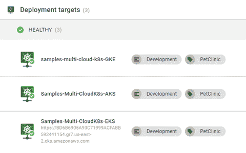

# 使用 Octopus Deploy 的多云 Kubernetes-Octopus Deploy

> 原文：<https://octopus.com/blog/multi-cloud-kubernetes>

在云平台上容器化应用是一个热门话题。三大云提供商(Azure、亚马逊网络服务(AWS)和谷歌云平台(GCP))都实施了 Kubernetes (K8s)平台服务:

*   蓝色库柏服务(AK)
*   Elastic Kubernetes Service (EKS)
*   谷歌 Kubernetes 引擎(GKE)

在本文中，我演示了使用 Octopus Deploy 从一个 K8s 云平台迁移到另一个平台是多么容易。

## 创建集群

在开始部署之前，在上面提到的每个云提供商(Azure、AWS 和 GCP)中创建一个集群。每个提供程序都有可供您使用的命令行界面(CLI)。

使用 Octopus Deploy 的 [Runbooks](https://octopus.com/docs/runbooks) 特性来创建集群。此外，您需要使用[Workers](https://octopus.com/docs/projects/steps/execution-containers-for-workers)特性的执行容器，因为 [Worker tools](https://hub.docker.com/r/octopusdeploy/worker-tools) 镜像包含了所有三个平台以及 kubectl 的 CLI。

(以下截图是在用章鱼云。Octopus 的自托管实例需要创建一个安装了 Docker 的 Worker 来使用这个特性。)

[](#)

您需要为 Docker 注册中心(如 Docker Hub)配置一个外部提要，以使用执行容器特性。

### 蔚蓝的

要使用 AKS，首先需要[创建一个 Azure 服务主体](https://docs.microsoft.com/en-us/azure/active-directory/develop/howto-create-service-principal-portal)。

这篇文章假设你熟悉如何创建 Azure 服务主体，所以不做讨论。

创建服务主体后，将其添加为 Octopus Deploy 中的 Azure 帐户。

您需要以下信息才能将其添加到 Octopus:

*   订阅 ID
*   目录(租户)ID
*   应用程序(客户端)ID
*   应用程序密钥/密码(应用程序注册的客户端密码)

微软开发了 Azure CLI 来连接你所有的 Azure 资源。使用 CLI，您可以创建一个 K8s 集群，并通过 3 个步骤将其添加到 Octopus Deploy:

1.  创建**资源组**
2.  创建 K8s 集群
3.  将集群添加为部署目标

#### 创建资源组

流程中的前两步使用了**运行 Azure 脚本**步骤模板。

向 runbook 添加一个步骤，选择 Azure 类别，然后选择**运行 Azure 脚本**步骤。

[](#)

**运行 Azure 脚本**需要您之前配置的 Azure 帐户，因此选择该帐户，然后添加以下脚本:

```
$resourceGroupName = "<ResourceGroupName>"
$resourceGroupLocation = "<ResourceGroupRegionCode>"

if ((az group exists --name $resourceGroupName) -eq $false)
{
    Write-Output "Creating resource group $resourceGroupName in $resourceGroupLocation"
    az group create --location $resourceGroupLocation --name $resourceGroupName
} 
```

#### 创建 K8s 集群

创建了**资源组**之后，您现在可以创建 K8s 集群了。

重复创建资源组的步骤，向 runbook 流程添加另一个**Run Azure 脚本**。

添加以下脚本:

```
# Get the variables
$clusterName = "<Name of cluster to create>"
$resourceGroupName = "<Resource group name you created from previous step>"
$azureLocation = "<Azure region code>"
$dnsPrefix = "<DNS prefix>"
$azureNodeSize = "<VM size to be used for nodes>"
$azureServicePrincipalClientId = "<Client ID>"
$azureServicePrincipalSecretKey = "<Key/Password for Service Principal Account>"

# Create the Azure Kubernetes cluster
$azureKubernetesCluster = az aks create --name $clusterName --resource-group $resourceGroupName --dns-name-prefix $dnsPrefix --location $azureLocation --node-count 1 --node-vm-size $azureNodeSize --generate-ssh-keys --service-principal $azureServicePrincipalClientId --client-secret $azureServicePrincipalSecretKey
$azureKubernetesCluster = $azureKubernetesCluster | ConvertFrom-JSON

$azureKubernetesCluster 
```

如果您将 Azure 帐户添加为变量，您可以直接从变量中检索客户端 ID 和密钥/密码，而无需再次输入。例如，如果创建名为`Azure.Account.Name`的变量，可以使用以下语法:

```
$clientId = $OctopusParameters['Azure.Account.Name.Client']
$secretKey = $OctopusParameters['Azure.Account.Name.Password'] 
```

#### 将集群添加为部署目标

第三步也是最后一步是注册集群，将 Octopus Deploy 作为部署目标。

Octopus Deploy cmdlet `New-OctopusKubernetesTarget`使得创建 K8s 集群作为目标成为一行操作。

向操作手册添加一个**运行脚本**步骤，并使用以下脚本:

```
# Get the variables
$clusterName = "<Name of the cluster>"
$resourceGroupName = "<Name of the resource group the cluster is in>"

# Add new Kubernetes cluster target
New-OctopusKubernetesTarget -Name "<Display name of target>" -clusterName $clusterName -clusterResourceGroup $resourceGroupName -octopusRoles "<Role list>" -octopusAccountIdOrName "<Name of Azure Account>" -namespace "default" -skipTlsVerification $true 
```

### 自动警报系统

与 Azure 类似，首先在 Octopus Deploy 中创建一个 AWS 帐户，以便与您的 AWS 资源进行交互。

这篇文章假设你熟悉如何[创建 AWS IAM 用户](https://docs.aws.amazon.com/IAM/latest/UserGuide/id_users_create.html)。

要在 Octopus 中创建 AWS 帐户，您需要以下内容:

亚马逊开发了 AWS CLI，可以用来与你所有的 AWS 资源接口。使用 CLI，您可以创建一个 K8s 集群，并分两步将其添加到 Octopus Deploy:

1.  创建 EKS 集群
2.  将集群添加为部署目标

创建 AWS 帐户的另一种方法是在虚拟机上使用 IAM 角色来执行集群的创建。使用 IAM 角色将在**创建 EKS 集群**步骤中指定。

#### 创建 EKS 集群

要创建 EKS 集群，首先在 runbook 中添加一个**Run AWS CLI 脚本**。向操作手册添加一个步骤，选择 AWS 类别:

[](#)

运行 AWS CLI 脚本的**能够使用 IAM 角色或在不同的 AWS 服务角色下执行。对于这篇文章，您使用前面创建的 AWS 帐户。除了帐户之外，模板还需要知道 AWS 地区代码。添加之后，添加以下脚本来创建 EKS 集群:**

```
# Get variables
$clusterName = "<Name of the cluster>"
$region = "<AWS Region code>"
$roleArn = "<AWS Role Arn that can create K8s clusters>"
$subnet1Id = "<ID of first subnet to use in your AWS VPC>"
$subnet2Id = "<ID of second subnet to use in your AWS VPC>"
$securityGroupId = "<ID of the security group to use in your AWS VPC>"

# Create EKS cluster
$eksCluster = aws eks create-cluster --name $clusterName --role-arn $roleArn --resources-vpc-config subnetIds=$subnet1Id,$subnet2Id,securityGroupIds=$securityGroupId
$eksCluster = $eksCluster | ConvertFrom-JSON

# Wait until the cluster is in a CREATING state
Write-Host "Waiting for cluster to be done creating..."
while ($eksCluster.Cluster.Status -eq "CREATING")
{
    # Wait for cluster to be done creating
    $eksCluster = aws eks describe-cluster --name $clusterName --instance-types "t3.medium" --instance-count 1
    $eksCluster = $eksCluster | ConvertFrom-JSON
}

# Display the final status of the cluster
Write-Host "Status of cluster: $($eksCluster.Cluster.Status)"

Write-Host "Creating node group..."
aws eks create-nodegroup --cluster-name $clusterName --nodegroup-name "$clusterName-workers" --subnets $subnet1Id $subnet2Id --instance-types "t3.medium" --node-role $nodeRoleArn

# Save the endpoint to an output variable
Set-OctopusVariable -name "EKSURL" -value $eksCluster.Cluster.Endpoint 
```

在三种 CLI 实现中，EKS 是唯一一种要求您在单独的命令中定义节点的实现。

#### 将集群添加为部署目标

向 runbook 添加一个**运行脚本**步骤(参见 Azure 部分的截图以供参考)。再次使用`New-OctopusKubernetesTarget` cmdlet，但是参数略有不同:

```
# Get the variables
$clusterName = "<Name of cluster>"
$region = "<AWS region code>"
$eksUrl = $OctopusParameters['Octopus.Action[Create EKS Cluster].Output.EKSURL']

# Add new Kubernetes cluster target
New-OctopusKubernetesTarget -Name "<Display name of target" -clusterName $clusterName -octopusRoles "<Role list>" -octopusAccountIdOrName "<Name of AWS Account>" -namespace "default" -skipTlsVerification $true -clusterUrl $eksUrl 
```

### GCP

与其他两种方法一样，您首先需要在 Octopus Deploy 中创建一个 Google Cloud 帐户。

这篇文章假设你熟悉如何[在 GCP 创建一个服务账户](https://cloud.google.com/iam/docs/creating-managing-service-accounts)，所以不讨论这部分。

要创建 Google Cloud 帐户，您需要在向服务帐户添加`Key`时生成的 JSON 密钥文件。

谷歌开发了 gcloud CLI，它可以与你所有的 GCP 资源进行交互。使用 CLI，您可以创建一个 K8s 集群，并分两步将其添加到 Octopus Deploy:

*   创建 GKE 集群
*   将集群添加为部署目标

#### 创建 GKE 集群

要创建 GKE 集群，您需要在 runbook 的脚本步骤中添加一个 **Run gcloud。选择 **谷歌云类别➜在脚本步骤中运行 Gcloud。****

[](#)

与 AWS 类似，**在脚本中运行 g cloud**步骤可以使用 VM 服务帐户来执行操作以及模拟。对于这篇文章，请使用您之前创建的 Google 帐户。

填写以下内容:

*   谷歌云账户
*   项目(谷歌云项目)
*   区域或地带

接下来，粘贴以下脚本:

```
# Get variables
$clusterName = "<Cluster name>"

# Get the GKE default kubernetes version
$kubernetesVersion = (gcloud container get-server-config --flatten="channels" --filter="channels.channel=STABLE" --format="json" | ConvertFrom-JSON)
$kubernetesVersion = $kubernetesVersion.defaultClusterVersion

# Create the GKE cluster
$gkeCluster = (gcloud container clusters create $clusterName --cluster-version=$kubernetesVersion --num-nodes=1 --format="json" | ConvertFrom-JSON)

# Save the end point
Set-OctopusVariable -name "GKEURL" -value $gkeCluster.Endpoint 
```

#### 将集群添加为部署目标

在 runbook 中添加一个**运行脚本**步骤(参考 Azure 部分的截图)。在撰写本文时，`New-OctopusKubernetesTarget` cmdlet 还没有更新到可以与 GCP 一起使用，所以注册目标的脚本看起来会有点不同。

```
 # Get the variables
$clusterName = "<Cluster name>"
$octopusUrl = "<Url of your Octopus server>"
$apiKey = "<API Key for registering target>"
$spaceId = $OctopusParameters['Octopus.Space.Id']
$headers = @{ "X-Octopus-ApiKey" = $apiKey }

# Add new Kubernetes cluster target
$newMachine = @{
    Name = "<Display name of target>"
    Endpoint = @{
        CommunicationStyle = "Kubernetes"
        Authentication = @{
            AuthenticationType = "KubernetesGoogleCloud"
            AccountId = "<Google Account>"
            UseVmServiceAccount = $false
            ImpersonateServiceAccount = $false
            Project = "<Google Project Name>"
            Region = "<Google region code>"
            ClusterName = $clusterName
        }
        AccountType = "GoogleCloudAccount"
        DefaultWorkerPoolId = "<Your worker pool id>"
        Container = @{
            FeedId = "<Your external feed id>"
            Image = "octopusdeploy/worker-tools:3.0.0-ubuntu.18.04"
        }
    }
    Roles = @("Test1")
    EnvironmentIds = @($OctopusParameters['Octopus.Environment.Id'])
}

# Call API to register cluster
Invoke-RestMethod -Method Post -Uri "$octopusUrl/api/$spaceId/machines" -Body ($newMachine | ConvertTo-JSON -Depth 10) -Headers $headers 
```

在 GKE 的情况下，您需要指定一个用于健康检查的工作池，并使用执行容器特性。这是因为 Octopus Cloud 中的`Hosted Windows` Worker Pool 没有安装 gcloud CLI，在尝试检查 GKE 集群的运行状况时会失败。

2021 年 11 月更新——`New-OctopusKubernetesTarget`已经更新，可以在 GKE 使用。

```
New-OctopusKubernetesTarget -Name "<Display name of target>" -clusterName $clusterName -octopusRoles "Test1" -octopusAccountIdOrName "<Google Account>" -namespace "default" -skipTlsVerification $true -octopusDefaultWorkerPoolIdOrName "Hosted Ubuntu" -healthCheckContainerImageFeedIdOrName "Docker Hub" -healthCheckContainerImage "octopusdeploy/worker-tools:3-ubuntu.18.04" -clusterRegion <Google region> -clusterProject <Google project name> 
```

如果所有三个 runbooks 都被执行，您应该有 3 个 Kubernetes 集群。

[](#)

## 转换云提供商 K8s 服务

考虑以下场景:您的组织选择使用 AWS 作为其云提供商。您使用以下过程将您的应用程序 PetClinic 部署到 EKS:

*   **部署 MySQL** :这一步将 MySQL 容器部署到 K8s 集群，作为数据库后端。
*   **运行 flyway** :该步骤执行一个 K8s 作业，该作业将在 MySQL 容器上创建和播种数据库。
*   **使用负载平衡器部署 petclinic web**:该步骤为 pet clinic web 前端创建一个部署，并在其前面放置一个负载平衡器。
*   **部署 Kubernetes 入口资源**:这一步在负载均衡器前面创建一个 NGINX 入口控制器。

您的组织刚刚被另一家公司收购，您必须遵守他们的标准，包括云提供商。新的母公司使用 GCP 的所有应用程序，现在您的工作是将 PetClinic 从 EKS 转换到 GKE。

与 Azure Web App 或 AWS Elastic Beanstalk 不同，K8s 部署的 Octopus 部署步骤不是特定于提供者的。同样的过程适用于任何注册为部署目标的 K8s 集群。

大多数向新平台的迁移都是从部署到旧平台和新平台开始的，因此您可以确保它们的功能相同。运行您的 GKE runbook 在 GCP 创建一个 K8s 集群。集群在 Octopus 中注册并显示为健康状态后，创建新版本或重新部署现有版本。

在下面的屏幕截图中，您可以看到两个目标的部署都是成功的，没有对部署过程进行任何更改:

[](#)

如果您运行 runbook 来创建 AKS 集群，您可以看到所有三个目标的部署都是成功的。

[](#)

## 结论

Octopus Deploy 只需要将 API 端点部署到 Kubernetes 集群。无论 K8s 集群是内部部署、云提供商 K8s 服务还是云中运行 Kubernetes 的虚拟机，都没有关系。如果 Octopus Deploy 可以与 K8s API 端点通信，那么它就可以部署到目标，而不必更改流程。

## 观看网络研讨会

[https://www.youtube.com/embed/qlsk8zdTcLA](https://www.youtube.com/embed/qlsk8zdTcLA)

VIDEO

我们定期举办网络研讨会。请参见[网络研讨会页面](https://octopus.com/events)了解过去的网络研讨会以及即将举办的网络研讨会的详细信息。

愉快的部署！