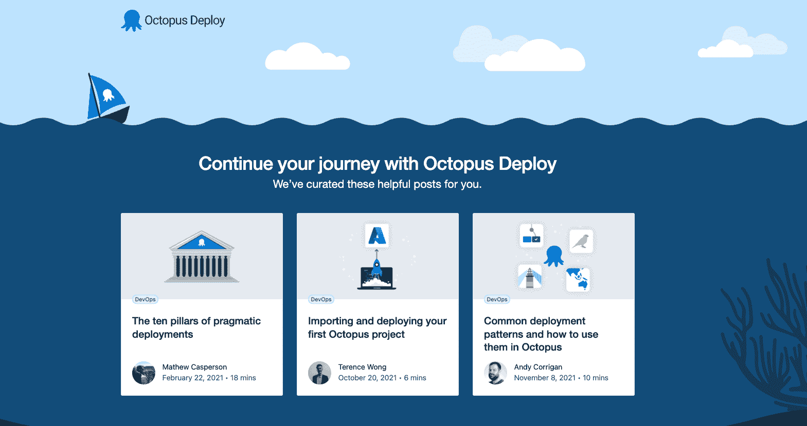

# 使用 GitHub 操作和 Octopus - Octopus 部署的多环境部署

> 原文：<https://octopus.com/blog/multi-environment-deployments-github-actions>

GitHub Actions 允许开发人员在 GitHub 存储库中执行 DevOps 操作。GitHub 社区维护集成了第三方工具和存储库的模板，如 Jenkins 或 Amazon 弹性容器注册中心(ECR)。

虽然 GitHub Actions 提供了一个包含的解决方案，但像 Octopus Deploy 这样的专用连续交付工具为您提供了一些好处，如环境、可视化环境的仪表板以及用于一致用户体验的标准化步骤模板库。

在本文中，我将向您展示如何在 GitHub Actions 工作流中构建 Docker 图像，将图像发布到 Amazon Elastic Container Registry(ECR ),并使用 Octopus 将图像部署到 Amazon Elastic Kubernetes Service(EKS)上的 web 应用程序。

## 先决条件

要跟进，您需要:

*   亚马逊网络服务(AWS)帐户
*   GitHub 账户

这个帖子使用了 [Octopus 水下应用库](https://github.com/OctopusSamples/octopus-underwater-app)。您可以派生存储库并跟随它。或者，github-octopus 分支包含完成本文步骤所需的模板文件。你必须用你自己的价值观来取代一些价值观，但我在这篇文章中列出了我的价值观作为参考。

## 亚马逊网络服务设置

要为 GitHub 操作设置 AWS，您需要创建一个访问键和一个 ECR 存储库来存储图像。

要创建访问密钥，请转到**亚马逊控制台**，然后 **IAM** ，然后**用户**、`[your user]`，然后**安全凭证**，然后**创建访问密钥**。

您的浏览器下载一个包含访问密钥 ID 和秘密访问密钥的文件。Jenkins 使用这些值向 Amazon 认证。

要创建存储库，请转到**亚马逊控制台**，然后是 **ECR** ，然后是**创建存储库**。

您需要为发布的每个图像建立一个图像存储库。给存储库起一个您想让图像起的名字。

你会在**亚马逊 ECR** 下看到你的仓库，然后是**仓库**。记下它所在的区域，在 URI 场。

[](#)

### AWS 集群设置

按照我们文章中的步骤在 AWS 中设置集群，[在 AWS 中创建 EKS 集群](https://octopus.com/blog/eks-cluster-aws)。

## GitHub 设置

对于这个示例，您使用一个示例 web 应用程序来显示名为 simple-octo 的水下章鱼动画。

在`https://github.com/OctopusSamples/octopus-underwater-app`分叉存储库。

转到**设置**，然后是**机密**，然后是**新储存库机密**。

*   **REPO_NAME** -您创建的 AWS ECR 存储库的名称
*   **AWS_ACCESS_KEY_ID** -之前的访问密钥 ID
*   **AWS _ SECRET _ ACCESS _ KEY**-之前的秘密访问密钥
*   **八达通服务器** -你的八达通服务器网址
*   **OCTOPUS_APIKEY** -你的 OCTOPUS 实例 APIKEY
    *   要创建一个，进入**你的用户名**，然后**个人资料**，然后**我的 API 密匙**，然后**新 API 密匙**

您需要在存储库中创建一个工作流文件。GitHub Actions 工作流包含对代码库执行操作的说明。几个预构建的步骤模板允许您在代码存储库上执行许多不同的任务。在本例中，您使用一个 step 模板来构建代码并将其推送到 AWS ECR 存储库，然后从 Octopus 部署它。

在。根文件夹的 github/workflow 目录。将以下代码粘贴到 main.yml 文件中:

```
on:
  push:
    branches: [ main ]
  pull_request:
    branches: [ main ]

name: AWS ECR push

jobs:
  deploy:
    name: Deploy
    runs-on: ubuntu-latest

    steps:
    - name: Install Octopus CLI
      uses: OctopusDeploy/install-octopus-cli-action@v1.1.1
      with:
          version: latest
    - name: Checkout
      uses: actions/checkout@v2

    - name: Configure AWS credentials
      uses: aws-actions/configure-aws-credentials@v1
      with:
        aws-access-key-id: ${{ secrets.AWS_ACCESS_KEY_ID }}
        aws-secret-access-key: ${{ secrets.AWS_SECRET_ACCESS_KEY }}
        aws-region: us-east-2

    - name: Login to Amazon ECR
      id: login-ecr
      uses: aws-actions/amazon-ecr-login@v1

    - name: Build, tag, and push the image to Amazon ECR
      id: build-image
      env:
        ECR_REGISTRY: ${{ steps.login-ecr.outputs.registry }}
        ECR_REPOSITORY: ${{ secrets.REPO_NAME }}
        IMAGE_TAG: "latest"

      run: |
        # Build a docker container and push it to ECR 
        docker build -t $ECR_REGISTRY/$ECR_REPOSITORY:$IMAGE_TAG .
        echo "Pushing image to ECR..."
        docker push $ECR_REGISTRY/$ECR_REPOSITORY:$IMAGE_TAG
        echo "::set-output name=image::$ECR_REGISTRY/$ECR_REPOSITORY:$IMAGE_TAG"

    - name: create Octopus release
      run: octo create-release --project underwater-octo-github --version 0.0.i --server=${{ secrets.OCTOPUS_SERVER }} --apiKey=${{ secrets.OCTOPUS_APIKEY }}

    - name: deploy Octopus release
      run: octo deploy-release --project underwater-octo-github --version=latest --deployto Development --server=${{ secrets.OCTOPUS_SERVER }} --apiKey=${{ secrets.OCTOPUS_APIKEY }} 
```

GitHub Actions 在主分支的 push 或 pull 请求上创建一个动作。这些步骤包括检查代码、认证并登录 AWS，然后构建、标记并把图像推送到 Amazon ECR。GitHub Actions 可以使用类似的 step 模板推送到其他云存储库，如 Google 或 Microsoft。

提交您的更改并转到**操作**选项卡，然后单击提交消息的标题。您可以看到工作流程完成时的各个阶段。

[](#)

去你的 Amazon ECR 仓库查看图片。

[【](#)

## Octopus 部署设置

在您的 Octopus Deploy 实例中，通过转到**项目**创建一个项目，然后**添加项目**。添加`aws-github`作为标题，点击**保存**。

通过前往**基础设施**，然后**环境**，然后**添加环境**来设置开发环境。给它起个名字，点击**保存**。

对测试和生产环境重复这些步骤。

然后，您需要设置 Amazon 帐户来部署到 EKS。

转到**基础设施**，然后**账户**，然后**添加账户**，然后 **AWS 账户**。给它起个名字，并填写前面的**访问密钥 ID** 和**秘密访问密钥**。

通过转到**基础设施**，然后**部署目标**，然后**添加部署目标**，然后 **Kubernetes 集群**，然后**添加**，在 Octopus Deploy 中将您的 AWS Kubernetes 集群设置为部署目标。

您可以[遵循我们的文档](https://octopus.com/docs/infrastructure/deployment-targets#adding-deployment-targets)中的步骤，这些文档指出了要添加的字段以设置部署目标。在本节中，您将为部署目标指定一个目标角色。这将在后面的 Octopus 部署步骤中引用。

## 部署到 EKS 步骤

在您的`aws-github`项目中，转到**流程**，然后**添加部署步骤**，然后 **Kubernetes** ，然后**部署 Kubernetes 容器**。添加您之前分配给部署目标的目标角色。

将以下 YAML 添加到 YAML 部分:

```
apiVersion: apps/v1
kind: Deployment
metadata:
  name: octopus-underwater-app-github
  labels:
    app: octopus-underwater-app
spec:
  selector:
    matchLabels:
        app: octopus-underwater-app
  replicas: 3
  strategy:
    type: RollingUpdate
  template:
    metadata:
      labels:
        app: octopus-underwater-app
    spec:
      containers:
        - name: octopus-underwater-app
          image: 720766170633.dkr.ecr.us-east-2.amazonaws.com/octopus-underwater-app:latest
          ports:
            - containerPort: 80
              protocol: TCP
          imagePullPolicy: Always 
```

导航回 Octopus 实例**项目概述**以查看部署到开发环境的版本。

[T45](#)

现在，当您准备好的时候，您就可以将产品发布到测试和生产环境中了。点击**部署**进行发布。

[T50](#)

您需要本地端口转发来检查服务。使用此命令检查 web 应用程序。端口 28015 是根据 Kubernetes 文档中的示例选择的:

```
kubectl port-forward deployment/octopus-underwater-app-github  28015:80 
```

在浏览器中转到 IP 地址`http://127.0.0.1:28021/`查看您的 web 应用程序。

[](#)

## 结论

在本文中，您使用 GitHub Actions 和 Octopus Deploy 将一个 web 应用程序部署到亚马逊 EKS。当您使用 Octopus Deploy 作为 CI/CD 工具链中的一个阶段时，您将受益于一个专用的持续交付工具。

Octopus Deploy 集成了几个云存储库，并内置了对发布管理的支持。GitHub Actions 有社区开发的步骤模板。使用这些工具的体验可能因模板而异。通过其 UI，Octopus Deploy 为 step 模板提供了标准化的体验。Octopus 还集成了不同的存储库和云提供商。

查看我们关于使用 GitHub Actions、Kubernetes 和 Octopus Deploy 进行部署的其他帖子:

[试用我们免费的 GitHub Actions 工作流工具](https://oc.to/GithubActionsWorkflowGenerator)，帮助您快速为您的 GitHub Actions 部署生成可定制的工作流。

您还可以了解更多关于使用 GitHub 构建[和使用 Octopus](https://octopus.com/github) 部署的信息，并在 GitHub Marketplace 中使用我们的[验证操作。](https://github.com/marketplace?query=octopus&type=actions&verification=verified_creator)

## 观看我们的 GitHub 行动网络研讨会

[https://www.youtube.com/embed/gLkAs_Cy5t4](https://www.youtube.com/embed/gLkAs_Cy5t4)

VIDEO

阅读我们的[持续集成系列](https://octopus.com/blog/tag/CI%20Series)的其余部分。

愉快的部署！