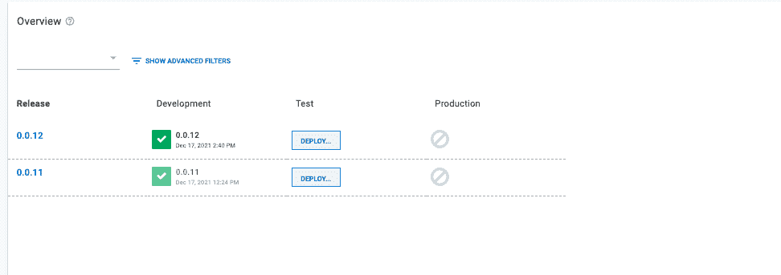
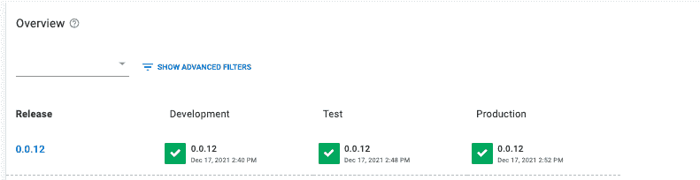
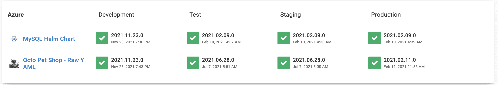

# Jenkins 和 Octopus - Octopus 部署的多环境部署

> 原文：<https://octopus.com/blog/multi-environment-deployments-jenkins>

在部署过程中，构件在部署之前由构建服务器构建。Jenkins 是为多环境设置设计的构建服务器。Jenkins 可以将您的工件打包并推送到一个中央存储库。从这里开始，连续交付(CD)工具可以获取工件并部署它。

Octopus Deploy 是帮助完成这一过程的最佳 CD 工具。Octopus 可以与 Azure、Google 和 Amazon 等主要云提供商进行交互和部署。

在这篇文章中，我将向您展示如何构建 Octopus underwater app 并将其推送到亚马逊弹性容器注册中心(ECR)。詹金斯将在章鱼部署中触发部署。Octopus 随后会将该应用部署到亚马逊弹性 Kubernetes 服务(EKS)。

## 先决条件

要跟进，您需要:

这个帖子使用了 [Octopus 水下应用库](https://github.com/OctopusSamples/octopus-underwater-app)。您可以分叉存储库，并使用主分支来跟进。

jenkins-octopus 分支包含完成本文步骤所需的模板文件。你必须用你自己的价值观来代替一些价值观，但是我已经在这篇文章中列出了我的价值观作为参考。

## 亚马逊网络服务设置

要为 Jenkins 设置 AWS，您需要创建一个访问密钥和一个 ECR 存储库来存储图像。

要创建访问密钥，请转到**亚马逊控制台**，然后 **IAM** ，然后**用户**、`[your user]`，然后**安全凭证**，然后**创建访问密钥**。

您的浏览器下载一个包含访问密钥 ID 和秘密访问密钥的文件。Jenkins 使用这些值向 Amazon 认证。

要创建存储库，请转到**亚马逊控制台**，然后转到 **ECR** ，然后转到**创建存储库**。

您需要为发布的每个图像建立一个图像存储库。给存储库起一个您想让图像起的名字。

你会在**亚马逊 ECR** 下看到你的仓库，然后是**仓库**。记下它所在的区域，在 URI 场。

[](#)

### AWS 集群设置

使用我们上一篇文章[在 AWS 中创建 ESK 集群](https://octopus.com/blog/eks-cluster-aws)中的指南在 AWS 中设置集群。

用 Octopus `release`和`deploy`命令扩展管道。创建一个 Jenkinsfile 并粘贴以下代码:

```
 pipeline {
    agent any
    options {
        skipStagesAfterUnstable()
    }
    stages {
         stage('Clone repository') { 
            steps { 
                script{
                checkout scm
                }
            }
        }

        stage('Build') { 
            steps { 
                script{
                 app = docker.build("octopus-underwater-app")
                }
            }
        }
        stage('Test'){
            steps {
                 echo 'Empty'
            }
        }
        stage('Push') {
            steps {
                script{
                        docker.withRegistry('https://720766170633.dkr.ecr.us-east-2.amazonaws.com', 'ecr:us-east-2:aws-credentials') {
                    app.push("${env.BUILD_NUMBER}")
                    app.push("latest")
                    }
                }
            }
        }
        stage('Deploy'){
            steps {
                script{
                    octopusCreateRelease additionalArgs: '', cancelOnTimeout: false, channel: '', defaultPackageVersion: '', deployThisRelease: false, deploymentTimeout: '', environment: "Development", jenkinsUrlLinkback: false, project: "underwater-octo", releaseNotes: false, releaseNotesFile: '', releaseVersion: "1.0.${BUILD_NUMBER}", tenant: '', tenantTag: '', toolId: 'Default', verboseLogging: false, waitForDeployment: false
                    octopusDeployRelease cancelOnTimeout: false, deploymentTimeout: '', environment: "Development", project: "underwater-octo", releaseVersion: "1.0.${BUILD_NUMBER}", tenant: '', tenantTag: '', toolId: 'Default', variables: '', verboseLogging: false, waitForDeployment: true
                }
            }
        }

    }
} 
```

## Octopus 部署设置

在您的 Octopus Deploy 实例中，您需要创建一个名为`aws-jenkins`的项目:

*   转到**项目**，然后**添加项目**。
*   添加`aws-jenkins`标题，点击**保存**。

接下来，设置开发、测试和生产环境:

*   转到**基础设施**，然后是**环境**，然后是**添加环境**。
*   将其命名为`Development`，点击**保存**。
*   对测试和生产环境进行同样的操作。

您需要设置亚马逊帐户以部署到 EKS:

*   进入**基础设施**，然后**账户**，然后**添加账户**，然后 **AWS 账户**。
*   给它起一个名字，并填写前面的**访问密钥 ID** 和**秘密访问密钥**。

现在您需要在 Octopus Deploy 中将 AWS Kubernetes 集群设置为部署目标:

*   转到**基础设施**，然后**部署目标**，然后**添加部署目标**，然后 **Kubernetes 集群**，然后**添加**。

遵循我们的文档中的[步骤，这些步骤指出了要添加的字段以设置部署目标。在本节中，您将为部署目标指定一个目标角色。这将在后面的 Octopus 部署步骤中引用。](https://octopus.com/docs/infrastructure/deployment-targets#adding-deployment-targets)

您需要将 Amazon 提要添加到 Octopus 实例中:

*   进入**库**，然后**外部进给**，然后**添加进给**，然后选择 **AWS 弹性容器注册表**。
*   输入您的**访问密钥 ID** 、**秘密访问密钥**，以及您的注册表的**区域**。

## 部署到 EKS 步骤

在您的`aws-jenkins`项目中，转到**流程**，然后**添加部署步骤**，然后 **Kubernetes** ，然后**部署 Kubernetes 容器**。添加您之前为部署目标指定的目标角色。

将以下内容添加到 YAML 部分:

```
 apiVersion: apps/v1
kind: Deployment
metadata:
  name: octopus-underwater-app-jenkins
  labels:
    app: octopus-underwater-app
spec:
  selector:
    matchLabels:
        app: octopus-underwater-app
  replicas: 3
  strategy:
    type: RollingUpdate
  template:
    metadata:
      labels:
        app: octopus-underwater-app
    spec:
      containers:
        - name: octopus-underwater-app
          image: 720766170633.dkr.ecr.us-east-2.amazonaws.com/octopus-underwater-app
          ports:
            - containerPort: 80
              protocol: TCP
          imagePullPolicy: Always 
```

点击**保存**。

## 部署在詹金斯

要将 Jenkins 连接到 Octopus，您需要安装 [Octopus 部署插件](https://plugins.jenkins.io/octopusdeploy/)。

转到**仪表板**，然后**管理插件**。如果没有安装插件，在**可用的**选项卡中搜索 Octopus 插件并安装插件。遵循我们文档中的[指南，该指南解释了如何设置 Jenkins 和 Octopus 插件](https://octopus.com/docs/packaging-applications/build-servers/jenkins)。

在设置了 Octopus 插件之后，对 GitHub 中的代码进行更改将会触发 Jenkins 和 Octopus 中的构建。

[](#)

导航回您的 Octopus 实例和**项目**，然后是**概述**，您将会看到部署到开发环境的版本。

[](#)

现在，当您准备好的时候，您就可以将产品发布到测试和生产环境中了。点击**部署**进行发布。

[](#)

您需要本地端口转发来检查服务。使用此命令检查 web 应用程序。端口 28015 基于 Kubernetes 文档中的示例:

```
kubectl port-forward deployment/octopus-underwater-app-jenkins  28015:80 
```

在浏览器中转至 IP 地址`http://127.0.0.1:28021/`查看您的 web 应用程序。

[](#)

Octopus Deploy 是一个专用的连续交付(CD)工具，它本身支持发布管理。Jenkins 通过管道文件定义环境。它们是管道代码的分隔符。

在 Octopus 中，环境是专用空间。Octopus Deploy 使得在将部署推向生产环境之前，可以很容易地停止部署。下面的仪表板展示了这种能力——不同的版本出现在不同的环境中，并且很容易看到版本在生命周期中的位置。

Jenkins 是一个持续集成(CI)工具，它只能完成持续交付的某些部分。Jenkins 通常用于构建图像并将其推送到中央存储库。Octopus Deploy 可以与几个不同的存储库接口，并管理部署过程。这种关注点的分离使 Jenkins 和 Octopus 部署能够专注于他们最擅长的领域，从而实现更愉快的部署。

[](#)

## 结论

在本文中，您使用 Jenkins 构建了一个 web 应用程序，将其推送到 ECR，并使用 Octopus Deploy 管理对 Kubernetes 的部署。

Octopus Deploy 提供了一个专用的仪表板来查看不同阶段的部署。仪表板强调 Octopus Deploy 如何补充像 Jenkins 这样的 CI 工具。

Octopus Deploy 支持所有主要的云提供商，包括 Azure、Google 和 Amazon。如果你还没有使用八达通，你可以开始一个[免费试用](https://octopus.com/start)。

查看我们关于使用 Jenkins、Kubernetes 和 Octopus Deploy 进行部署的其他帖子:

试试我们免费的 Jenkins 管道生成器工具用 Groovy 语法创建一个管道文件。这是您启动管道项目所需的一切。

阅读我们的[持续集成系列](https://octopus.com/blog/tag/CI%20Series)的其余部分。

愉快的部署！