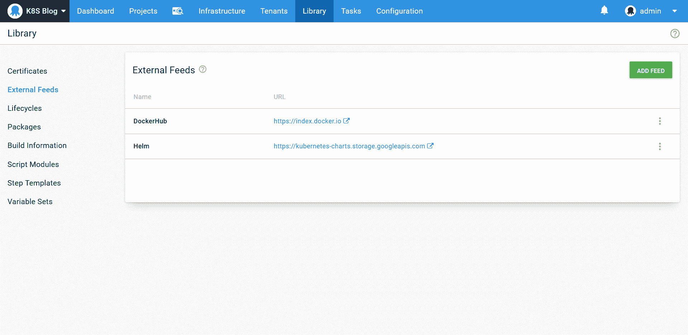
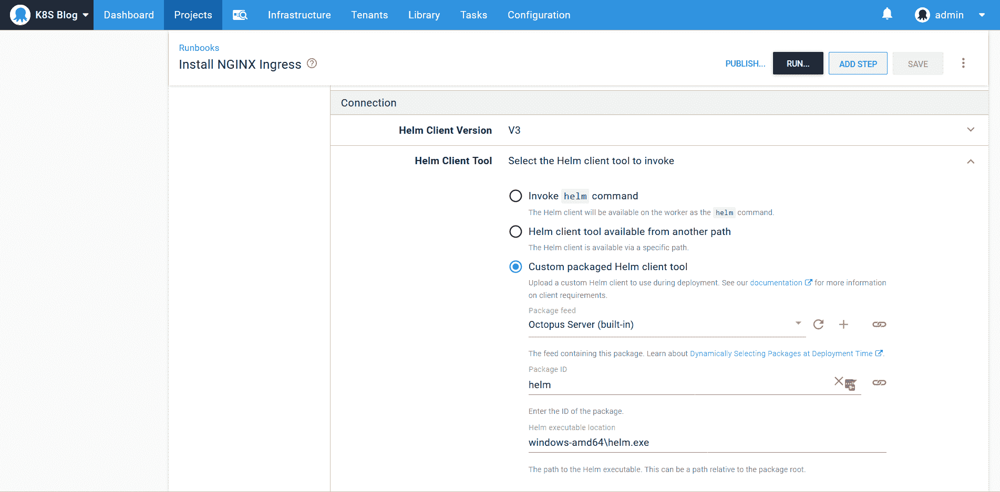

# 创建多环境 Kubernetes 部署- Octopus 部署

> 原文：<https://octopus.com/blog/multi-environment-k8s-deployments>

[](#)

Kubernetes 资源的声明性质提供了一种方便的方式来描述集群的期望状态。然而，Kubernetes 没有本土的环境概念。虽然名称空间提供了一种对集群进行分区的自然机制，但是仅仅通过运行`kubectl`或查看传统的 Kubernetes 仪表板，很难了解部署了什么。

通过 Octopus 管理 Kubernetes 部署，应用程序可以在不同的环境(由名称空间和名称空间受限的服务帐户表示)中运行，当前的环境状态由 Octopus 仪表板汇总。

在这篇博文和截屏中，我们来看看 Kubernetes 部署如何在多种环境中进行。我们还将创建一些操作手册来管理和检查集群，为将来负责支持部署和集群的任何人提供一组基本的自动化工具。

## 截屏

下面的视频演示了将 web 应用程序部署到 Kubernetes 集群中的多个环境的过程。博文的其余部分提供了其他资源的链接和本演示中使用的脚本副本:

[https://www.youtube.com/embed/WexwK4ro9Bs](https://www.youtube.com/embed/WexwK4ro9Bs)

VIDEO

## 饲料

我们的部署需要指向 Docker Hub 的 Docker feed 和 Helm feed:

[](#)

## 环境

我们有三个环境来代表我们部署的应用程序的进展:**开发**、**测试**和**生产**。然后我们有一个名为 **Admin** 的环境，用于管理集群范围内的资源:

[](#)

**开发**、**测试**和**生产**环境都启用了**动态基础设施**选项:

[](#)

## 证书

由 Let's Encrypt 生成的通配符证书已上载到证书库。这将由入口资源稍后使用:

[](#)

## 管理目标

我们需要一个具有管理特权的 Kubernetes 目标作为起点。该目标将用于安装和检查集群范围的工具，如入口控制器，以及创建特定于环境的目标。该目标具有**管理角色**:

[](#)

## 部署目标

从概念上讲，Octopus 中的 Kubernetes 目标是一个安全边界，将部署限制在特定的环境中。在本例中，我们在一个集群中创建多个环境，安全边界由一个名称空间和一个只能访问该名称空间的服务帐户定义。然后，名称空间表示环境，服务帐户的有限范围防止对该名称空间/环境的部署修改任何其他名称空间/环境。

要创建仅限于特定名称空间的服务帐户，必须创建三个 Kubernetes 资源:

*   服务账户
*   一个角色
*   角色绑定

然后，服务帐户创建一个包含用于身份验证的生成令牌的密码。

幸运的是，一个名为**Kubernetes-Create Service Account and Target**的社区步骤模板为您完成了创建这些 Kubernetes 资源以及创建 Octopus token 帐户和 Kubernetes 目标本身的艰巨工作。在这里，我们将此步骤配置为运行手册的一部分，以创建角色 **k8s** 链接到环境的小写名称的目标:

[](#)

在**开发**、**测试**和**生产**环境中运行 runbook 会导致创建三个新的 Kubernetes 目标。以下是生产部署目标:

[](#)

## 部署流程

我们将随机报价示例应用程序部署到集群中。这个 Spring Boot 应用程序的源代码可以在 [GitHub](https://github.com/OctopusSamples/RandomQuotes-Java) 上找到，Docker 图片可以在 [DockerHub](https://hub.docker.com/r/octopusdeploy/randomquotesjava) 上找到。

为了演示传递到每个部署的环境特定变量，我们将创建一个名为**环境**的变量，它有三个值，分别作用于**开发**、**测试**和**生产**环境:

[](#)

然后我们使用**部署 Kubernetes 容器**步骤部署这个映像。这一步为创建 Kubernetes 资源提供了一个自以为是的 UI 驱动的界面，在本例中，我们将创建一个部署、服务和入口资源。

部署资源创建一个带有容器的 pod，该容器公开端口 80 并将**环境**变量映射到名为 **SPRING_PROFILES_ACTIVE** 的环境变量。这将设置 Spring 活动概要文件的名称，它将显示在屏幕上，允许我们验证是否为每个环境应用了正确的 Octopus 变量:

[](#)

然后，群集 IP 服务在群集内部公开端口 80:

[](#)

入口将服务暴露给主机 **#{Octopus 上的任何请求。Environment.Name | ToLower} .章鱼. tech** 。它还会为该主机名分配一个 HTTPS 证书:

[](#)

## 入口控制器

我们的 Kubernetes 集群需要一个入口控制器来检查入口资源，并创建适当的网络规则来公开我们的 web 应用程序。有许多[第三方入口控制器可用](https://kubernetes.io/docs/concepts/services-networking/ingress-controllers/)，对于这个例子，我们将安装 NGINX 入口控制器。

安装 NGINX 入口控制器最简单的方法是使用`nginx-ingress`舵图。我们将通过**升级舵图**步骤来安装这个舵图，作为操作手册的一部分。该步骤将在 **admink8s** 目标上运行，因为入口控制器是一个集群范围的服务:

[](#)

为了确保运行 helm 部署的工作人员能够访问 helm v3 可执行文件，来自 [helm releases 页面](https://github.com/helm/helm/releases)的档案被上传到内置提要，并在该步骤的 **Connection** 部分被引用。对于 Windows workers 来说，`helm.exe`文件的路径是`windows-amd64\helm.exe`:

[](#)

对于 Linux 工作者，路径是`linux-amd64/helm`:

[](#)

## 检查入口控制器负载平衡器公共 IP

NGINX 入口控制器的安装创建了一个带有公共 IP 的负载平衡器。我们需要知道这个公共 IP，以便将其映射到 DNS 主机名。

为了检查 Kubernetes 资源，我们使用一个名为**Kubernetes-Inspect Resources**的社区步骤模板。这一步是对`kubectl`的方便包装，我们将使用它来检查 NGINX 创建的服务的细节:

[](#)

## 更新 DNS 记录

octopus.tech 域由 SimpleDNS 托管，它提供了一个 API 来更新 DNS 记录。更新现有的 DNS 记录是通过 HTTP 补丁操作来执行的，我们已经使用`curl`完成了这个操作。 **IP 地址**变量的值是在运行 runbook 之前通过提示符提供的，并且 **SimpleDNS 令牌**变量是一个秘密:

```
Set-Content -Path data.json -Value '{"content":"#{IP Address}"}'

.\curl\curl-7.72.0-win64-mingw\bin\curl.exe  `
  --silent `
  -H "Authorization: Bearer #{SimpleDNS Token}" `
  -H "Accept: application/json" `
  -H "Content-Type: application/json" `
  -X "PATCH" `
  --data-binary '@data.json' `
  "https://api.dnsimple.com/v2/36730/zones/octopus.tech/records/20067854" 
```

大多数 Linux 发行版都会安装 curl，或者通过包含的包管理器获得，所以 bash 中的这个脚本是:

```
echo "#{IP Address}" > data.json

curl \
  --silent \
  -H "Authorization: Bearer #{SimpleDNS Token}" \
  -H "Accept: application/json" \
  -H "Content-Type: application/json" \
  -X "PATCH" \
  --data-binary '@data.json' \
  "https://api.dnsimple.com/v2/36730/zones/octopus.tech/records/20067854" 
```

## 结论

多环境是一种常见的部署模式，Octopus 为在多环境中进行 Kubernetes 部署提供了一流的支持。通过为每个环境创建 Kubernetes 目标，并使用仅有权访问单个名称空间的服务帐户对这些目标进行身份验证，Octopus 确保了部署是在正确的名称空间中创建的，并且不会影响它们不应该访问的资源。

在这篇博文和截屏中，我们了解了如何创建多环境 Kubernetes 部署流程，使用社区步骤模板创建特定于环境的目标，并创建大量操作手册来配置和管理 Kubernetes 集群以及 DNS 提供商等相关基础设施。最终结果是一个 web 应用程序部署到了**开发**、*、**、**、*、**生产**、*环境中，安全地暴露在 HTTPS 和一套操作手册中，以帮助任何人在未来支持集群。*

愉快的部署！