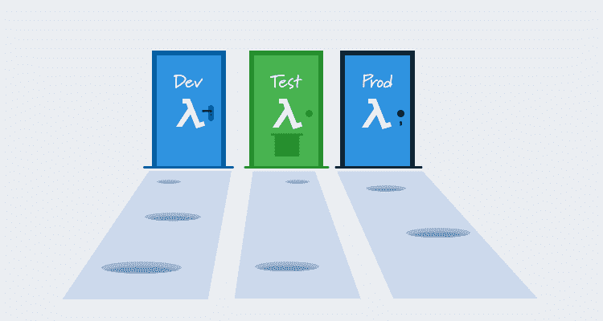
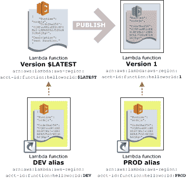

# 为什么不应该使用 Lambda 别名来定义环境- Octopus Deploy

> 原文：<https://octopus.com/blog/multi-environment-lambda-deployments>

如今，开始使用无服务器应用程序相对容易。像[无服务器](https://serverless.com/)和 [AWS SAM](https://aws.amazon.com/serverless/sam/) 这样的工具抽象掉了许多样板代码，隐藏了服务之间更好的交互，让你快速启动并运行。

从概念验证阶段转移到可测试和可重复的部署不可避免地意味着跨多个环境部署您的代码。我们已经看到了如何[从 SAM CLI 迁移到 Octopus](/blog/aws-sam-and-octopus) 来实现这些多环境部署。上一篇文章提倡将独立的 CloudFormation 栈作为实现多环境部署的一种方式，但是像 Lambda 别名这样的解决方案呢？

在这篇文章中，我们将看看 Lambda 别名，并强调一些在使用它们时可能不会立即显现出来的缺陷。

## 什么是 Lambda 别名？

Lambda 别名本质上是 Lambda 部署的命名版本。默认情况下，有一个名为`$LATEST`的单一版本，它总是代表所部署的 Lambda 的最新副本。然后，您可以发布一个版本，这将创建 Lambda 代码和配置的不可变快照。新发布的版本有一个自动分配的版本号，但是通过给其中一个版本号分配一个名称或别名，可以定义一组代表一个环境的 Lambda 版本。

例如，别名`Prod`可能指向一个月前创建的 Lambda 版本。因为发布的版本是不可变的，开发者可以继续更新 Lambda，但是名为`Prod`的别名将总是引用一个已知的稳定版本。

同样，`Test`别名可能指向 Lambda 的一个新发布的版本，目的是对它进行测试。然后`Dev`别名可以指向`$LATEST`版本，从而创建一个总是指向最新部署代码的开发环境。

下面是 AWS 文档中的一个截图，展示了别名的概念。

别名的概念很容易理解，但是在实现这个策略之前，需要考虑一些事情。

## 到底什么是环境？

为了理解别名是如何出错的，我们首先需要问一个相当简单的问题:*什么是环境？*

在内部部署的时代，环境是专用的服务器或虚拟机。例如，您可能有一台生产服务器和一台测试服务器。部署到这些服务器的代码和基础设施构成了生产或测试环境。

这种拓扑很容易理解:生产环境是运行生产代码的生产服务器，生产代码与生产数据库交互。这里没有歧义。

现在考虑 AWS Lambda 同时托管测试和生产代码的情况。您甚至会发现自己处于这样一种情况，即`Test`别名指向与`Prod`别名相同的版本。我们如何描述具有这种拓扑结构的环境？

很容易说 Lambda 环境是别名，也就是说生产环境是`Prod`别名指向的 Lambda 版本集，而测试环境是`Test`别名指向的 Lambda 版本集。但是，当我们需要实现非功能性需求，如安全性和性能时，这种描述就失效了。

假设您正在编写一个医疗应用程序，该应用程序处理要求您不要透露的敏感信息。这意味着您必须考虑由您的代码生成的日志文件，甚至是显示您的应用程序所采用的路径的堆栈跟踪，可能包含或暗示法律敏感信息。

当生产环境可以简单地描述为*运行在生产服务器上的代码*时，安全性可以实现为*只有被授权访问生产服务器的人才能读取日志*。好吧，但是，在实践中，安全性并不那么容易，但是至少对于生产日志文件来自哪里没有歧义。

当使用别名时，生产环境的概念变得更加模糊。当从生产主机 myapp.com 调用 Lambda 时，您可能被迫将生产环境描述为*，然后当从测试主机 test.myapp.com*调用 Lambda 时，您可能被迫将测试环境描述为*。*

我们现在正处于将环境意识的概念从基础设施下推到准则中的位置。我们的 Lambda 代码必须知道它被调用的上下文(例如通过跟踪请求主机名)并相应地标记日志条目。这意味着我们的安全规则需要考虑日志条目是否标记有*测试*或*生产*。

现在您面临的挑战是标记每个日志条目，捕捉所有异常，创建一个安全规则来扫描每个 CloudWatch 日志中的特定标记，并相应地限制对日志条目的访问。

或者，考虑 Lambda 最终与数据库交互的情况。您将很难找到主张将测试和生产数据放在同一个数据库中的人，这意味着您将为每个环境拥有不同的数据库。正如我们的代码必须知道它被调用的上下文以适当地标记日志条目一样，它也需要知道它应该与哪个数据库进行交互。即使你的 Lambda 不直接与数据库交互，它最终也会调用一个与数据库交互的数据库，所以它需要在每次调用时传递这种环境意识。

现在您面临的挑战是创建一个安全规则，只允许生产上下文中调用的 Lambda 与生产数据进行交互。请记住，生产 Lambda 可能与测试 Lambda 完全相同，唯一的区别是调用它的上下文。

如您所见，这两个看似微不足道的安全练习很快变得难以管理，我们甚至还没有讨论速率限制、网络分段、分布式跟踪…

## 地狱是无法描述你的环境

大多数非功能性需求最终需要以安全性、网络或监控规则的形式来表达，并且这些规则需要根据环境来定义。这似乎是显而易见的，但这意味着您需要能够定义环境。

当环境意识从基础设施层下推到代码本身时(当您的生产代码实际上可以与您的测试代码相同时，这是必然的)，定义环境变得棘手，并且保证基于环境的规则得到实施几乎是不可能的。

[Lambda 开发者自己也表达了同样的观点](https://github.com/awslabs/serverless-application-model/issues/220?source=post_page---------------------------#issuecomment-349054599):

> 我不建议您(或任何人)在各种环境中使用别名。我对此最大的担忧是，您可能会冒着影响 prod 的风险，对测试或开发进行更改。如果部署出了问题，你会造成更大的爆炸半径。我的另一个担心是你的函数的安全性。您可能需要添加特定于开发或测试的凭据或策略，这些凭据或策略将会或可能会在生产中复制。我建议将开发、测试和生产划分到单独的 CloudFormation 堆栈中，这样每个环境都是相互隔离的。然后，您只需管理一个 CloudFormation 模板，就可以在环境级别通过 CI/CD 系统部署它。您将仍然只管理一个 Lambda 功能(通过 SAM)，但是这种设置将减少部署的爆炸半径，并隔离您不同环境的功能和资源。

## 为环境使用堆栈、区域或帐户

与其尝试为环境使用别名，不如基于其他边界(如 CloudFormation 堆栈、AWS 区域或完全独立的 AWS 帐户)来拆分环境。

在[之前的博客文章](/blog/aws-sam-and-octopus)中，我们已经看到了如何使用单独的 CloudFormation 堆栈。

使用不同的 AWS 区域是下一个合乎逻辑的步骤，尽管您可能会发现物理区域的网络开销会干扰测试或性能监控。

为了最终隔离，您可以采取下一步，通过单独的 AWS 帐户创建环境。在视频[中，AWS 基于 Lambda 的应用程序的测试和部署最佳实践](https://www.youtube.com/watch?v=zJQDAsWm-5k) AWS 开发者倡导者 Chis Munns 描述了以这种方式使用帐户，似乎甚至 AWS 也接受使用数百个帐户来实现这种分离。

幸运的是，实现这些策略中的任何一个都很简单，只需将适当的 Octopus 变量应用到一个环境中，这意味着无论您决定实现哪种策略，您都可以轻松地管理您的多环境部署。

## 结论

对于非常简单或概念验证的部署，Lambda 别名可以为多种环境提供解决方案。但是正如我们所看到的，随着部署变得更加复杂，别名很快就会带来问题。

独立的 CloudFormation 堆栈、AWS 区域或帐户提供了更清晰的环境边界，使安全性和监控更加可靠。

Octopus 通过将变量值(如 CloudFormation 堆栈名称、AWS 区域名称或 AWS 帐户)纳入环境范围来支持这些环境边界，这意味着您的多环境部署易于管理且部署可靠。