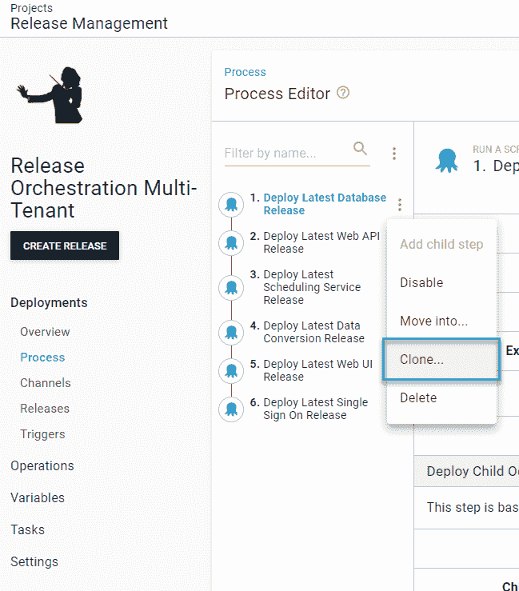
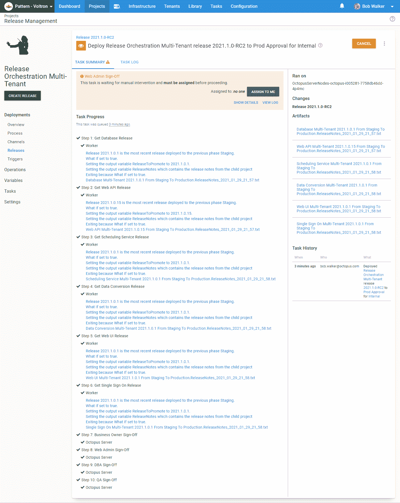

# 使用 Octopus Deploy 的多租户发布管理- Octopus Deploy

> 原文：<https://octopus.com/blog/multi-tenancy-release-management>

[](#)

Octopus Deploy 中我最喜欢的功能之一是[多租户](https://octopus.com/docs/deployments/patterns/multi-tenant-deployments)。每个客户都有自己的应用程序版本，或者托管在每个客户的独特基础架构上，或者由客户自己托管。Octopus Deploy 中的多租户特性解决了许多问题。

我的[上一篇文章](/blog/release-management-with-octopus)深入探讨了新的[部署子 Octopus 部署项目步骤模板](https://library.octopus.com/step-templates/0dac2fe6-91d5-4c05-bdfb-1b97adf1e12e/actiontemplate-deploy-child-octopus-deploy-project)，涵盖了各种场景，但不包括多租户。

在本文中，我将介绍新 step 模板的多租户功能，以及如何使用它来更好地管理您的多租户版本。

这篇文章假设你阅读了[前一篇文章](/blog/release-management-with-octopus)。它将触及类似的主题，但不是一个完整的老调重弹。

## 示例应用程序

和上一篇文章一样，我有一个示例应用程序，其中每个组件都是一个 Octopus Deploy 项目。

[](#)

有几个主要区别:

示例应用程序是一个 SaaS 应用程序，具有以下业务规则:

*   每个客户都获得了由数据库、Web API 和 Web UI 组成的“核心”产品。
*   每个客户都获得一个**分期**和**生产**环境。**试运行**环境允许他们的工程师在部署到**生产**之前测试任何变化。
*   客户可以额外付费购买计划服务、单点登录应用程序和数据转换。
*   客户可以支付额外的费用来更早地访问在**测试**环境中部署的变更。
*   在发布部署到**生产**环境之前，某些客户必须征得他们的同意。
*   购买模块需要重新部署核心组件，需要更新配置文件，并且需要回收服务以获得新功能。
*   客户希望停机时间保持在最低限度。

这些规则复制了现实世界的一些复杂性。

以下是我们的客户样本:

*   **内部**:这是一个内测客户，大家用来测试变化。该客户存在于所有四个环境中:**开发**、**测试**、**试运行**和**生产**。
*   **所有宠物**:该客户已经支付了所有额外组件以及在**测试**环境中访问预览版本的费用。
*   **宠物生活**:裸机客户在**试运行**和**生产**环境中只有四个“核心”组件。
*   **宠物世界**:该客户购买了调度服务和单点登录应用程序，用于**筹备**和**生产**环境。
*   **仅限狗**:该客户购买了调度服务和数据转换服务，用于**试生产**和**生产**环境。

## 多租户和部署子 Octopus 部署项目步骤模板

一些客户选择一个大型项目来处理所有事情。他们一次性部署软件，但是停机时间非常长，因为未更改的组件也需要重新部署。

这可能会引出一个问题，“我如何跳过包没有改变的步骤？”。

这种方法的问题是 web 部署很少“仅仅”推出服务器包。需要额外的步骤来配置项目，如品牌或运行集成测试。

Octopus Deploy 中的每个组件都需要分配给一个独特的项目。父项目将处理编排。直到现在，还没有一个步骤来解决现实世界中的几个用例:

*   通过仅部署已更改的内容，最大限度地减少停机时间。
*   通过只构建已更改的内容来最小化构建时间。
*   尽量减少一个人必须做出的决定。
*   单一责任原则，每个项目尽其所能部署一件事。
*   租户被分配到不同的项目。
*   每个项目的租户被分配到不同的环境中。
*   租户有不同的**生产**发布时间表。
*   租户有不同的测试周期。
*   租户需要他们自己的一组批准，但是一个人应该只需要批准一次发布。
*   应用程序必须按照特定的顺序部署到租户。
*   客户在星期二批准了他们对星期四晚上部署的更改。

新的[部署子 Octopus 部署项目](https://library.octopus.com/step-templates/0dac2fe6-91d5-4c05-bdfb-1b97adf1e12e/actiontemplate-deploy-child-octopus-deploy-project)步骤模板有助于解决这些用例。

您的应用程序将有一个父项目，只需要一个部署过程。你不应该担心租户和项目分配。它有必要的保护条款，以确保相同的流程将适用于**内部客户**的所有附加功能，*和*的**宠物生活**只有核心组件。

[](#)

在继续之前，让我们看看 step 模板如何处理多租户父项目的不同用例。

### 未分配给子项目的租户

步骤模板将自动处理所有可能的多租户用例:

*   租户是否被分配给子项目？如果没有，退出该步骤，记录一条消息并继续下一步。
*   租户是否被分配到特定环境的子项目中？如果否，退出该步骤，记录一条消息，然后继续下一步。
*   租户是否被分配到特定环境的子项目中？如果是，找到最新版本并触发部署。
*   子项目是否配置为运行多租户？如果没有，则在不提供租户的情况下运行子项目。

### 选择版本

step 模板的核心业务规则之一是选择源环境中最后一个成功部署的版本。大多数逻辑专注于计算源环境，并通过 4 个逻辑门运行:

*   如果提供了源环境，就使用它。
*   当提供通道时，找到目标环境阶段之前的阶段。
*   当没有提供通道时，使用**默认**通道，然后找到目标环境相位之前的相位。
*   一旦知道了源环境，找到最新的*成功的*版本。

步骤模板使用任务日志来计算要升级的版本。使用 Tasks 页面上的高级搜索过滤器，您可以实时看到 step 模板将选择哪个版本。

[](#)

当目标环境是渠道生命周期的第一阶段时，它将找到为渠道创建的与提供的发布模式相匹配的最新发布。

多租户增加了一层复杂性。考虑这个场景:

[](#)

*   **内部**:有最新的前沿版本，`2021.1.0.15`准备好进入**暂存**。
*   **所有宠物**:有一个旧版本，`2021.1.0.1`准备好去**登台**。
*   **宠物生活**、**宠物世界**和**只有狗**没有被分配到**测试**环境。

当 step 模板将最新的`2021.1.0.x`版本升级到 **Staging** 时，会选择什么版本？答案是:

*   **内部** : 2021.1.0.15
*   **宠物生活** : 2021.1.0.15
*   宠物世界 : 2021.1.0.15
*   **仅限狗入内** : 2021.1.0.15
*   所有宠物 : 2021.1.0.1

多租户增加了复杂性，因为:

*   只有**所有宠物**和**内部**被分配到**测试**环境。
*   租户可以有不同的版本。

幸运的是，章鱼已经为我们解决了这个问题。如果我们通过释放下拉菜单从**过滤器中选择`2021.1.0.15`释放，仪表板将变成这样:**

[T47](#)

step 模板与 Octopus Deploy 已经提供逻辑挂钩。在内部，该逻辑查看`2021.1.0.15`中的**所有宠物**，并确定这不是升级到**暂存**的正确版本。**所有的宠物**都被分配到**测试**环境中，而那个版本还没有被部署到那个环境中。而对于**内部**，该版本已经被部署到**测试**，因此它可以被部署到**暂存**。

当 step 模板查看 **Pet Life** 时，它看到租户没有被分配到**测试**环境。然后，它将从测试环境中选择最新的版本，而不考虑租户。

## 使用部署子 Octopus 部署项目步骤模板

本节将介绍一些常见父项目场景的配置。

您可以作为访客登录，在[示例实例](https://samples.octopus.app/app#/Spaces-603/projects/release-orchestration-multi-tenant/deployments)上查看最终的项目。

### 脚手架

有一些为用户和生命周期配置的脚手架。请参见[上一篇](/blog/release-management-with-octopus#scaffolding)中的脚手架部分。

配置用户和生命周期后，您需要创建一个项目。创建项目时，记得选择上面创建的新生命周期。

[](#)

确保项目配置为所有部署都需要租户。

[](#)

之后，导航到变量屏幕，添加 API 键和发布模式。

[T32](#)

对于每个租户，连接新创建的用于**试运行**和**生产**环境的项目。

[](#)

示例场景假设构建服务器将部署到**开发**中的所有租户。步骤模板不是根据这一假设编写的。因为**开发**是渠道生命周期的第一阶段，它将找到与提供的发布模式相匹配的最新发布。

### 场景:为租户部署从测试到试运行的最新版本

在这个场景中，我们将父项目配置为以特定的顺序部署从**测试**到**阶段**的所有子组件。目前，我们不关心批准。

#### 添加步骤

转到新创建的项目的部署流程，并为每个子项目添加一个`Deploy Child Octopus Deploy Project`步骤。

[](#)

以下是每个参数的值:

*   **Octopus Base URL** :接受默认值`#{Octopus.Web.ServerUri}`。您可以在配置- >节点配置该值。这是为章鱼云预先配置的。
*   **Octopus API Key**:API Key 变量，`#{Project.ChildProjects.ReleaseAPIKey}`。
*   **子项目空间**:接受默认值。这个例子没有在另一个空间中创建一个发布协调项目。
*   **子项目名称**:子项目的名称。
*   **子项目发布号**:发布模式变量`#{Project.ChildProjects.ReleasePattern}`。
*   **未找到子项目发布错误句柄**:接受默认值，表示如果发布不存在，跳过它。
*   **目的环境名**:接受默认值。使用与父项目相同的环境。
*   **源环境名称**:接受缺省(空)值本例将让 step 模板决定源环境。
*   **子项目通道**:接受默认值(空)子项目只有一个通道。
*   **租户名称**:接受默认值`#{Octopus.Deployment.Tenant.Name}`。
*   **子项目提示变量**:接受缺省(空)值。没有提示变量。
*   **部署模式**:接受默认值。该示例是进行部署，而不是重新部署。
*   **强制重新部署**:接受默认值。该示例不会重新部署现有的版本。
*   **刷新变量快照**:接受默认值。该示例不会刷新子项目变量快照。
*   **具体部署目标**:接受默认值。这个例子没有部署到特定的机器上。
*   **忽略特定机器不匹配**:接受默认值。我们还没有添加部署目标触发器。
*   **将发布说明保存为工件**:接受默认值。
*   **如果**会怎样:接受默认值。我们还没有添加批准。
*   **等待完成**:接受默认值。此示例将等待部署完成。
*   **等待部署**:接受默认值。30 分钟应该足够了。
*   **调度**:接受默认值。这个例子要求子项目有一个特定的顺序。
*   **自动批准子项目手动干预**:接受默认值。现在不需要这个设置，因为这个例子不涉及手动干预。
*   **审批环境**:接受默认值。现在不需要这个设置，因为这个例子不涉及手动干预。
*   **批准租户**:接受默认值。现在不需要这个设置，因为这个例子不涉及手动干预。

#### 创建发布并部署它

在添加和配置这些步骤之后，您就创建了一个发布。在这篇文章中，我将对父项目进行许多修改；您可能会看到发布号的`2021.1.0-RCx`。

[T35【](#)

首先，将发布部署到**所有宠物**租户。

[](#)

等待释放完成。对于 Web UI 项目，您应该看到发布版`2021.1.0.1`被选中进行部署。

[](#)

对于其他项目，您应该会看到`2021.1.0.15`被选中。

[](#)

#### 为未分配测试的租户部署该版本

现在我们来看看租户是*而不是*分配到**测试**的情况，比如**宠物生活**、**宠物世界**、**狗狗专用**的情况。

[](#)

**宠物生活**也不分配到调度服务、单点登录或数据转换服务项目。

[](#)

当将父项目部署到**Staging**for**Pet Life**时，会发生一些事情

*   Web UI 项目的版本`2021.1.0.15`将被选中，因为它是**测试**的最新成功版本。
*   将跳过计划服务、数据转换服务和单一登录项目。

[](#)

到目前为止，我们已经将父项目配置为只进行部署。如果我们停在这里，我们会比以前处于更有利的位置。我们可以按特定顺序推出分配给租户的所有组件。此外，该流程将跳过未自动分配给租户的步骤。在管理多租户应用程序时，这本身就是一种成功。但是我们可以更进一步。让我们转到审批。

### 方案:父项目中的审批

在子项目中进行手动干预是很常见的。在这个示例应用程序中，每个组件项目都有两到三个手动干预。这意味着要提交 8 到 18 个批准，具体取决于租户。那是非常乏味的。

在理想的配置中，所有的批准都在父项目中，并向下流动到子项目。

然而什么是被批准的？部署 Octopus 后，所有手动干预都是部署的一部分。这是先有鸡还是先有蛋的情况。为了解决这个问题，step 模板提供了“假设”功能，它将完成部署之前的所有工作。此外，步骤模板收集了所有的发行说明以帮助批准。

父项目的流程是:

1.  以假设模式运行**部署子 Octopus 部署项目**步骤模板。
2.  进行所有必要的手动干预。
3.  在正常模式下运行**部署子 Octopus 部署项目**步骤模板。

在假设模式下运行时，将设置以下输出参数，供流程稍后使用:

*   **ReleaseToPromote** :满足所有要求的发布号。如果找不到版本，则设置为 N/A。如果版本已经部署到目标环境，则它会指示。
*   **ReleaseNotes** :子项目的发布说明。包括提交历史记录和使用构建信息时与项目关联的问题。
*   **ChildReleaseToDeploy** :表示是否有子版本要部署。它要么是真的，要么是假的。在可变运行条件下使用此变量。

#### 创建假设步骤

要对此进行配置，首先克隆所有现有的步骤。通过点击每个步骤旁边的溢出菜单(三个垂直省略号)来完成。

【T2 

重命名每个克隆的步骤。将克隆步骤中的参数更新为:

*   **将发行说明保存为工件**:设置为`Yes`。
*   **如果**怎么办:设置为`Yes`。

#### 添加手动干预步骤

在继续之前，添加手动干预步骤。手动干预步骤的一个特征是它可以向批准者提供指示。我们可以使用 step 模板的输出变量来创建有用的指令。例如:

```
Please approve releases for:

**Database: #{Octopus.Action[Get Database Release].Output.ReleaseToPromote}**
#{Octopus.Action[Get Database Release].Output.ReleaseNotes}

**Web API: #{Octopus.Action[Get Web API Release].Output.ReleaseToPromote}**
#{Octopus.Action[Get Web API Release].Output.ReleaseNotes}

**Scheduling Service: #{Octopus.Action[Get Scheduling Service Release].Output.ReleaseToPromote}**
#{Octopus.Action[Get Scheduling Service Release].Output.ReleaseNotes}

**Data Conversion: #{Octopus.Action[Get Data Conversion Release].Output.ReleaseToPromote}**
#{Octopus.Action[Get Data Conversion Release].Output.ReleaseNotes}

**Web UI: #{Octopus.Action[Get Web UI Release].Output.ReleaseToPromote}**
#{Octopus.Action[Get Web UI Release].Output.ReleaseNotes}

**Web UI: #{Octopus.Action[Get Sign Sign On Release].Output.ReleaseToPromote}**
#{Octopus.Action[Get Single Sign On Release].Output.ReleaseNotes} 
```

我避免重复劳动。让我们把它作为一个变量。

[](#)

现在，我们可以添加手动干预，将指令发送到新变量，并且只在**生产**环境中运行。

手动干预中的负责团队列表与 OR 相结合。列表中任何团队的任何人都可以批准手动干预。如果您需要多个团队的批准，您将需要多个手动干预步骤。

[](#)

#### 重新排列步骤

部署后，批准没有意义，因此通过单击按名称过滤文本框旁的溢出菜单(三个垂直省略号)并选择重新排序按钮来重新排序步骤。

[](#)

将您设置的所有“假设”步骤移到“非假设”步骤之上。完成后，您的流程应该如下所示:

[](#)

#### 了解自动批准的实际应用

为其中一个租户创建一个新版本，并将其部署到 **Staging** 。一旦发布完成，就将其发布到**生产**。

在此部署过程中，您将看到手动干预和自动批准在起作用。首先，手动干预应该有随发行说明一起部署的版本:

[](#)

在每个小组都批准了发布之后，部署就开始了。如果您转到一个特定的部署，您将在子项目中看到类似于以下内容的消息:

[](#)

发布到**生产**现已完成。您可以在一个地方批准特定租户的所有子项目部署。

### 场景:今天批准，明天部署

有时，在进入**生产**之前，特定客户需要在发布上签字。在实际部署期间，他们不太可能批准部署。例如，更常见的情况是，他们会在周二批准在周四部署。另外，让我提醒你之前的这条规则:

> 某些客户，如**所有宠物**和**宠物世界**必须在发布部署到**生产**环境之前给予同意。

**所有宠物**和**宠物世界**都需要特别批准。所有其他客户只需要一次批准，这将发生在**内部**租户。

为了避免部署在**生产**中等待数天的人工干预，您可以在**准备**和**生产**之间有一个**产品批准**环境。

**产品批准**环境将*仅*用于父项目。子项目的生命周期将保持不变。

这个场景逐步将**产品批准**环境添加到多租户应用程序中，以满足这些规则。

#### 添加新环境并配置生命周期

添加**产品批准**环境。你会注意到我的截图中的环境位于本页的**暂存**和**生产**之间。我单击了溢出菜单，对该页面上的环境进行了重新排序。

[](#)

现在已经添加了新的环境，更新这个发布编排项目所使用的生命周期。

[](#)

关注**默认生命周期。**它没有明确定义的短语，而是使用整个环境列表自动生成阶段。要从**默认生命周期**中删除**产品批准**，您需要添加显式阶段。

#### 更新部署流程

接下来，更新批准步骤，使其仅在**产品批准**环境中运行。然后配置非假设步骤，跳过**生产审批**环境。更新后的部署流程如下所示:

[](#)

接下来，导航到变量屏幕并添加两个新变量:

*   **项目。child project . Approval . environment . name**:存储 **Prod Approval** 环境名。
*   **项目。child project . deployment . environment . name**:存储部署的目标环境的名称。对于除**产品批准**之外的所有环境，该名称将与当前环境相匹配。在**产品批准**环境中运行时，部署环境的名称是**生产**。

[](#)

进入实施**部署子 Octopus 部署项目**的每个步骤，并更新以下参数:

*   **目的环境名称**:更新为`#{Project.ChildProject.Deployment.Environment.Name}`。
*   **审批环境**:更新至`#{Project.ChildProject.Approval.Environment.Name}`。

[](#)

通过这样做，我们告诉步骤模板在**生产**部署期间从**生产审批**环境而不是**生产**环境中获取审批。这意味着我们可以在上午 11 点批准，并安排在下午 7 点部署。

#### 设置租户审批

最后，设置审批租户。默认情况下，批准租户是当前租户的名称。那个默认将只适用于**所有宠物**、**宠物世界**和**内部**。其他人都会用**内部**。有几种方法可以实现这一点。我将使用一个项目变量模板，默认值设置为`Internal`:

[T38](#)

转到**内部**、**所有宠物**和**宠物世界**，为发布编排项目分配**产品批准**环境。

[](#)

对于**所有宠物**和**宠物世界**，在**生产**环境下将审批租户名称改为`Octopus.Deployment.Tenant.Name`。这是必要的，因为**生产**环境是我们需要获得批准的地方。

[](#)

对于每个“非假设”步骤，将批准租户设置为前面创建的变量。

[](#)

批准屏幕将显示**宠物生活**和**仅限狗**不在**产品批准**环境中运行。其他房客都是这样。

[](#)

#### 查看批准的实际情况

让我们看看这一切的行动。首先，让我们部署**内部**到**暂存**和**生产审批**。只有假设步骤和批准步骤将在**产品批准**环境中运行。

[](#)

现在把那个发布提升到**生产**为**内部**。从**内部**租户的**产品批准**环境中获取批准。

[](#)

在**内部**通过**产品批准**后，我们可以进入**宠物生活**和**仅限狗**。通过**准备**和**生产**促进发布表明**内部**租户的批准。

[](#)

当相同的版本被部署到**所有宠物**的**生产**时，我们看到批准来自**所有宠物**租户。

[T39](#)

步骤模板仅查找当前版本的批准。创建一个新版本将需要另一轮批准，即使是补丁版本，如`2021.1.1`。

## 结论

这篇文章介绍了[部署子 Octopus 部署项目](https://library.octopus.com/step-templates/0dac2fe6-91d5-4c05-bdfb-1b97adf1e12e/actiontemplate-deploy-child-octopus-deploy-project)步骤模板的一些多租户场景。你可以在我的[上一篇](/blog/release-management-with-octopus)中看到更多的场景。

Octopus Deploy 的多租户功能旨在帮助在不同基础设施上安装软件的公司。我看到和听到了客户在这个模型中遇到的各种怪癖，它们是我编写这个步骤模板的动机。我希望帮助客户避免手动流程中的错误，并尽可能消除多租户部署带来的心理负担。

我希望这个步骤模板对您的多租户项目有用。

这个三部分系列的最后一个指南是:

## 观看网络研讨会:使用 Octopus Deploy 实现更好的多租户部署

[https://www.youtube.com/embed/dD8psiK1wL4](https://www.youtube.com/embed/dD8psiK1wL4)

VIDEO

我们定期举办网络研讨会。请参见[网络研讨会第](https://octopus.com/events)页，了解过去的网络研讨会和即将举办的网络研讨会的详细信息。

愉快的部署！