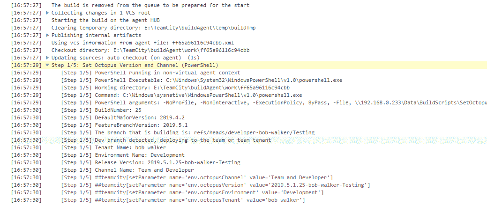

# 利用多租户创建团队和开发人员沙箱——Octopus 部署

> 原文：<https://octopus.com/blog/multi-tenancy-teams>

最近，我有机会会见一位客户，谈论他们的开发过程。他们想知道是否有可能改变他们的 CI/CD 管道，以便更容易、更快速地测试变更。当他们开始描述他们的场景时，我忍不住笑了，因为在过去的 10 多年里我已经遇到过很多次了。

他们有三个开发团队和四个主要应用程序。四个主要应用程序之间存在一些依赖关系。应用程序 A 可能调用应用程序 B，应用程序 B 调用应用程序 C，依此类推。对于哪个团队可以开发哪个应用程序，并没有明确的“界限”。在任何时候，两个团队都可能在开发同一个应用程序。例如:

*   团队 A 正在为应用程序 A 添加一个新功能。
*   团队 B 正在修复应用程序 a 的一些错误。
*   团队 C 正在为应用程序 b 添加一个新功能。

团队 B 具有更高的优先级，因为它正在修复 bug。团队 A 什么时候可以推出应用程序 A 的新特性，以便 QA 工程师进行测试，业务负责人进行验证？有没有可能在 B 队完成之前完成，而不踩过他们的工作？团队 C 如何在不停止团队 B 的情况下更改他们的应用程序？

**请注意**:我转述了那次会议的一些内容，如果他们正在阅读这篇文章，我向他们道歉，我把他们的担忧过于简单化了。

在 Octopus Deploy 工作之前，我在不同的工作中多次遇到这种情况。在那些公司，知识的集体缺乏，以及工具的限制，导致了一些，比如说，不寻常的解决方案。团队 C 被告知他们所做的任何改变都必须是向后兼容的。如果需要的话，把它藏在特征标志后面。团队 A 和 B 的工作不能停止。团队 A 被告知在团队 B 完成他们的工作之前不要推进他们的变更。根据这需要多长时间，团队 A 可能也会尝试进行一些小的修改，增加他们修改的范围，并给 QA 带来更多的工作。

这只是三个团队。我曾为拥有 10 多个开发团队的公司工作过。想象一下，试图变戏法所有这一切！

根本问题是上述解决方案不能很好地扩展。手动闸门太多。太容易出错，导致工作变慢。每个团队都需要自己的“沙箱”每个团队的沙箱都有每个团队或开发人员所需的每个应用程序的副本。这使得上述场景更容易处理。

*   团队 A 可以把一个新特性推到他们的沙箱中进行测试，而不需要完全依赖团队 b。
*   团队 C 可以将更改推送到他们的沙盒中进行测试，而不会破坏团队 A 和 b。
*   团队 A 和 B 不知道团队 C 的改变，因为他们指向他们自己的应用程序 B 的副本。
*   一旦团队 C 的变更被验证，他们将把他们的代码合并到一个发布分支或主版本中，这将开始一个新的构建和新的版本。然后团队 A 和 B 将需要把最新的版本带到他们的沙箱中。

有时候，一个开发人员会致力于一个突发事件或另一个变更，他们想要得到反馈，可能来自另一个开发人员，或者来自企业所有者。过去，当我这样做时，我让开发人员和/或企业所有者直接连接到我的机器。直接连接到我的机器对我来说是一个巨大的痛苦，因为我可能正在调整其他东西，代码甚至可能没有运行。如果有一个我也能推动这些改变的地方就好了。当时，如果我这样做了，它会上传到“主”开发服务器，并有可能破坏东西。

这是 Octopus Deploy 的[多租户特性](https://octopus.com/docs/deployments/patterns/multi-tenant-deployments)的完美用例。在本文中，我将带您了解如何使用 Octopus Deploy 中的多租户特性为团队和开发人员配置私有测试沙箱。

## 此解决方案的注意事项

这个解决方案有几个重要的注意事项。

首先，这将要求整个应用程序具有自动化部署。你不能有你的代码(c#/JS/TS/PHP/等。)通过 Octopus Deploy 进行部署，而您的数据库是手动部署的。

其次，这种解决方案违背了“永远要集成”的原则如果你尽可能快地测试最新最好的代码，那将是最好的。例如，我在一个贷款发放系统上工作，它依赖于一个服务来获取客户信息。当测试我的更改时，我希望被指向最新和最好的客户服务。根据最新和最好的版本进行测试可以更快地发现问题，从而降低成本。下面详细介绍的解决方案将集成推到了软件开发生命周期的后期。

尽可能快地运行最新最好的代码是有风险的。由于客户服务中的一个新特性而产生的错误可能会导致贷款发放系统的测试速度变慢。没有客户很难贷款。当这种情况发生时——这种情况经常发生，但在其他服务上也是如此——我想要一个依赖服务的稳定副本来指向它。一旦新客户服务的测试完成，我就会把这个版本放到我的沙箱里。这种方法的风险是，我可能直到后来才发现应用程序中的错误。该错误可能需要额外的代码更改，这会增加成本。尤其是如果代码更改需要发生在客户服务中，并且最近已经被推送到生产中。

无论哪种方式都有风险。由您决定您希望风险发生在哪里。

## 配置 Octopus 部署

在深入了解配置之前，让我们后退一步，看看一些用例。希望在这篇文章的结尾，我们能见到他们所有人。

*   作为团队 C 的开发人员，我希望能够对应用程序 B 进行修改，而不影响其他团队对应用程序 a 的工作。
*   作为一名开发应用程序 A 的开发人员，我希望能够在应用程序 B 的更改完成并通过验证后，将它们拉出来。
*   作为一名开发人员，我总是希望能够在非生产环境中测试当前生产中的内容。
*   作为一名开发人员，我希望能够在不影响我的团队的情况下做出更改，并将其提交给业务所有者进行验证。
*   作为应用程序 A 的开发人员，我想知道 B I 正在连接和测试哪个版本的应用程序。
*   作为团队 A 中的一名开发人员，我希望能够将一个修补程序直接发布到 staging，而不必先进行开发或测试。
*   作为团队 A 中的一名开发人员，我希望能够将团队的变更推进到客户可以提供反馈的测试区域。获得客户反馈不会一直发生，但我希望有这样的机会。

如前所述，我们将使用 Octopus Deploy 的[多租户特性](https://octopus.com/docs/deployments/patterns/multi-tenant-deployments)来解决这个问题。我选择这个解决方案，而不是为团队和开发人员创建单独的环境，有几个原因。

1.  当您添加一个新环境时，您并不知道需要配置的所有变量。在 Octopus Deploy 的多租户特性中，有一个可变模板的概念。如果租户缺少一个变量，UI 中会有一个指示器，并且有一个中心位置来配置它们。
2.  它简化了生命周期。我认为任何给定的 Octopus 部署实例都应该有 10 个或更少的环境。
3.  它可以随着团队和开发人员的成长而扩展。当有新人开始时，很容易将他们添加为租户，并在几分钟内为他们配置一个测试沙箱。

为此，我将创建一个名为`Tenant Type`的租户标记集，用于分组和组织目的。基于用例，我需要在`Tenant Type`标签集中添加三个标签。

*   版本(主版本或主版本和修补程序)。
*   团队(供团队测试用)。
*   人员(每个开发人员)。

[](#)

## 全局变量

在我的演示实例中，我有两个变量集。`Global`将在所有项目中使用。`OctoFx`将用于任何用于部署 OctoFx 应用程序组件的 OctoFx 项目。

[](#)

每个环境都有自己的 SQL Server 和 web 服务器。我将在相同的服务器上托管我的租户。每个租户将获得一个独特的子域。我将为分配给团队或个人`Tenant Type`的租户使用的命名约定将是[environment short name][tenant short name][application name]. octopus demos . com。例如，对于开发中的 Bob 的 OctoFx 应用程序副本，名称将是 DevBobOctoFx.OctopusDemos.com。对于版本`Tenant Type`，命名约定将是【环境名称】【应用名称】. OctopusDemos.com。例如，开发中的 OctoFx 将是 DevOctoFx.OctopusDemos.com。

我使用同一个 SQL Server 进行开发和测试，所以我的数据库名称乍一看会很奇怪。[environment prefix]-[tenant short name]-[application name]用于分配给团队或个人的租户`Tenant Type`。鲍勃在`Development`中的 OctoFx 数据库的副本将是`d-Bob-OctoFx`。分配给版本`Tenant Type`的租户将是[environment prefix]-[application name]。比如`Development`中的 OctoFx 会是`d-octofx`。

首先，我将在 Global 中创建几个变量来存储环境简称和环境前缀变量。

[](#)

**请注意:**我喜欢用命名方案【VariableSet】。[组件]。[姓名]。当试图引用它们时，更容易找到。此外，当查看项目的所有变量时，它们更容易找到。

然后，我将跳转到`Variable Templates`选项卡，添加一个新模板。这将在创建租户并将其分配给各种项目时填充。

[](#)

现在我可以跳回 variables 选项卡并添加两个变量，一个用于子域名，另一个用于数据库名。您可以将变量的范围扩大到租户标记。请注意，我只对`Tenant Type` tenant 标签的一个变量进行了限定。这是因为我希望任何“正常的”发布都有相同的命名约定，即使项目没有使用租户。

[](#)

你会注意到我在这里引用了一个名为`Project.Application.Name`的变量。该变量将在项目级别设置。这是可能的，因为变量替换是在运行时完成的。需要在运行时替换变量，因为 Octopus 通常直到在机器上运行该步骤时才知道值。

`OctoFx`变量集没什么超级复杂的。它存储一些数据库值，这样它可以建立一个连接字符串。

[](#)

## 基础设施

正如我在前面的部分中所述，我将部署到一个 SQL 服务器和多个 web 服务器。我将使用一个 worker 来部署到 SQL Server。只有网络服务器上有触角。我需要更新触手注册，以允许多租户部署。首先，我们需要告诉 Octopus Deploy 允许对每个 web 服务器进行租户和非租户部署。

[](#)

当我们这样做时，屏幕上会出现一个新的部分，允许我们选择允许哪些租户。我们将使用`Tenant Type`标记，而不是分配特定的租户。使用的`Tenant Type`标签将取决于环境。

*   制作:发布`Tenant Type`。
*   登台:组队和发布`Tenant Type`。
*   测试:全部`Tenant Type`。
*   开发:全部`Tenant Type`。

你可能想知道为什么 staging 得到两个团队并发布`Tenant Type`标签。我见过很多舞台和生产相匹配的例子。这包括外部访问。将 staging 用作外部客户的“测试”站点是很常见的。开发人员做出的一个突发事件或随机变化不太可能被修饰到足以让客户测试的程度。一个团队创建的新特性更有可能在客户测试它之前被多人测试过。

【T2 

当我更新完我的机器后，概览屏幕将如下所示:

[](#)

## 项目

在配置租户之前，我想看一下我将作为例子使用的`OctoFx`应用程序。OctoFx 由两部分组成；一个数据库和一个网络界面。每个组件在 Octopus Deploy 中都有其部署项目。并不是对 OctoFx 的所有更改都需要部署完整的应用程序。

[](#)

向数据库添加索引不需要部署网站。更新 CSS 不需要部署数据库。将它们分开有助于节省时间。当您必须部署修补程序时，这真的很方便。当您真正需要修复网站时，必须等待数据库部署完成，这是对耐心的一种锻炼。

每个项目只需要专注于一件事。数据库项目只是担心数据库部署。

**请注意:**这个项目是在假设数据库在那个特定环境中不存在的情况下创建的。它将创建一个新的数据库，并运行必要的脚本来添加模式、数据和用户。

[](#)

而 web 部署只需要考虑 web 部署的步骤。就像数据库项目一样，它是在假设网站不存在的情况下编写的。部署到 IIS 将在服务器上创建网站。然后有一个步骤将网站添加到 DNS。

[](#)

有些情况下，您希望同时部署整个堆栈。这就是“交通警察”项目的由来。它使用 deploy a release 步骤以正确的顺序部署组件。

[](#)

构建服务器负责为每个组件创建版本。一个人将进来并为交通警察项目创建发布。请注意，traffic cop 项目的生命周期允许您直接部署到 staging，跳过`Development`和`Testing`。跳过这些环境是为了处理个别组件被手动推送到`Testing`的情况。

**请注意:**我的示例实例中的项目是在假设数据库和/或网站不存在的情况下创建的。每个项目都执行必要的步骤来启动和运行组件。为了让这种沙盒方法发挥作用，您的项目需要用类似的概念来创建。你不必重复我在项目中使用的确切过程。

另一个需要做的重要调整是配置项目以支持多租户部署。可以通过转到项目的设置部分并更改多租户设置来找到该配置。在我的例子中，我选择需要一个租户来进行部署。如果您第一次将项目过渡到多租户，那么允许有租户和没有租户的部署会更有意义。

[](#)

## 分支、生命周期和通道

现在正是讨论分支策略的最佳时机。分支将对应于 Octopus Deploy 中的一个生命周期和项目通道。我将让我的构建服务器向来自非发布分支的任何包构建添加一个预发布标记。构建服务器还将根据分支名称确定租户和通道。

*   发布分支(release/*):部署到开发->测试->试运行->生产。所有生产版本的 95%都将经历这个生命周期。
*   热修复分支(hotfix/*):可以跳过开发和测试，直接进入试运行阶段，然后进入生产阶段。所有生产版本的 5%应该经历这个生命周期。这为生产提供了一条清晰的路径，同时提供了测试能力。
*   团队分支([TeamName]/*):只能转到开发->测试->登台。这个分支将有一个附加到包名的预发布标签。
*   开发者分支([DeveloperName]/*):只能去开发->测试。这个分支将有一个附加到包名的预发布标签。

在 Octopus Deploy 中，我创建了以下生命周期。团队和开发生命周期将`Development`和`Testing`环境设置为可选的。这是为了让用户能够自由选择要更新的环境。

[](#)

每个项目将有以下渠道来支持各种用例。

[](#)

每个使用的渠道都有一个针对软件包预发布标签的版本规则。对于团队和开发人员部署，过滤器是`.+`，这意味着它必须有一个预发布标签。对于所有其他频道，过滤器是`^$`，这意味着不允许预发布标签。

[](#)

构建服务器配置将在本文稍后介绍。

您会注意到任何租户都可以使用默认频道。这是否意味着每个租户都可以部署到生产环境中？不。当您将租户链接到项目时，您将告诉 Octopus 租户可以部署到的环境。

[](#)

## 房客

租户标签已经就位。已经配置了生命周期。项目已经配置完毕。已经进行了必要的基础设施改革。终于到了创建一些租户的时候了。

对于每个租户，我将分配一个租户标记。

[](#)

然后，我将连接我的项目。因为这是一个人`Tenant Type`我只允许部署到`Development`和`Testing`环境。

[](#)

如果您还记得，`Global`变量集有一个变量模板。现在项目已经连接好了，我需要进入变量然后选择`Common Templates`来填充变量模板。

[](#)

该说的都说了，该做的都做了，我为发布版`Tenant Type`创建了两个租户。

[](#)

团队的三个租户`Tenant Type`。我们把我们的团队命名为 pod-[章鱼型]。

[](#)

最后，几个租户指定了这个人`Tenant Type`。

【T2 

租户屏幕可以按`Tenant Type`过滤。通过`Tenant Type`过滤可以更容易地找到特定的租户。以及事后截图。我完全做到了。

现在，项目概览屏幕将显示所有租户。

[](#)

我可以通过选择一个版本来部署到特定的租户。

[](#)

当您进入部署屏幕时，您可以选择按租户标签部署到特定的租户。如果您查看屏幕截图的底部，它会向您显示将被部署到的所有租户。

[](#)

项目概述屏幕还提供了按租户标签对租户进行分组的能力。当我们按租户类型分组时，屏幕将按租户类型对所有租户进行分组。

[](#)

## 构建服务器

在这个例子中，我将使用 TeamCity。同样的核心概念也适用于您选择的构建服务器。

在构建开始时，我运行一个 PowerShell 脚本来设置各种输出参数。

[](#)

在我的例子中，PowerShell 脚本设置了这三个参数。

[](#)

这些参数将在创建发布步骤中使用。

[](#)

被调用的 PowerShell 并不是什么超级复杂的东西。对照规则列表检查分支名称，然后从那里开始。在脚本的最后，它使用 TeamCity 特定的格式来设置输出变量。

```
Param(.   
    [string]$currentBranch,
    [string]$buildNumber,
    [string]$defaultMajorVersion,
    [string]$featureBranchVersion
)

Write-Host "BuildNumber: $buildNumber"
Write-Host "DefaultMajorVersion: $defaultMajorVersion"
Write-Host "FeatureBranchVersion: $featureBranchVersion"

$channelName = "Default"
$releaseVersion = "$defaultMajorVersion.$buildNumber"
$environmentName = "Development"
$tenantName = "Main"

Write-Host "The branch that is building is: $currentBranch"

if ($currentBranch -like "refs/heads/hotfix*") {    
    Write-Host "Hotfix Branch Detected, deploying to staging and using the hotfix channel"
    $channelName = "Hotfix"    
    $releaseVersion = "$defaultMajorVersion.$buildNumber"
    $environmentName = "Staging"
    $tenantName = "Hotfix"
}
elseif ($currentBranch -like "refs/heads/team-*") {    
    Write-Host "Team branch detected, deploying to a team tenant"
    $channelName = "Team and Developer"
    $environmentName = "Development"

    $preReleaseTag = $currentBranch.replace("refs/heads/team-", "").replace(" ", "").replace("/", "-")
    $releaseVersion = "$featureBranchVersion.$buildNumber-$preReleaseTag"

    $teamName = $currentBranch.replace("refs/heads/team-", "")
    $teamName = $teamName.substring(0, $teamName.indexOf("/"))

    $tenantName = $teamName
}
elseif ($currentBranch -like "refs/heads/developer-*") {    
    Write-Host "Dev branch detected, deploying to the team or team tenant"
    $channelName = "Team and Developer"
    $environmentName = "Development"

    $preReleaseTag = $currentBranch.replace("refs/heads/developer-", "").replace(" ", "").replace("/", "-")
    $releaseVersion = "$featureBranchVersion.$buildNumber-$preReleaseTag"

    $devName = $currentBranch.replace("refs/heads/developer-", "")
    $devName = $devName.substring(0, $devName.indexOf("/")).replace("-", " ")

    $tenantName = $devName
}
else{
    Write-Host "Master or release branch detected, using the defaults"
    $channelName = "Default"
    $releaseVersion = "$defaultMajorVersion.$buildNumber"
    $environmentName = "Development"
    $tenantName = "Main"
}

Write-Host "Tenant Name: $tenantName"
Write-Host "Environment Name: $environmentName"
Write-Host "Release Version: $releaseVersion"
Write-Host "Channel Name: $channelName"

"##teamcity[setParameter name='env.octopusChannel' value='$channelName']"
"##teamcity[setParameter name='env.octopusVersion' value='$releaseVersion']"
"##teamcity[setParameter name='env.octopusEnvironment' value='$environmentName']"
"##teamcity[setParameter name='env.octopusTenant' value='$tenantName']" 
```

最后一部分是告诉您的构建服务器，在我的例子中是 TeamCity，监控所有的分支，或者监控符合您的需求的分支。

[](#)

## 看到它的实际应用

是时候测试一下了。我为我的开发人员创建了一个测试分支，并将其推送到服务器。

[](#)

TeamCity 选择了新的分支机构。

[](#)

日志表明它成功地找到了所有东西。

[](#)

并且为租户启动部署。

【T2 

我也有一个特定的分支包，然后可以与其他开发人员共享。

[](#)

因此，如果 Derek 想要将这些更改带入他的沙箱，我们将首先将版本更改为我的版本号。然后，我们将单击“部署”按钮。

[](#)

## 站着一整个沙箱

到目前为止，我们一直专注于一个应用程序，OctoFx。我敢打赌，您的开发团队中有不止一个应用程序。为了解决这个问题，我创建了一个名为`Deploy All The Things`的项目。项目的生命周期允许它进入开发、测试和准备阶段，开发和测试是可选的。它旨在供带有个人或团队`Tenant Type`租户标签的租户使用。

[](#)

目前它只部署了 OctoFx。将来，它可以部署其他应用程序，并按照需要的顺序进行部署。

[](#)

关于部署发布步骤的一个注意事项。当您创建一个发布时，也就是当您选择子项目的发布版本时，这个项目完全有可能只将一个发布部署到一个环境中的一个租户。

[](#)

## 结论

这需要一点设置，但是可以配置 Octopus Deploy，这样每个团队和每个开发人员都有自己的沙箱来部署。拥有一个独立的沙箱将允许团队和开发人员获得关于正在进行的工作的反馈，而不必与其他团队协调何时可以进行更改。让我们再检查一次用例，以确保我们解决了它们。

*   作为团队 C 的一名开发人员，我希望能够对应用程序 B 进行更改，而不影响其他团队对应用程序 a 的工作。->解决了，每个团队都有自己的沙箱。开发应用程序 B 的团队会推进他们的沙箱进行测试。
*   作为一名开发应用程序 A 的开发人员，我希望能够在应用程序 B 的更改完成并通过验证后，将它们拉出来。->解决后，团队可以等待，直到更改被合并到一个发布分支并推送到主租户，或者他们可以选择为租户创建的发布并将其放入他们的沙箱。
*   作为一名开发人员，我总是希望能够在非生产环境中测试当前生产中的内容。->已解决，只有在团队沙盒中验证了某项功能后，才会更改非生产环境中的主要租户。更改在主租户的较低环境中停留的时间应该很短，因为它已经过测试。
*   作为一名开发人员，我希望能够在不影响我的团队的情况下做出更改，并将其提交给业务所有者进行验证。->解决了，每个开发者都获得了自己的租户，也就是获得了自己的沙盒。
*   作为应用程序 A 的开发人员，我想知道 B I 正在连接和测试哪个版本的应用程序。->已解决，每个团队和开发人员都可以完全控制他们的沙箱中的版本。
*   作为团队 A 中的一名开发人员，我希望能够将一个修补程序直接发布到 staging，而不必先进行开发或测试。->已解决，有了渠道和热修复租户，就有可能将更改直接推送到暂存。
*   作为团队 A 中的一名开发人员，我希望能够将团队的变更推进到客户可以提供反馈的测试区域。获得客户反馈不会一直发生，但我希望有这样的机会。->解决了，任何有团队的租户`Tenant Type`都可以推送到 staging。

关于修补程序租户的最后一个想法。你不需要包括这个。我这样做是因为与我交谈的客户在其暂存环境中有一个单独的“热修复”子域。这对他们来说是有意义的。对你来说可能没有意义。我鼓励您亲自测试一下，并调整流程以满足您的需求。

下次再见，愉快的部署！