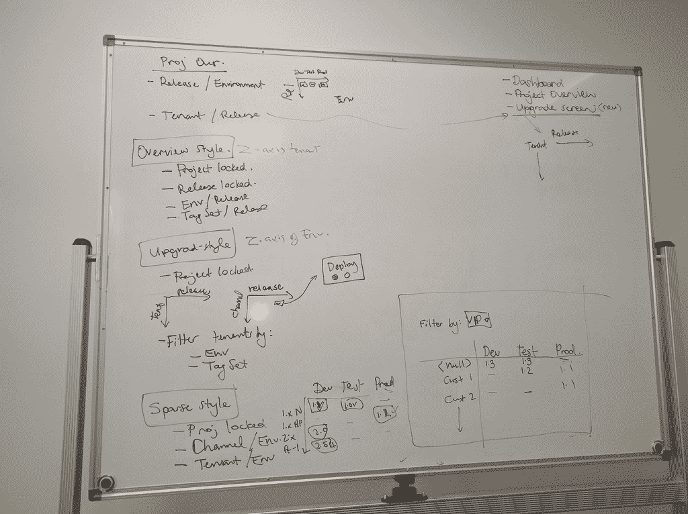
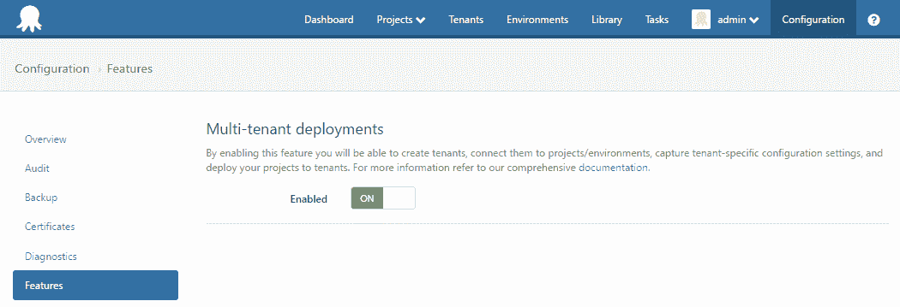

# 多租户部署:起源- Octopus 部署

> 原文：<https://octopus.com/blog/multi-tenant-deployments-origins>

这篇文章是我们 Octopus 3.4 博客系列的一部分。在我们的[博客](https://octopus.com/blog/octopus34-blog-series-kickoff)或我们的[推特](https://twitter.com/OctopusDeploy)上关注它。

**Octopus Deploy 3.4 已经发货！阅读[博文](https://octopus.com/blog/octopus-deploy-3.4)和[今天就下载](https://octopus.com/downloads)！**

* * *

与其深入讨论多租户部署的“如何做”或“是什么”,我想我应该花点时间来回顾一下它是如何走到今天这一步的...为什么花了这么长时间！

## 善意

在[用户之声](https://octopusdeploy.uservoice.com/forums/170787-general/filters/top)中排名第二的建议获得了几乎两倍的票数，为租赁部署提供支持似乎是用户迫切需要的一项功能。我们可以看到这样一个功能如何真正让那些需要管理多个客户部署、目前被迫复制项目或环境的用户的生活变得更加轻松，正如我们可用的[多租户部署指导文档](http://docs.octopusdeploy.com/display/OD/Multi-tenant+deployments+prior+to+Octopus+3.4)中所建议的那样。

这种认识是在去年实现的，它最初被安排在我们的[公开路线图](https://octopus.com/company/roadmap)中`3.1.0`发布。不幸的是，正如俗话所说，生活阻碍了我们(或者在我们的例子中是“Azure 部署目标”[设计支点](https://octopus.com/blog/azure-changes))。在我们决定响应用户反馈(Azure 部署目标的限制)时，我们被迫将多租户部署推进到一个提议的`3.2.0`版本中，以便我们可以提供一个新的带有相关修复的小版本。鉴于用户对我们在`3.0.0`设计的 Azure 目标的反应，我们似乎走错了路，并渴望尽快纠正它。这是从社区获得更好反馈的一课。我们渴望在未来更好地实践*社区驱动的设计*流程。

当时我们另一个流行的用户之声建议是关于[分支](https://octopusdeploy.uservoice.com/forums/170787-general/suggestions/3480536-branch-support-for-deploying-older-app-versions)，它涉及到基于包版本管理和约束部署的能力。经过一些内部讨论和 RFC，这个功能最终演变成了我们现在所说的[频道](https://octopus.com/blog/octopus-deploy-3.2)。一旦这个功能最终完成，我们就渴望把它交到用户手中，这样他们就可以马上获得它的好处。然而，这意味着，不是像我们在路线图中承诺的那样阻止`3.2.0`发布(及其所有 channel-y 优点)只是为了包括多租户部署，而是多租户部署将不得不再次推迟到`3.3.0`。

## RFC 已发布

“好的”，我听到你们都在说“当然，现在其他的事情都解决了，它应该很完美地包含在下一个次要版本 3.3.0 中了！”嗯，我们当然也这么认为。将多租户部署作为首要功能，我们开始就其外观进行内部设计讨论。我们最初的[计划](https://octopus.com/blog/rfc-multitenancy)通过使用通用标签和标签集来表示租户，希望它的通用本质能够同时解决用户可能遇到的其他架构问题。使用这种方法，需要创建多个环境来满足该部署阶段不同租户的需求，使用 tags & tagsets 创建组织架构来管理这些“租户环境”组。

这种方法有其缺陷，尤其是混淆了环境(构成发布过程中部署阶段的一部分)和租户(基于不同的配置/变量促进给定环境的并行部署)的概念。幸运的是，我们的 RFC 得到了来自用户的大量讨论，这让我们思考我们是否做出了正确的架构决策。这是一个反馈循环，我们非常幸运能够将它包含在我们的设计过程中，因为从实际用户那里获得该功能的输入是非常宝贵的。

> 世界上最好的内部 BAs 可能会错过一些关键的见解，而这些见解正是社区能够提供的。

由[@马修·阿博特](https://octopus.com/blog/rfc-multitenancy#comment-2402945580)、[@里奇科德](https://octopus.com/blog/rfc-multitenancy#comment-2403511790)和[@乔治·黑明斯](https://octopus.com/blog/rfc-multitenancy#comment-2402888124)发布的几个关键帖子提醒我们，多租户部署的一些核心动力是促进安全检查，以确保客户部署和设置在正确的时间到达正确的机器。在环境之上用标签构建一切所带来的复杂性似乎超过了其灵活性的理论优势。这似乎是 YAGNI 的一个明显例子。如果它在 Octopus Deploy 中被提升为一级实体，那么在一个租户的上下文中以隔离的方式查看和使用您的部署过程将会更加清晰。

**感谢所有对最初的多租户部署 RFC 博文发表评论的人。**您的帖子引发了团队的新一轮讨论，大家一致认为，虽然一些新想法是很好的补充，但多租户部署显然需要重新设计，以获得一流的地位。在所有这些多租户部署设计工作进行的同时，其他团队成员仍在为 Octopus Deploy 构建其他令人兴奋的新功能(您可能已经注意到过去几个月我们团队中的一些新面孔！).同样，这些变化的范围和深度需要一个新的次要版本。 [`3.3.0`发布的博客文章](https://octopus.com/blog/octopus-deploy-3.3#MultiTenancy)再次指出多租户部署将被推后(希望)最后一次。

*(自我提醒...避免路线图承诺在特定版本中包含开放特性)*

将第二个 RFC 放在一起，让我们能够重复之前的问题，并提供一个似乎更符合用户期望的解决方案。在这种情况下，我还要感谢 [@Scott Brickey](https://octopus.com/blog/rfc-multitenancy-take-two#comment-2492152443) 和 [@Blair Paine](https://octopus.com/blog/rfc-multitenancy-take-two#comment-2492865877) 提供了关于多租户部署如何使用权限的思考，以及 [@Mike Jacobs](https://octopus.com/blog/rfc-multitenancy-take-two#comment-2492475835) 和 [@Andrew Newton](https://octopus.com/blog/rfc-multitenancy-take-two#comment-2492959873) 提供了租户变量的输入。为了获得良好的回应，我们将未解决的设计问题直接发布到社区中，而不是希望每个人都能“理解”并看到我们的差距在哪里。你们中的一些人给出了很好的回答，告诉我们你们对这些问题的想法，以确保我们走上正确的道路。对这个建议的普遍积极的反应给了我们信心，让橡胶上路，同时仍然保持我们的眼睛在活跃的职位。

## 早期访问程序

在内部，我们仍有许多围绕特定概念和行为的具体实施的设计决策，但我们的指导原则之一是让多租户部署成为一项附加功能。鉴于我们将为那些需要该功能的人提供所有新的拨号盘和交换机，我们希望隔离这些更改，而不会给不需要多租户部署的用户造成系统混乱。有很多 Octopus 部署设置(您可能是其中之一)，对他们来说，他们当前的设置“刚刚好”，不需要为多个客户部署同一个版本。出于这个原因，我们引入了多租户部署功能切换，它只需激活一次，就会开始显示管理多租户场景所需的各种组件和功能。即使启用了该功能，我们也能确保您之前未租赁的部署仍然可以继续部署，以便可以随时创建租户并使用现有版本执行部署。最后这种行为的一个结果是租户变量在部署时*没有被快照*，而是在部署时被合并(不要担心，我们在这一点上没有触及正常的项目变量！).我们将在[未来的博客](https://octopus.com/blog/octopus34-blog-series-kickoff)中深入探讨这个(以及其他)设计决策背后的更多细节。

由于这一新功能的规模以及与我们最初提出的解决方案的偏差，我们渴望将我们的代码交到有兴趣并愿意在流程早期提供反馈的用户手中。受 JetBrains 早期访问计划的启发，我们引入了一种类似的方法，在不同的功能块开始到位时，得到常规的不稳定 alpha 构建。这个新的[Octopus Deploy Early Access Program](http://docs.octopusdeploy.com/display/ODEAP/Octopus+Deploy+EAP)允许我们为社区提供另一种方式来提供他们对新功能进展的反馈(在这种情况下，包括并行功能的开发预览，如[弹性和瞬态环境](https://octopus.com/blog/the-evolution-of-auto-deployments-and-event-sourcing)),而不必完全致力于支持仍在进行中的架构设计。我们再一次得到了很好的反馈，这影响了我们前进的方向，即使是在这个后期阶段。非常感谢所有花时间下载、安装和使用`3.4-alpha`版本的人！听到用户对产品的正面体验，甚至是部分完整的产品，我们信心大增。

## 目前处于测试阶段

经过长时间的等待，我们很高兴在我们最新的 [`3.4.0-beta0001`版本](https://octopus.com/downloads/3.4.0-beta0001)中提供了迫切需要的多租户部署特性。它还没有完全完成的[功能，但它已经到了一个阶段，我们有信心应该有很少的结构变化。我们预计第二个测试版将在接下来的几周内发布，而完整的 RTW 可能在几周之后发布。虽然我们没有提到提供反馈的每个人的名字，但请放心，每个反馈对于实现多租户部署都是无价的。](https://octopus.com/blog/octopus-deploy-3.4-eap-beta1#multi-tenant-deployments)

这个旅程教会了我们社区驱动的开发在帮助塑造大型特性方面的价值，在这些特性中，用户最了解他们需要解决的问题。RFC、EAP 和 beta 计划结合在一起，让你——用户——参与到你想要的产品的设计过程中，对此我们表示感谢。

**这可能是一个漫长的过程，但由于我们用户的支持，我认为它已经有了一个更好的形状，符合你的设想，但仍然很容易破解。**

有关多租户部署的更多信息，请参见我们的[新指南](http://docs.octopus.com/display/OD/Multi-tenant+deployments)。