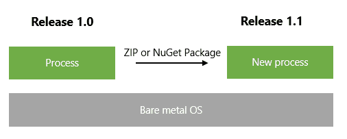
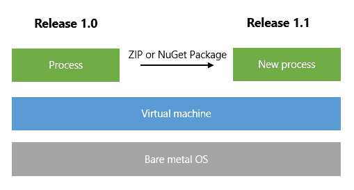
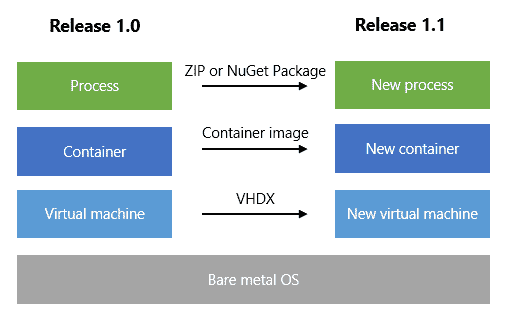
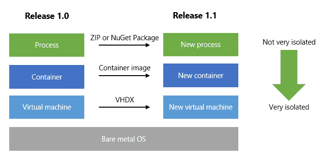
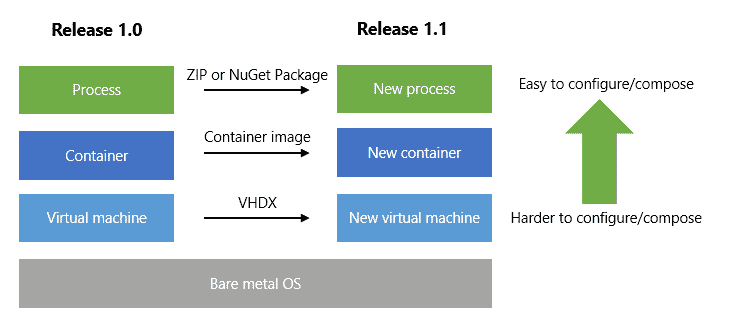

# 部署的未来:纳米服务器和。网络核心-八达通部署

> 原文：<https://octopus.com/blog/nano-server-future-deployment-models>

在过去的几个月里，我花了相当多的时间与[ASP.NET Core 1](https://octopus.com/blog/aspnet-core-build-and-deploy)在一起，本周我一直在深入研究 [Windows Server 2016 和 Nano Server](https://blogs.technet.microsoft.com/windowsserver/2015/04/08/microsoft-announces-nano-server-for-modern-apps-and-cloud/) 。有一点是明确的:对于开发人员来说，当所有这些都投入生产时，我们部署和运行应用程序的方式将会发生相当大的变化。

## 背景

现在，像 Octopus 这样的工具的工作方式是把你的应用程序打包成一个 ZIP 文件，然后把它推到一台远程机器上。在那里，它被解压缩、配置，一个新的进程被启动，同时一个旧的进程被淘汰。流程可能是:

*   NT 服务(我们停止旧的服务，启动新的服务)
*   一个 IIS 网站(旧的应用程序池工作进程死亡，一个新的创建)

就堆栈而言，它看起来像这样:

或者也许像这样:

虽然您也许可以为每个应用程序版本创建一个新的虚拟机映像，部署一个全新的虚拟机并关闭旧的虚拟机，但现在没有人这样做，因为:

1.  VHDX/磁盘镜像文件非常庞大，至少有几十 GB 以上；而且，
2.  启动要花很长时间

(这就是为什么任何使用 Azure 云服务的人都会告诉你他们有多讨厌部署它们。也许如果纳米服务器已经存在，云服务将会变得巨大)

换一种方式思考这个问题:目前，在应用程序的不同版本之间唯一可行的“部署单元”是过程。为每个应用程序变化构建和部署一个新的虚拟机是很疯狂的(在 Windows 上)。

## Windows Server 2016:纳米服务器和容器

Windows Server 2016 有三种风格。我们已经熟悉的前两个:带有 GUI 的服务器和服务器核心。那里没什么有趣的。

第三种风格是纳米服务器，它是游戏规则的改变者。以下是纳米服务器的有趣之处:

*   它**小得可笑**。完整的 Nano 服务器虚拟机映像，包含 IIS、PowerShell 和。NET Core，是 750mb。
*   它**快速启动**。从“打开”到“IIS 响应 HTTP 请求”的时间是几秒钟。
*   内存使用等。非常小，大约 170mb。

像 Linux 发行版一样，Nano Server 也为您提供了如何运行它的选择:

*   在裸机上
*   作为 Hyper-V 客户机器
*   在容器内

是的，Windows Server 2016 的另一个重大变化是容器。这是一项由 Docker 等公司在 Linux 操作系统上推广的技术，它也将进入 Windows。

## 许多应用程序部署单元

有了 Nano Server，当您考虑在 2016 年发布和部署您的应用时，突然有了许多选择:

假设您的团队正在进行为期两周的冲刺，并且每两周交付一个新版本的软件进行测试，然后最终投入生产。现在，您可以选择如何交付新软件:

*   编译您的应用程序并将其压缩(约 50mb) -流程级部署(现在)
*   编译你的应用程序，把它放在一个容器映像中(Docker build-> image)——容器级部署
*   编译您的应用程序，并生成新的 Nano Server VHDX (~800mb) -虚拟机级部署

Nano 服务器映像的微小尺寸使它们成为您连续交付管道中非常可信的“构建工件”。当您可以使用大致相同的时间和工件大小构建整个虚拟机映像时，为什么要构建 MSI 或 ZIP 呢？

对于 Octopus 来说，这意味着我们需要开始在这个堆栈的每一层进行操作。现在，当您创建一个发布时，您选择 NuGet/ZIP 包的版本以包含在发布中。在未来，这将意味着:

*   选择构成这个版本的 NuGet/ZIP 包:Octopus 部署到一个现有的运行目标
*   选择构成这个版本的 Docker/container 映像:Octopus 部署到 Docker/container 主机
*   选择构成此次发布的 VHDX:Octopus 部署到 Hyper-V 主机

## 取舍，以及如何选择

这些变化的最大好处是隔离和安全:微软现在只关注 Azure，所以投资能够运行微小的、完全隔离的操作系统映像是非常有意义的。

隔离在企业中也是一种好处。有多少次您需要部署一个新版本的应用程序，或者想要部署一个新版本的应用程序。NET 运行时，但被告知不能这样做，因为这可能会破坏系统上的其他应用程序。

另一方面，容器映像和 VHDX 使得部署时配置有点笨拙。在理想情况下，我们将在测试和生产环境中使用相同的容器映像/VHDX。但是测试和生产可能使用不同的数据库连接字符串。

*   使用流程级部署，就像解压缩后修改配置文件一样简单
*   使用容器级部署，您可以将一些变量/连接器放入容器中，但是这样不够灵活
*   借助基于 VHDX 的部署，您可以为每个环境构建不同的 VHDX，或者先启动虚拟机并对其进行配置

作为另一个例子，也许您的应用程序允许每个部署启用不同的附加包。同样，在部署流程时，在运行时“组合”这些应用程序要比试图在 VHDX 中组合它们更容易，如果那是部署的单元的话。

无论您如何交付新版本的应用程序——作为 zip、Docker 图像、VHDXs 或可启动 USB 拇指驱动器——Nano Server 都是一个选项。这是一个非常引人注目的问题。

## 。网络核心和纳米服务器是未来

凝视着我的水晶球，我将做出两个大胆的预测:

*   完整的。NET 框架现在是遗留的；5 年后，大多数绿地 C#/。NET 应用程序将针对。网络核心
*   具有 GUI 和服务器核心的 Windows 服务器现在是传统的；大多数绿地环境将建立在纳米服务器上

请这样想:任何对服务器应用程序真正重要的东西要么被移植到。NET Core，或将在未来几年。如果你的 app *能*瞄准。NET Core，那就应该。没有理由把自己限制在最大限度内。NET Framework，也是将您与完整的。随着这些技术的消亡，NET Framework 将会逐渐消失。

如果你的应用针对。NET 核心，那么应该可以在 Nano 服务器上运行。如果你能在微小、快速、小表面积的 Nano 服务器上运行，为什么要保留 GUI 服务器或服务器核心的所有开销？

也就是说，我确信 Windows Server 的“完整版本”将继续存在很长一段时间，主要是针对那些被当作“宠物”而不是“牛”的服务器。例如域控制器、SQL Server 主机等。-但这将是一个小的利基市场。对于大部分水平扩展的服务器(应用和网络服务器)，纳米服务器是未来的发展方向。