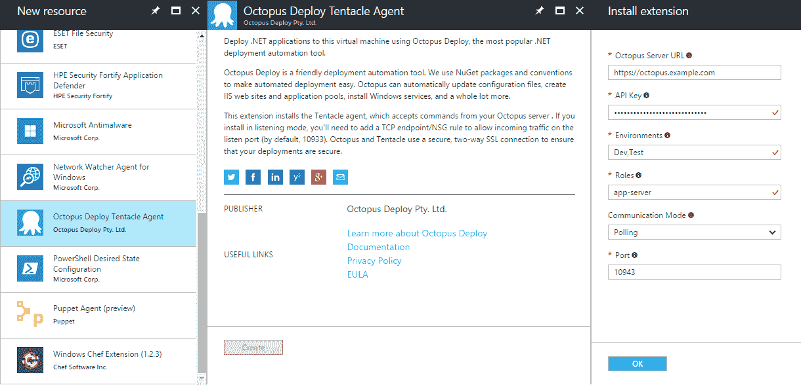

# Azure 虚拟机扩展- Octopus 部署

> 原文：<https://octopus.com/blog/new-azure-vm-extension>

回到 2014 年 10 月，我们非常兴奋地[宣布【Azure 的虚拟机扩展，它允许你安装触手代理，并将其连接到你的 Octopus 服务器。](https://octopus.com/blog/azure-vm-extension)

然而，在软件的世界里(尤其是在云的世界里)，事情在继续发展。微软对 Azure 门户和使这些扩展可用的基础设施进行了重大更新——我们的扩展不再兼容，并已从门户中移除。

今天，我很高兴地宣布，我们已经从头开始重新编写了扩展，它现在可以供您愉快地使用。

## 我能用它做什么？

新的扩展允许你安装或卸载触手，以及在 Azure 虚拟机上更新触手的配置。

你可以通过 [Azure 门户](https://octopus.com/docs/infrastructure/windows-targets/azure-virtual-machines/via-the-azure-portal)、 [PowerShell](https://octopus.com/docs/infrastructure/windows-targets/azure-virtual-machines/via-powershell) 、 [Azure CLI](https://octopus.com/docs/infrastructure/windows-targets/azure-virtual-machines/via-the-azure-cli) 或 [ARM 模板](https://octopus.com/docs/infrastructure/windows-targets/azure-virtual-machines/via-an-arm-template)来实现。(有人告诉我，这甚至可以通过 [Terraform](https://www.terraform.io/docs/providers/azurerm/r/virtual_machine_extension.html) 实现，但这超出了本文的范围！)

## 使用新的 Azure 门户

在 Azure 门户中，选择您的虚拟机，点击`Extensions`并点击`+ Add`按钮。选择`Octopus Deploy Tentacle Agent`扩展，点击`Create`。按照要求填写字段，点击`OK`，扩展将被部署。

[](#)

## 使用 PowerShell (Azure 资源管理器(ARM)模式)

```
$publicSettings = @{
  OctopusServerUrl = "https://octopus.example.com";
  Environments = @("Env1", "Env2");
  Roles = @("app-server", "web-server");
  CommunicationMode = "Listen";
  Port = 10933
}

$privateSettings = @{"ApiKey" = "<MY SECRET API KEY>"}

Set-AzureRmVMExtension -ResourceGroupName "resource-group-name" `
    -Location "Australia East" `
    -VMName "vm-name" `
    -Name "OctopusDeployWindowsTentacle" `
    -Publisher "OctopusDeploy.Tentacle" `
    -TypeHandlerVersion "2.0" `
    -Settings $publicSettings `
    -ProtectedSettings $privateSettings `
    -ExtensionType "OctopusDeployWindowsTentacle" 
```

## 使用 ARM 模板

您可以在创建虚拟机时部署扩展，或者更新扩展资源组以便以后应用扩展。

像往常一样创建您的 ARM 模板，并在您的`Microsoft.Compute/virtualMachine`资源下添加一个`resources`元素:

```
"resources": [
  {
    "type": "Microsoft.Compute/virtualMachines/extensions",
    "name": "[concat(parameters('vmName'),'/OctopusDeployWindowsTentacle')]",
    "apiVersion": "2015-05-01-preview",
    "location": "[resourceGroup().location]",
    "dependsOn": [
      "[concat('Microsoft.Compute/virtualMachines/', parameters('vmName'))]"
    ],
    "properties": {
      "publisher": "OctopusDeploy.Tentacle",
      "type": "OctopusDeployWindowsTentacle",
      "typeHandlerVersion": "2.0",
      "autoUpgradeMinorVersion": "true",
      "settings": {
        "OctopusServerUrl": "http://localhost:81",
        "Environments": [
          "Development",
          "Staging"
        ],
        "Roles": [
          "App Server",
          "Web Server"
        ],
        "CommunicationMode": "Listen",
        "Port": 10933
      },
      "protectedSettings": {
        "ApiKey": "API-ABCDEF1234567890ABCDEF12345"
      }
    },
    "dependsOn": [
      "[concat('Microsoft.Compute/virtualMachines/', parameters('vmName'))]"
    ]
  }
] 
```

有关更多信息和示例，包括 Azure 服务管理(ASM)模式、Azure CLI 等的说明，请[查看我们的文档](https://octopus.com/docs/installation)。