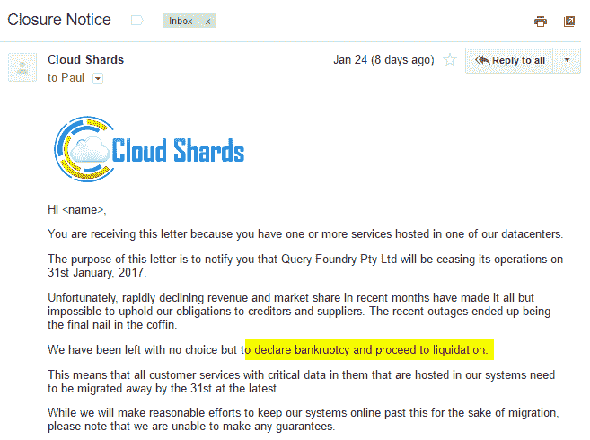
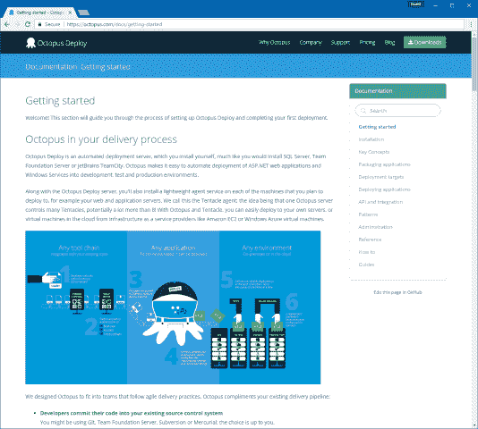

# Octopus 文档的新家- Octopus Deploy

> 原文：<https://octopus.com/blog/new-home-for-documentation>

**我们已经将文档转移到[octopus.com/docs](https://octopus.com/docs)，文档的来源在 Markdown，而[托管在 GitHub](https://github.com/OctopusDeploy/docs) 。**

* * *

自 2012 年以来，我们一直在 [Atlassian Confluence](https://www.atlassian.com/software/confluence) 主持 Octopus Deploy 的产品文档。Atlassian 提供了云托管版本的 Confluence，但出于只有他们自己能解释的原因，[他们不支持 CNAME 的](https://jira.atlassian.com/browse/CLOUD-6999)，这对我们很重要。这给我们留下了两个选择——我们要么自己主持，要么找别人主持。我们选择了一家名为 [QueryFoundry](https://twitter.com/queryfoundry) 的公司，他们在过去的 3 年里相当可靠地为我们托管了 Confluence。

1 月 17 日，我们醒来发现我们的文档离线了。QueryFoundry 的网站也是如此。我们等待着，以为他们会很快恢复在线。24 小时后，他们仍然离线，他们只提供了几个状态更新，事情看起来很糟糕。

不幸的是，我们没有任何最近的文档备份。我们很快建立了一个页面，说我们的文档不可用，然后开始搜索谷歌的缓存和 Archive.org 来寻找这些页面的副本。在这个阶段，我们假设我们的文档永远不会回来了！

大约 48 小时后，QueryFoundry 恢复了，我们的 Confluence 服务器也恢复了。我们能够导出我们的文档，喘口气，责备自己没有最近的备份，然后坐下来想出一个计划。

我们有几个选择:

*   我们可以坚持使用 query foundry——毕竟，这些事情会发生。但令我失望的是，他们在停机期间很少更新状态。
*   我们可以找其他人来主持合流
*   我们可以找些别的东西

对于 API 或库文档，有一些很棒的托管选项- [readme.io](https://readme.io) 是我的最爱之一。

最终，受到我们在[special](https://docs.particular.net/)的朋友的启发，我们决定将我们所有的文档转换成 Markdown，然后[将它们放在 GitHub 的存储库中](https://github.com/OctopusDeploy/docs)——使用 GitHub 或者本地的文本编辑器来编辑文档是很好的。

我们原本计划在 markdown 上使用一个静态站点生成器，但是我们希望它与我们网站搜索/站点地图文件的其余部分集成，并在[octopus.com/docs](https://octopus.com/docs)托管文档。因此，我们构建了一个工具，将它们同步到运行该网站的自制 CMS 中，使用 [Markdig](https://github.com/lunet-io/markdig) 进行转换。

无论如何，我们尽快开始迁移是件好事...在首次停机后大约一周，我们收到了来自 CloudShards 的这封令人悲伤的电子邮件:

从 Confluence exports 到在我们自己的网站上托管大约需要一周的时间，我们仍然需要浏览几个页面来手动修复它们，但我对最终结果非常满意:

记住做备份，即使是托管服务！