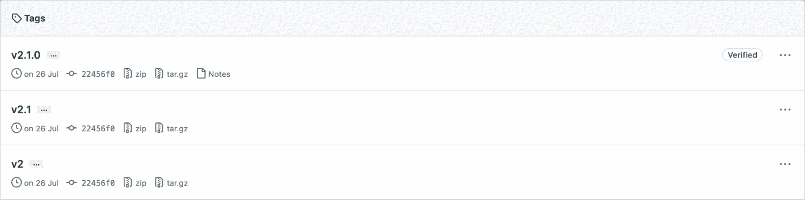
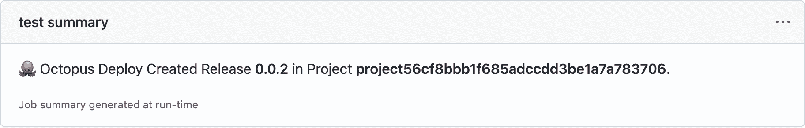
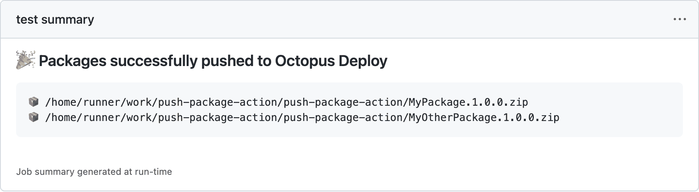

# Octopus Deploy 的 GitHub 动作中的新功能- Octopus Deploy

> 原文：<https://octopus.com/blog/new-in-github-actions>

2021 年 6 月，我们[在 GitHub Marketplace 中发布了我们的第一组动作](https://octopus.com/blog/github-actions-for-octopus-deploy)，以将您的 GitHub 工作流与 Octopus Deploy 集成。

我们最近改进了这些动作的可用性，并在章鱼部署 v2 的 GitHub 动作中增加了一个新动作，作为章鱼 2022 年第三季度发布的一部分。

我们的更新包括:

*   永远发布标签支持
*   提高可用性
*   新的推送构建信息操作
*   工作摘要

在这篇文章中，我将带你了解我们所做的改变，以及你如何从中获得最大收益。

请注意，这篇文章假设你知道用 GitHub 操作构建工作流的基础知识。要了解更多信息，请访问 GitHub 文档。

## 永远发布标签支持

为了提高可用性，我们现在在所有的 GitHub 动作中支持 release 标签的语义版本化。有了这一改变，您现在可以比以前更容易地在工作流程中引用发行标签:

```
uses: OctopusDeploy/create-release-action@v2.0.0 # major.minor.patch
uses: OctopusDeploy/create-release-action@v2.0   # major.minor
uses: OctopusDeploy/create-release-action@v2     # major 
```

我们对操作所做的任何更改都会自动更新我们的发布标签。这些更改将被合并到您的工作流中，具体取决于它们的引用方式。

[](#)

例如，引用仅指定了主要版本的操作意味着您的工作流将自动选取次要版本和修补程序更新附带的更改。

```
#use v2 of push-package-action which includes all updates to minor and patch versions
uses: OctopusDeploy/push-package-action@v2

#use v2.1 of push-package-action which includes all updates to patch versions
uses: OctopusDeploy/push-package-action@v2.1

#use v2.1.3 of push-package-action (pinned version; no updates)
uses: OctopusDeploy/push-package-action@v2.1.3 
```

我们建议您只固定到主版本(v2 ),这样您就可以在错误和安全修复可用时自动受益。

## 提高可用性

在查看了数百个公共存储库之后，我们发现我们提供的参数中只有不到一半在工作流中使用。这些参数中有许多是为了支持 Octopus CLI 而提供的，但是它们并没有在 GitHub 工作流上下文中使用。因此，我们删除了这些参数以提高可用性。

我们现在还支持对上下文值使用环境变量。我们继续鼓励使用[机密来保护敏感值](https://docs.github.com/en/actions/security-guides/security-hardening-for-github-actions#using-secrets)。

```
-name: Create a release in Octopus Deploy 🐙
  uses: OctopusDeploy/create-release-action@v2
  env:
    OCTOPUS_API_KEY: ${{ secrets.API_KEY  }}
    OCTOPUS_HOST: ${{ secrets.SERVER }}
    OCTOPUS_SPACE: 'Spaces-1'
  with:
    project: 'MyProject' 
```

我们 GitHub 动作的所有 READMEs 都已经更新到[记录这些变化](https://github.com/OctopusDeploy/create-release-action/blob/main/migration-guide.md)以及我们支持的[环境变量](https://github.com/OctopusDeploy/create-release-action#%EF%B8%8F-environment-variables)。

## 推送构建信息操作

构建信息是 Octopus Deploy 一个重要特性，它驱动了许多部署后功能。在针对 Octopus Deploy v2 的 GitHub Actions 中，我们添加了对通过新动作发送构建信息的支持，[推送-构建-信息-动作](https://github.com/OctopusDeploy/push-build-information-action)。

这个 GitHub 动作允许您向 Octopus 提供详细的提交、构建和发布跟踪信息，这些信息可以作为发行说明出现。您可以使用此功能与每个生产部署的利益相关者共享发行说明，并在尝试隔离特定版本中引入的 bug 时，跟踪从部署到构建和提交的链接。

```
env:
  OCTOPUS_API_KEY: ${{ secrets.OCTOPUS_API_KEY }} # API key used with Octopus Deploy
  OCTOPUS_HOST: ${{ secrets.OCTOPUS_HOST }}       # address of Octopus Deploy
  OCTOPUS_SPACE: '[space-name-or-space-id]'
steps:
  -uses: actions/checkout@v2
  -name: Push build information to Octopus Deploy 🐙
    uses: OctopusDeploy/push-build-information-action@v1
    with:
      packages: '[package-id]'
      version: '[version-of-packages]' 
```

仔细观察上面的 YAML，可以发现它对 Octopus CLI 没有依赖性。那是因为这个动作第一次使用了我们的 [TypeScript API 客户端库](https://github.com/OctopusDeploy/api-client.ts)。

## 工作摘要

[GitHub 在 2022 年 5 月宣布了 GitHub 行动的工作总结](https://github.blog/2022-05-09-supercharging-github-actions-with-job-summaries/)，我们想要支持它。以前，动作输出仅限于日志和注释，很难对大量信息进行聚合和分组。

使用 Octopus Deploy v2 的 GitHub Actions，您可以看到由[创建-发布-操作](https://github.com/OctopusDeploy/create-release-action)和[推送-打包-操作](https://github.com/OctopusDeploy/push-package-action)生成的作业摘要，这样更容易理解:

[](#)

[](#)

## 结论

用于 Octopus Deploy v2 的 GitHub Actions 现已推出。更新包括 SemVer 发布标签支持、改进的可用性、新的推送构建信息步骤和对作业摘要的支持。

我们希望你喜欢我们为 Octopus Deploy v2 在 GitHub Actions 中所做的更改。

愉快的部署！