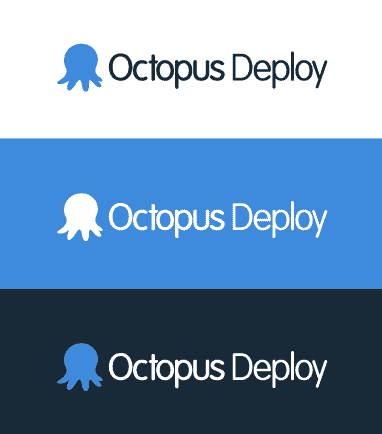

# 新标志-八达通展开

> 原文：<https://octopus.com/blog/new-logo>

当我第一次开始构建 Octopus Deploy 时，我在 [iStockPhoto](http://www.istockphoto.com/) 中搜索 Octopus 图片，并看到了这张图片:

该图像中的颜色成为 Octopus Deploy 第一个测试版的配色方案:

不过，我需要一个可以用在顶角的小 logo，所以我让我姐姐设计了一个 logo。这个标志成为了我们从 beta 版开始使用的标志:

我觉得这个标志对于 1.0 版本来说已经足够好了，我喜欢这个笑脸。事实上，一个客户甚至建议在发布失败或服务器崩溃时使用“皱眉”这个标志，所以我们在几个发布之前就添加了这个标志。

尽管笑脸很好看，但是对于“专业”产品来说，它总是感觉有点太卡通化了，并且在小尺寸时缩放不太好。章鱼正在成长，所以我们请来了科里·金尼万来给它改头换面。不多说了，我很自豪地宣布新的章鱼标志！

