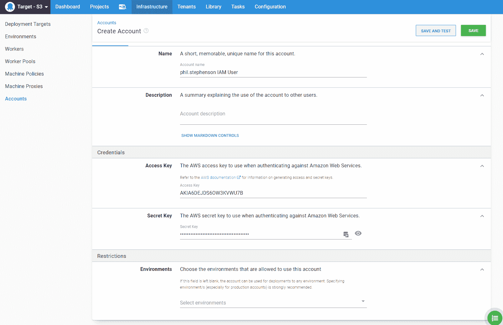

# 带有 Next.js、GitHub 操作和 Octopus Deploy - Octopus Deploy 的 CI/CD

> 原文：<https://octopus.com/blog/nextjs-github-actions-and-octopus-deploy>

[](#)

像 [Next.js](https://nextjs.org/) 和[这样的流行框架创建了 React App](https://github.com/facebook/create-react-app) 支持将你站点的资产捆绑到文件中的特性，但是将这些资产部署到 web 服务器的某个地方取决于你。在这篇文章中，我将使用 [GitHub Actions](https://github.com/features/actions) 捆绑一个 Next.js 博客，并使用 Octopus Deploy 将其部署到 [AWS S3](https://aws.amazon.com/s3/) 。

我们项目的源代码可以在我们的 [Octopus Sample GitHub repo](https://github.com/OctopusSamples/nextjs-blog) 中找到。

## 构建和打包

在我们可以使用 Octopus 部署我们的博客之前，我们需要打包站点并将其推送到一个包存储库中。打包我们的站点是[构建部署管道](https://octopus.com/devops/continuous-delivery/what-is-a-deployment-pipeline/)的一部分，你可以在文章[打包 Node.js 应用](https://octopus.com/blog/deploying-nodejs)中读到更多关于它为什么重要的信息。

为了简单起见，我们将使用 Octopus 的内置存储库中的[。由于我们的项目已经托管在 GitHub 上，让我们设置一个 GitHub 动作来帮助我们创建我们的包。我们的工作流应该是这样的:](https://octopus.com/docs/packaging-applications/package-repositories/built-in-repository)

对于我们的`main`分支的每次推送，我们将:

*   检查源代码。
*   运行`npm ci`来获取我们的`node_modules`依赖项(这一步隐含的是在我们的 Actions 环境中设置 node.js)。
*   用新的版本号标记我们的提交。
*   使用`next export`来生成我们的静态资产文件。
*   将这些资产打包到我们的产品包中。
*   最后，将我们的包推送到 Octopus 内置的存储库中。

让我们从 GitHub 动作模板开始，它检查我们的源代码，运行`npm ci`，并生成我们的资产:

```
// main.yml - https://github.com/OctopusSamples/nextjs-blog/blob/main/.github/workflows/main.yml
on:
  push:
    branches:
      - main
jobs:
  release:
    name: Create Release
    runs-on: ubuntu-latest
    steps:
      - name: Checkout
        uses: actions/checkout@v2
      - name: Setup Node.js
        uses: actions/setup-node@v2
        run: |
          npm ci
          npm run export 
```

`npm run export`在我们的 package.json 文件中运行下面的 [npm 脚本](https://docs.npmjs.com/cli/v6/using-npm/scripts):

```
"scripts": {
  "build": "next build",
  "export": "next build && next export"
}, 
```

有关`next export`的更多信息，请参见 [next.js 文档](https://nextjs.org/docs/advanced-features/static-html-export)。

这是一个好的开始，但是现在我们需要一些方法来为我们的包创建新的版本号。

### 语义发布标签

Octopus 内置提要中的每个包都需要一个 **ID** 和一个**版本**号，因此文件名使用这种格式`ID.version.ext`。例如:`nextjs-blog.0.1.0.zip`。版本号必须是有效的[语义版本](https://octopus.com/docs/packaging-applications/create-packages/versioning#semver)。您可以在每次想要发布时手动标记您的发布，但是这很耗时并且需要人工。如果您想要自动化这个过程，那么用自制的解决方案构建逻辑来生成新的、有效的语义版本是具有挑战性的。幸运的是，有一个叫做[语义发布](https://semantic-release.gitbook.io/)的优秀开源项目可以做到这一点。

语义发布基于一些预定义的约定评估我们的提交消息。根据我们最近提交消息的格式，在找到最新版本并相应地更新主要版本、次要版本或补丁版本后，库将生成下一个适当的语义版本。这个库的细节超出了本文的范围，但是如果您以前从未使用过它，一定要看看这个项目。

甚至有一个社区为语义发布贡献了 GitHub 行动。让我们使用这个项目来自动生成我们的新版本，并标记我们的提交:

```
...
  - name: Tag and Create Release
    id: semantic
    uses: cycjimmy/semantic-release-action@v2
    env:
        GITHUB_TOKEN: ${{ secrets.GITHUB_TOKEN }} 
```

因为我们的主 git 分支被命名为`main`，我们需要在我们的`package.json`中进行一小段配置来告诉语义发布只评估对`main`分支的提交:

```
"release": {
  "branches": [
    "main"
  ]
} 
```

现在我们已经构建并标记了我们的新版本，是时候创建我们的包并将其发布到 Octopus 了。

### 用 octopackjs 打包并发布

如果您曾经尝试过用普通的 ol' npm 创建包，这可能会非常令人沮丧。

*   `npm pack` [命令](https://docs.npmjs.com/cli/v6/commands/npm-pack)暴露的 CLI 参数非常少。
*   您不能显式定义生成的包的名称。
*   包的版本必须来自`package.json`中的`version`键，并且不能被 CLI 参数覆盖。
*   你的包根*必须*包含`package.json`文件。
*   您不能轻易地定义最终出现在您的包中的目录结构。

这看起来好像 npm 是专门为打包您的包而设计的，以供其他 npm 项目使用——而不是为部署。

[octopackjs](https://github.com/OctopusDeploy/octopackjs) 是一个由 Octopus 维护的开源项目，旨在将你的包打包并推送到 Octopus 服务器。运行`npm run export`之后，Next.js 将我们的静态资产文件放在一个名为`out`的目录中。让我们使用 octopackjs 编写一个小节点脚本来打包该目录并将其推送到我们的 Octopus 服务器:

```
// publish.js - https://github.com/OctopusSamples/nextjs-blog/blob/main/publish.js
const octo = require('@octopusdeploy/octopackjs');
const octopusUrl = 'https://samples.octopus.app';
octo.pack()
    .appendSubDir('out', true)
    .toFile('.', (err, data) => {
        console.log('Package Saved: ' + data.name);
        octo.push(data.name, {
            host: octopusUrl,
            apikey: 'MY-API-KEY',
            spaceId: 'Spaces-604',
            replace: true
        },
        err => err ? console.error(err.body) : console.log('Package Pushed to ' + octopusUrl));
    }); 
```

参见我们的文档，了解如何创建 API 键用于 Octopus Deploy。有安全意识的读者可能会马上注意到，我的 API 键似乎是直接硬编码到我们的脚本中的，这是一个很大的错误！让我们在这里使用一个环境变量:

```
octo.push(data.name, {
    ...
    apikey: process.env.OCTOPUS_APIKEY,
    ... 
```

我们可以在 GitHub Actions 中使用[加密的秘密注入这个环境变量。首先，我们将把我们的`OCTOPUS_APIKEY`秘密添加到我们的存储库中(按照动作文档中的说明):](https://docs.github.com/en/actions/reference/encrypted-secrets)

[](#)

接下来，我们将在`main.yml` GitHub 动作模板中引用我们的秘密:

```
...
- if: steps.semantic.outputs.new_release_published == 'true'
name: Publish Package
env:
    OCTOPUS_APIKEY: ${{ secrets.OCTOPUS_APIKEY }}
run: |
    npm ci
    npm run export
    OCTOPUS_APIKEY="$OCTOPUS_APIKEY" node publish.js 
```

既然我们已经建立了我们的行动，让我们提交，推动，看着它去！

[](#)

在这个例子中，我们从 GitHub Actions 向 https://samples.octopus.app 的 Octopus Cloud 实例推送包。如果你正在运行一个不能从 github.com 公开访问的 Octopus 服务器，你可能会考虑推送到一个第三方的包存储库(例如 Artifactory，Nexus ),并通过将它设置为一个[外部 feed](https://octopus.com/docs/packaging-applications/package-repositories) 或使用一个本地 GitHub Actions runner(如本文[帖子](https://octopus.com/blog/gitub-actions-local-runner)中所解释的),让你的 Octopus 服务器从该存储库中拉出。

## 部署

既然我们已经建立了持续集成流程，那么是时候部署我们的网站了。我们将使用 Octopus Deploy 将我们的包上传到 AWS S3。方便的是，它已经有一个为此设计的[内置步进模板](https://octopus.com/docs/deployment-examples/aws-deployments/s3)。对于像我们在这里建立的这样的静态内容网站，S3 桶是一个很好的选择，因为它们需要很少的配置(不需要安装和配置 web 服务器)，价格便宜，当然你也可以从 AWS 云平台的可靠性中受益。

### AWS S3

设置一个 S3 桶是非常简单的，有很多教程可以帮助你，所以我不会在这里一步一步地讲解。我强烈建议遵循 AWS 文档，特别是针对使用亚马逊 S3 托管静态网站的[。](https://docs.aws.amazon.com/AmazonS3/latest/dev/WebsiteHosting.html)

Octopus 需要一个 [AWS 访问密钥](https://docs.aws.amazon.com/general/latest/gr/aws-sec-cred-types.html#access-keys-and-secret-access-keys)来上传包到你的 S3 桶。建立一个单独的 [IAM 用户](https://docs.aws.amazon.com/IAM/latest/UserGuide/id_users.html)对您的新 bucket 拥有明确的权限是一个好主意(尽管不是强制性的)。有关管理 IAM 用户访问密钥的帮助，请参见本页。

将您的访问密钥 ID 和密钥秘密保存在安全且可访问的地方。我们需要这两个值来在 Octopus Deploy 中设置我们的 AWS 帐户

### 章鱼部署

在 Octopus Accounts 部分，创建一个新的 [AWS 帐户](https://octopus.com/docs/infrastructure/deployment-targets/aws)。我希望我的帐户名称匹配或引用 AWS IAM 用户的名称:

[](#)

接下来，让我们创建一个名为`nextjs-blog`的新 Octopus 项目:

[](#)

为了在我们的`nextjs-blog`项目中使用我们的 AWS 帐户，我们需要在我们项目的 variables 部分创建一个 AWS 帐户变量:

[](#)

最后，让我们通过将**上传包添加到 AWS S3 存储桶**步骤来创建项目中的唯一步骤:

[](#)

配置这一步很简单。您可以跟随我们的文档，其中[解释了步骤模板选项](https://octopus.com/docs/deployment-examples/aws-deployments/s3)和更多信息的链接。

注意**包目标**选项。默认情况下，该步骤设置为部署整个包文件，而不提取它。我们的资产文件就在包里，我们需要把它们提取出来，放在水桶的根部，让 S3 为它们服务。为此，请按照下列步骤操作:

1.  在包选项中选择**特定文件。**
2.  点击**添加文件选择**。
3.  选择**多档**(相对于**单档**)。

[](#)

默认文件模式`**/*`将选择我们包中的所有文件和目录，这正是我们想要的。

4.  接下来，输入一个`Canned Acl`。在这里阅读更多关于这些[的内容](https://docs.aws.amazon.com/AmazonS3/latest/dev/acl-overview.html#canned-acl)。对于我的设置，我使用了`bucket-owner-full-control`

最后，创建一个发布，交叉手指，然后部署！

如果一切顺利，我们会在这里看到我们的网站:[http://octopus-nextjs-sample . S3-website-us-west-2 . Amazon AWS . com/](http://octopus-nextjs-sample.s3-website-us-west-2.amazonaws.com/)

[](#)

## 结论

在 [GitHub](https://github.com/OctopusSamples/nextjs-blog) 上查看该项目的源代码，您还可以在我们的 [Octopus 部署示例空间](https://samples.octopus.app/app#/Spaces-604/projects/nextjs-blog)中查看部署项目。

如果你想使用 SSL 证书为你的网站提供服务，请查看 [AWS CDN 产品 CloudFront](https://docs.aws.amazon.com/AmazonS3/latest/dev/website-hosting-cloudfront-walkthrough.html) 。

如果你有一个大得多的 Next.js 站点，并且生成静态资产不切实际，Next.js 还支持用 Node.js 的[动态后端为你的应用服务。参见这个](https://nextjs.org/docs/deployment#nodejs-server)[伟大的数字海洋教程](https://www.digitalocean.com/community/tutorials/how-to-deploy-a-next-js-app-to-app-platform)为你的 Next.js 应用程序设置这种部署。

感谢您的阅读，祝您部署愉快！