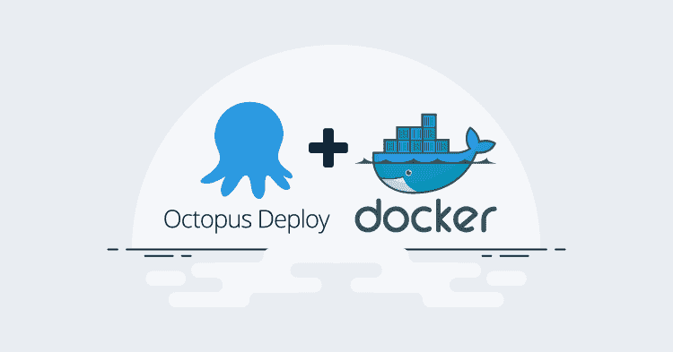
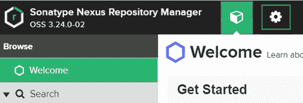
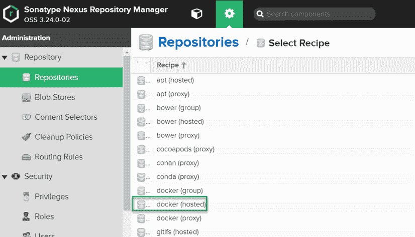
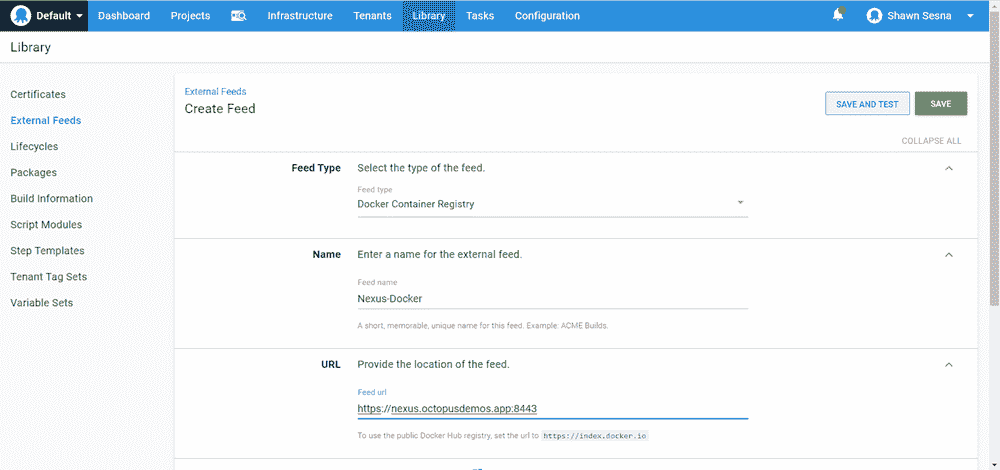

# 使用带有 Octopus Deploy - Octopus Deploy 的 Nexus Docker 注册表

> 原文：<https://octopus.com/blog/nexus-docker-external-feed-with-octopus>

[](#)

将 [Docker Hub](https://hub.docker.com) 连接到 Octopus Deploy 非常简单，然而，并不是每个人都想使用公开可用的 Docker 注册中心。在这些情况下，您可以使用存储库软件，如 [JFrog Artifactory](https://jfrog.com/artifactory) 或 [Sonatype Nexus](https://www.sonatype.com/product-nexus-repository) 。JFrog 和 Sonatype 都有开源软件(OSS)版本，但是，JFrog 的 OSS 版本中没有 Docker registry repository 类型。在这篇文章中，我演示了如何在 Nexus 中创建 Docker 注册表并将其连接到 Octopus Deploy。

## 关系

付费版本包括高可用性(HA)、动态存储和更好的身份验证集成等功能，但总体操作功能在 OSS 版本中全部开启。

### 创建 Docker 注册表

在 Nexus 中创建 Docker 注册库非常容易。登录 Nexus 并导航至**服务器管理**选项卡(齿轮图标):

[](#)

从这里，点击左边的**存储库**选项卡，然后点击**创建存储库**。

选择 **docker(托管)**仓库类型:

[](#)

这部分流程不同于其他存储库类型，比如 NuGet 和 Maven 2。而其他两个使用`https://ServerUrl/repository/RepositoryName`，Nexus Docker 注册表需要一个端口分配。在这个例子中，我使用了端口`8443`，这将在我们标记图像时变得很重要。

您可以接受其余选项的默认值。完成后，单击页面底部的**创建存储库**按钮。

### 标记图像

为了将 docker 图像上传到我们的 Nexus Docker 注册表，我们必须对图像进行适当的标记。这是通过以下标记方案实现的:`ServerUrl:Port/ImageName:Version`。例如:

```
nexus.octopusdemos.app:8443/pitstop-auditlogservice:1.0.0.0 
```

注意标签中没有存储库名称`nexus-docker`。这就是端口名称很重要的地方，因为它标识了上传到 Nexus 时它将属于哪个注册表。

## 连接到 Octopus 部署

当将其他存储库类型连接到 Octopus Deploy 时，只需通过 Nexus 中的 Copy URL 按钮提供 URL:

[](#)

虽然我们的 Docker 注册中心有这个按钮，但这不是我们用 Octopus Deploy 连接到存储库的方式。

当在 Octopus Deploy 中创建外部 feed 并测试它时，使用该页面的 URL 会产生误报。端点将响应一条成功消息，甚至提供搜索结果，但是当您试图在部署过程中使用它时，它将失败。

### 创建外部提要

要在 Octopus Deploy 中创建外部提要，请单击**库**选项卡，然后单击**外部提要**，并单击**添加提要**按钮。

为外部馈送输入以下信息:

*   提要类型:Docker 容器注册表。
*   名称:给它一个描述性的名称。
*   URL: https://ServerUrl:Port(例如 https://nexus . octopus demos . app:8443)。
*   注册表路径:留空。
*   凭据:如果需要，请输入凭据:

[](#)

完成后点击**保存并测试**。

输入图像名称(支持部分名称)并点击**搜索**以验证连接是否正常工作。

## 结论

Nexus 有一种独特的方式将 Docker 注册中心作为存储库类型来处理。在这篇文章中，我演示了创建注册中心并将其连接到 Octopus Deploy 的必要性。