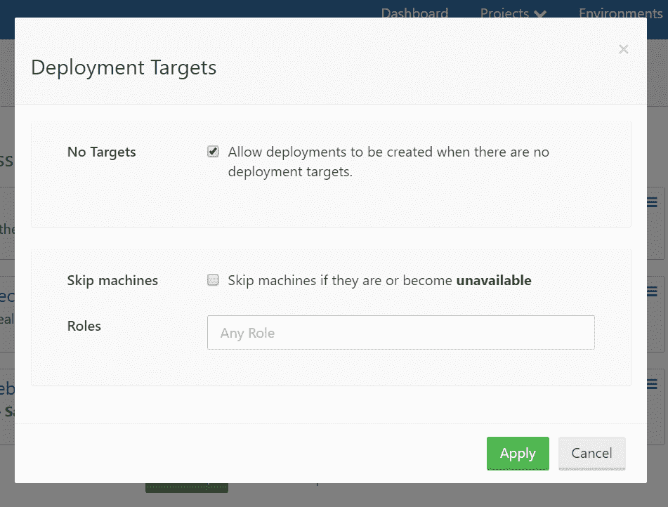

# 部署到无目标- Octopus 部署

> 原文：<https://octopus.com/blog/no-target-deployments>

作为 Octopus Deploy 3.8.7 的一部分，我们发布了一个与弹性和瞬态环境相关的新特性，我们认为这是值得一提的。

## 允许部署到无目标

该特性的核心是一个项目级设置，可以选择在没有目标的环境中执行部署。

## 这为什么有用？

弹性和瞬态环境的基本前提是确保部署到环境中所有目标的版本是相同的，包括上线的新目标。这种机制的关键是成功地部署到环境中，以便知道将哪个版本部署到其他目标。但是，为了在环境中进行部署，您必须至少有一个健康的目标，这有其局限性。

如果您正在构建一个新的环境会怎么样？(例如，对于基础架构/测试自动化)在基础架构部署完全完成之前，您不能开始部署。如果您的部署过程包括提供将被后续步骤使用的基础设施的步骤，会怎么样？根据定义，目标在部署开始前是不存在的。

如果在您想要将升级部署到某个环境时，临时机器碰巧都处于离线状态，该怎么办？是的，在某些情况下这是有效的，例如，您正在部署一批移动设备，而在您想要部署新版本时，这些设备中没有一个是对接的/在线的。

## 我如何使用这项新功能？

上面屏幕截图中显示的设置将允许您在环境中没有目标时创建部署。这基本上就是你所需要的，但是在大多数情况下，你可能希望将这与使用[触发器](https://g.octopushq.com/AutomaticDeploymentTriggers)结合起来。

如果您使用的是[不可变的基础设施](https://g.octopushq.com/ImmutableInfrastructure)，那么如果您想将基础设施供应步骤和应用程序部署步骤合并到一个项目中，这个特性将非常有用。

## 你必须选择加入！

Octopus 不想让你部署到没有目标的环境中。对于我们的绝大多数客户来说，我们仍然认为部署到没有目标的环境是一个错误，我们将继续这样对待它，直到用户有意识地表示可以这样做。

## 自动部署覆盖

对于那些没有见过或使用过[自动部署覆盖](https://octopus.com/docs/deployments/patterns/elastic-and-transient-environments/keeping-deployment-targets-up-to-date#Keepingdeploymenttargetsuptodate-Overridingthereleaseusedforautomaticdeploymentsoverriderelease)功能的人来说，这是一个命令行选项，可以手动覆盖将部署到给定环境/租户的版本。当您想要将一个环境/租户锁定到一个特定的版本，而不是让他们总是接收最新的成功发布时，这是非常有用的。

以前，版本覆盖是处理没有目标的环境中的部署的推荐选项，因为它可以在没有现有部署的情况下定义。当新的目标出现在环境中时，自动部署触发器将被触发，并且部署指定版本的任务将被排队。既然可以将版本部署到没有目标的环境中，这种自动部署覆盖的使用场景就不再必要了。