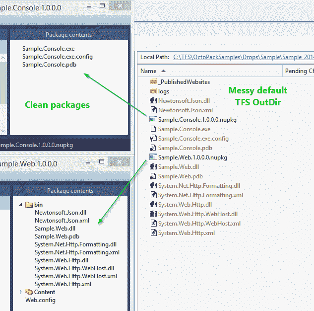

# OctoPack 3.0 - Octopus 部署

> 原文：<https://octopus.com/blog/octopack-3.0>

我们刚刚发布了 OctoPack 的新版本，有一些大的变化。如此之大，事实上，我们称之为 OctoPack 3.0！

第一个变化是，在打包二进制文件时，我们习惯于将所有文件放在`$(OutDir)`下。默认情况下，TFS 将所有项目的输出发送到同一个目录，这意味着 OctoPack 无法判断哪个文件是哪个项目的。由于马克斯·马卢克的[拉请求，我们已经改为使用`@(FileWrites)`和`@(FileWritesShareable)`。你可以](https://github.com/OctopusDeploy/OctoPack/pull/12)[在 MSDN](http://msdn.microsoft.com/en-us/magazine/dd419659.aspx) 上了解更多关于这些房产的信息。最终的结果是，OctoPack 应该更适合 TFS 用户。



第二个主要变化是 OctoPack 不再需要签入版本控制。也就是说不再有**了。使用 NuGet 包还原时的 octopack** 文件夹！我们正在使用与微软[相同的方法。Bcl.Build](https://www.nuget.org/packages/Microsoft.Bcl.Build/) 用途。当你安装 OctoPack 时，你会得到下面的`<Import>`:

```
<Import Project="..\packages\OctoPack.3.0.19\tools\OctoPack.targets" Condition="Exists('..\packages\OctoPack.3.0.19\tools\OctoPack.targets')" /> 
```

这样，当 NuGet package restore 尚未运行而目标丢失时，您仍然可以加载项目。

但是，*如果*调用了 OctoPack，而**还没有**运行 NuGet 包恢复，那么显然我们什么也包不了。所以我们还添加了一个`<Target>`,它将导致构建失败，除非您首先运行 NuGet package restore:

```
<Target Name="EnsureOctoPackImported" BeforeTargets="BeforeBuild" Condition="'$(OctoPackImported)' == ''">
  <Error Condition="!Exists('..\packages\OctoPack.3.0.19\tools\OctoPack.targets') And ('$(RunOctoPack)' != '' And $(RunOctoPack))" Text="You are trying to build with OctoPack, but the NuGet targets file that OctoPack depends on is not available on this computer. This is probably because the OctoPack package has not been committed to source control, or NuGet Package Restore is not enabled. Please enable NuGet Package Restore to download them. For more information, see http://go.microsoft.com/fwlink/?LinkID=317567." HelpKeyword="BCLBUILD2001" />
  <Error Condition="Exists('..\packages\OctoPack.3.0.19\tools\OctoPack.targets') And ('$(RunOctoPack)' != '' And $(RunOctoPack))" Text="OctoPack cannot be run because NuGet packages were restored prior to the build running, and the targets file was unavailable when the build started. Please build the project again to include these packages in the build. You may also need to make sure that your build server does not delete packages prior to each build. For more information, see http://go.microsoft.com/fwlink/?LinkID=317568." HelpKeyword="BCLBUILD2002" />
</Target> 
```

现在，当在 Team Build 或另一个 CI 工具下运行 OctoPack 时，这会带来一些问题，特别是如果构建服务器被配置为在构建开始之前清理所有文件(包括 NuGet 包)的话。它还会影响使用虚拟生成代理的 Team Foundation 服务。但这不仅仅是 OctoPack 的问题；也影响到了`Microsoft.Bcl.Build`用户。最佳解决方案是在构建解决方案之前运行 NuGet 包恢复。对于 TFS 用户，NuGet 团队的这篇文章展示了如何在构建之前运行 NuGet 包恢复。TeamCity 客户可以使用内置的 [NuGet 安装程序](http://blog.jetbrains.com/teamcity/2013/08/nuget-package-restore-with-teamcity/) runner。

最后，修复了许多小错误，并添加了一些其他功能:

*   [34](https://github.com/OctopusDeploy/OctoPack/pull/34)——我们现在读`AssemblyInformationalVersion`，回到`AssemblyVersion`，当决定一个包使用什么版本的时候(如果你没有通过`/p:OctoPackPackageVersion=XYZ`)
*   你现在可以将自定义的`<files>`与我们自动检测和添加的文件结合使用，而不是选择任何一个
*   你现在可以在打包时将自定义属性传递给 NuGet

这些变化大部分来自社区的拉请求，其中一些已经等待了相当长的时间。感谢每一个为 OctoPack 提交 PR 的人；从现在开始，我们会更加积极地复习它们。