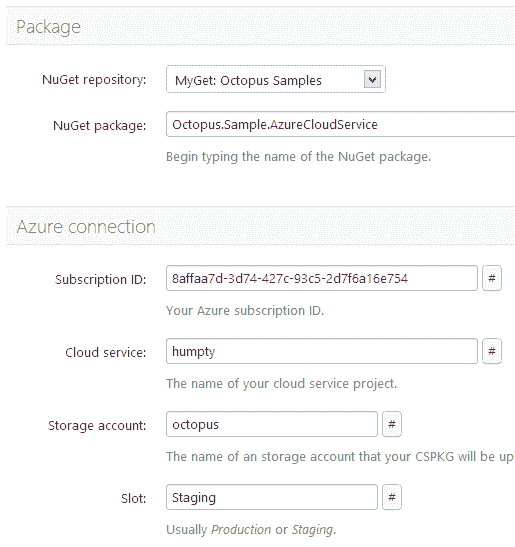
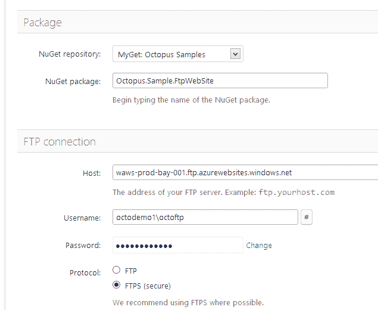
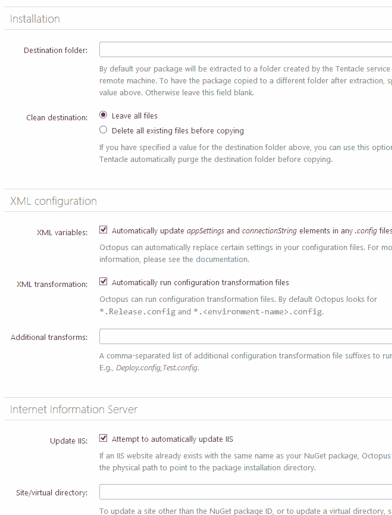
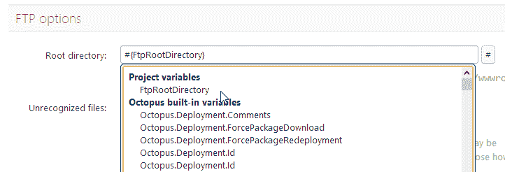

# 带有 Azure 和 FTP 部署的 Octopus 1.5，加上 ScriptCS 支持！-章鱼部署

> 原文：<https://octopus.com/blog/octopus-1.5-azure-ftp-scriptcs>

今天，我们发布了 Octopus Deploy 1.5，它支持自动部署 Windows Azure 云服务，以及通过 T2 FTP/FTPS 进行部署。

## Azure 云服务部署

通过将您的云服务包打包到 NuGet 包中，Octopus 现在可以使用新的部署步骤类型自动将您的应用程序部署和升级到 Windows Azure。



对 Azure 的支持包含一些很酷的特性:

*   Octopus 可以在部署前自动配置您的`.cscfg`
*   Octopus 可以保留已经在 Azure 门户上定义的实例计数，或者使用来自您的`.cscfg`的新值

你可以在我们关于 Windows Azure 特性的[文档页面上了解更多关于这些特性的信息。](http://octopusdeploy.com/documentation/features/azure)

Azure 部署不需要触手；该包直接从 Octopus 服务器部署。

## FTP/FTPS 部署

Octopus 还可以通过 FTP/FTPS 部署，这意味着 Octopus 现在可以与各种商业网站主机以及 Windows Azure 网站一起工作。



与 Azure 部署步骤一样，这个步骤是在 Octopus 服务器上执行的，因此不需要任何触手。Octopus 仍将执行 XML 配置转换并运行 PowerShell 脚本，因此您可以在部署之前应用特定于环境的配置。

在 [Octopus FTP 文档页面](http://octopusdeploy.com/documentation/features/ftp)上了解更多信息。

## 剧本

[ScriptCS](https://github.com/scriptcs/scriptcs) 是一个开源项目，允许你用 C#编写脚本。在 Octopus 中，它是 Windows PowerShell 的替代品。

例如，在您可能使用了`Deploy.ps1`的地方，您可以使用`Deploy.csx`(一个 ScriptCS 脚本)。Octopus 将调用你的脚本的脚本代码。

与 PowerShell 脚本一样，Octopus 使您的项目变量(以及内置变量)可用于您的 ScriptCS 脚本。例如，此脚本将打印要部署到的环境的名称:

```
using System;

Console.WriteLine("Deploying to: " + Octopus.Parameters["OctopusEnvironmentName"]); 
```

## 改进封装步骤选项

当将 NuGet 包部署到触手时，您可以定义所谓的“[特殊变量](http://octopusdeploy.com/documentation/features/variables)来配置设置，比如将包提取到哪里，或者更新 IIS 站点的名称。

现在，这些设置已被移到步骤定义页面，使它们更容易查找和设置:



不同的环境需要使用不同的设置？您可以使用[变量替换语法](http://octopusdeploy.com/blog/variable-substitutions)和我们新的变量插入下拉菜单:



## 了解更多信息:3 月 28 日的网络研讨会

这个版本还包括许多错误修复和可用性改进。如果您想了解更多信息，[请参加我们 3 月 28 日](http://octopusdeploy.com/blog/octopus-1.5-webinar)的免费网络研讨会。

愉快的部署！