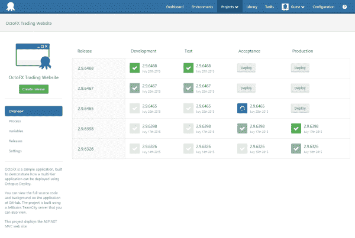

# 章鱼 3.0:发布了！-章鱼部署

> 原文：<https://octopus.com/blog/octopus-3.0-released>

今天，我很自豪地宣布，章鱼 3.0 已经升级到生产就绪版本！你可以[现在就下载](/downloads)，或者在我们的演示网站上探索一个[活章鱼服务器。一定要查看一下](https://demo.octopusdeploy.com)[升级指南](http://docs.octopusdeploy.com/display/OD/Upgrading+from+Octopus+2.6)——我们做了一些大的改动，但是我们尽量让升级体验相对不那么痛苦。

Octopus 3.0 的开发工作始于 8 个月前，它包含了一些巨大的变化。Octopus 最重要部分的大部分都被重写了，几乎没有一段代码没有改变:

到了产品生命周期的这个时候，大多数公司会很乐意坚持当前的架构，只是偶尔添加一个大的特性，并将其称为新版本。我个人认为，这导致产品变得陈旧，使用起来没有乐趣。对于我们这样规模的公司来说，没有其他产品可以依赖，我认为投入如此多的时间来重写产品的基本部分，并花 8 个月的时间来完成它是一个非常大胆的决定。我希望有了 3.0 你会同意这是值得的。

当然，3.0 不仅仅是大的架构变化；我们还增加了一系列新功能:

*   SSH、Windows Azure web 应用程序和离线放置的新部署目标
*   一个数据迁移器，允许您在 Octopus 服务器之间导出和导入 JSON 格式的数据，或者将它们提交给 Git repo
*   增量压缩以减少带宽和部署时间
*   一个完整的外观和感觉改造
*   一个新的项目概述(如上图),使推广版本更容易
*   努力实现[高可用性](http://octopusdeploy.com/blog/octopus-deploy-high-availability)，我们将在几周后分享更多内容

总的来说，4，170 个文件中的 1，790 个 Git 提交用于制作这个版本。这也是我们有史以来测试最多的版本——我们已经对它进行了多次 bug bashed，我们已经有了一个漫长的测试过程，在野外安装了 100 多个 Octopus 3.0。谢恩一直在密切关注性能，我们已经用数百个触角测试了它。

8 个月的发布间隔时间太长了。我期待着回到一个更有规律的节奏，每一两个月发布一次新版本的 Octopus，逐渐使软件变得更好。

### 谢谢

对我来说，软件构建的创造性努力及其无限的可能性是[自我实现](https://en.wikipedia.org/wiki/Maslow%27s_hierarchy_of_needs#Self-actualization)的完美载体。章鱼刚开始的时候，是我和我一个人的倒影；我的想法，和我的缺点。另一方面，Octopus 3.0 是由一个现在有 13 人的团队开发的，我认为它反映了我们所有人的最佳状态。对我的团队来说，能和你们一起将 Octopus 3.0 带入这个世界是一种真正的荣誉。还要特别感谢参加 3.0 预发布网络研讨会并对我们新的[社区论坛](http://community.octopusdeploy.com)提供反馈的所有人。