# 部署 Octopus 和 PowerShell DSC - Octopus 的配置管理

> 原文：<https://octopus.com/blog/octopus-and-powershell-dsc>

[PowerShell 期望状态配置(DSC)](https://msdn.microsoft.com/en-us/powershell/dsc/overview) 是 PowerShell 团队采用声明式方法来配置服务器，是标准 PowerShell 脚本命令式方法的替代方案。PowerShell DSC 可用于许多在配置新服务器时需要运行的常见配置任务。一些有用的例子:

*   安装 Windows 功能，如用于 web 服务器的 IIS
*   设置环境变量
*   设置文件和文件夹权限

虽然 Octopus 专注于不断交付应用程序的新版本(您自己构建的应用程序)，但这些任务是一次性的，通常由不同的工具集来完成。在过去的 6 个月里，我们一直致力于开发一些功能，这些功能实际上结合在一起，当与 PowerShell DSC 结合时，使 Octopus 成为一个真正有效的配置管理工具。

在这篇文章中，我想演示如何使用 Octopus 来管理、测试和推广 PowerShell DSC 脚本，以及 Octopus 和 PowerShell DSC 如何结合使用。

## 概观

在这篇文章中，我将向你展示如何:

*   使用 Octopus 运行 PowerShell DSC 脚本，在我们的 web 服务器上安装 IIS
*   使用 Octopus 中的健康检查来检测 DSC 脚本的“漂移”(IIS 功能被禁用)
*   检测到漂移时设置电子邮件提醒
*   使用 Octopus 中的自动部署来纠正偏差(修复 IIS)
*   测试我们的 DSC 脚本的新版本，并在不同环境之间推广它们

## Octopus 作为 PowerShell DSC 推/拉服务器的替代产品

微软支持在服务器之间部署 PowerShell DSC 脚本的两种方式——“推”和“拉”服务器。这是一个中央服务器，存储每个节点的配置。

对于我们的大多数客户来说，他们已经在机器之间设置了我们的章鱼和触手代理，你猜怎么着:章鱼和触手可以配置为[监听](http://docs.octopusdeploy.com/display/OD/Listening+Tentacles)(推)和[轮询](http://docs.octopusdeploy.com/display/OD/Polling+Tentacles)(拉)模式！并且它有一些好处:[章鱼/触手通信是安全的](http://docs.octopusdeploy.com/display/OD/Octopus+-+Tentacle+communication)，不期望机器在同一个域，支持代理服务器，以及许多其他特性。

因此，如果您使用 Octopus 和 Tentacle，您应该能够使用 Octopus 部署您的 PowerShell DSC 脚本，而不需要 DSC 拉/推服务器。少了一件要管的事！

## 演示环境

我在 Hyper-V 中设置了三台虚拟机来构建这个演示:一台 Octopus 服务器，两台服务器将作为我们的 web 服务器。一台是“测试”服务器，另一台是“生产”服务器:


我在 Octopus 服务器上设置了 SQL Server 和 Octopus，并在两个 web 服务器上设置了 Tentacle(在轮询模式下)。我没有添加任何其他 Windows 功能或做任何其他事情来配置它们。

## 第一个 DSC 脚本

在我们进入 IIS 之前，让我们首先制作一个非常简单的设置环境变量的 DSC 脚本。我们将在 Octopus 中创建一个名为“配置”的新项目，该项目将包含一个 PowerShell 脚本步骤，其中包含我们的 DSC 脚本:

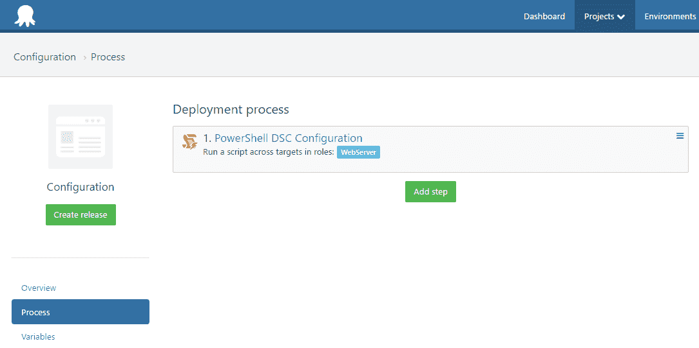

剧本是这样的:

```
Configuration WebServerConfiguration
{  
  Node "localhost"
  {  
    Environment HelloMessageVariable
    {
        Ensure = "Present"
        Name = "HelloMessage"
        Value = "Hello, world!"
    }
  } 
}

WebServerConfiguration -OutputPath "C:\DscConfiguration"

Start-DscConfiguration -Wait -Verbose -Path "C:\DscConfiguration" 
```

该脚本做了三件事:

1.  它定义了配置。注意，我们使用`localhost`，因为这个脚本将直接在每个 web 服务器上运行。
2.  它调用配置(生成`.mof`文件)，将输出发送到一个文件夹
3.  它会应用该文件夹中的配置

在 Octopus 中，我们可以创建这个项目的发布，并部署它。DSC 脚本将在远程机器上运行，发现环境变量不存在，并创建它:

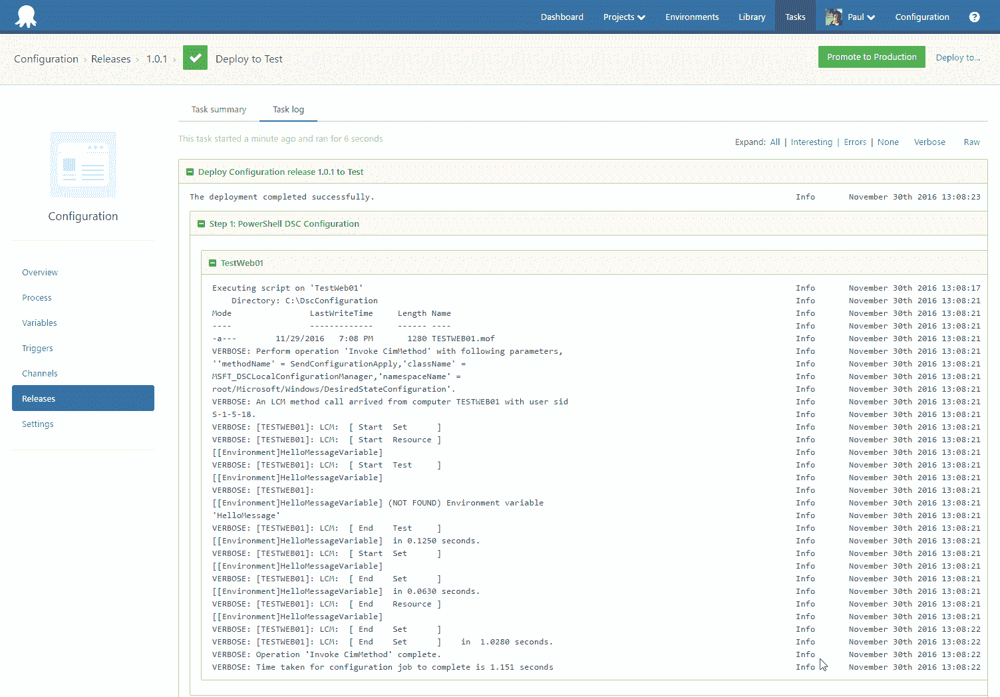

我们可以看到该变量已在机器上创建:

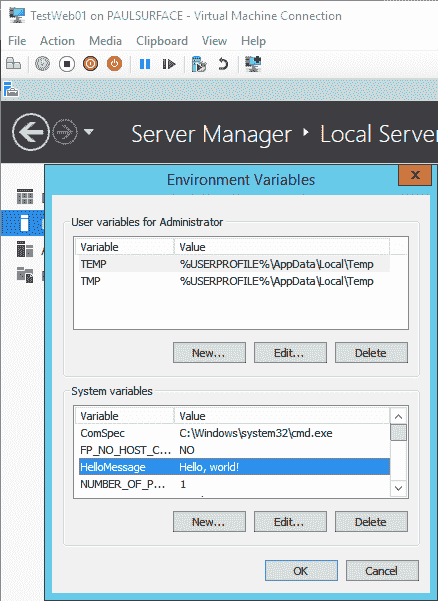

如果我们修改了 Windows 中的环境变量(比如某个调皮的开发人员在调试某个东西的时候手动更改了变量，忘记告诉任何人)，下一次 DSC 脚本运行的时候就会被覆盖:

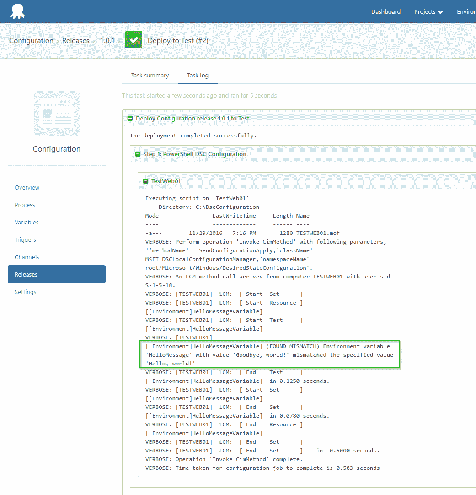

现在，这很有趣，但是 DSC 现在没有做太多标准 PowerShell 不能做的事情(尽管它更具声明性，这很好)。我们仍然需要重新部署 DSC 脚本来强制覆盖它。

## 检测漂移

DSC 声明式模型的强大之处在于能够检测到*漂移*——当机器上配置的实际情况与它应该配置的不匹配时。

PowerShell 提供了一个`Test-DscConfiguration`功能，可以用来检查机器是否漂移。我们可以在 Octopus 中设置一个[自定义健康检查策略](http://docs.octopusdeploy.com/display/OD/Machine+Policies),以便在每次检查机器健康时运行:

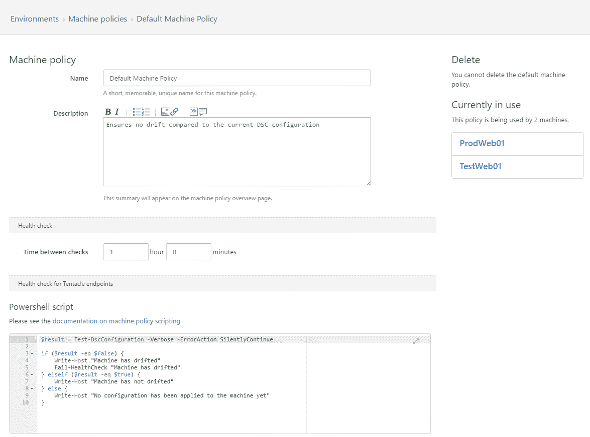

以下是脚本:

```
$result = Test-DscConfiguration -Verbose -ErrorAction SilentlyContinue

if ($result -eq $false) {
    Write-Host "Machine has drifted"
    Fail-HealthCheck "Machine has drifted"
} elseif ($result -eq $true) {
    Write-Host "Machine has not drifted"
} else {
    Write-Host "No configuration has been applied to the machine yet"
} 
```

如果机器漂移(在这种情况下，有人编辑变量)，机器现在将在环境页面中显示为不健康:

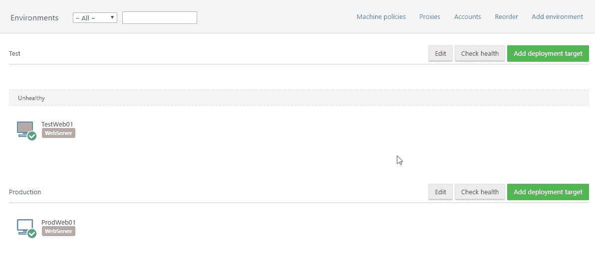

您可以将此功能与我们的[订阅](http://docs.octopusdeploy.com/display/OD/Subscriptions)功能相结合，以便在机器变得不健康时收到电子邮件通知。订阅可能是这样的:

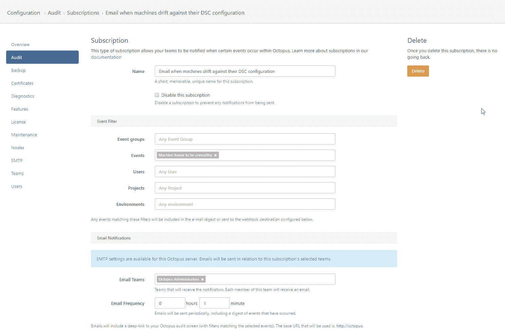

这将导致:

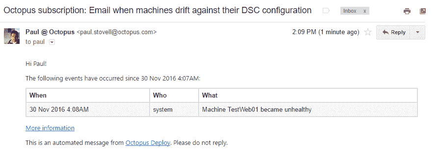

## 自动校正漂移

当机器偏离理想的配置时，它将在 Octopus 中变得“不健康”。这很方便，因为我们可以在 Octopus 中设置一个自动部署[触发器](http://docs.octopusdeploy.com/display/OD/Project+Triggers)来在机器上自动部署当前的 DSC 脚本。这将重新应用配置，并纠正偏差。

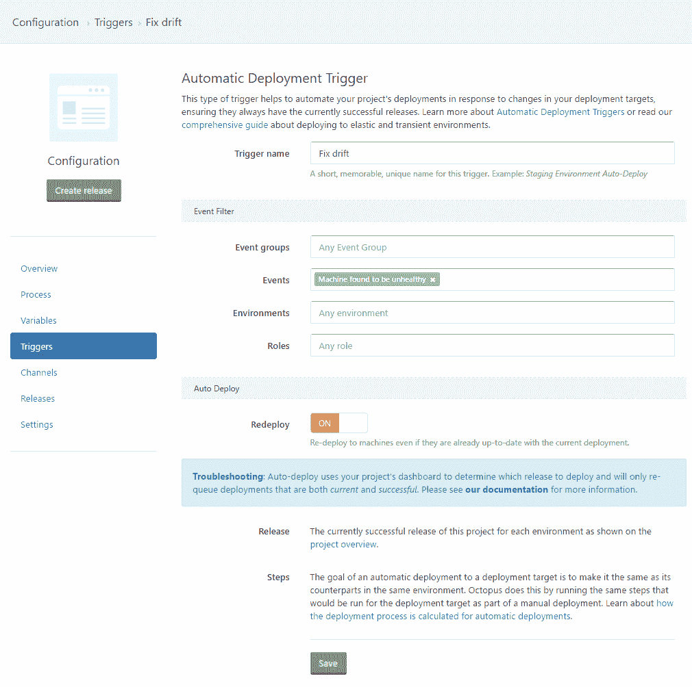

## 测试和促进 DSC 变化

Octopus 习惯于处理在环境之间提升应用程序版本，这种方法对于 DSC 脚本非常有效。如果您有一个新版本的 DSC 脚本，那么在将它推广到生产环境之前，最好将其应用到测试环境中的服务器上。在这里，我们可以看到我已经将 DSC 脚本的“1.0.1”版本投入生产，目前我正在测试该脚本的一些新版本:

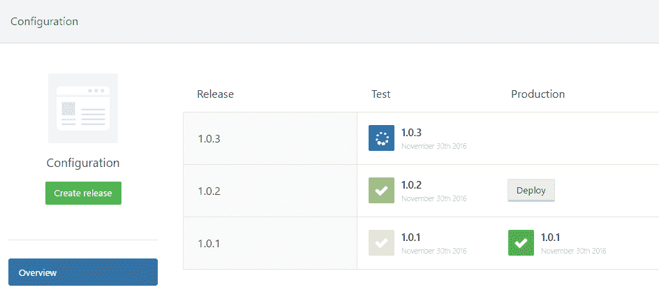

## （同 ImmigrationInspectors 移民检查）

在介绍中，我用安装 IIS 作为可以用 DSC 完成的事情的例子，尽管为了使例子简单，我们把重点放在设置环境变量上。下面是一个安装 IIS 的 DSC 脚本示例:

```
Configuration WebServerConfiguration
{  
  Node "localhost"
  {        
    WindowsFeature InstallWebServer
    {
      Name = "Web-Server"
      Ensure = "Present"
    }

    WindowsFeature InstallAspNet45
    {
      Name = "Web-Asp-Net45"
      Ensure = "Present"
    }
  } 
}

WebServerConfiguration -OutputPath "C:\DscConfiguration"

Start-DscConfiguration -Wait -Verbose -Path "C:\DscConfiguration" 
```

PS:这里有一个获取这些特性名称的好方法——在 Windows Server 2012 R2 实例上的 PowerShell 会话中，如果您调用`Get-WindowsFeature`，您将看到一个漂亮的树，上面有每个特性的名称:

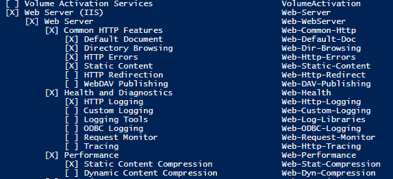

## 摘要

虽然 Octopus 专注于传统上所谓的“应用程序发布自动化”，但我们也有越来越多的客户将其用于配置管理。PowerShell DSC 和 Octopus 使您很容易涉足配置管理领域，灵活性意味着您可以构建包含 PowerShell DSC、传统脚本、Chocolatey 命令和应用程序部署的混合项目。

我们在过去 6 个月中添加的新功能-自动部署触发器和自定义运行状况检查策略-确实有助于在使用 Octopus 部署、管理和测试 PowerShell DSC 脚本时实现闭环。2017 年，我们有更多关于 PowerShell DSC 的计划，我们的目标是在明年年初发布一篇 RFC 博客文章，介绍我们的想法。

如果你想了解更多关于 PowerShell DSC 的知识，我非常喜欢这篇文章: [PowerShell DSC:基础知识](https://www.simple-talk.com/sysadmin/powershell/powershell-desired-state-configuration-the-basics/)。

你用的 PowerShell DSC 有/没有八达通？