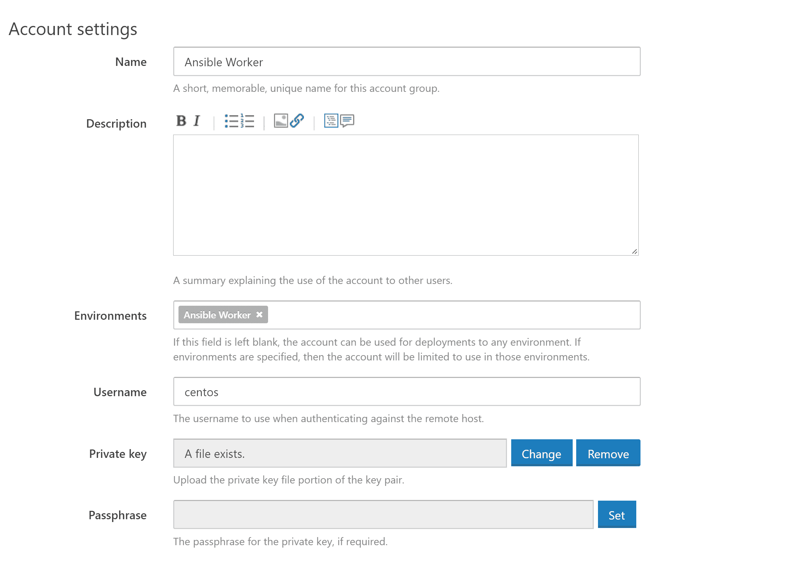
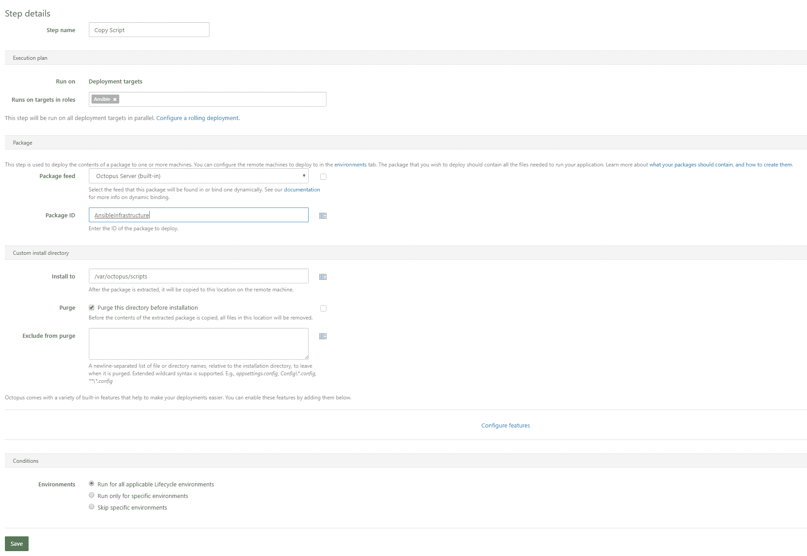

# 使用 Octopus - Octopus Deploy 管理可行的部署

> 原文：<https://octopus.com/blog/octopus-ansible>

您可能熟悉 Octopus 提供的管理和部署代码的特性。如今，像 AWS 这样的云服务和 Ansible 这样的工具也能把你的基础设施变成代码，那么为什么不用 Octopus 部署你的 Ansible、Chef 或 Puppet 脚本呢？

在这篇博文中，我将向你展示使用 Ansible 和 Octopus Deploy 在 AWS 中创建一个简单的 Windows 实例的过程。

## 为什么要用带 Ansible 的 Octopus？

在我们进入在 Octopus 中运行 Ansible 脚本的细节之前，一个自然的问题是为什么要这样做？使用 Octopus 进行基础设施部署有几个好处。

*   现在，您可以像现在处理应用程序代码一样，通过环境(如开发->测试->生产)来发展基础设施。
*   您的基础架构部署经过审核，因此您可以确切了解谁在何时部署了什么。
*   将可转换的代码包装在版本化的包中，可以很容易地恢复到基础设施的前一个版本。
*   这些可回答的日志由 Octopus 保存，便于日后查阅。
*   您的基础架构部署可以利用 Octopus 的安全特性，从而可以轻松定义谁可以在哪里部署什么基础架构。

## 获取源代码

这篇博文中使用的 Ansible 代码可以在 [GitHub](https://github.com/OctopusDeploy/AnsibleDemo) 中找到。

## 准备 AWS 资源

虽然 Ansible 支持配置 Windows 目标，但它不是为从 Windows 主机运行而设计的。[文档说](http://docs.ansible.com/ansible/intro_windows.html):

> 直接从 Windows 控制机器上运行 Ansible 并不是这个项目的目标。

这意味着我们需要创建一个代表 Octopus 运行 Ansible 脚本的 Linux 实例。

当然我们可以用 Ansible 来创建这个 Linux 主机！

但是在我们开始创建实例之前，我们首先需要一个名为`AnsibleWorker`的 IAM 角色，我们可以将它分配给代表我们运行 Ansible 的 EC2 实例。

这个角色需要能够创建、查询和销毁 EC2 实例。在这种情况下，我们只在`us-east-1`区域工作，所以我们只在该区域授予角色权限。此 IAM 策略将授予这些权限。

```
{
    "Version": "2012-10-17",
    "Statement": [
        {
            "Action": "ec2:*",
            "Effect": "Allow",
            "Resource": "*",
            "Condition": {
                "StringEquals": {
                    "ec2:Region": "us-east-1"
                }
            }
        }
    ]
} 
```

这些 IAM 策略总是让我困惑的是什么时候使用`"Resource": "*"`以及什么时候使用 ARN。

[Amazon EC2 API 动作支持的资源级权限](http://docs.aws.amazon.com/AWSEC2/latest/UserGuide/ec2-supported-iam-actions-resources.html)包含一个支持资源级权限的动作列表。如果 Amazon EC2 API 操作不支持资源级权限，您可以授予用户使用该操作的权限，但是您必须为策略语句的 resource 元素指定一个*。

我们还需要使用 [AWS 安全令牌服务](http://docs.aws.amazon.com/IAM/latest/UserGuide/id_credentials_temp.html)来承担这个角色。我们将利用 Ansible 中的 STS 来生成 Ansible AWS 步骤运行所需的令牌(即访问令牌、秘密令牌和会话令牌)。

将下面策略中的`accountid`替换为您的 AWS 帐户 ID。

```
{
    "Version": "2012-10-17",
    "Statement": [
        {
            "Effect": "Allow",
            "Action": [
                "sts:AssumeRole"
            ],
            "Resource": [
                "arn:aws:iam::accountid:instance-profile/AnsibleWorker"
            ]
        }
    ]
} 
```

最后，为了生成 STS 令牌，角色需要信任自己。您可以通过 AWS web 控制台配置这种信任，方法是单击 IAM 角色中的`Trust relationships`选项卡，并允许角色信任本身运行`sts:AssumeRole`操作。

```
{
  "Version": "2012-10-17",
  "Statement": [
    {
      "Effect": "Allow",
      "Principal": {
        "Service": "ec2.amazonaws.com"
      },
      "Action": "sts:AssumeRole"
    },
    {
      "Sid": "",
      "Effect": "Allow",
      "Principal": {
        "AWS": "arn:aws:sts::accountid:assumed-role/AnsibleWorker/i-abcdef01234567890"
      },
      "Action": "sts:AssumeRole"
    }
  ]
} 
```

## 配置 AWS 凭据

首先，我们有一个先有鸡还是先有蛋的情况，我们希望运行一些 Ansible 来创建将用于运行一些 Ansible 的实例。

为了解决这个问题，我们将运行在本地创建 Ansible worker 的 Ansible 脚本。所以您需要一个 Linux 实例来运行这个初始的 Ansible 剧本。参见 [Ansible 安装文档](http://docs.ansible.com/ansible/intro_installation.html)来启动并运行您的本地环境。

尽管 Windows Linux 子系统(即 Windows 上的 Bash)没有得到微软或 Ansible 的官方支持，但我已经在 Ansible 上广泛使用了它，没有出现任何问题。

您还需要安装 [AWS CLI 工具](https://aws.amazon.com/cli/)。

确保您已使用有权使用以下命令创建 EC2 实例的帐户配置了 AWS 凭据:

```
aws configure 
```

## 创建工人

下面显示的 Ansible YML 文件定义了一个角色运行的任务，该角色将在 AWS 中创建一个 Centos 7 EC2 实例，并为其配置运行 Ansible 脚本所需的一切。

在本例中，我将 EC2 实例放入默认的 VPC 中。如果你有一个自定义的 VPC，你需要设置`vpc_subnet_id`选项，也许还需要添加`assign_public_ip`选项。

某些 EC2 实例类型仅在 VPC 内部可用。关于需要 VPC 的列表，参见本文件[。](http://docs.aws.amazon.com/AWSEC2/latest/UserGuide/using-vpc.html#vpc-only-instance-types)

```
---
- name: Create Linux Server
  ec2:
    key_name: ThePrivateKeyName
    instance_type: m3.medium
    image: ami-ae7bfdb8
    wait: yes
    instance_profile_name: AnsibleWorker
    group: TheSecurityGroupName
    count: 1
    region: us-east-1
    wait_timeout: 3000
    volumes:
      - device_name: /dev/sda1
        volume_size: 80
        volume_type: gp2
        delete_on_termination: true
    instance_tags:
      Name: Ansible Worker
  register: linux_server_ec2

- name: Add Host to Inventory
  add_host:
    name: "{{ item.public_ip }}"
    groups:
      - centos_server
  with_items: "{{linux_server_ec2.instances}}"

- name: Wait for SSH to answer on all hosts
  wait_for:
    port: 22
    host: "{{ item.public_ip }}"
    timeout: 600
  with_items: "{{linux_server_ec2.instances}}"

- name: Pause for a bit
  pause:
    seconds: 30 
```

一旦 Centos 实例启动并运行，我们就需要安装 Octopus 和 Ansible 所需的包。

您会注意到这个角色添加了一个名为`ansible_rsa.pub`的 SSH 密钥。您可以使用以下命令生成此文件:

```
ssh-keygen -f ansible_rsa -t rsa -N '' 
```

保存好`ansible_rsa`和`ansible_rsa.pub`文件，因为我们以后会用到它们。

示例 GIT repo 包含了`ansible_rsa.pub`文件，但是您实际上不能使用这个公钥，因为它不包含`ansible_rsa`私钥文件。您需要生成自己的密钥对，并替换公钥来登录 Linux 实例。

```
---
- name: Add EPEL repository
  yum:
    name: https://s3.amazonaws.com/bamboo-support/epel-release-7-9.noarch.rpm
    state: present

- name: Install useful packages
  yum:
    name: wget,elinks,telnet,htop,mlocate,python-pip,vim,nano,jq,java-1.8.0-openjdk-devel,unzip,maven,libunwind,libicu,git,patch,zip

- name: Install mono key
  get_url:
      url: http://keyserver.ubuntu.com/pks/lookup?op=get&search=0x3FA7E0328081BFF6A14DA29AA6A19B38D3D831EF
      dest: /tmp/GPG-KEY-mono
      mode: 0440

- name: import mono key
  rpm_key:
    state: present
    key: /tmp/GPG-KEY-mono

- name: Add mono repo
  yum_repository:
    name: mono
    description: Mono repository
    baseurl: http://download.mono-project.com/repo/centos7/
    gpgkey: http://keyserver.ubuntu.com/pks/lookup?op=get&search=0x3FA7E0328081BFF6A14DA29AA6A19B38D3D831EF
    gpgcheck: yes
    enabled: yes

- name: Install mono
  yum:
    name: mono-devel

- name: Set JAVA_HOME
  lineinfile: dest=/etc/environment state=present regexp='^JAVA_HOME' line='JAVA_HOME=/usr/lib/jvm/jre-1.8.0'

- name: Install the 'Development tools' package group
  yum:
    name: "@Development tools"
    state: present

- name: Install python pip and other development libraries
  yum:
    name: python-pip, python-devel, python-lxml, openssl-devel

- name: Install Ansible and the AWS boto library
  pip:
    name: ansible, boto, boto3, pywinrm, requests-credssp
    state: latest

- name: Creates directory for ansible scripts
  file:
    path: "/var/octopus/scripts"
    state: directory
    owner: centos
    group: centos
    mode: 0775

- name: Set authorized key
  authorized_key:
    user: centos
    state: present
    key: "{{ lookup('file', 'roles/linux-ansible-target/files/ansible_rsa.pub') }}" 
```

为了与新的 Linux 实例进行真正的通信，Ansible 需要知道使用什么 SSH 私有密钥文件。这在`group_vars\centos_server.yml`文件中定义。您需要将`ansible_ssh_private_key_file`设置指向与`roles\centos-7-server-instance\tasks\main.yml`文件中定义的`key_name`相匹配的 PEM 文件的位置。

```
---
ansible_ssh_private_key_file: /tmp/aws.pem 
```

然后，我们需要从剧本中运行这两个角色。

```
---
- name: Linux Server
  hosts:
    - 127.0.0.1
  become: false
  gather_facts: false

  roles:
    - centos-7-server-instance

- name: Ansible setup
  hosts: centos_server
  remote_user: centos
  become: true
  become_user: root

  roles:
    - linux-ansible-worker 
```

使用以下命令运行行动手册:

```
 ansible-playbook ansible-worker.yml 
```

这个 Ansible 脚本的最终结果将是一个运行 Centos 的 EC2 实例，它安装了 Mono 和 Ansible，可以作为 Octopus 中的一个 worker 使用。

## 创建 Windows EC2 实例

出于演示目的，我们将使用 Octopus 和 Ansible 构建一个 Windows 2016 server EC2 实例。

这里的过程与创建 Centos EC2 实例非常相似，但是用户数据有一些有趣的步骤，使得使用 Windows 实例更加容易。

```
---
  - name: Assume AWS Role
    sts_assume_role:
      role_arn: "arn:aws:iam::accountid:role/AnsibleWorker"
      role_session_name: "AnsibleBuild"
      region: us-east-1
    register: assumed_role

  - name: Create Windows Server
    ec2:
      aws_access_key: "{{ assumed_role.sts_creds.access_key }}"
      aws_secret_key: "{{ assumed_role.sts_creds.secret_key }}"
      security_token: "{{ assumed_role.sts_creds.session_token }}"
      key_name: OctopusVirginia
      instance_type: m3.large
      image: ami-f1b5cfe7
      wait: yes
      wait_timeout: 600
      group: SecurityGroupName
      count: 1
      region: us-east-1
      user_data: "{{ lookup('template', 'templates/userdata.txt.j2') }}"
      volumes:
        - device_name: /dev/sda1
          volume_size: 80
          volume_type: gp2
          delete_on_termination: true
      instance_tags:
        Name: Windows Server
    register: windows_server_ec2

  - name: Add Host to Inventory
    add_host:
      name: "{{ windows_server_ec2.instances[0].public_ip }}"
      groups: windows_server

  - name: Wait for WinRM to answer on all hosts
    wait_for:
      port: 5986
      host: "{{ windows_server_ec2.instances[0].public_ip }}"
      timeout: 6000 
```

`userdata.txt.j2`模板包含一个 Powershell 脚本，该脚本在创建时由 Windows 实例运行。我们使用这个脚本准备由 Ansible 管理的 Windows 实例，并设置初始管理员密码。

你可以在这里找到更多关于 Windows 系统准备工作的细节。

我们还为 winrm 启用了服务器端 SSP(即[CredSSP for second-hop remoting](https://blogs.msdn.microsoft.com/powershell/2008/06/05/credssp-for-second-hop-remoting/))，这在安装 SQL Server 等应用程序时是必需的。

将`TheWindowsPassword`改为符合所需密码复杂性规则的值。如果您将密码保留为默认密码，Powershell 脚本将不会按预期运行。

```
<powershell>
Enable-WSManCredSSP -Role Server -Force
Set-Item -Path "WSMan:\localhost\Service\Auth\CredSSP" -Value $true
Invoke-Expression ((New-Object System.Net.Webclient).DownloadString('https://raw.githubusercontent.com/ansible/ansible/devel/examples/scripts/ConfigureRemotingForAnsible.ps1'))
$user=[adsi]"WinNT://localhost/Administrator,user"
$user.SetPassword("TheWindowsPassword")
$user.SetInfo()
</powershell> 
```

需要定义一些额外的组变量，以允许 Ansible 与新创建的 Windows 实例进行交互。这些在`group_vars\windows_server.yml`文件中定义。

```
---
ansible_user: Administrator
ansible_port: 5986
ansible_connection: winrm
ansible_password: TheWindowsPassword
ansible_winrm_server_cert_validation: ignore
ansible_winrm_transport: credssp 
```

我们将在这台服务器上安装 Chrome，因为我真的讨厌在新安装的 Windows 服务器上试图在 IE 中做任何事情。

```
---
- name: Install Chrome
  win_chocolatey:
    name: googlechrome
    state: present 
```

该角色与`windows-server.yml`剧本一起运行。

```
---
- name: Create Windows Server
  hosts:
    - 127.0.0.1
  become: false
  gather_facts: false

  roles:
    - win-server-instance

- name: Configure Windows
  hosts: windows_server
  become: false
  gather_facts: false

  roles:
    - configure-windows 
```

可以使用以下命令运行本行动手册:

```
ansible-playbook windows-server.yml 
```

## 创建可解析的包

现在我们已经有了 Ansible 脚本，我们可以创建一个版本化的包，可以推送到 Octopus Deploy。

因为这些脚本托管在 GIT 中，所以我们可以使用 GIT 创建一个 ZIP 文件。这样做的好处是不包括`.git`目录，也不包括 GIT 没有跟踪的任何文件。

```
git archive -o AnsibleInfrastructure.1.0.0.0.zip HEAD 
```

然后可以使用 CLI 工具将这个包推送到 Octopus。

```
octo push --package AnsibleInfrastructure.1.0.0.0.zip --apiKey API-YOURAPIKEYGOESHERE --server https://octopus.hostname 
```

## 添加可负责的工人

我们在博客开始时创建的 EC2 实例现在需要在 Octopus 中进行配置。我们将把它添加为一个 [SSH 目标](https://octopus.com/docs/deployment-targets/ssh-targets)，使用`ansible_rsa`私钥建立连接。

[](#)

对于像 Bamboo 这样的 CI 服务器，您通常会有一个工人池，并且可以将一个作业发送给任何自由工人实例。因此，一个工作单元(通常是用 Bamboo 构建的应用程序)被分配给一个工人。

由于主要关注部署，Octopus 将获取一个包并将其安装在所有目标上。所以一个工作单元(Octopus 中的一个部署)被分配给所有的目标。

在这里，我们正在创建一个章鱼目标，并将其称为“工人”。这是可行的，因为我们有一个目标，Octopus 会将部署(或者在本例中执行 Ansible 剧本)排队到这个目标。

今天，Octopus 没有工人池的概念，其中一个工人可以被选择来运行一个单独的工作单元。但是，如果我们只有一个“worker”目标，那么作业就会像我们预期的那样排队。

## 运行 Ansible 行动手册

运行 Ansible 行动手册分为两步。

首先，我们提取包含 Ansible 代码的包，这些代码在前面的步骤中被推送到 Octopus。这是通过`Deploy a package`步骤完成的，其中 Ansible 包被提取到 worker 上的`/var/octopus/scripts`目录中。

[](#)

### 运行剧本

接下来我们运行 Ansible 剧本。这是通过一个`Run a Script`步骤完成的。

```
cd /var/octopus/scripts
ANSIBLE_HOST_KEY_CHECKING=False ansible-playbook windows-server.yml 
```

`ANSIBLE_HOST_KEY_CHECKING=False`用于防止 SSH 提示信任 SSL 目标。它实际上并不与 Windows 目标一起使用，但是您会希望将它与 Linux 目标一起使用。

## 结论

这个过程的最终结果是一个 EC2“worker”实例，可以用来代表 Octopus 运行 Ansible 脚本，以及一个部署 Windows server 实例的 Ansible 脚本示例。

我希望您能看到将您的基础设施作为代码部署是多么容易，以及您如何在此基础上利用开发人员认为理所当然的 Octopus 中的所有管理特性。