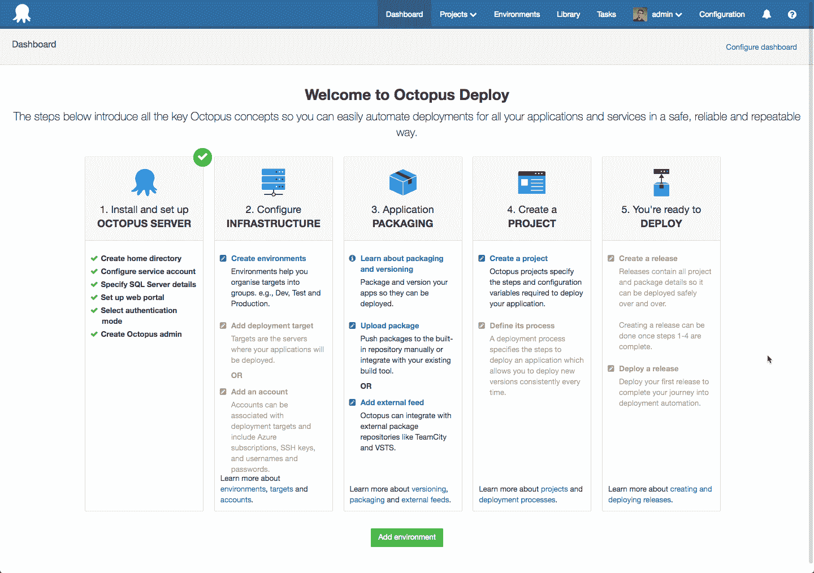
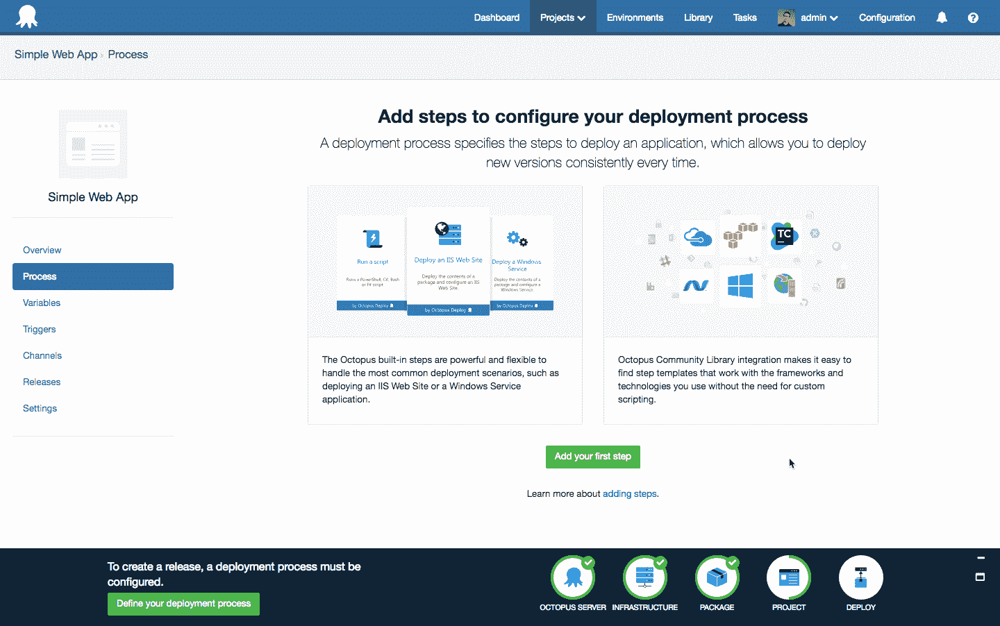
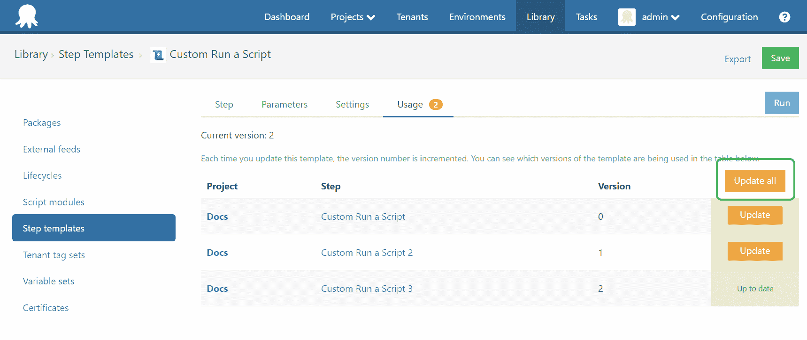
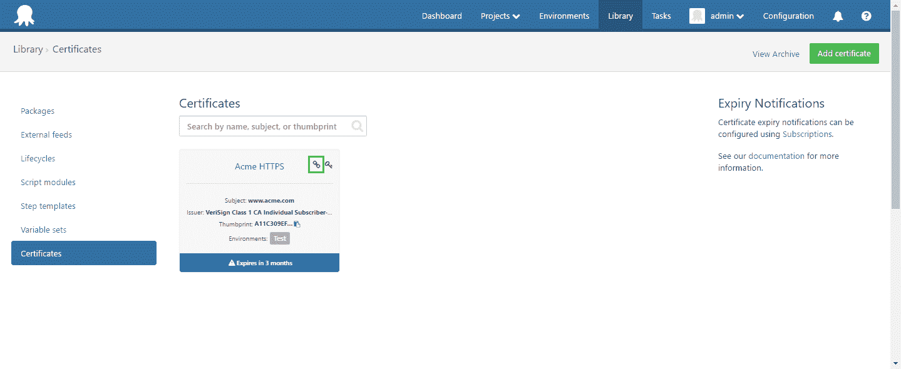
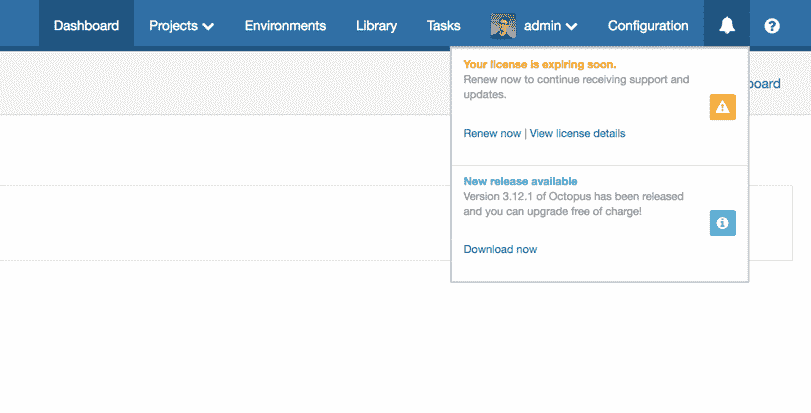

# 八达通 4 月发布 3.12 -八达通部署

> 原文：<https://octopus.com/blog/octopus-april-release>

八达通 3.12 现在可以下载，我们正在尝试一个新的每月发布节奏。这意味着我们将按照您可以信赖的可预测的时间表发布新版本。这些版本将包括新的特性，以及当月所有补丁的汇总。我们做这个实验的目的如下:

*   使您更容易了解 Octopus Deploy 中的新功能和增强功能
*   让您更容易计划何时以及如何升级
*   通过结构化的交付时间表，提高每月发布的质量和可预测性。

**注意**:我们仍然会在补丁准备好的时候继续发布小的改进和漏洞修复。我们希望尽快将这些改变交到你们手中，这样就不会改变。

## 在这篇文章中

## 发布之旅

[https://www.youtube.com/embed/ZswEEN4pMVM](https://www.youtube.com/embed/ZswEEN4pMVM)

VIDEO

## 现在开始使用 Octopus 更加容易了

Octopus Deploy 一直致力于帮助新用户轻松实现部署自动化，但这仍然是一条漫长而复杂的自动化之路。

新的 onboarding 体验介绍了 Octopus 的概念，并指导新用户首次成功部署。安装新的 Octopus server 实例时，仪表板会显示一个入门指南，概述完成部署所需的基本步骤。对于有经验的用户，可以随时从帮助菜单访问该指南。如果您正在为一个项目设置一个新的实例，进行培训，或者顾问正在为一个新的客户端设置一个部署管道，那么参考它会很有帮助。

一步一步的过程是我们认为最简单的方式来进行你的第一次部署，实现章鱼的牛逼。为了帮助您跟踪进度，我们在屏幕底部提供了一个进度条。这将为您提供流程中下一步是什么的提示和链接，在您第一次部署后它会消失。

我们这项工作的目标是帮助新的和有经验的用户尽可能快和容易地部署他们的第一个版本，然后继续自动化他们的其他项目。这是一个令人愉快的副作用，让一切看起来更好一点😃我们认为我们已经实现了这个目标，我们希望得到您反馈。启动一个虚拟机，开始一个全新的实例，或者只是玩玩你现有的 Octopus 安装。

## 更新所有项目的步骤

跨多个项目更新步骤需要大量的工作，因为每个步骤都需要手动更新。过去你已经让我们清楚地知道了那件事。今天，我们很高兴地宣布，我们已经自动化了处理的[，您只需点击一下鼠标。](https://octopus.com/docs/projects/updating-step-templates)

## 文件中的替代变量现在支持扩展通配符模式匹配

package steps 的一个流行特性是 Octopus 能够在配置和 JSON 文件中进行变量替换。这让您可以利用[嵌入式模板语法](https://octopus.com/docs/projects/steps/configuration-features/substitute-variables-in-templates)。

这些额外的配置操作是在一组固定的文件上进行的，每个文件一行。这是一个严格的配置，如果文件丢失，部署就会失败。如果你有一些文件，这可能是可取的，但有 90 个用户的声音投票，这是更灵活的。问题是，对于较大的部署，需要转换的配置文件数量未知且不断变化。因为移动配置文件而中断构建是一种可怕的经历。

对于这些配置选项来说，扩展的通配符模式匹配是一种拯救。通过这种增强，您可以使用模式来指定带有通配符的文件名集，以确定将要修改的文件集。这里有两个例子:`**/*.config`将匹配任何嵌套深度的以`.config`结尾的文件，而`Area1/**/*.config`将只匹配`Area1`和更深的文件夹中的`*.config`文件。

## PowerShell 调试支持

如果您曾经为 Octopus 编写过长度超过几行的步骤模板或脚本步骤，我敢肯定您遇到过这样的问题，您必须调整一些东西并重新运行，直到您让它按照您想要的方式工作。也许你甚至求助于基于`write-host`的调试。好了，现在你可以使用一个完全成熟的调试器(比如 PowerShell ISE)和你的 PowerShell 脚本来调试问题。您甚至可以通过 PSRemoting 进行远程调试！看看我们的[文档](https://octopus.com/docs/deployments/custom-scripts/debugging-powershell-scripts)开始吧。

## 性能改进

我们在这个版本上投入了很多努力，以使 Octopus 在大规模和小规模部署中都比以往表现得更好。显著的改进是:

*   部署时间减少 60-90%,尤其是对于包含大量步骤或机器的部署。在我们的负载测试场景中，端到端的 3 小时部署减少到了 6 分钟！
*   处理大型任务日志时性能提升 10 倍。在我们的测试场景中，一个 18MB 的任务日志的解析时间从 5000 毫秒减少到了 500 毫秒。
*   对于绝大多数正常工作负载，CPU、RAM 和 SQL 数据库的使用都有所减少，这意味着 Octopus 将更好地适应更困难的工作负载和更多的用户。

我们强烈建议升级到 Octopus 3.12，以便您可以从这些性能改进中受益。所有这些性能改进也在 Octopus 3.11 的最新补丁中提供，以防你现在无法升级到 Octopus 3.12。

## 证书链支持

Octopus 版本提供了[证书功能](https://octopus.com/blog/certificates-feature)，我们在过去几周一直在完善它。3.12 通过添加对包含证书链的 [PFX 文件的支持，延续了这一点。](https://octopus.com/docs/deployments/certificates/certificate-chains)

## 改进的许可证通知

我们这个月的最后更新是一个小的改进，以帮助显示您的八达通卡状态。我们已经更新了我们的许可证页面，如果您的许可证即将到期或已经过期，我们会向您发出警报，我们还添加了一个非常微妙的提醒，以便八达通用户了解他们的许可证状态。我们发现，使用 Octopus 的开发人员通常不知道他们公司的许可状态，因此无法总是利用新功能或增强功能，因此我们使其更容易知道何时需要续订。也就是说，我们已经努力确保这是非常微妙的，不会惹恼你。

值得指出的是，这目前只显示许可证到期通知和新版本通知(根据您的偏好)，但我们将在未来建立它。

## 升级

升级 Octopus Deploy 的所有常规[步骤都适用。在此版本中，我们引入了一些安全增强功能。如果您的任何用户在升级后遇到问题，请尝试以下步骤:](https://octopus.com/docs/administration/upgrading)

1.  在 web 浏览器中刷新 Octopus 部署门户
2.  退出 Octopus Deploy 门户网站
3.  再次登录

## 包裹

这个月到此为止。我们希望您喜欢最新的功能和我们新的发布节奏。欢迎给我们留下评论，让我们知道你的想法！愉快的部署！