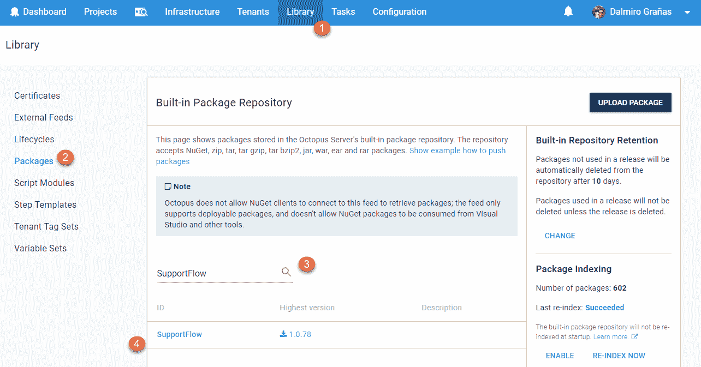
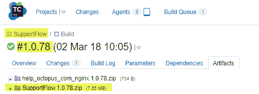

# 集成 101: Octopus 和构建服务器- Octopus 部署

> 原文：<https://octopus.com/blog/octopus-build-server-integration-101>

自从这篇文章首次发表以来，我们已经重新命名了 Octo.exe，现在它是 Octopus CLI，更多信息，请参见这篇文章: [Octopus release 2020.1](https://www.octopus.com/blog/octopus-release-2020-1) 。

在我为 Octopus 的客户提供支持的三年中，*“将 Octopus 与构建服务器集成”*可能是我回答最多的问题。在这篇博文中，我将向您提供一些关于如何完成这项任务的技巧，如果您是从零开始，不管您使用的是什么构建服务器技术。

这篇博文的目标读者是那些刚刚开始将 Octopus 集成到他们的持续集成(CI)管道中的用户。如果你已经建立并运行了这个系统，它对你来说可能没有太大的价值😃

## 在这篇文章中

## 关注点分离

在某种程度上，Octopus 和所有的构建服务器技术乍一看都非常相似。它们的一些共同点是:

*   这两个工具都属于 CI 管道，旨在帮助开发团队更快、更可靠地获得代码。
*   两者基本上都是流程运行者。你定义一个充满步骤的过程，你执行它，奇迹就发生了。

但相似之处也就到此为止了。如果您想要集成任何两个工具，您需要清楚地了解每个工具负责哪个任务。

下面是两个(非常简单的)列表，列出了每个工具在理想 CI 流程中应该扮演的角色。

### 构建服务器应该做什么？

*   **编译你的二进制文件**。这意味着运行`MSBuild`、`NPM`、`javac`、`dotnet.exe`等。，并将编译后的应用程序放到构建代理上的文件夹中。
*   **运行测试**。
*   **打包并推送你的应用到一个存储库**。一旦测试通过，用您的构建的输出创建一个包，并将其推送到您的存储库。
*   **调用 CI 管道中的下一个工具**。在我们的例子中，我们将调用 Octopus 来告诉它创建和部署一个发布。

### 章鱼该怎么办？

*   **提供/更新基础设施(可选)**。如果你需要创建一个`Azure WebApp`、一个`Elastic Beanstalk`实例、扩展一个虚拟机集、创建一个 IIS/Tomcat 网站或者任何与设置*相关的东西，也就是你将放置编译好的代码的地方*，把这个任务作为你的 Octopus 部署过程的第一步是一个非常好的主意。Octopus 目前支持 [Terraform](https://octopus.com/docs/deployments/terraform) 、 [AWS CloudFormation](https://octopus.com/docs/deployments/aws/cloudformation) 和 [Azure RM 模板](https://octopus.com/docs/runbooks/runbook-examples/azure/resource-groups)。
*   **在部署之前在您的应用程序中设置配置值**。理想情况下，您的包的内容应该可以部署到您生命周期中的任何环境中，唯一不同的是特定于环境的配置值，比如连接字符串、密码/API 密钥等。Octopus 有[多种特性](https://octopus.com/docs/projects/steps/configuration-features)可以在部署时修改配置值。
*   **部署您的应用**。

## 那么，我应该如何开始将 Octopus 整合到我的 CI 渠道中呢？

我见过的人们在开始这项任务时最常犯的一个错误是，在没有完全理解每个工具能带来什么的情况下，同时配置太多的东西。在这篇博文中，我不会分享任何关于如何设置的细节(我们有很好的文档)。相反，我希望这篇文章能作为一个指南/清单，帮助你有条不紊地完成这项任务。

我们将这个任务分成三个界限分明的阶段:**构建**、**部署**、&、集成。每个阶段都有自己的目标，我们将会关注这些目标。

与队友一起工作？
阶段 **1** 和 **2** 可以按任何顺序进行，因为它们不会相互接触，直到我们到达阶段 **3** 。这意味着，如果你和一个队友一起工作，他可以专注于阶段 **1** ，而你专注于阶段 **2** (你甚至可以打赌看谁先完成)。

### 阶段 1 -构建

**目标:**在这一阶段结束时，您应该能够运行一个成功的应用程序构建，因此您应该有一个包含任何受支持格式[的包](https://octopus.com/docs/packaging-applications/supported-packages)，其中包含被推送到包存储库的构建输出。

#### 1.1 -成功构建您的项目

我见过许多开发人员害怕这一步，主要是因为这迫使他们处理他们已经使用了一段时间的黑箱，称为“构建配置”。在开发团队中，只有 1-2 个开发人员真正知道他们的构建是如何工作的，其他人只是简单地点击“运行”,希望一切顺利。如果你是后一种人，这可能是一个改变这种情况的好时机，你可以和队友一起学习你的构建过程是如何工作的。

要完成这一步，您应该有一个遵循以下两条准则的成功构建:

*   生成输出必须发送到固定文件夹。每个构建工具都有一个参数，允许您将输出发送到自己选择的目录中。我建议你把它发送到一个叫做`Build`或`Output`的文件夹，它位于你的构建的`WorkDir`的根目录下。
*   该文件夹中的内容应该完全按照您期望它被部署到目的地的方式进行组织。例如，如果你的网站/PAAS 期望一个`web.config`和一个`index.html`文件在根目录下，那么这两个文件也应该在这个文件夹的根目录下。

#### 1.2 -将您的构建输出打包并推送到存储库

在这一步中，您将把上一步中提到的`output folder`的内容打包到一个[包中，其中包含任何受支持的格式](https://octopus.com/docs/packaging-applications/supported-packages)。然后你将把这个包推到一个仓库，Octopus 将在那里提取它。

根据你是否使用我们的插件中的[，以及你是否使用](#a-few-words-about-build-server-plugins-and-octo.exe)[Octopus 内置库](https://octopus.com/docs/packaging-applications/package-repositories#Packagerepositories-Usingthebuilt-inrepository)来存储你的包，你将需要使用下面的方法之一:

| 使用插件 | 使用内置存储库 | 包装方法 | 推动方法 |
| --- | --- | --- | --- |
| 是 | 是 | 使用插件提供的名称中带有单词“Pack”的步骤 | 使用插件提供的名称中带有“推送包”字样的步骤 |
| 是 | 不 | 使用插件提供的名称中带有单词“Pack”的步骤 | 使用[Nuget.exe 推动](https://docs.microsoft.com/en-us/nuget/tools/cli-ref-push) |
| 不 | 是 | 使用[Nuget.exe 包](https://docs.microsoft.com/en-us/nuget/tools/cli-ref-pack) | 使用[Nuget.exe 推](https://docs.microsoft.com/en-us/nuget/tools/cli-ref-push)或[Octo.exe 推](https://octopus.com/docs/octopus-rest-api/examples/feeds/push-package-to-builtin-feed) |

如果使用 TeamCity，步骤`Octopus Deploy: Push Package`将*打包*和*推动*一步完成

完成后，检查您的存储库以确保包在那里。下面的截屏显示了如果您使用内置的存储库该如何做。

这里唯一的关键建议是，您应该使用与创建它的构建版本相同的版本号来版本化这个包。所以如果你正在构建项目`SupportFlow`并且你正在运行构建`1.0.78`，你的包应该以`SupportFlow.1.0.78.zip`结束

### 第 2 阶段-部署

**目标:**在本阶段结束时，您应该能够在 Octopus 中创建一个发布，并使用[Octo.exe](https://octopus.com/docs/octopus-rest-api/octopus-cli)从命令行触发应用程序的成功部署。

#### 2.1 -将测试包上传到您的存储库中

如果您已经完成了步骤`1.2`，这意味着您的存储库中已经有了一个包，所以您可以跳到下一步。如果你还没有完成这一步，只需在本地编译你的应用程序，并使用[Octo.exe 包](https://octopus.com/docs/packaging-applications/create-packages/nuget-packages/using-octo.exe)打包输出。一旦你有了一个包，就把它推到 [Octopus 内置库](https://octopus.com/docs/packaging-applications/package-repositories/pushing-packages-to-the-built-in-repository#PushingpackagestotheBuilt-Inrepository-UsingtheOctopuswebportal)并确保你能在`Library -> Packages`下的门户网站中看到它。

下一步您只需要一个包，您将反复使用它，直到您正确完成部署过程。如果你的部署过程使用了不止一个包(也许是分别部署一个 *WebApp* 和一个*云服务*，对你需要的每个包重复这个过程。

#### 2.2 -设计您的部署流程并运行它

现在，您终于可以开始在 Octopus 中做事了。我们在这里不会涉及太多的细节，因为[是我们的文档为](https://octopus.com/docs/deploying-applications)准备的。但是这一步的总体思路是在 Octopus 中设置您的部署过程，以部署`2.1`中提到的包。一旦您完成了这些，您应该能够从 Octopus web 门户手动触发成功的部署。

如果这是你第一次建立你的 Octopus 项目，这可能是你花费大部分时间的步骤。此时，不要太在意您正在使用的包的版本号或 Octopus 中的发布号。这一步的唯一目的是让您熟悉您的部署过程，并完全理解每一步会带来什么。

因此，您可以高枕无忧，根据需要触发任意多的部署😃

#### 2.3 -使用 Octo.exe 创建发布并触发部署

在上一步中，您学习了如何从 Web 门户创建发布和触发部署。这一步的目标是你学习做同样的事情，但是使用`Octo.exe`。

如果你不知道这个 CLI 工具，这里有 TL；DR，这是一个命令行应用程序，它与 [Octopus API](https://octopus.com/docs/octopus-rest-api) 对话，并帮助您对 Octopus 实例执行一些最常用的操作。您可以在本文档中了解它提供的所有功能。

您应该注意的命令是[创建-释放](https://octopus.com/docs/octopus-rest-api/octopus-cli/create-release)。关于此命令的一些提示:

*   如果您使用`--deployTo`参数，它不仅会创建发布，还会将它部署到环境中。它基本上结合了命令`create-release`和`deploy-release`。
*   使用`--progress`在控制台中查看执行时的部署日志。否则，该命令只会在 Octopus 中创建一个任务，您将被迫转到 Web 门户来查看部署情况。
*   使用`--whatIf`来看看如果运行这个命令会发生什么，而实际上没有触发 Octopus 中的任何东西。

每一个构建服务器集成(至少是 Octopus 团队构建的)都只是这个 CLI 工具的 UI 包装器。所以你从这一步学到的知识将在下一阶段派上用场。

### 第三阶段-整合

**目标**:在这个阶段结束时，您应该能够向您的构建流程添加一个新的步骤，该步骤触发 Octopus 中的部署。

现在，在这个阶段，我们将把前两个阶段的所有东西放在一起。因此，你有必要成功地完成这两项任务。

#### 3.1 -从构建中在 Octopus 中创建一个发布/部署

如果你正在使用我们的一个构建服务器插件，在它的名字上寻找一个带有“创建发布”字样的步骤。

如果你没有使用我们的插件，不要担心！您在`2.3`中获得的知识应该足够让您在构建过程中添加一个 PowerShell/Bash 脚本步骤，运行您已经使用过的相同的`Octo.exe`命令。为此，您将需要`Octo.exe`在构建时驻留在您的构建代理上。你可以通过添加[这个 NuGet 包](https://www.nuget.org/packages/OctopusTools/)或者[这个 Chocolatey 包](https://chocolatey.org/packages/octopustools)作为依赖来实现。

不管怎样，如果您使用插件步骤，或者原始的`Octo.exe`调用，您需要传递的主要值是:

*   `Release Version`。我们强烈建议您使用您的内部版本号来设置这个值，这样您总是知道哪个内部版本触发了 Octopus 中的哪个版本。

*   您要部署到的`Environment`。

**Pro 提示**
插件/扩展提供的每一个“创建发布”步骤都会有一个名为`Show Deployment Progress`或类似的复选框。如果您选中该框，您的构建服务器将保持与您的 Octopus 部署的连接，并在您的构建日志中实时显示它的输出。此外，如果部署失败，构建过程中的该步骤也将失败。这最后一点非常方便，只要看看你的构建就知道在 Octopus 中的部署是否失败了。

如果您正在使用一个原始的`Octo.exe`调用，那么这个特性的等价物就是`--progress`参数。

如果您在这一步遇到问题，请查看我们的[故障排除指南](https://octopus.com/docs/packaging-applications/build-servers/troubleshooting-integrations-with-build-servers),了解如何解决问题，或者学习如何在我们的论坛中寻求帮助。

## 关于构建服务器插件和 Octo.exe 的几句话

如果你查看我们的 [API](https://octopus.com/docs/octopus-rest-api) 和[构建服务器](https://octopus.com/docs/packaging-applications/build-servers)文档，你会注意到我们的团队为一些最流行的构建服务器构建了一些插件。这些插件扩展了构建服务器的功能，通过添加一些自定义步骤来完成 Octopus 的功能，比如触发部署和推送包。下面的列表链接到每个插件的文档，以及每个插件提供的步骤列表。

*   **[VSTS/TFS](https://octopus.com/docs/packaging-applications/build-servers/tfs-azure-devops)**
    *   创建八达通释放
    *   部署八达通释放
    *   促进章鱼释放
    *   包装应用
    *   将包推给八达通
*   **[团队合作](https://octopus.com/docs/packaging-applications/build-servers/teamcity)**
    *   创建发布
    *   部署发布
    *   促进释放
    *   推送包装(也称为包装)
*   **[竹子](https://octopus.com/docs/packaging-applications/build-servers/bamboo)**
    *   创建发布
    *   部署发布
    *   打包包装
    *   推送包
*   **供应商**(即将推出)

在幕后，这些步骤实际上只是围绕`Octo.exe`的 UI 包装器。因此，如果您没有使用上面的任何构建服务器，您可以简单地在构建过程的脚本步骤中使用`Octo.exe`来获得相同的结果。

* * *

就是这样！我真的希望这个指南能帮助你以一种更有条理的方式将 Octopus 整合到你的 CI 渠道中。

请记住，本指南做了很多假设，主要针对真正基本的 CI 渠道。如果您觉得这里描述的步骤不适合您的流程，[请联系我们的支持论坛](https://octopus.com/docs/packaging-applications/build-servers/troubleshooting-integrations-with-build-servers#Octopus-Steps-Ask-for-help)，我们会帮您一把。

## 了解更多信息