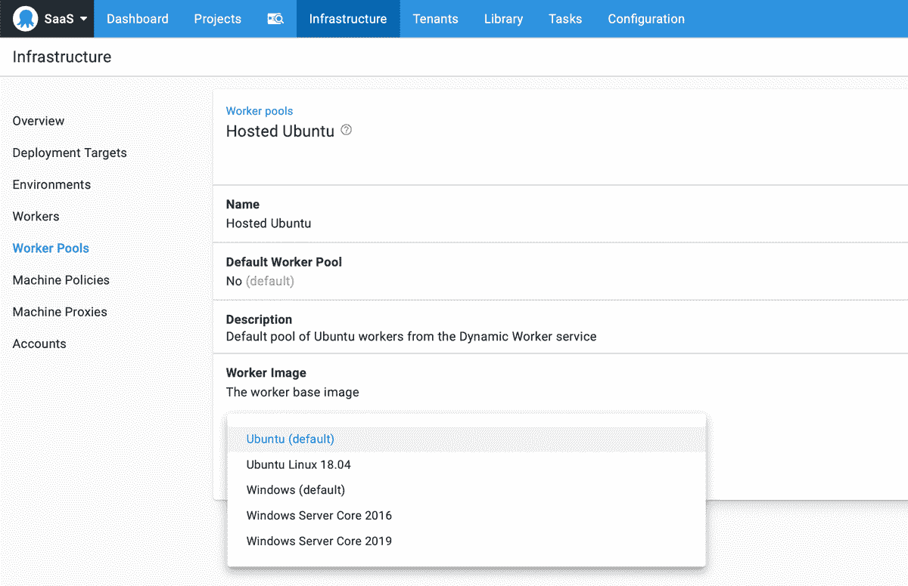
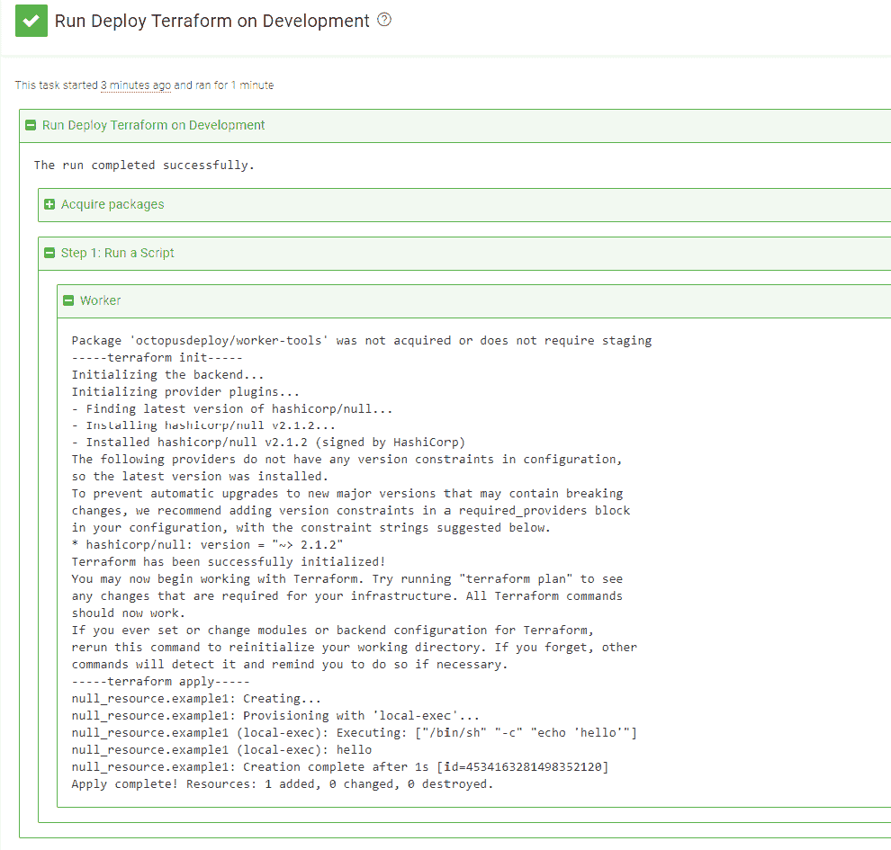

# 在 Octopus Cloud 上宣布 Linux 工人池- Octopus Deploy

> 原文：<https://octopus.com/blog/octopus-cloud-built-in-linux-worker-pools>

[](#)

有了 Octopus 托管的[动态工作池](https://octopus.com/docs/infrastructure/workers/dynamic-worker-pools)，你可以在几分钟内启动 [Octopus Cloud](https://octopus.com/docs/octopus-cloud) 实例并在 Windows 机器上运行 PowerShell 部署或 runbook 步骤。不幸的是，在 Linux 机器上运行 bash 脚本并不总是那么容易。

章鱼云对 Linux 工作者的支持不足，让我们从上线开始就有点难过。您已经能够添加自己的 Linux 工作器，但是感觉不如为 Windows 提供的对动态工作器的内置支持那样自然。

## Ubuntu 18.04 工作程序现已推出

从今天起，我很高兴地宣布我们支持章鱼云上的 Ubuntu 工人。这是我们在成为 Windows 工作负载和 Linux 工作负载最佳部署工具的征途上向前迈出的一步。

[](#)

## Windows 2019 工作人员现已推出

我也很高兴分享，我们已经推出了 Windows 2019 workers。我们仍在切换每个人，但您可以通过导航到 **基础架构➜工作池** 来选择在您的实例中使用新的工作映像。

## Docker 现已预装

切换到 Windows 2019 workers 的一个很大的积极因素是 docker 也安装了，所以你可以用你自己的自定义 Docker 图像让你的构建闪闪发光；唯一的限制是你的想象力(哦，还有 DockerHub 下载时间)。

我们真正感到兴奋的一件事是，增加对 Docker 的支持真正开放了我们的[执行容器特性](https://octopus.com/blog/execution-containers)，它已经在特性标志后面有一段时间了。作为我们早期访问计划的一部分，现在每个人都可以使用该功能。

最后一件事，我们的[工人工具容器](https://hub.docker.com/r/octopusdeploy/worker-tools)也已经更新，现在支持刚刚发布的 [Terraform 0.13](https://www.hashicorp.com/blog/announcing-hashicorp-terraform-0-13/) 版本。查看 [PR #20](https://github.com/OctopusDeploy/WorkerTools/pull/20) 了解所有可用版本的详细信息。

## 尽管走

下一节将介绍如何在 Linux worker 上运行 bash 脚本。作为补充，我们将从容器内部执行 Terraform，以展示使用最新版本是多么容易。

### 为 DockerHub 配置外部提要

如果您还没有为 DockerHub 配置提要，请转到 **库➜外部提要** 并点击**添加提要**按钮。在 **Feed Type** 字段中选择**Docker Container Registry**，并为其命名，我称之为 mine **Docker Hub** 。

### 创建新的 runbook

创建新的员工库后，转到“项目”选项卡，创建一个新项目。从那里，转到 **Runbooks** 并点击 **Add Runbook** 按钮并给它命名。

在 process 选项卡上，添加一个新的**运行脚本**步骤。在 worker 上选择 **Run once 将让您选择新的 worker pool，并显示一个名为**容器映像**的新部分。**

[T31](#)

选择 Docker Hub feed，然后点击底部的`Use latest Linux-based image`链接。这将自动使用最新版本填充该字段。

最后，对于脚本，选择 **Bash** 并输入以下脚本:

```
cat <<EOT > main.tf
resource "null_resource" "example1" {
  provisioner "local-exec" {
    command = "echo 'hello'"
  }
}
EOT

echo "-----terraform init-----"
terraform init -no-color

echo "-----terraform apply-----"
terraform apply -no-color -auto-approve 
```

点击**保存**，然后**运行**将执行脚本:

[](#)

虽然这个脚本并没有做多少事情(它`echo`发出了“hello”)，但是它强调了运行 bash 脚本和使用最新的 Terraform 版本是多么容易。

## 结论

我们希望您和我们一样对这些新功能感到兴奋。今天就给它一个狂欢吧(一语双关),让我们知道你的想法！

愉快的部署！