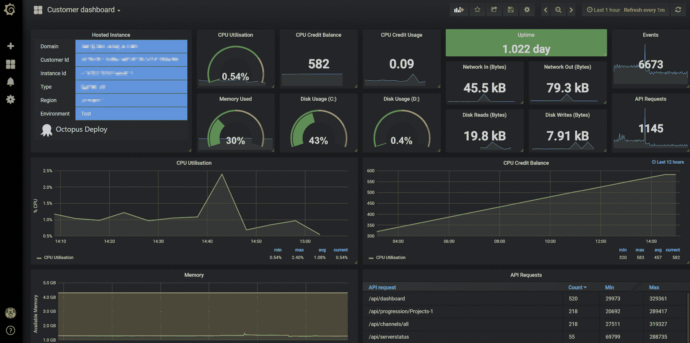

# 吃我们自己的狗粮-章鱼部署

> 原文：<https://octopus.com/blog/octopus-cloud-dogfooding>

[](#)

我们在构建 Octopus Cloud 时遵循的指导原则之一是尽可能多地使用 Octopus Deploy，这样我们就可以增加 Octopus 的内部使用量，实质上就是“吃我们自己的狗粮”。我们真的很重视这一点，以确保我们感受到的痛苦与我们的客户一样，并帮助章鱼做得更好。

虽然这并非没有挑战(部署工具不一定是管理 SaaS 平台的首选！)，总的来说这是一次有趣的旅程。这肯定是有回报的，我们已经能够在现实世界中测试和改进 Octopus。

这篇文章介绍了这种方法产生的一些更有趣的东西。

## 章鱼 DSC

[OctopusDSC](https://github.com/OctopusDeploy/OctopusDSC) 是我们的[期望状态配置](https://docs.microsoft.com/en-us/powershell/dsc/overview)模块，允许安装和配置 Octopus 服务器和触手。虽然它已经处于相当好的状态，但它不是我们在愤怒时经常使用的东西，所以它有一些粗糙的边缘。

使用它来提供 Octopus 云实例和我们的管理实例，意味着我们投入了相当多的精力来改进它。我们已经:

*   使其在高可用性场景中工作。
*   改进它以遵循处理密码的最佳实践。
*   添加了对为共享数据存储指定网络共享的支持。
*   添加了指定内置工作人员凭据的功能。
*   添加了“已安装但未配置”状态，以大幅缩短实例启动时间。

## 安全性

实施 Octopus Cloud 意味着我们更加关注安全的方方面面。当使用[输出变量](https://octopus.com/docs/deployment-process/variables/output-variables)来传递 API 键时，我们意识到这里有一个潜在的缺陷，敏感值可能会以明文形式输出到日志中。现在有[和](https://octopus.com/blog/octopus-release-2018.6#sensitive-output-variables)一个`-sensitive`参数来确保这种情况不会发生。

## 工人联合起来！

很长一段时间以来，你都可以在 Octopus 服务器上运行自己的脚本。在高度信任的环境中，这不是问题，但对于一些组织(尤其是在 SaaS 世界中)来说，这并不理想。为了解决这个问题，我们添加了指定一个用户帐户的功能，以便在使用[内置 worker](https://octopus.com/docs/administration/workers/built-in-worker) 的服务器上运行脚本时使用。这允许我们作为一个单独的低特权用户运行脚本，减少了潜在的影响。

虽然这大大减少了出错的可能性，但它仍然没有我们想要的那么好。我们已经做了大量工作来实现 Workers(一种配置一个或多个触角作为卸载工作的地方的方法——包括运行脚本——从 Octopus 服务器)的第一部分[在 2018.6.0](https://octopus.com/blog/octopus-release-2018.6) 中放弃了。这为将来允许我们将这些在服务器上运行的任务外包给一次性容器奠定了基础，给了我们更大的隔离。

## 韵律学

有效地管理一大堆 Octopus 服务器意味着我们真的需要先发制人地知道发生了什么，以及事故何时发生。我们使用 [Elasticsearch](https://www.elastic.co/) 来存储我们的指标，使用 [Grafana](https://grafana.com/) 来查看它们，使用 [Telegraf](https://www.influxdata.com/time-series-platform/telegraf/) 来读取和发送指标。我们为 Octopus 服务器添加了将任务和 web API 指标记录到文件中的功能，因此 telegraf 可以接收它们并将其发送到 Elasticsearch。这与一些内置的 telegraf 功能相结合，使我们拥有了一些令人惊叹的仪表板，如:

[](#)

我们运行和管理 Octopus 的一大好处是，我们可以看到关于 Octopus 在现实世界中表现的广泛、高水平的指标。这也意味着，如果出现性能问题，我们会受到更高规格机器成本增加的影响——这只能是提高 Octopus 性能的胜利！

我们将在另一篇博文中深入探讨指标和仪表板的细节。

## 房客

我们大量使用[多租户部署模式](https://octopus.com/docs/deployment-patterns/multi-tenant-deployments)。这帮助我们找到了一些不像我们希望的那样容易使用的区域。而我们在这方面还没有太大的进展(太多好的想法，时间不够！)，我们学到了很多东西，也有了一些好的想法，可以在未来做得更好。

我们成功实现的一个立竿见影的效果是对租户使用[脚本控制台](https://octopus.com/docs/administration/script-console)的能力。以前，您必须查找基础设施页面，找到与该租户相关联的所有实例，记下它们，然后返回脚本控制台并手动选择实例。相当痛苦，更不用说容易出错。现在，它就像选择租户一样简单，您可以开始了！

## 压碎那些虫子

在相当早的时候使用新的[地形](https://octopus.com/docs/deployment-examples/terraform-deployments)、 [S3](https://octopus.com/docs/deployment-examples/aws-deployments/s3) 和[云形成](https://octopus.com/docs/deployment-examples/aws-deployments/cloudformation)步骤，可以让我们找到一堆只在现实世界中出现的琐碎边缘情况。虽然我们在尝试构建章鱼云时发现这些错误很烦人，但对我们来说，打击这些错误比你这个客户更可取。一旦这些特性可用，立即使用它们的好处之一就是相关的开发人员仍然处于相同的“顶部空间”,可以很容易地找到并修复错误，而不是在 3 个月后忘记所有的上下文。

另一个 dogfooding 的胜利是发现了一个讨厌的计时错误，它导致了在慢速连接登录时浏览器重定向。我们所有的开发测试都是用快速连接完成的，所以这个 bug 从来没有出现过。我们自己部署和使用它意味着我们很快就找到并修复了这个 bug。

## 可用性

我们的可用性团队已经做了一些用户测试，并观察了用户注册和开始使用 Octopus 的过程。看到新客户和现有客户都在使用该产品，并看到事情并不像我们想象的那样顺利、简单，这真是大开眼界。我们已经开始实施 UX 的一些改进，取得了很好的效果。

请密切关注即将发表的关于这一问题的更详细的博文。

## 小麻烦

每天使用八达通突出了一些小问题，这些问题阻碍了我们想要的超级流畅的体验。其中之一是`Configuration->Nodes`页面上的“运行任务”链接。它会将“3 个正在运行的任务”显示为一个链接，您可能会认为单击该链接会显示这 3 个任务，但实际上，它显示的是该节点的所有任务，而不考虑状态。虽然这不完全是一个节目停止，但它是一个经常让我恼火的问题，我花时间去修复它。现在，您只能看到正在运行的任务——这在您清空节点、准备替换它时非常有用！

另一个小麻烦是当一个任务被另一个任务阻塞时显示的消息:

```
Cannot start this task yet because "ServerTasks-46122" (has a read lock) tasks are currently running
and this task cannot be run in conjunction with any other tasks. Please wait... 
```

虽然它是功能性的(它告诉你它在某些事情上被阻止了)，但它是不和谐的，部分是因为语法，但也是因为弄清楚`ServerTasks-46122`是什么的挑战。您可以复制 ID 并操纵 URL 来访问它，但这并不直观。现在，语法已经修复，ID 现在是运行任务的直接链接。再说一次，这并不是一个完美的结局，但是当你试图弄清楚发生了什么的时候，它会让你的生活变得更加容易。

## 还有很多事要做

虽然除了我在这篇文章中提到的，还有很多东西要谈，但我不想让你太无聊。我们还有一长串需要解决的问题——睁大眼睛，寻找持续的改进。

开心(章鱼云)部署！