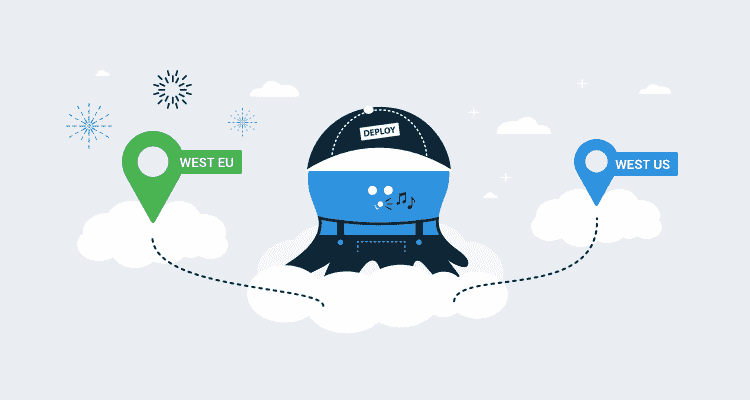

# 章鱼云:西欧地区现已推出-章鱼部署

> 原文：<https://octopus.com/blog/octopus-cloud-west-eu-region>

`tl;dr`章鱼云现已在以下地区推出:

*   Azure West US 2(美国华盛顿)。
*   蔚蓝西欧(荷兰)- **新！**

## 章鱼云托管区域

Octopus Cloud 最初在位于美国俄勒冈州波特兰市的单个亚马逊网络服务(AWS)区域启动运行

2019 年，我们[重新构建了](/blog/octopus-cloud-1.0-reflections)章鱼云，以提高其性能并降低运行成本。作为这一转变的一部分，我们从 AWS 转移到了微软的 Azure 平台，我们有了 Azure West US 2 的新默认托管区域，位于美国华盛顿。我们现在正在扩展我们支持的地区，包括位于荷兰的 Azure West Europe。

## 迁移现有客户

我们很乐意将现有客户迁移到这个新地区。如果您对托管实例的位置有偏好，请联系我们，我们将与您一起迁移到新的区域。

## 结论

章鱼云现在在两个地区可用，我们将根据客户需求继续添加更多。