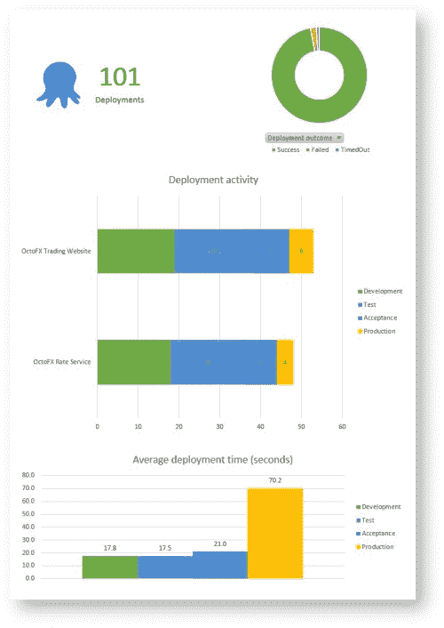
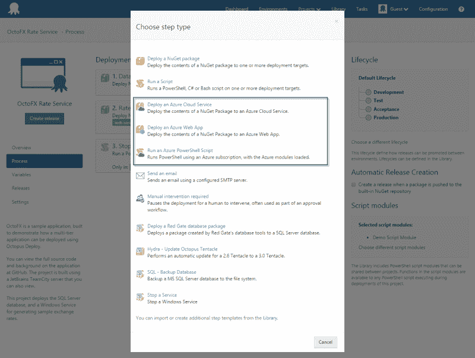
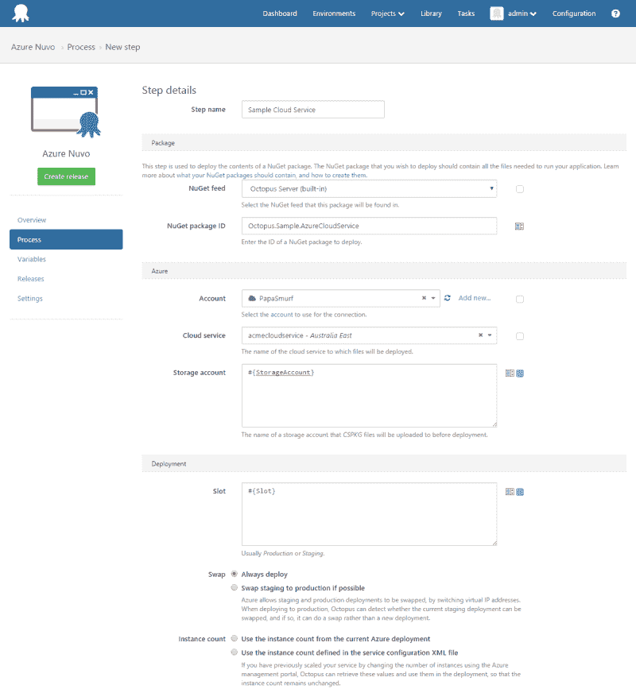
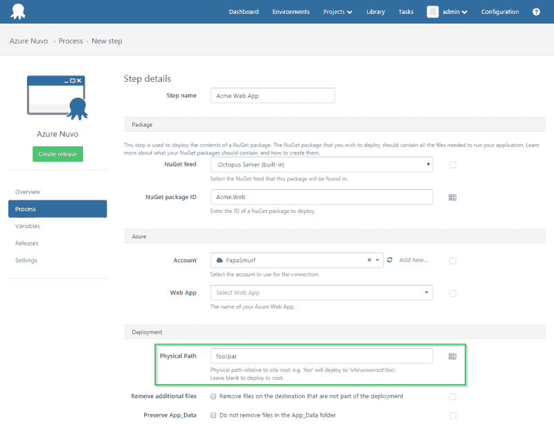

# Octopus Deploy 3.1 预发布版- Octopus Deploy

> 原文：<https://octopus.com/blog/octopus-deploy-3.1-pre-release>

Octopus Deploy 3.1 现在[作为预发布](/downloads/3.1.0)提供。

## 特征

## 。NET 4.5

Octopus Deploy 3.1 需要。NET 4.5 安装在*服务器*上。而触手*不会*要求。NET 4.5，如果您希望使用 [TLS 1.2](#tls) ，则需要安装它。

## 报告

Octopus 3.1 增加了一个报告特性，使用您喜欢的报告工具，可以很容易地根据您的部署历史生成报告。

目前 Octopus 没有在任何地方的用户界面中显示这些报告数据，但是我们确实公开了原始数据，您可以在您最喜欢的报告工具中查询或使用这些数据。

原始数据以两种方式提供:

*   XML 提要，可以由 Microsoft Excel 或 PowerBI(首选)等工具使用，或者以编程方式使用
*   作为 Octopus SQL 数据库中的一个表

这些数据允许您报告以下问题:

*   我们在多长时间内完成了多少次部署？针对哪些项目或环境？
*   有多少部署成功了？多少人失败了？
*   部署平均需要多长时间？

为了帮助您开始，我们提供了一个示例 Excel 电子表格，您可以将其连接到自己的 Octopus 服务器。

有关更多信息，请参见我们的[报告文档](http://docs.octopusdeploy.com/display/OD/Reporting)。

## 触手升级和 TLS 1.2

我们最近宣布 [Octopus 3.1 将要求。网 4.5](http://octopusdeploy.com/blog/octopus-3.1-will-be-.net-4.5) 。既然我们要搬到。NET 4.5，章鱼/触手通讯可以用 TLS 1.2。

当建立连接时，Octopus 和触手会协商 TLS 1.0、1.1 和 1.2 中的最佳协议。但是，您可以通过配置 SChannel 来告诉 Windows 禁用 TLS 1.0 或 1.1(或任何其他协议)，这将覆盖 Octopus/触手使用的设置。一个允许你这样配置的免费工具是 [IISCrypto](https://www.nartac.com/Products/IISCrypto)

如果您只想成为 TLS 1.2，流程将是:

*   将 Octopus 升级到 3.1
*   将触手升级到 3.1
*   使用工具/修改注册表来禁用 TLS 1.0 和 1.1

需要注意的一点是，如果你已经有了 3.0 版本的触手，就不需要升级到 3.1 版本，因为这些变化不是强制性的。在环境标签上你会看到升级触手的按钮，但是如果出于某种原因你需要坚持触手的 3.0 版本，你可以。

## Azure 步骤类型

正如 Paul 最近[发布的](http://octopusdeploy.com/blog/azure-changes)，对于 3.1，我们正在改变部署到 Azure 的方法。

我们引入了三种新的步骤类型:

*   Azure 云服务
*   Azure Web 应用程序
*   Azure PowerShell

希望我们保留了 3.0 中最好的变化，但重新启用了一些自动基础架构供应场景。

例如，查看云服务模板，您会注意到我们仍然有帐户，用于选择服务和存储帐户的下拉菜单仍然存在，但是所有字段都可以切换为绑定到变量表达式(如下图中的存储帐户和插槽)。

任何作为云服务或 Web 应用程序步骤的一部分运行的 PowerShell 都将自动加载 Azure PowerShell 模块，并选择与所选帐户关联的订阅。

我们还将捆绑的 Azure PowerShell 模块更新到版本 [0.9.5](https://github.com/Azure/azure-powershell/releases/tag/v0.9.5-July2015) 。

#### 迁移 2.6 Azure 步骤

对于 3.0，我们无法将 2.6 Azure 云服务步骤迁移到新的 Azure 目标中。在 3.1 中，任何现有的 Azure 步骤都可以从 2.6 中迁移出来，并且无需修改就可以部署。

#### 反对 3.0 目标

我们还没有删除 3.1 中的 3.0 Azure 目标。我们添加了一条警告消息，表明它们已被弃用。虽然我们没有严格的删除期限，但我们不打算长期支持这两种模式，我们鼓励您开始将 3.0 目标转移到 3.1 步骤类型中。我们向那些因这些变化而带来不便的人表示歉意，并希望您能理解。这不是一个轻率的决定，但我们认为这是未来的最佳选择。

#### 部署到 Web 应用程序的子目录

自从我们增加了部署到 Azure Web Apps 的功能后，一个非常受欢迎的功能就是部署到站点根目录以外的位置。因此，我们在 Azure Web App 步骤中添加了一个“物理路径”字段。

这将支持从现有网站中独立部署 Azure Web 作业等场景。

## 概括起来

这是一个预发布版本，所以我们鼓励那些一直在等待这些特性的人抓住它并尝试一下。我们的目标是在接下来的两周内正式发布。

我们知道你们很多人一直在等待一些即将到来的特性，比如分支支持和多租户。接下来是这些。我们的目标是 3.1 版本，但是 Azure 的改变占了先机。我们已经相应地更新了我们的[路线图](/roadmap),并且已经在开发 3.2 的特性。

愉快的部署！