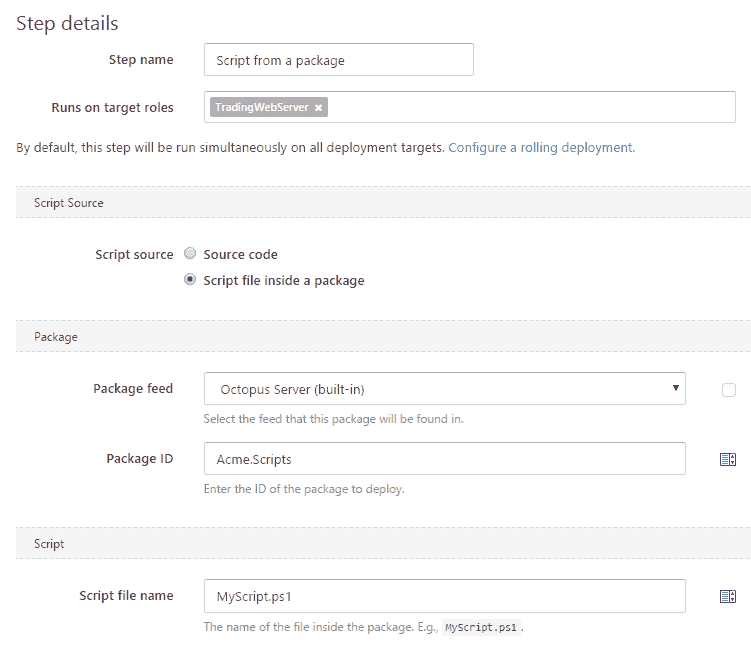
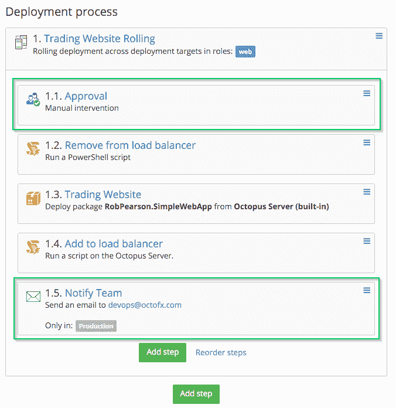
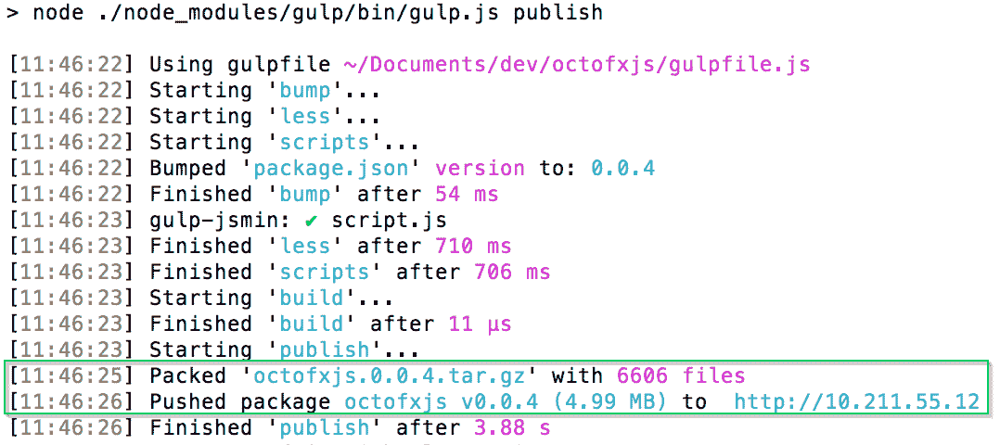
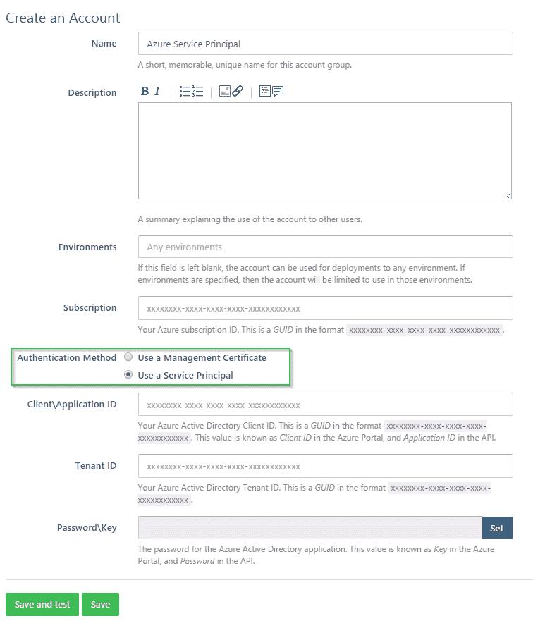
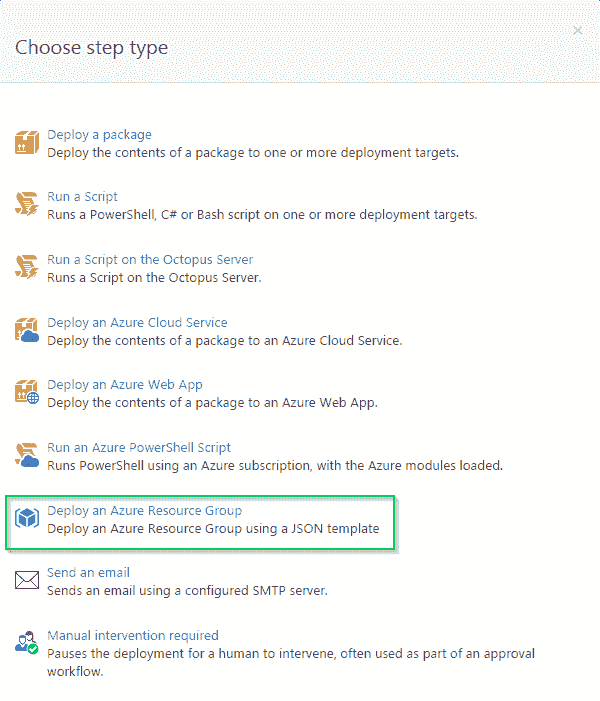
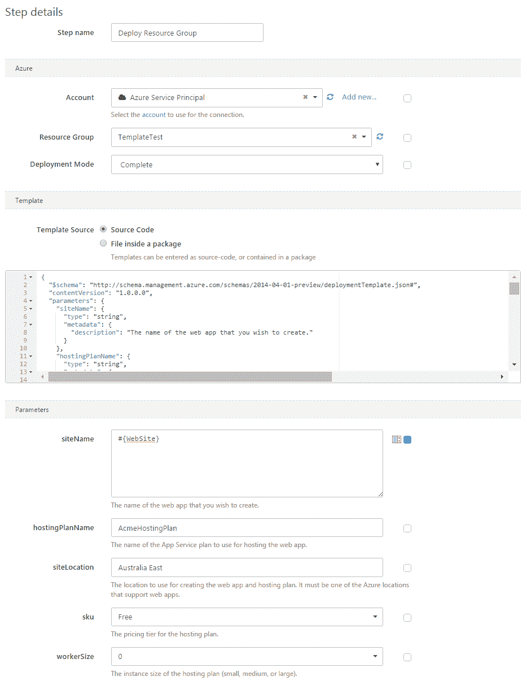
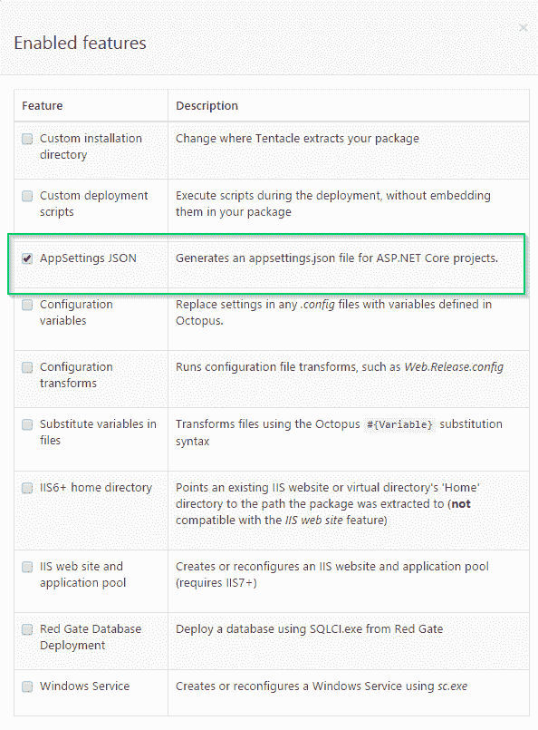

# 八达通部署 3.3 -八达通部署

> 原文：<https://octopus.com/blog/octopus-deploy-3.3>

Octopus Deploy 3.3 对每个人都有好处(*):

*   对于非。我们支持 zip 和 tar 包，加上一些 JavaScript 库来帮助创建和推送包。
*   对于 Azure 用户，资源管理器集成和新的资源组模板步骤类型。
*   对于那些生活在雷德蒙德的人来说，3.3 为 ASP.NET 核心带来了一个故事。
*   我们也没有忘记我们的基础，对执行脚本进行了一系列改进。

***** 嗯...不是所有人。不包括多租户。我们在下面称呼[。](#MultiTenancy)

## 特征

3.3 提供了以下新功能:

## 升级到八达通部署 3.3

*对`octo.exe`、`Octopus.Client`和 TeamCity 插件*的突破性改动

你需要升级`octo.exe`和你的团队城市插件。如果您使用的是`DeploymentProcess`资源，您还需要升级使用`Octopus.Client`的代码。

有关更多信息，请参考我们关于这一重大变更的[文档。](http://docs.octopusdeploy.com/display/OD/Sensitive+Properties+API+Changes+in+Release+3.3)

### 编写源自包的步骤脚本

以前，对于独立的脚本步骤(即与打包的应用程序无关的脚本)，代码作为步骤配置的一部分存储在 Octopus Deploy 中。在 3.3 中，脚本步骤能够执行包含在包中的脚本。

这允许您将脚本存储在源代码控制中，将它们打包成构建过程的一部分，并将其推送到 Octopus Deploy。

### 在 Octopus 服务器上执行的脚本步骤

部署应用程序时，有些情况下您希望执行不需要在目标机器上执行的脚本。例如，对数据库执行一些 SQL。也可能有这样的情况，脚本*不能*在目标机器上执行(由于网络拓扑等)，而*必须*在 Octopus 服务器上执行。

3.3 增加一个新的步骤类型:[在 Octopus 服务器上运行一个脚本](http://docs.octopusdeploy.com/display/OD/Running+Scripts+on+the+Octopus+Server)。这消除了在 Octopus 服务器上安装触手的需要，这是以前最常见的解决方法。

### 基于服务器的步骤作为子步骤

如果您有一个包含子步骤的步骤(通常用于实现滚动部署)，那么您以前不能将基于服务器的步骤(例如[电子邮件](http://docs.octopusdeploy.com/display/OD/Email+notifications)、[手动干预](http://docs.octopusdeploy.com/display/OD/Manual+intervention+and+approvals))添加为子步骤。使用 3.3，您现在可以对部署到的每台计算机进行手动干预。

这个特性与上面提到的在 Octopus 服务器上运行脚本*结合得很好。也许您有一个 web 应用程序的滚动部署，并且有一个 PowerShell 脚本步骤，该步骤在部署到负载均衡器之前将机器从负载均衡器中移除。PowerShell 步骤现在可以从 Octopus 服务器执行了。*

### 支持 zip 和 tar 包

八达通部署不再是 NuGet-only！我们喜欢吃章鱼，但是我们知道有些时候，特别是对于那些生活在非。NET 世界，当创建一个 tar 或 zip 文件可以更方便。

如果使用内置的 Octopus 包存储库，现在可以使用常规的 zip 文件，或者 tar 文件(+ GZip 或 BZip2)。详情请参见我们的[支持包文档](http://docs.octopusdeploy.com/display/OD/Supported+Packages)。

### OctoPack.js

继续让生活变得更简单的主题。NET 伙伴们，我们已经创建了一些 JavaScript 工具来帮助将包推送到 Octopus Deploy。 [OctoPack.js](https://github.com/OctopusDeploy/octopackjs) 为 Node.js 带来了一些 OctoPack 功能。我们还创建了 [gulp](https://github.com/OctopusDeploy/gulp-octo) 和 [grunt](https://github.com/OctopusDeploy/grunt-octo) 包装器，因此从您的 JavaScript 构建链推送至 Octopus Deploy 变得更加容易。

查看我们的[示例项目](http://docs.octopusdeploy.com/display/OD/Node+on+*Nix+deployments)。

### Azure 服务主账户

这个[新账户类型](http://docs.octopusdeploy.com/display/OD/Creating+an+Azure+Service+Principal+Account)代表 Azure Active Directory 中的一个服务主体。这样做的动机是与 Azure 资源管理器 API 集成，包括下面的新步骤类型。

### Azure 资源组模板步骤

3.3 通过一个新的[部署 Azure 资源组步骤](http://docs.octopusdeploy.com/display/OD/Deploy+using+an+Azure+Resource+Group+Template)类型扩展了 Octopus Deploy 的 Azure 集成，允许通过[模板](https://azure.microsoft.com/en-us/documentation/articles/resource-group-authoring-templates/)部署资源组。

这个特性在去年我们的 [RFC](https://octopus.com/blog/rfc-azure-resource-manager) 中已经指出。它允许对 Azure 进行声明性的、不可变的部署。

与源自包特性的*脚本步骤类似，Azure 资源组模板可以作为 JSON 源直接输入到步骤中，也可以包含在包中。如果它作为 JSON source 输入，我们将动态显示参数的字段，这些字段当然可以绑定到 Octopus 变量。*

### ASP.NET 核心 JSON 配置

ASP。NET Core(以前称为 ASP.NET 5)越来越接近生产版本，我们知道一些客户已经在使用它，所以我们想确保它得到支持。

之前在包装方面有一些问题。NuGet 包中的 nuspec 文件。有变通办法，但有点痛苦。既然我们支持替代的包类型，这个问题是完全可以避免的。

此外，JSON 是 ASP.NET 核心中当前最流行的配置，我们已经添加了一个新的 [AppSettings JSON 特性](http://docs.octopusdeploy.com/display/OD/AppSettings+JSON+Configuration+Feature)，使得将 Octopus 变量写入 JSON 配置文件变得更加容易。

我们现在在 Octopus Deploy 中也有一些关于 ASP.NET 核心部署的指南。

## 多租户——一个明显的疏漏

你们中的许多人会注意到上面的特性列表中有一个遗漏。

我们在 3.3 中承诺了多租户。多租户是 3.3 中的*不是*。对此我们深表歉意。

我们打算把它包括在内。我们发布了一个关于潜在实现的 RFC，并收到了很多有价值的反馈。反馈促使我们重新考虑我们提议的设计。在这一点上，我们必须决定是否保留上述所有功能以等待多租户，或者发布 3.3 sans MT，并花时间确保我们做得正确。显然我们选择了第二种选择。你很快就会看到修改后的 RFC。多租户是我们的首要任务。