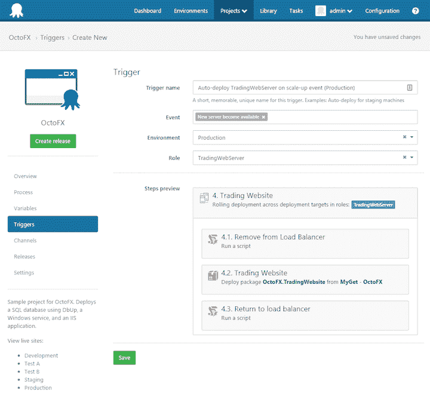

# 章鱼部署 3.4 EAP - Alpha 2 -章鱼部署

> 原文：<https://octopus.com/blog/octopus-deploy-3.4-eap-alpha2>

**Octopus Deploy 3.4 已经发货！阅读[博文](https://octopus.com/blog/octopus-deploy-3.4)和[今天就下载](https://octopus.com/downloads)！**

我们很自豪地宣布 Alpha 2 的发布，作为 Octopus Deploy 3.4 的[早期访问计划(EAP)](http://docs.octopusdeploy.com/display/ODEAP/Octopus+Deploy+EAP) 的一部分！这个功能发布是雄心勃勃的，我们想让你早点拿到它，而不是等着发布一个接近成熟的预发布版本。现在绝对是参与的最佳时机，[让我们知道你的想法](#feedback)！

## Octopus Deploy 3.4 出货后会是什么样子？

我们的目标是 Octopus Deploy 3.4 完整版的两个主要特性:

## Alpha 2 中的多租户部署

在 Alpha 2 中，您可以:

### Alpha 2 中的多租户示例

我们构建了一个小实用程序，它驱动 Octopus API 将完整的多租户示例(如上面的演示视频所示)安装到您的 Octopus 3.4.0 Alpha 2 服务器中。下载[章鱼。Sampler.1.0.0.zip](https://github.com/OctopusDeploy/Sampler/releases/tag/1.0.0) 并查看 [EAP](http://docs.octopusdeploy.com/display/ODEAP/Download+Latest) 页面了解更多详情。

### 多租户部署仍将继续

我们已经取得了很大的进步，但仍有一些重要的方面有待改进:

## Alpha 2 中的机器策略

根据您的反馈(是的，这真的很有帮助！)我们提炼了**机器策略**的概念，在 Alpha 2 中我们认为机器策略是功能完整的。

在 Alpha 2 中，您可以:

*   控制健康检查的频率
*   定制运行状况检查脚本(从我们今天所做的作为基线/默认开始)，允许您控制运行状况检查的结果，现在结果为`Healthy`、`Healthy with warnings`、`Unhealthy`、`Unavailable`(离线，但我们希望避免与[离线](http://docs.octopusdeploy.com/display/OD/Offline+Package+Drop)混淆)
*   指出哪些计算机预计会不时不可用，以减少运行状况检查结果中的干扰(以前，不可用的计算机会导致计算机不健康并在日志中出现错误)
*   控制机器长时间不可用时的操作

我们正在考虑的其他可能性:

*   锁定触手到一个特定的版本，因为你正在运行。某些服务器上的. NET 4.0
*   自动升级触手，而不是在环境页面上纠缠你
*   自动升级卡拉马里，而不是在环境页面上纠缠你

*那么自动部署和跳过不可用于部署的机器呢？亲爱的读者，请继续读下去！*

### 我们认为与部署相关的控件应该属于一个项目

在 Alpha 1 中，我们试图让一切都符合**机器策略**。经过思考(以及您的反馈)，我们决定将与部署相关的控制转移到项目中。*实际上是部署过程决定了是否可以安全地跳过部署目标，或者在部署过程中包含部署目标，而不是机器策略。*

在 Alpha 2 中，您可以:

*   在部署流程的不同阶段使用新的`Evaluate deployment targets`步骤，确定哪些部署目标应该包含在后续步骤中(基于最新的运行状况检查结果，或者运行连接性检查，或者完整的运行状况检查)
    *   我们计划将此步骤改为`Health check`步骤，允许您执行健康检查，并决定要做什么:部署失败，忽略不可用/不健康的机器继续部署，并可能将新的可用/健康的机器添加到部署中。*你怎么看？*
*   指示如果某些部署目标在部署期间变得不健康或不可用，则应该跳过它们(考虑在部署期间缩小规模)

T13

### 引入自动部署的触发器

不久前，我们写了一个 RFC，我们称之为[章鱼反应](https://octopus.com/blog/rcf-octopus-reactions-integration-toolkit)。这个概念是你可以基于某些 Octopus 事件定义**触发器**，然后**动作**来执行响应。我们认为触发器和动作提供了一种建模自动部署的更好方法。我们计划在 Octopus 3.4 中使用触发器实现自动部署。更多细节请关注本期 GitHub。

想象一下，当具有`web-server`角色的机器变得健康(通过环境过滤)时配置一个触发器，您可以触发您的项目的部署，运行特定于那个`web-server`角色的步骤，并且以某种方式选择哪些其他步骤应该/不应该作为这个自动部署的一部分运行。

触发器仍在开发中，所以你不能在 Alpha 2 中配置自动部署，但是我们很想得到你基于这个截图的反馈。你怎么想呢?

## Octopus Deploy Alpha 2 入门

使用访客帐户在我们的 [EAP 演示服务器](http://octopus34alpha2.southeastasia.cloudapp.azure.com/)上试用。

**有 Azure 套餐吗？**你可以使用我们在 Azure Marketplace 新发布的[模板，使用你自己的 Azure 订阅来建立一个完整的 Octopus 设置。*这将在虚拟机上安装最新稳定版本的 Octopus 服务器，但您可以使用远程桌面将 Octopus 服务器升级到 EAP 版本。最后，完成后，您可以轻松地删除整个资源组！*](https://azure.microsoft.com/en-us/marketplace/?term=Octopus+Deploy)

### 想自己装？

我们的 EAP 附带 45 天的[企业](https://octopus.com/purchase)试用许可。[下载最新的](http://docs.octopusdeploy.com/display/ODEAP/Octopus+Deploy+EAP) EAP 版本，浏览发行说明。由于还处于开发的早期阶段，我们不支持从 EAP 版本升级。我们建议在试用服务器上安装 EAP 版本。

## 您的反馈确实很重要

请在我们的[论坛](http://help.octopusdeploy.com/discussions/beta-testing-feedback)发表反馈并加入讨论。我们特别希望收到以下方面的反馈:

*   “正常”和“租用”部署概念是否令人困惑，或者对您来说是否有意义？
*   我们计划从快照中排除租户变量(这样您就可以添加它们，并在创建版本后随时更改细节)。我们还有[移除快照的长期计划](https://octopus.com/blog/rfc-removing-snapshots) -你怎么看？
*   您认为我们还应该允许选择租户/确定租户范围吗？
*   既然我们已经对它们进行了改进，那么`Machine Policies`中还缺少什么吗？
*   您认为我们的自动部署方向有问题吗？

来吧，参与进来，帮助我们构建迄今为止最好的 Octopus 部署。*部署愉快！*