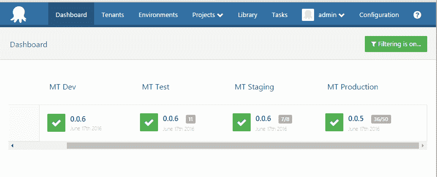

# 八达通部署 3.4 EAP - Beta 1 -八达通部署

> 原文：<https://octopus.com/blog/octopus-deploy-3.4-eap-beta1>

**Octopus Deploy 3.4 已经发货！阅读[博文](https://octopus.com/blog/octopus-deploy-3.4)和[今天就下载](https://octopus.com/downloads)！**

我们很自豪地宣布 Beta 1 的发布，作为 Octopus Deploy 3.4 的[早期访问计划(EAP)](http://docs.octopusdeploy.com/display/ODEAP/Octopus+Deploy+EAP) 的一部分！还有时间参与进来，[让我们知道你的想法](#feedback)！

## Octopus Deploy 3.4 Beta 1 中有哪些功能？

在这个版本中，我们已经完成了我们计划发布的核心部署功能，编写了指南来帮助您开始，并且我们已经在内部测试了所有这些功能几个星期。

### 多租户部署

多租户部署基本上已经完成，除了一些[值得注意的遗漏](#notable-omissions)，并且已经准备好让您开始认真测试。

开始多租户部署的最佳地方是我们的[指南](http://docs.octopusdeploy.com/display/OD/Multi-tenant+deployments)。

### 支持弹性和瞬态环境

我们已经完成了针对弹性和瞬态环境的特性集，包括[机器策略](http://docs.octopusdeploy.com/display/OD/Machine+Policies)、新项目配置选项、[项目触发器](http://docs.octopusdeploy.com/display/OD/Keeping+deployment+targets+up+to+date)(自动部署)，以及一个您可以添加到部署流程中的新健康检查步骤。

您可以结合这些功能来实现以下场景:

*   根据需求自动扩展 web 服务器
*   更新经常与公司网络断开连接的工作站/笔记本电脑上的应用程序
*   通过不可靠或缓慢的网络连接优雅地处理远程部署目标

开始使用弹性和瞬态环境支持的最佳地方是我们的[指南](http://docs.octopusdeploy.com/display/OD/Elastic+and+Transient+Environments)。

### 云区

当我们发布 Octopus 3.0 时，我们认为我们在部署目标 [Azure 云服务](http://docs.octopusdeploy.com/display/OD/Azure+Cloud+Service+Target)和 [Azure Web App](http://docs.octopusdeploy.com/display/OD/Azure+Web+Apps) 方面做了一件好事——事实也的确如此。部署目标解决了一组需求，替换的 [Azure 云服务](http://docs.octopusdeploy.com/display/OD/Deploying+a+package+to+an+Azure+Cloud+Service)和 [Azure Web App](http://docs.octopusdeploy.com/display/OD/Deploying+a+package+to+an+Azure+Web+App) 部署步骤解决了另一组需求。我们在之前的博客文章中写了更多关于这个的内容。

现在，我们引入了[云区域](http://docs.octopusdeploy.com/display/OD/Cloud+Regions)作为弥合这一差距的一种方式，并使得为多区域云应用设计[滚动部署](http://docs.octopusdeploy.com/display/OD/Rolling+deployments)变得更加容易。基于此，我们将开始放弃部署目标的过程。您可以在下面的中了解有关此[的更多信息，我们将为您提供迁移所需的所有详细信息，作为我们文档中升级指南的一部分。](#deprecating-azure-targets)

### 触手通信的代理支持

我们在 Octopus 服务器与触手通信的协议中实现了对 HTTP 代理服务器的支持。这对轮询和监听触角都有效。如果需要，每个触手可以配置成使用不同的代理。您甚至可以使用一个代理将触手连接到 Octopus 服务器，并使用另一个代理处理一般的 web 请求。

### Octopus Deploy 3.4 Beta 1 中的一些值得注意的遗漏

为了更快地向我们的客户发布这个测试版，并利用您的反馈，我们做出了一些艰难的决定。

*   在 Beta 1 中，您可以使用 web 门户或 API 来部署发布，但是您不能使用`octo.exe`或任何构建服务器扩展。我们希望在 Beta 2 中更新这些内容。
*   在 Beta 1 中，您可以显式地使用一个或多个租户来实现基于租户的安全性，但是在 Beta 1 中您不能使用租户标签。现在不要使用租户标签，只需显式地将租户添加到您的团队中。我们希望在 Beta 2 中完成使用租户标签的基于租户的安全性。
*   我们决定推迟一些额外的特性，这些特性将使处理大量租户和部署目标变得更加容易。
*   我们计划调整计算租户部署中包含哪些部署目标的方法，但我们未能在 Beta 1 中及时完成。目前，没有租户筛选的部署目标被视为“对所有租户可用”。在 Beta 1 中，最安全的方法是对所有环境使用租户，包括测试环境。在 Beta 2(以及更高版本)中，我们希望将该模型简化为:
    *   租用的部署使用租用的部署目标(具有某种租户过滤器的目标)。
    *   未租用的部署使用未租用的部署目标(没有任何类型的租户过滤器的目标)。
*   我们还没有完成对 API 的审查，我们预计它会在 Beta 1 和 Beta 2 之间发生变化。我们小心翼翼地使用典型的 API 优先的方法来构建 Octopus 3.4，但是在我们认为它稳定之前，我们想从几个不同的角度来审查这个 API。

## 重大变更和废弃通知

### 反对 Azure 部署目标

我们开始反对支持 [Azure 云服务](http://docs.octopusdeploy.com/display/OD/Azure+Cloud+Service+Target)和 [Azure Web App](http://docs.octopusdeploy.com/display/OD/Azure+Web+Apps) 部署目标。

别担心，在 Octopus 3.4 中，你可以查看和编辑现有的 Azure 部署目标，并开始迁移它们以使用 [Azure 云服务](http://docs.octopusdeploy.com/display/OD/Deploying+a+package+to+an+Azure+Cloud+Service)和 [Azure Web App](http://docs.octopusdeploy.com/display/OD/Deploying+a+package+to+an+Azure+Web+App) 部署步骤和[云区域](#cloud-regions)。

在 Octopus Deploy 的未来版本中，我们将停止对 Azure 云服务和 Azure Web App 部署目标的支持。

### 运行状况检查结果的更改

我们为[弹性和瞬态环境](#elastic-and-transient-environments)引入了一个新的属性`MachineResource.HealthStatus`，它可以是`Healthy`、`HealthyWithWarnings`、`Unhealthy`和`Unavailable`。在 Octopus 3.4 中，你可以继续使用现有的`MachineResource.Status`，它可以是`Online`或`Offline`，但是我们已经将`Status`属性标记为`Obsolete`，并将在未来的版本中删除它。

### 触手已被修补，以配合章鱼 3.4

如果你使用的是旧版本的触手，用 Octopus 3.4 注册一个全新的触手会失败。发生这种情况是因为老触手不理解[云区域](#cloud-regions)并且不能反序列化它们。我们已经修补了触手，以便在未来更能适应这种变化。

**注意**:这个问题只影响**向你的章鱼服务器注册新的触手**。现有的触手将继续正常工作。

*   **注册 3.0.x 触须(用于老年人。NET 4.0-only 服务器)**:请下载[触手 3.0.26](https://octopus.com/downloads/3.0.26) 已经打了补丁，可以和 Octopus 3.4 一起使用。
*   **注册新版本的触手**:请开始使用 a 3.4.x 触手版本(我们推荐最新的)。

### 对内置存储库错误代码的更改

当您将一个重复的包推送到[内置的包存储库](http://docs.octopusdeploy.com/display/OD/Pushing+packages+to+the+Built-In+repository)时，我们现在将用 HTTP 状态码`409 Conflict`而不是`400 Bad Request`来响应。像`nuget.exe`这样的客户端只会显示 HTTP 状态代码，丢弃 Octopus 返回的原因，解释为什么这是一个错误的请求。在这种情况下使用`409 Conflict`会使诊断更容易。参考[本 GitHub 问题](https://github.com/OctopusDeploy/Issues/issues/2419)了解更多信息。

## 在我们发布 Octopus 3.4 之前还需要做些什么？

除了与我们出色的 Octopus 社区合作提供反馈，我们还需要:

*   实现一些额外的特性，这些特性在处理大量租户和部署目标时会很好。
*   继续充实我们的指南，帮助您充分利用这些新功能。
*   使用 API 为租户迁移到 Octopus 3.4 提供指导。
*   进一步提高具有数百个租户、环境和部署目标的大型安装的性能。

我们非常兴奋地宣布，其他一些尚未为 Beta 1 做好准备，但将在 Beta 2 中发布的产品有:

## 已知问题

*   我们将继续在仪表盘上工作，它仍然有一些显示/数据问题。请随时将您在仪表盘上的[反馈](#feedback)写给我们，以便我们将其纳入最终设计。
*   旧的触角将无法注册与章鱼 3.4 与以下信息:`Octopus.Client.Exceptions.OctopusDeserializationException: Unable to process response from server: The given key was not present in the dictionary.` -见[突破性的变化](#breaking-tentacle)。

## Octopus Deploy Beta 1 入门

使用来宾帐户在我们的 [Beta 1 演示服务器](http://octopus34beta1.southeastasia.cloudapp.azure.com/)上试用它，或者联系我们的支持团队获取提升的凭证。

**订阅 Azure？**你可以使用我们在 Azure Marketplace 新发布的[模板，使用你自己的 Azure 订阅来建立一个完整的 Octopus 设置](https://azure.microsoft.com/en-us/marketplace/?term=Octopus+Deploy)。*这将在虚拟机上安装最新稳定版本的 Octopus 服务器，但是您可以使用远程桌面将 Octopus 服务器升级到 EAP 版本。最后，完成后，您可以轻松地删除整个资源组！*

### 想自己装？

Octopus Deploy 附带 45 天的企业试用许可。[下载 Octopus 3.4 Beta 1](http://docs.octopusdeploy.com/display/ODEAP/Octopus+Deploy+EAP) 版本，浏览发行说明。我们将支持从这些测试版升级到正式版的 Octopus 3.4，但不支持降级到以前的 Octopus 版本。如果你想升级现有的 Octopus 服务器，不要忘记备份和测试你的数据库。否则，我们建议安装在试用服务器上。

## 您的反馈确实很重要

请在我们的[论坛](http://help.octopusdeploy.com/discussions/beta-testing-feedback)发表反馈并加入讨论。

来吧，参与进来，帮助我们构建迄今为止最好的 Octopus 部署。*部署愉快！*