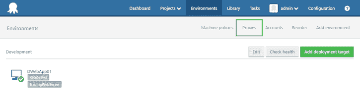

# 八达通部署 3.4 EAP - Beta 2 -八达通部署

> 原文：<https://octopus.com/blog/octopus-deploy-3.4-eap-beta2>

**Octopus Deploy 3.4 已经发货！阅读[博文](https://octopus.com/blog/octopus-deploy-3.4)和[今天就下载](https://octopus.com/downloads)！**

我们很自豪地宣布章鱼部署 3.4 测试版 2 的发布。除了一些小的改进和错误修复，我们认为这个版本的功能是完整的。还有时间参与 Octopus Deploy 3.4 的[早期访问计划(EAP)](http://docs.octopusdeploy.com/display/ODEAP/Octopus+Deploy+EAP) 和[让我们知道你的想法](#feedback)！

**关注我们的[微博系列](https://octopus.com/blog/octopus34-blog-series-kickoff)了解章鱼 3.4 的所有伟大特性！**

## Octopus Deploy 3.4 Beta 2 有什么新功能？

在这个版本中，我们一直在 3.4 Beta 1 的基础上进行构建，对现有功能进行了改进，并完成了对 NuGet 3 的升级，增加了对 SemVer 2 和 F#自定义脚本的支持。我们还完成了关于`octo.exe`和团队城市和 VSTS 扩展的工作，这样你就可以将 3.4 Beta 2 完全集成到你现有的构建管道中，包括所有新的 Octopus 3.4 特性。

你可以在我们的 [GitHub 资源库](https://github.com/OctopusDeploy/Issues/issues?q=is%3Aclosed+is%3Aissue+milestone%3A3.4.0-beta002)中看到 3.4 Beta 2 中修复了哪些 bug，也可以随意看看大家一直在发帖的[反馈](http://help.octopusdeploy.com/discussions/beta-testing-feedback)！此外，请查看我们的章鱼 3.4 [博客系列](https://octopus.com/blog/octopus34-blog-series-kickoff)以深入了解新功能和构建该版本的决策。

### 多租户部署有什么新特性？

除了小的改进和错误修复，我们已经完成了 Octopus Deploy 3.4.0 的多租户部署工作。请放心，我们将在未来几周和几个月内继续努力改进。

显著的变化和改进:

*   您现在可以通过名称和标签搜索租户
*   global dashboard 已更新，纠正了我们在显示您的项目/环境的租赁部署时犯的一些错误
*   多租户项目概述得到了改进，包括:
    *   改进的过滤
    *   通过标签集进行分组的能力
    *   能够部署到租户组，甚至特定环境中的所有租户
    *   现在更容易理解哪些租户连接到了哪些环境
*   我们改变了计算租户部署中包括哪些部署目标和帐户的方式，这将使设计租赁和非租赁托管场景变得更加容易:
    *   租用的部署使用租用的部署目标和帐户(带有某种类型的租户过滤器)。
    *   未租用的部署使用未租用的部署目标和帐户(没有任何类型的租户过滤器)。
*   我们还更新了所有的[工具和集成](#updated-tools)，以便与租户合作- [看看](#updated-tools)，看看你能做些什么

开始多租户部署的最佳地方是我们的[指南](http://docs.octopusdeploy.com/display/OD/Multi-tenant+deployments)。

### 弹性和瞬态环境中的新特性？

除了小的改进和错误修复，我们已经完成了 Octopus 3.4.0 的弹性和瞬态环境支持工作。

显著的变化和改进:

*   我们修复了一个错误,在手动部署后项目触发器会意外触发
*   我们使得在没有任何现有部署的情况下对全新的环境使用自动部署成为可能，这使您能够即时创建测试环境。这对于使用不可变的基础设施(将服务器视为“牛而不是宠物”)和测试特性分支非常有用。你可以在[我们关于不可变基础设施的指南](http://docs.octopusdeploy.com/display/OD/Immutable+Infrastructure)中读到更多。
*   我们还更新了所有的[工具和集成](#updated-tools)来处理弹性和瞬态环境- [看看](#updated-tools)看看你能做什么

从弹性和瞬态环境支持开始的最佳地方是我们的[指南](http://docs.octopusdeploy.com/display/OD/Elastic+and+Transient+Environments)。

### F#脚本支持

除了我们其他支持的脚本语言之外，你现在可以用 F# ( `*.fsx`)编写[定制脚本](http://docs.octopusdeploy.com/display/OD/Custom+scripts)。请看[这个 GitHub 问题](https://github.com/OctopusDeploy/Issues/issues/2549)并且看一些[例子，看看作为你的部署的一部分，你可以用 F#脚本](https://fsharpforfunandprofit.com/posts/low-risk-ways-to-use-fsharp-at-work-2/)做什么。

### NuGet v3

我们已经替换了对 NuGet 的依赖。通过全面升级到 NuGet 3，这意味着我们已经能够关闭一些长期的 bug，并支持外部 NuGet v3 提要！更多信息见[本 GitHub 问题](https://github.com/OctopusDeploy/Issues/issues/2428)。

### 永远见 2

您现在可以在发行版和软件包中使用 [SemVer 2](http://semver.org/spec/v2.0.0.html) 版本了！这将使得在构建和部署管道中使用 SemVer 2 变得更加容易，尤其是使用像 [GitVersion](https://gitversion.readthedocs.io/en/latest/why/) 这样的工具。

### 更新的工具和集成

我们已经更新了`Octopus.Tentacle.exe`、`Octopus.Client` SDK、`octo.exe`以及 [TeamCity](http://docs.octopusdeploy.com/display/OD/TeamCity) 和 [VSTS](http://docs.octopusdeploy.com/pages/viewpage.action?pageId=5669025) 扩展。将这些更新的工具与 Octopus Server 3.4 结合使用，您现在可以:

*   [使用`Octopus.Tentacle.exe`和](http://docs.octopusdeploy.com/display/OD/Automating+Tentacle+installation)自动注册触手:
*   使用`octo.exe`和构建服务器扩展来执行租用部署
*   使用`Octopus.Client` SDK 自动化 Octopus 3.4 中的任何事情

我们将在接下来的几周内更新文档。同时，您可以使用工具提供的帮助，或者[联系我们寻求支持或提供反馈](#feedback)。

### 将代理配置移至环境

在 Beta 2 中，我们将监听触角的代理配置移到了环境区域。在 Beta 1 中，您需要授予用户系统管理员权限，以便他们可以管理触手代理配置。现在用户可以在被授予通常的`Proxy*`权限后管理触手代理配置。

## 重大变更和废弃通知

### 反对 Azure 部署目标

我们开始反对支持 [Azure 云服务](http://docs.octopusdeploy.com/display/OD/Azure+Cloud+Service+Target)和 [Azure Web App](http://docs.octopusdeploy.com/display/OD/Azure+Web+Apps) 部署目标。

别担心，在 Octopus 3.4 中，你可以查看和编辑现有的 Azure 部署目标，并开始迁移它们以使用 [Azure 云服务](http://docs.octopusdeploy.com/display/OD/Deploying+a+package+to+an+Azure+Cloud+Service)和 [Azure Web App](http://docs.octopusdeploy.com/display/OD/Deploying+a+package+to+an+Azure+Web+App) 部署步骤和[云区域](http://docs.octopusdeploy.com/display/OD/Cloud+Regions)。

在 Octopus Deploy 的未来版本中，我们将停止对 Azure 云服务和 Azure Web App 部署目标的支持。

### 运行状况检查结果的更改

我们为[弹性和瞬态环境](#elastic-and-transient-environments)引入了一个新的属性`MachineResource.HealthStatus`，它可以是`Healthy`、`HealthyWithWarnings`、`Unhealthy`和`Unavailable`。在 Octopus 3.4 中，你可以继续使用现有的`MachineResource.Status`，它可以是`Online`或`Offline`，但是我们已经将`Status`属性标记为`Obsolete`，并将在未来的版本中删除它。

### 触手已被修补，以配合章鱼 3.4

如果你使用的是旧版本的触手，用 Octopus 3.4 注册一个全新的触手会失败。发生这种情况是因为老触手不理解[云区域](http://docs.octopusdeploy.com/display/OD/Cloud+Regions)并且不能反序列化它们。我们已经修补了触手，以便在未来更能适应这种变化。

**注意**:这个问题只影响**向你的章鱼服务器注册新的触角**。现有的触手将继续正常工作。

*   **注册 3.0.x 触须(用于老年人。NET 4.0-only 服务器)**:请下载[触手 3.0.26](https://octopus.com/downloads/3.0.26) 已经打了补丁，可以和 Octopus 3.4 一起工作。
*   **注册新版本的触手**:请开始使用 a 3.4.x 触手版本(我们推荐最新的)。

### 对内置存储库错误代码的更改

当您将一个重复的包推送到[内置的包仓库](http://docs.octopusdeploy.com/display/OD/Pushing+packages+to+the+Built-In+repository)时，我们现在将用 HTTP 状态码`409 Conflict`而不是`400 Bad Request`来响应。像`nuget.exe`这样的客户端只会显示 HTTP 状态代码，丢弃 Octopus 返回的原因，解释为什么这是一个错误的请求。在这种情况下使用`409 Conflict`会使诊断更容易。更多信息请参考[GitHub 问题](https://github.com/OctopusDeploy/Issues/issues/2419)。

## 在我们发布 Octopus 3.4 之前还需要做些什么？

除了与我们出色的 Octopus 社区合作提供反馈，我们还需要:

*   继续充实我们的指南，帮助您充分利用这些新功能。
*   使用 API 为租户迁移到 Octopus 3.4 提供指导。
*   进一步提高具有数百个租户、环境和部署目标的大型安装的性能。

## Octopus Deploy 3.4 Beta 2 入门

使用来宾帐户在我们的 [3.4 Beta 2 演示服务器](http://octopus34beta2.southeastasia.cloudapp.azure.com/)上试用，或者联系我们的支持团队以获得提升的凭证。

**订阅 Azure？**你可以使用我们在 Azure Marketplace 新发布的[模板，使用你自己的 Azure 订阅来建立一个完整的 Octopus 设置](https://azure.microsoft.com/en-us/marketplace/?term=Octopus+Deploy)。*这将在虚拟机上安装最新稳定版本的 Octopus 服务器，但是您可以使用远程桌面将 Octopus 服务器升级到 EAP 版本。最后，完成后，您可以轻松地删除整个资源组！*

### 想自己装？

Octopus Deploy 附带 45 天的企业试用许可。[下载 Octopus 3.4 Beta 2](http://docs.octopusdeploy.com/display/ODEAP/Octopus+Deploy+EAP) 版本，浏览发行说明。我们将支持从这些测试版升级到正式版的 Octopus 3.4，但不支持降级到以前的 Octopus 版本。如果你想升级现有的 Octopus 服务器，不要忘记备份和测试你的数据库。否则，我们建议安装在试用服务器上。

## 您的反馈确实很重要

请在我们的[论坛](http://help.octopusdeploy.com/discussions/beta-testing-feedback)发表反馈并加入讨论。

来吧，参与进来，帮助我们构建迄今为止最好的 Octopus 部署。*部署愉快！*