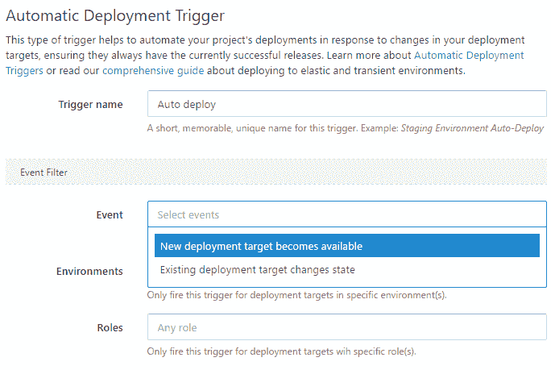
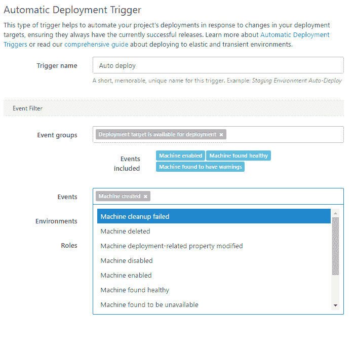

# Octopus Deploy 3.6:项目触发增强- Octopus Deploy

> 原文：<https://octopus.com/blog/octopus-deploy-3.6>

* * *

Octopus Deploy 3.6 来了！好像昨天才发布了 3.5。对于长期的章鱼粉丝来说，两个小版本如此接近可能会感到惊讶；我们正在尝试一种新的版本管理方法。

## 版本控制策略

我们在 Octopus 上的目标是在漏洞修复和特性准备好的时候尽快部署它们。我们相信，当我们编写的代码在您的手中时是最有价值的，在您的手中，功能会使您的生活更轻松，并且错误是短暂的。

传统上，我们以补丁版本(例如 3.2.1、3.2.2、3.2.3)的形式发布错误修复和小功能，以小版本(例如 3.1、3.2、3.3)的形式发布大功能，通常将一系列功能捆绑到同一个小版本中。从今天开始，我们尝试在一个特性准备好(而不是捆绑)或者从以前的版本升级可能会引起摩擦的时候发布一个次要版本。

在今天的版本 3.6 中，我们增加了次要版本，因为从 3.5.x 升级可能会引起摩擦。我们想确保你可以闭着眼睛应用补丁发布:这将是顺利的，无痛的，一切将继续像以前一样工作。你可以在不同的补丁之间切换，所以如果你遇到一个你不喜欢的补丁，你可以回滚到之前的版本。

较小的版本增量意味着您可能需要更加关注升级，并且您将只能前滚。在今天的版本中，有一个影响项目触发器的模式更改，其中包括一个将 3.5 版项目触发器转换为 3.6 版项目触发器的升级脚本。唯一的恢复方法是恢复数据库备份！

## 项目触发变更

### 事件过滤器

在 Octopus Deploy 3.4 中，项目触发器可以配置为基于两个事件自动部署:

*   新的部署目标变得可用
*   现有部署目标改变状态

我们听到的反馈是，这两个事件的含义并不完全清楚。在 Octopus Deploy 3.6 中，您可以选择任何与机器相关的事件来导致自动部署(又名。项目触发器)来激发。我们还提供了一个方便的事件分组机制(如订阅中所介绍的)来选择预定义的事件组:

可以在项目触发器过滤器中选择的事件精确映射到在*配置>审计*屏幕上显示的事件，以使项目触发器的设计和故障排除更加容易。选择任何机器事件的能力也为配置一些有趣的项目触发器打开了大门。例如:试图修复变得不健康的机器。

### 机器选择逻辑

> “自动部署很难！”

自动部署功能最初是一个神奇的复选框，可以让计算机保持最新版本。我们很快意识到将正确的版本发布到正确的机器上是很困难的。在尝试确定“新部署目标是否可用”或“现有部署目标是否改变状态”时，我们执行了一些复杂的计算，对于相同的事件序列，这些计算有时会产生自动部署，有时不会。在 3.6 中，我们已经摆脱了复杂性。相反，当某个事件与为项目触发器选择的筛选器相匹配时，该项目触发器将被触发。

3.6 将更新任何现有项目触发器上的事件过滤器。“新部署目标变得可用”将被转换为在“计算机已创建”事件上执行，而“现有部署目标更改状态”将在“计算机变得可用于部署”事件组上执行。

## 下一步是什么？

我们希望你喜欢 3.6，并发现项目触发器有更多的深度和可预测性。我们预计将通过开放事件选择来扩展项目触发器，以包括更多的事件，并通过提供更多可以作为触发器触发的结果来执行的动作。例如，您可以将项目触发器配置为“在每次成功部署项目 A 之后自动部署项目 B”或者“在推出一个包时创建并部署一个发布到测试环境中”。