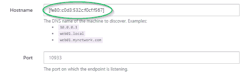
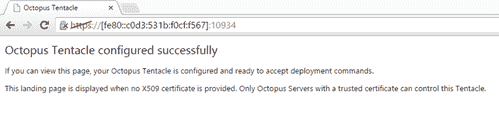
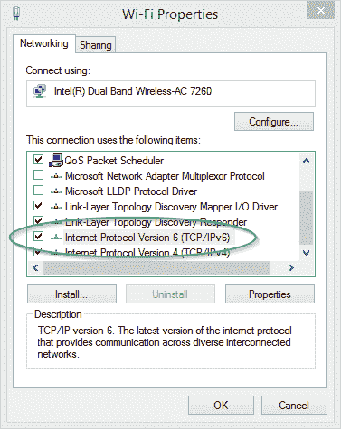

# 为 IPv6 配置 Octopus 部署- Octopus 部署

> 原文：<https://octopus.com/blog/octopus-deploy-ipv6>

虽然以前在技术上可以通过[比目鱼](https://github.com/OctopusDeploy/Halibut)设置你的触手使用 IPv6 协议，但这需要在触手上手动配置，因此需要知道它和服务器之间使用的是哪种特定协议。此外，只有主机名有效，无法为目标配置提供特定的 IPv6 地址。随着`3.1.7`中引入的变化，您的 Octopus Deploy 实例现在可以进入未来，闭着眼睛就可以开始使用 IPv6。如果您的 IOT(触须互联网)设置有耗尽内部 IPv4 地址的风险，那么您不必再担心了。

## IPv4/IPv6 双模上的触角

默认情况下，Octopus Deploy 服务器和 Tentacles 现在都将使用 sockets [的双模式功能监听地址。Net 4.5](http://blogs.msdn.com/b/webdev/archive/2013/01/08/dual-mode-sockets-never-create-an-ipv4-socket-again.aspx) 。侦听触手(以及使用轮询模式时的服务器)将同时侦听 IPv4 和 IPv6 地址，但是为了简单起见，两种协议使用相同的端口。这意味着您可以根据地址为任一协议设置您的目标，它将“正常工作”。如果您在触手配置中提供其 FQDN(完全合格的域名),部署时解析的地址仍将由网络堆栈在内部确定。因此，有时在您的日志中看到您的 IPv4 地址用 IPv6 符号表示，如`[::ffff:127.0.0.1]`，您应该不会感到太惊讶。

请记住，当在 URI 中指定 IPv6 地址时，[规范](https://www.ietf.org/rfc/rfc2732.txt)要求将地址括在方括号中。因此，如果你的目标地址是`fe80::c0d3:531b:f0cf:f567`，那么被发现的地址将是`[fe80::c0d3:531b:f0cf:f567]`，而完整的触手 URL 将会沿着`https://[fe80::c0d3:531b:f0cf:f567]:10933/`的路线



您还可以在浏览器中直接引用您的触手的 IPv6 地址来测试连通性，就像您使用普通的 IPv4 地址或主机名一样。



如果您的触须似乎是用其 IPv4 地址而不是 IPv6 地址重新连接，记得也检查您的网络适配器在其设置中启用了此功能。



由于 Halibut 通信框架用于轮询和侦听触角，IPv6 连接细节也适用于轮询触角被配置为连接到特定 Octopus 服务器的场景。当设置轮询触手时，您现在可以指定一个 IPv6 地址来连接到服务器，只要该地址用方括号括起来，并且网络配置为允许 IPv6 连接。也就是说，如果您提供主机名，网络堆栈将为您决定使用哪个协议。最终最简单的事情是让你的 DNS 做它的工作；使用主机名，不要触摸任何东西，正确的协议将在必要时使用。

# 将触手独占绑定到 IPv4

如果出于某种原因，你希望强制触手只监听 IPv4 地址，这可以通过利用内置的`configure`命令来设置。

```
Tentacle.exe configure --listenIpAddress 0.0.0.0 
```

此配置可以通过调用

```
Tentacle.exe configure --listenIpAddress any 
```

# 进一步的问题

如果您担心您的基础设施不支持 IPv6，请不要担心。虽然默认情况下，Octopus 现在将通过任一协议进行通信，但如果您的目标使用主机名或 IPv4 地址进行配置，它们将悄悄地退回到仅侦听 IPv4，而不需要任何额外的配置。我们关于[触手故障排除](http://docs.octopusdeploy.com/display/OD/Troubleshoot+Listening+Tentacles)的文档页面也提供了一些其他有用的提示和资源，帮助你与触手对话。