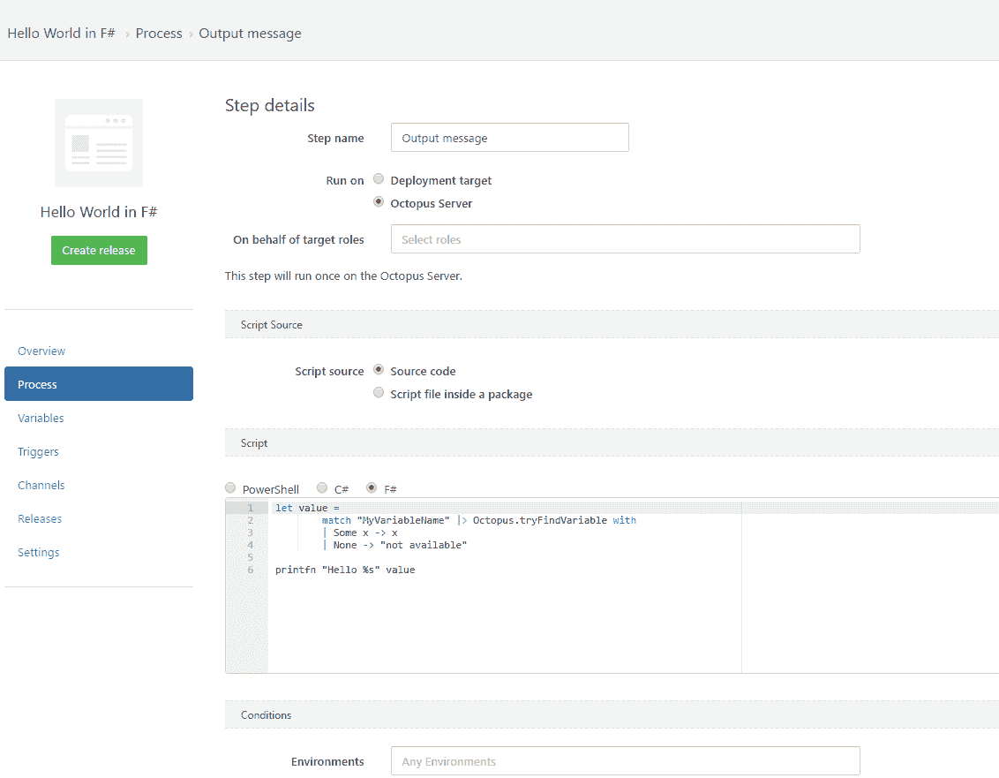

# F# | >章鱼部署爱-章鱼部署

> 原文：<https://octopus.com/blog/octopus-deploy-loves-fsharp>

这篇文章是我们 Octopus 3.4 博客系列的一部分。在我们的[博客](https://octopus.com/blog/octopus34-blog-series-kickoff)或我们的[推特](https://twitter.com/OctopusDeploy)上关注它。

**Octopus Deploy 3.4 已经发货！阅读[博文](https://octopus.com/blog/octopus-deploy-3.4)和[今天就下载](https://octopus.com/downloads)！**

* * *

即将发布的 Octopus 3.4 将包括 F# 4.0 支持，这意味着[自定义](http://docs.octopusdeploy.com/display/OD/Custom+scripts)和[独立](http://docs.octopusdeploy.com/display/OD/Standalone+scripts)脚本(*。fsx)可以写在里面。

## 我如何开始？

1.  [创建新项目](http://docs.octopusdeploy.com/display/OD/Getting+started#Gettingstarted-Createaproject)
2.  [添加一个名为 MyVariableName 的变量](http://docs.octopusdeploy.com/display/OD/Variables),并将其值设置为 World
3.  [增加一个“运行脚本”步骤](http://docs.octopusdeploy.com/display/OD/Custom+scripts)
4.  键入您的 F#脚本。F#对空白敏感，所以缩进很重要。您可以从[这里](https://gist.github.com/pawelpabich/9c4d38e5522d914dd5981c5052b8dc9d)复制并粘贴一个示例脚本。
5.  [创建一个新版本并部署它](http://docs.octopusdeploy.com/display/OD/Getting+started#Gettingstarted-Createareleaseanddeployit)
6.  单击任务日志，您应该会看到以下输出:

你也可以[设置输出变量](http://docs.octopusdeploy.com/display/OD/Output+variables#Outputvariables-F#)和[创建工件](http://docs.octopusdeploy.com/display/OD/Artifacts#Artifacts-F#)。

## 为什么是 F#？

我们已经支持 Bash、PowerShell 和 ScriptCS，所以你可能想知道为什么我们需要另一种语言。首先，因为是你要求的，而且你[要求了好几次](https://octopusdeploy.uservoice.com/forums/170787-general/suggestions/10799772-allow-the-use-of-f-script-fsx-in-place-of-powe)。:)其次，Octopus 支持的每种语言都提供不同的功能:

*   Bash 对文本进行操作
*   PowerShell 操作对象，但是直到运行时才知道它们的类型
*   脚本提供静态编译
*   F#是紧凑的，有一个很大的[类型推理](https://msdn.microsoft.com/en-us/visualfsharpdocs/conceptual/type-inference-%5Bfsharp%5D)，并且强迫你显式地处理边缘情况(例如[缺值](https://fsharpforfunandprofit.com/posts/the-option-type/)

在我们看来，选择越多越好，因为这有助于您找到适合工作的工具。

## 我想多学一点

如果你以前没有使用过 F#并且想了解更多，那么看看由 F#基金会和 [Scott Wlaschin 的网站](https://fsharpforfunandprofit.com)提供的[资源。他是一位伟大的教育家。](http://fsharp.org/learn.html)

如果你总是想在你的开发工作流程中使用 F#,但是找不到一个低风险的方法来引入它，那么 F#中的部署脚本可能就是你正在寻找的。

别忘了，你可以通过使用[脚本控制台](http://docs.octopusdeploy.com/display/OD/Script+Console)在任意数量的目标上执行任意的 F#代码。这是一个像 [REPL](https://en.wikipedia.org/wiki/Read%E2%80%93eval%E2%80%93print_loop) 一样，但是分布式的。

最后但同样重要的是，我要感谢 Jorge Fioranelli 帮助我们使 API F#变得友好。

尽情享受吧！