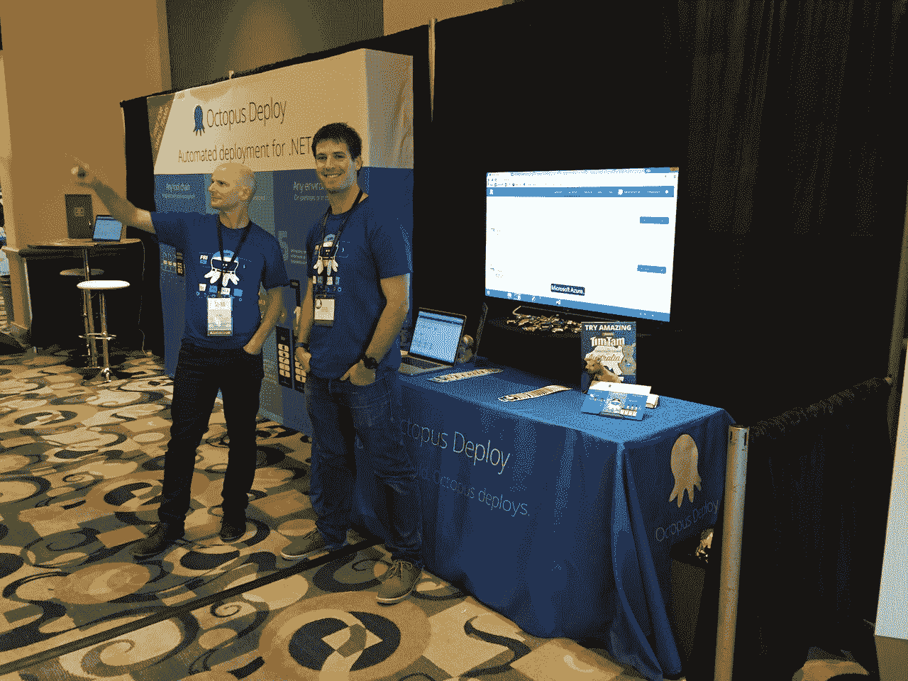
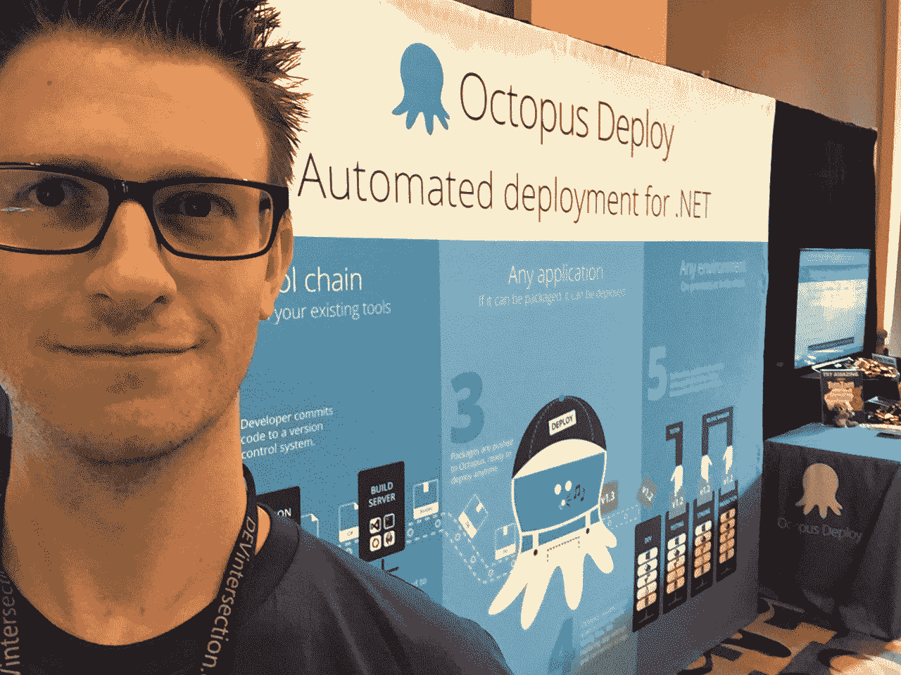
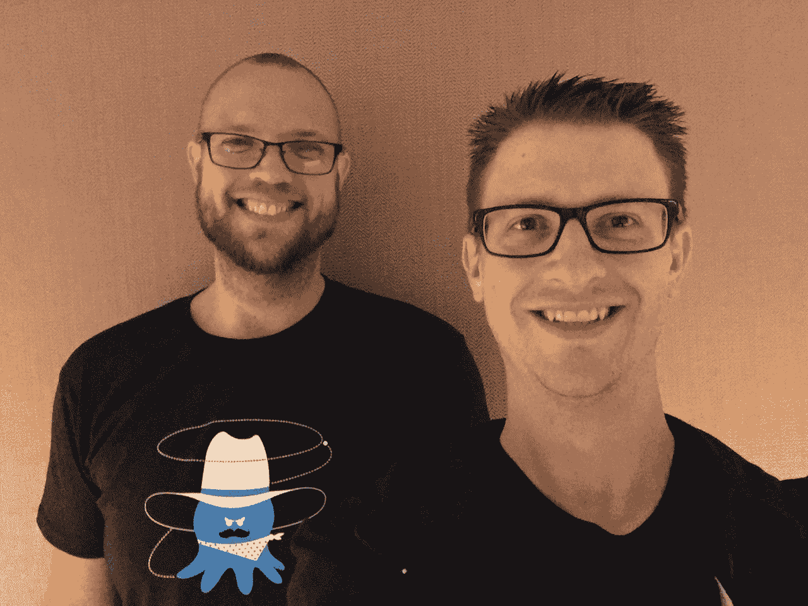
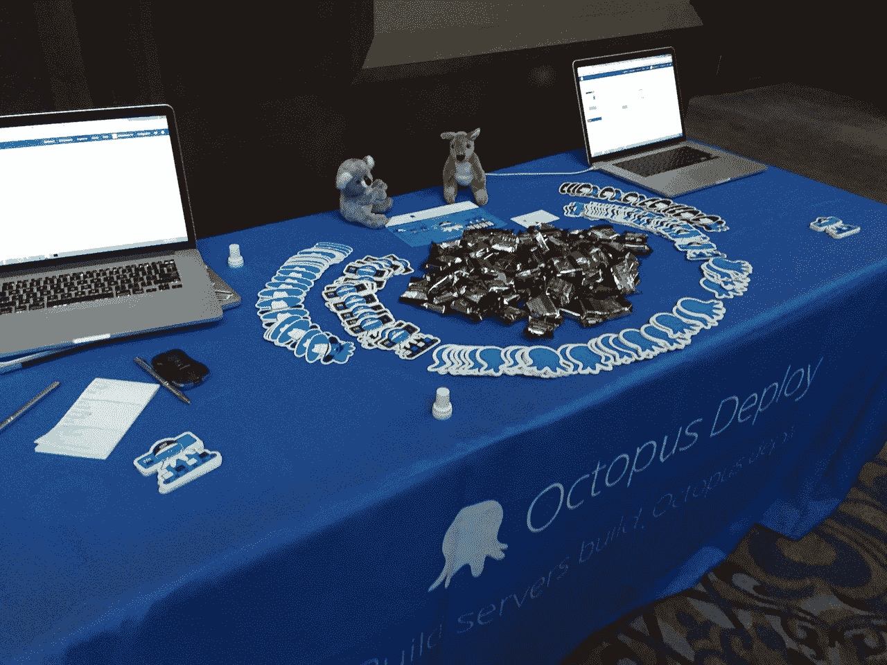

# 章鱼去开会！-章鱼部署

> 原文：<https://octopus.com/blog/octopus-goes-to-conferences>

Octopus 最近开始参加会议，我认为分享我们的经验会很有趣。这对团队中的每个人来说都是新的和令人兴奋的事情，但我们真的不知道会发生什么。 [Damo](https://twitter.com/damovisa) 一直在引领寻找大型活动的进程，并组织所有需要参加和展示的活动。早期，当我们收到 40 页的参展商包时，有点令人生畏，但 Damo 在上面！:)

## 为什么？

为什么我们开始在会议上展出？很棒的问题！主要原因是增加对章鱼的认识，所以更多的人尝试它。我们很幸运，章鱼很受欢迎，而且还在增长，但是仍然有很多人没有听说过我们，也没有尝试过。我们相信我们有一个伟大的产品，我们的统计数据显示，如果有人尝试八达通，他们通常会坚持下去。所以我们认为在会议上与人交谈是实现这一目标的好方法。我们还决定首先关注美国的会议，这样我们可以更多地了解事情是如何运作的。

另一个因素是，人们已经开始在大型活动中寻找章鱼摊位聊天或提问。一些团队成员参加了会议或在会议上发言，我们被问及是否有展位，以便他们稍后与我们交谈。我们热爱我们的客户，所以我们认为有一个人们可以亲自与我们互动的场所是很棒的。也就是说，我们鼓励每个有反馈和问题的人前往我们的[支持页面](https://octopus.com/support)进行联系。:)

总的来说，这有点像实验。我们不知道活动中的展览会涉及哪些内容。我们想尝试一些会议，了解他们是如何工作的。活动繁忙吗？人们有兴趣和我们交谈吗？他们会问什么样的问题？我们应该对他们说什么？

## 会议

带着我们的目标，我们参加了在内华达州拉斯维加斯举行的 Visual Studio Live ，开始了这一年的学习。然后，我们非常幸运能够参加微软在加州三藩市举行的 [Build](https://build.microsoft.com/) 2016 大会，这是一个激动人心的活动，充满了公告，非常繁忙。接下来是在佛罗里达州奥兰多举行的[devi intersection](https://devintersection.com/)，在得克萨斯州奥斯汀举行的 [Visual Studio Live](https://vslive.com) ，最后是在密苏里州堪萨斯城举行的[堪萨斯城开发者大会(KCDC)](http://kcdc.info) 。

本周，我们即将结束我们参加 [NDC 悉尼](http://ndcsydney.com)的首届会议，整个[章鱼团队](https://octopus.com/team)都将到场！这将是一个令人敬畏的事件，所以如果你在 NDC，请过来说“嗨”，并抓住一些对待！

[保罗](https://twitter.com/paulstovell)和[达莫](https://twitter.com/damovisa)领导前两项赛事，团队的混合人员参加其余赛事。我很幸运地参加了几次会议，这真是一次有趣的经历。同样需要注意的是，我们没有雇佣任何营销或活动管理人员。就像我之前说的，Damo 组织了这些活动，而展位上的工作人员是 Octopus 的开发者。

## 物流

那么参加一个会议需要做些什么呢？这是一系列的任务，从预订航班到组织营销材料(展位标牌、传单、贴纸等)和音频/视频设备。对我们来说，航班是规划过程中很重要的一部分，因为我们的总部在澳大利亚的布里斯班，而且我们离很多地方都很远。这暗示着*非常长的飞行*。

我们参加的大多数会议都有为期两天的赞助商展览，其中第一天是筹备日。我们也利用这第一天从长途飞行中恢复过来，并适应新的时区。我们很快了解到这些会议/展览都有一个模式。

*   第一天是忙碌的一天。如果有人有兴趣了解更多关于 Octopus 的知识，或者询问它与其他产品相比如何，似乎他们在第一天就这么做了。我记得和一大群人交谈，解释章鱼适合在哪里，回答一百万个问题。这是令人振奋的，有时也是压倒性的。
*   第二天没那么忙，但是对话通常更深入更长。我们有很多人问我们章鱼如何适应他们的特定环境，以及如何与他们的其他环境一起工作。这些对话非常有趣，因为我们有更多的时间来谈论细节。

我们做的一件有趣的事情是给会议带来一些澳大利亚的东西。每次会议，我们都会带 20 公斤(约 44 磅)的 Tim Tams，一种澳大利亚巧克力饼干。它们在澳大利亚非常普遍和受欢迎，但在海外并不普遍。我们经常听到与会者询问他们是否尝过章鱼小摊的澳洲饼干。:)

## 我在一个电话亭里！

在卡座是什么感觉？我觉得这很酷！与来自不同公司和美国不同地区，有时甚至是世界其他地方的开发人员交谈非常愉快。只需要一分钟打个招呼就能更好地了解一个人。他们来自哪里？他们为哪家公司工作？他们在开发什么样的应用？我们与开发者进行了许多真诚的交谈，他们对学习更多关于 Octopus 的知识以及为什么它有价值感兴趣。我们让现有客户和从未听说过我们的人交谈，我们收到了各种各样的问题。章鱼是什么？与其他产品相比如何？它适用于网站吗？它如何处理数据库更新？为什么它比直接从 Visual Studio 部署要好？

我们期望在会议上帮助开发者了解 Octopus，但是我们惊讶于我们对开发者的了解。与大量开发人员交谈的一个意想不到的好处是，我们更好地了解了人们正在构建的应用程序类型、他们喜欢的工具和平台以及他们遇到的问题。与和我们有类似问题的人交谈，帮助他们了解章鱼是如何帮助他们的，这感觉很棒。

也就是说，事情并非一帆风顺。整天站着和人说话可能会很累。有些人非常怀疑，有些对话很难，让人精疲力尽。值得庆幸的是，这些对话是例外，而不是常规。

## 俯仰

我们在会议上的工作是努力提高产品认知度，但我们并没有真正以销售和营销的方式去做。我们试图帮助人们了解章鱼是什么，理解它解决的问题以及它为什么有价值。在我们的展位上，我们没有走近人们并开始询问他们的部署需求等。只有当人们靠近我们时，我们才会和他们说话。所以我们尽量做到平易近人！我们没有坐在桌子后面躲起来；我们每天都站着微笑！

我们还带了一大堆 Tim Tams 和章鱼贴纸来吸引人们搭讪。:)

那么，如果有人走到我们面前问‘章鱼是什么？’我们该怎么办我们问了他们几个问题，以便更好地了解他们的环境和他们正在构建的应用程序类型。我们还询问了他们目前如何部署他们的应用程序。根据他们的情况，我们描述了章鱼是如何工作的，但更重要的是，我们试图帮助他们理解*为什么*它是有价值的。然后，我们向他们展示了一个笔记本电脑上的工作示例，以更好地说明事情是如何工作的。

另一个有趣的教训是，开发人员是一个非常多样化的群体，但我们发现有许多共同的类型。我认为最常见的群体是我称之为*的现代开发者*。他们主要构建 web 应用程序，并混合使用现代框架(ASP.NET MVC、Angular 等)、技术和工具。这个小组通常会问一些关于 Octopus 如何工作以及它如何与 web 应用程序/数据库和支持技术一起工作的问题。

另一个常见的开发者群体是我所谓的*高级开发者*。他们提到他们使用了最新的工具和技术，并且已经有了某种交付渠道。这个小组一般会问一些问题，涉及我们可以为他们现有的流程增加什么价值，Octopus 与他们已经使用的产品相比如何，或者如何与我们的 API 集成。

最后一个常见的开发者群体是我称之为*的老式*开发者。他们不一定使用源代码控制、构建服务器或当今最常见的现代实践。这是一个很大的惊喜，一般来说，他们还没有准备好看到像 Octopus Deploy 这样的产品。其中一些开发人员希望改善他们的环境，并有兴趣了解 Octopus 在整个开发过程中的位置。

# 包裹

Octopus 参加会议的经历很棒。我们学到了很多关于参与重大事件的知识，也学到了很多关于现代开发者如何构建应用的知识。

我们已经发现了会议“bug ”,所以请务必查看我们的[活动](https://octopus.com/company/events)页面，了解我们未来将参加的会议和活动的更多信息。