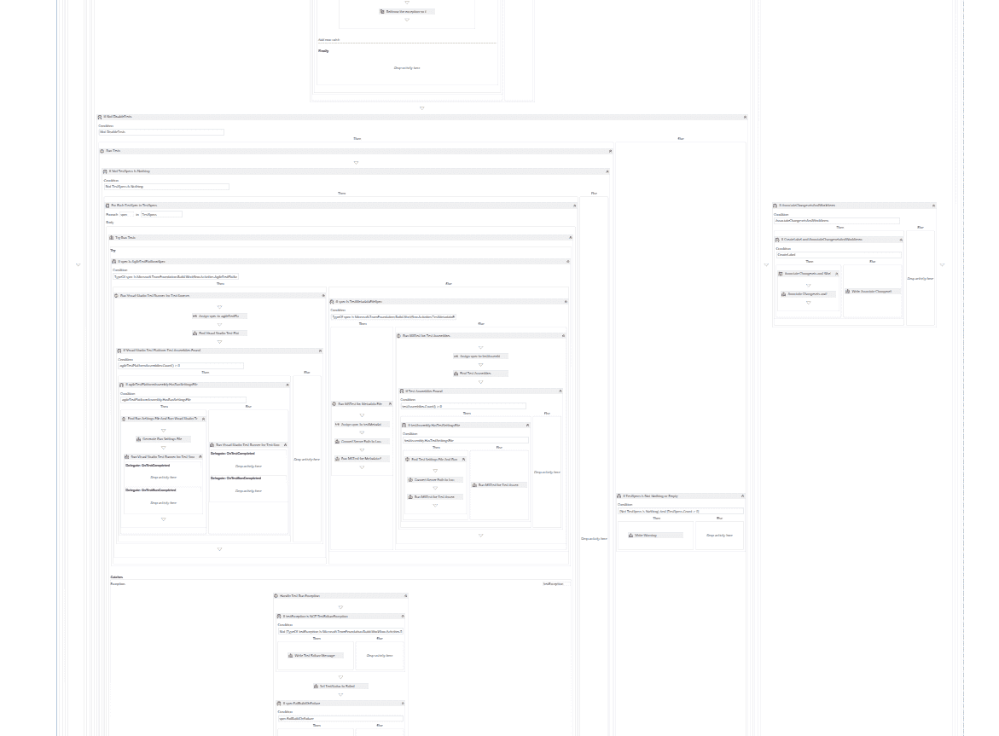

# Octopus 与 TFS 集成构建 vNext - Octopus 部署

> 原文：<https://octopus.com/blog/octopus-integration-with-tfs-build-vnext>

如果您是使用 Team Foundation Server 或 Visual Studio Online 的 Octopus Deploy 用户，您可能非常熟悉[octoppack](http://docs.octopusdeploy.com/display/OD/Using+OctoPack)。它是一个挂钩到您的 MSBuild 过程的工具，用来打包您的项目，以便与 Octopus 一起使用。

目前，TFS 一个项目的 CI 流程包括使用 OctoPack 打包并推送您的应用程序，然后在您推送至 Octopus 时自动创建新版本，最后是一个将该版本自动部署到环境中的生命周期。如果你想了解更多，我们的[培训视频页面](http://octopusdeploy.com/learn/videos)上有一个演示。

这个场景对于 90%的项目来说都非常有效，但是它模糊了过程中*构建*和*部署*阶段之间的界限。这些阶段应该是分开的。例如，如果您的构建成功了，但是有一半的集成测试失败了，您希望进行部署吗？

如果你足够专注，你可以[修改构建过程模板](https://msdn.microsoft.com/en-us/library/dd647551.aspx)来添加额外的步骤，但是没有人愿意这样做:

### 团队构建 vNext

令人欣慰的是，微软在替换 Team Build 方面投入了大量精力。如果你是 Visual Studio Online 用户，或者你玩过 TFS 2015 预发布版本，你可能会看到新的*版本。预览菜单中的*选项(它将很快被合并到现有的*构建*选项中)。

如果你想知道它是如何工作的， [Chris Patterson 在今年](https://channel9.msdn.com/Events/Build/2015/3-671)的//build/上做了一个很棒的演示，微软也在网上向[提供了一些信息。](http://vsalmdocs.azurewebsites.net/library/vs/alm/build/overview)

作为一个长期的 TFS 用户，我非常有信心你会想尽快转移到新的构建系统。

### 章鱼集成

Team Build 的新结构给了我们一个很好的机会来更好地与您的构建过程集成。为此，我们在 GitHub 中创建了一个新的公共 [OctoTFS 库。](https://github.com/OctopusDeploy/OctoTFS)

它目前包含两个选项，用于在 Octopus 中创建一个发布，作为构建定义中的一个独立步骤。它们都可以让您很好地分离构建和部署阶段。请注意，您仍然需要打包您的 Nuget 包并将其推送到 Octopus 服务器(或另一个 Nuget repo)——这些步骤只是创建发布。你仍然可以使用 [OctoPack](http://docs.octopusdeploy.com/display/OD/Using+OctoPack) 进行打包和推送。

我最兴奋的集成是[定制构建步骤](https://github.com/OctopusDeploy/OctoTFS/tree/master/source/CustomBuildSteps)。它给了你一个非常好的用户界面，甚至包括从变更集和工作项中提取的发布说明——这是我们经常被要求的。

不幸的是，因为您需要将这个包上传到 TFS/VSO，所以在新的构建系统到达 RTM 之前，它是不可用的。那应该不会太远。至少这样你就可以从 RTM 的第一天开始使用它，而不是等待！

*更新:可以使用`TFX-CLI`工具上传定制构建任务。说明可以在 GitHub 页面* 上找到

另一个选项是一个可以包含在项目中的 [PowerShell 脚本](https://github.com/OctopusDeploy/OctoTFS/tree/master/source/BuildPowershellScripts)。这个你现在就可以使用，它几乎也能工作*到*(还没有发布说明)。这不是很好的工作，但它现在的工作。

### 支持

我们将继续致力于这些集成，使它们对尽可能多的人有用且易于使用。尽管我们的首要任务总是放在核心产品上，所以我们会尽可能地改进和添加。

当然 [OctoTFS 库](https://github.com/OctopusDeploy/OctoTFS)是开源的，我们将接受拉请求，所以如果你看到一个 bug，一个潜在的改进，或者甚至是一个全新的集成选项，我们很乐意你的贡献！

### 其他 TFS 集成

我预计我们将在未来开始与 TFS 建立更多的集成。微软开始用 REST API(T1)、T2 服务挂钩(T3)、甚至 T4 扩展(T5)打开一些令人敬畏的机会。TFS 内部的八达通仪表板有人吗？