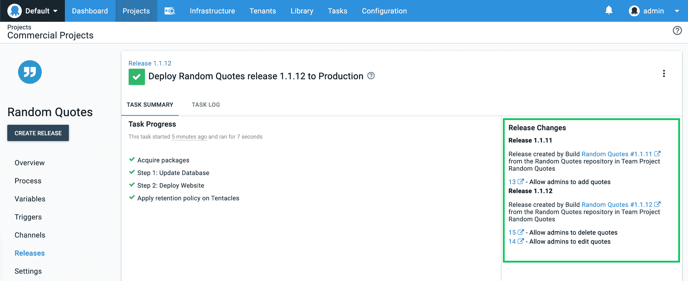

# Jenkins 的 Octopus 插件:无痛的 Jenkins 集成- Octopus 部署

> 原文：<https://octopus.com/blog/octopus-jenkins-plugin>

我们很高兴推出我们的官方 Octopus Deploy [Jenkins 插件](https://plugins.jenkins.io/octopusdeploy),使集成 Jenkins 版本和 Octopus 部署变得更加容易。章鱼有一个 Jenkins 社区插件已经很多年了，由 [Brian Adriance](https://github.com/badriance) 和其他贡献者维护，章鱼已经和 Brian 一起接管了这个插件，并提供我们团队的官方支持。我们感谢 Brian 和其他贡献者自 2015 年项目启动以来所做的努力。使它成为一个官方插件带来了显著的优势，因为我们可以保持插件最新，并增加新的功能。

这个版本使 Jenkins 插件与我们的 [TeamCity](https://plugins.jetbrains.com/plugin/9038-octopus-deploy-integration/) 、 [Azure DevOps](https://marketplace.visualstudio.com/items?itemName=octopusdeploy.octopus-deploy-build-release-tasks) 和 [Bamboo Server](https://marketplace.atlassian.com/apps/1217235/octopus-deploy-bamboo-add-on?hosting=server&tab=overview) 插件具有同等的特性。它带来了集成能力，包括我们的工作项和构建信息特性集。

[了解如何安装或更新扩展](/blog/octopus-jenkins-plugin#how-to-install-or-update-the-octopus-deploy-jenkins-plugin)

## 轻松集成您的 Jenkins 构建和 Octopus 部署

将你的 Jenkins 构建与 Octopus 部署集成在一起，现在不需要你自己编写脚本或者依赖社区支持的插件。我们的官方插件提供了与其他构建服务器插件相似的构建和后期构建操作。

此更新允许您配置理想的 CI/CD 管道:

詹金斯:

*   构建您的前端代码库(捆绑、林挺等)。).
*   构建任何微服务或 web 服务。
*   运行单元/集成测试。
*   运行静态分析。

**章鱼展开**:

*   打包您的构建输出(即，压缩它)。
*   将您的压缩包推送到 Octopus 或另一个工件库。
*   将构建信息推送到 Octopus，以提供到代码、构建以及与构建相关的任何工作项的链接。
*   创建发布以快照您的部署过程和依赖关系。
*   将版本部署到您的环境中，如开发、测试和生产环境。

注意:这个版本的插件不支持 Jenkins 管道，但是它在我们的关注范围内。

[了解更多信息](https://octopus.com/docs/packaging-applications/build-servers/jenkins)

## 更好的可视性:了解生产中的新情况

【T2 

Octopus 部署补充了 Jenkins 构建，使您能够更好地了解和洞察您的 CI/CD 渠道。作为构建过程的一部分，将构建信息推送到 Octopus 使 Octopus 能够显示您的提交、构建细节以及与特定构建相关的任何工作项目(例如 GitHub 或吉拉问题)。这一功能可以查看哪些特性、错误修复和增强对一个版本有贡献，Octopus 还可以确定自上次部署以来哪些工作项发生了变化。这意味着您可以清楚地看到生产或任何其他环境中的**新功能**。

这个特性集让团队在将版本部署到生产环境时，对所包含的变更有了信心和可见性。

[了解更多信息](https://octopus.com/docs/deployment-process/releases/deployment-notes)

## 更好的沟通:自动生成和共享发布注释

我们的构建信息和工作项集成的另一个好处是释放团队的能力，以改善他们与其他团队、经理或客户的沟通。利用发布细节，包括相关问题，Octopus 使团队能够生成定制的发布说明，并根据他们的需要共享它们。这可能是给运营团队的一条松散消息，让他们随时了解最新情况，也可能是给客户的一封电子邮件，让他们分享包括新版本在内的最新功能。

此功能消除了发行说明的手动收集和共享。

[了解更多信息](https://octopus.com/docs/deployment-process/releases/release-notes)

## 如何安装或更新八达通部署詹金斯插件

Octopus Deploy [Jenkins 插件](https://plugins.jenkins.io/octopusdeploy)是 [Jenkins 插件库](https://plugins.jenkins.io/)中现有 Jenkins 插件的新版本。这意味着你可以像安装任何其他 Jenkins 插件一样[安装或升级它](https://jenkins.io/doc/book/managing/plugins/)。

阅读我们的[Jenkins Build Server integration](https://octopus.com/docs/packaging-applications/build-servers/jenkins)了解更多信息。

## 摘要

[Jenkins](https://jenkins.io) 和 [Octopus Deploy](https://octopus.com) 能够更好地协同工作，为您的 CI/CD 渠道提供更好的端到端可见性。

欢迎给我们留下评论，让我们知道你的想法！愉快的部署！