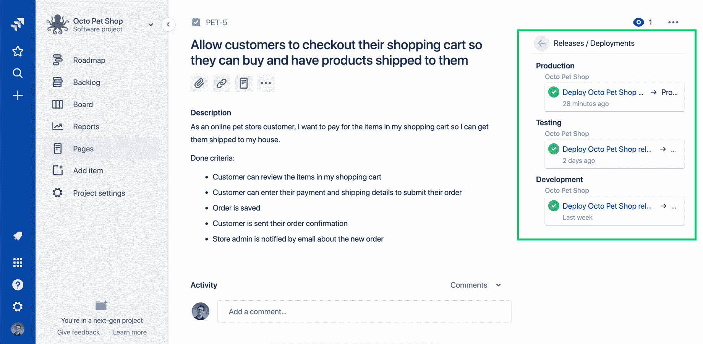
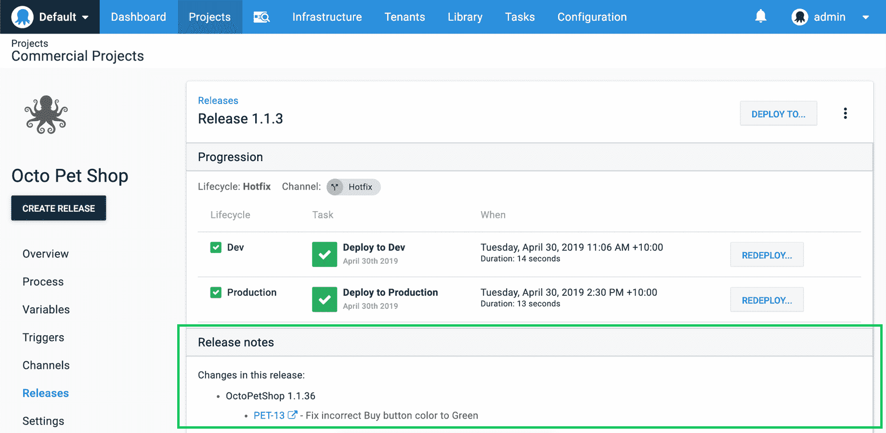
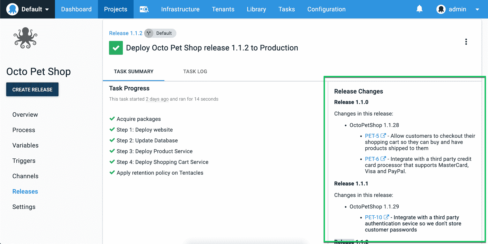

# 面向吉拉的 Octopus 插件-为您的软件管道提供更好的可视性- Octopus Deploy

> 原文：<https://octopus.com/blog/octopus-jira-integration>

[https://www.youtube.com/embed/7wWLM0rzVQ4](https://www.youtube.com/embed/7wWLM0rzVQ4)

VIDEO

Octopus 很自豪地为吉拉发布了我们的 [Octopus Deploy 插件，它解锁了一些非常有用的场景。](https://marketplace.atlassian.com/apps/1220376/octopus-deploy-for-jira)

构建优秀的软件通常需要使用多种工具和服务，但是找到合适的工具和服务并让它们相互交流是一件令人头疼的事情。Atlassian 的[吉拉软件](https://atlassian.com/jira)是一个流行的应用程序，帮助团队规划、跟踪和管理软件发布，而 Octopus Deploy 帮助团队以快速、可重复和可靠的方式自动化他们的开发和操作过程。总之，它们使团队能够更好地端到端地了解他们从想法到产品的软件管道。

整合八达通和吉拉软件解锁三个关键场景:

了解如何 **[连接 Octopus Deploy 和吉拉软件](/blog/octopus-jira-integration#connect-octopus-deploy-and-jira-software)** 并开始使用。

注意:Octopus Deploy 插件仅与吉拉软件云兼容，因为吉拉服务器(本地)不支持启用此功能所需的 API。

## 查看功能或错误修复何时部署到生产

> 完成意味着部署到生产中

如果你曾经和开发团队一起工作过，你可能会听到有人说一个新特性已经完成了 98%,然后需要几个星期才能完成并部署到生产中。这种常见的情况导致团队说“完成”意味着部署到生产中。

我们为吉拉软件开发的 Octopus 插件可以让我们看到一个改进或错误修复是否已经完成并部署到产品中，或者它是否仍在进行中。这一新的信息可以直接在你的吉拉问题，你可以点击通过八达通了解更多的细节。这使得您的团队和公司能够更好地了解他们最熟悉的工具。

## 请参阅八达通发行版中的吉拉问题

软件通常在生产过程中通过 CI/CD 管道运行。开发者将代码推送到 GitHub 这样的源代码库，搭建 Bamboo、TeamCity 这样的服务器，搭建好，Octopus 部署好。传统上，这些步骤之间的联系可能会丢失。

使用我们的吉拉插件和一个构建服务器插件([见下面的链接](/blog/octopus-jira-integration#getting-started))，现在可以直接在 Octopus 中看到你的吉拉问题和构建细节。这允许团队看到吉拉问题，并构建有助于发布的细节，提供从问题到部署的端到端可追溯性。你可以点击吉拉软件了解更多信息。它还可以帮助找到将 bug 引入到版本中的变更。

## 自动生成和共享发行说明

【T2 

使用多种工具会使跟踪应用程序版本及其包含的特性变得困难。很难找到哪些特性、错误修复和增强对发布和部署有所贡献。项目经理通常会编写发布说明来使其更容易理解，但这通常是一个手动过程。整合八达通和吉拉软件，使这一进程完全自动化。Octopus 知道哪些问题已经部署到环境中，因此它可以快速生成发布说明，显示测试或生产环境中的新内容。

在 Octopus 中阅读发布说明是有用的，但是通过电子邮件、slack 或其他媒介分享更好。使用我们的[电子邮件通知步骤](https://octopus.com/docs/deployment-process/steps/email-notifications)或社区贡献的步骤模板，如 [slack](https://library.octopus.com/step-templates/99e6f203-3061-4018-9e34-4a3a9c3c3179/actiontemplate-slack-send-simple-notification) 或 [Microsoft teams](https://library.octopus.com/step-templates/110a8b1e-4da4-498a-9209-ef8929c31168/actiontemplate-microsoft-teams-post-a-message) ，您可以在每次成功部署到产品后向您的团队、经理或高管发送发布说明。这使得让每个人都参与进来变得快速而容易。

## 连接八达通部署和吉拉软件

如果你的团队已经在使用吉拉软件和 Octopus Deploy，我强烈推荐下载我们的插件并试用。阅读我们的[文档](https://octopus.com/docs/managing-releases/issue-tracking/jira)了解如何连接两个应用程序并开始使用。

[吉拉的 Octopus 部署插件](https://marketplace.atlassian.com/apps/1220376/octopus-deploy-for-jira)

我还建议安装一个我们的构建服务器插件，这样你就可以充分利用上面的特性。

如果你的团队正在使用吉拉软件或八达通部署，你可以尝试免费的其他服务，看看它如何为你工作。

## 总结

总之，[吉拉软件](https://atlassian.com/jira)和 [Octopus Deploy](https://octopus.com) 携手合作，让您更好地了解从创意到生产的软件管道。

愉快的部署！