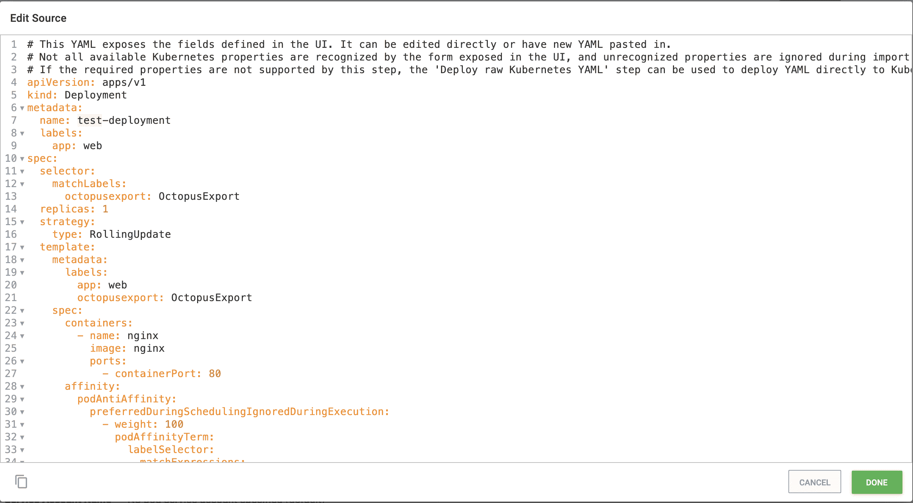
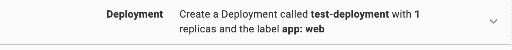
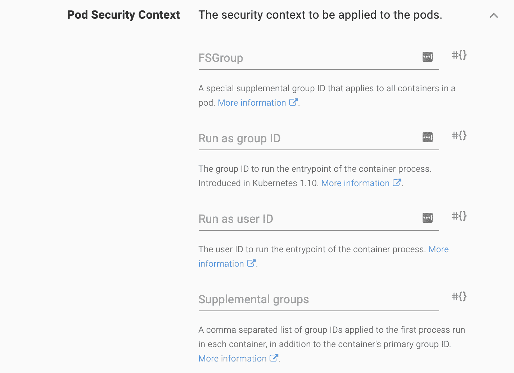
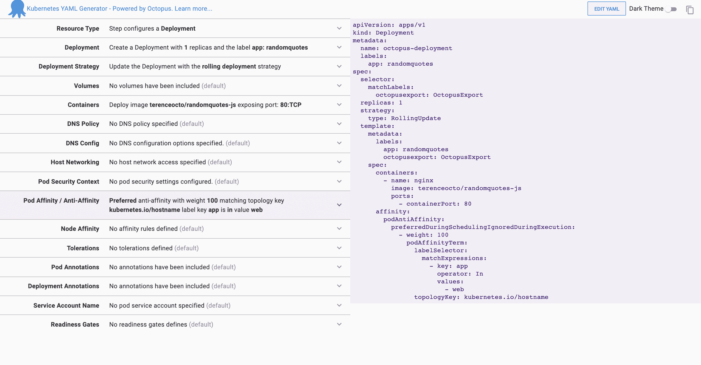
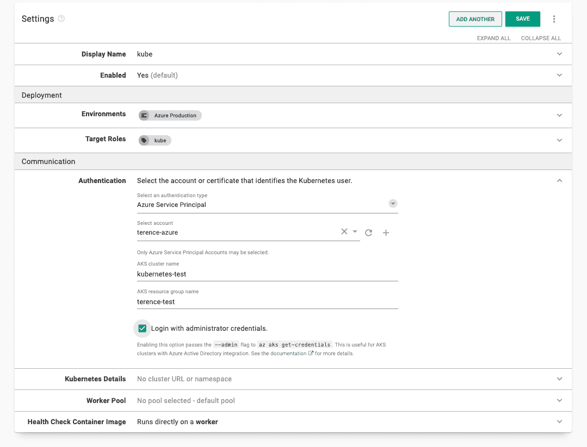
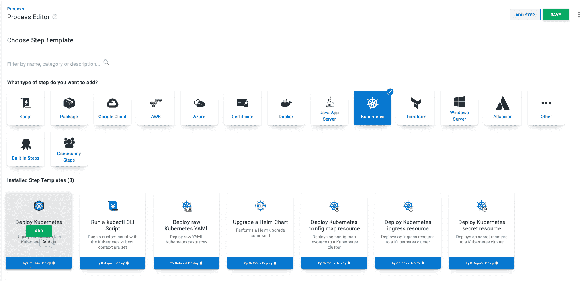
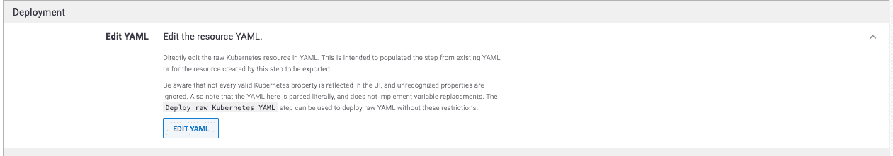
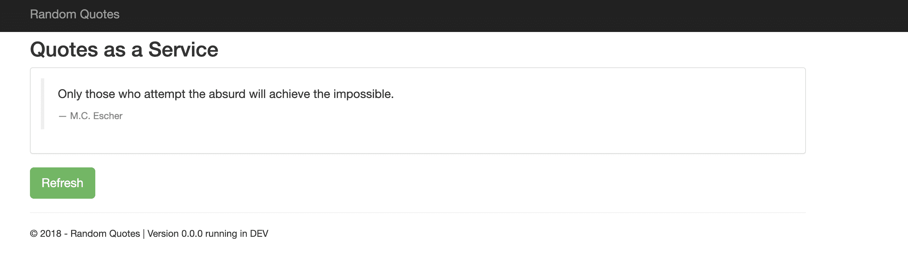

# 章鱼部署的库伯内特 YAML 发电机-章鱼部署

> 原文：<https://octopus.com/blog/octopus-kubernetes-yaml-generator>

Kubernetes (K8s)是一个强大的容器编排工具。

Kubernetes 读取定义您要部署到的资源的 YAML 文件。当然，不是每个人都喜欢写 YAML。为了使这更容易，我们发布了一个工具，帮助开发人员为 Kubernetes 集群部署构建 YAML 文件。

你可以在 https://k8syaml.com/找到这个工具。

## 我们的 K8s YAML 发电机概述

YAML 文件是一个人类可读的配置文件，它告诉 Kubernetes 如何提供和部署服务。

我们工具的左侧包含 YAML 文件的各种选项。每个选项都有一个填充的下拉菜单。

右边包含 Kubernetes 将使用的 YAML 文件。

K8s YAML 工具内置的两个功能是实时更新和双向同步。

### 实时更新

更改工具左侧的字段时，右侧的 YAML 文件会更新以进行匹配。将左侧的资源类型从 **Deployment** 更改为 **StatefulSet** 将会更改 YAML 文件以匹配新选项。实时更新可以为 YAML 文件添加以前没有的新选项。

[](#) 

部署资源类型

[](#) 

有状态设置资源类型

### 双向同步

您可以通过选择**编辑 YAML** 按钮在工具中编辑 YAML。

在编辑窗格中，您可以编辑任何字段。

下面，我将部署的名称编辑为`test-deployment`，并点击**完成**。

[](#)

双向同步会更新工具的左侧以匹配编辑内容。

[](#)

### 更多信息

Kubernetes YAML 文件中有几个可配置的选项。该工具链接到 Kubernetes 的官方文档，而不是详细解释它们。大多数选项都有一个**更多信息**链接，直接将您带到文档。

[](#)

## 用例

为了展示 YAML 文件的作用，我用它将一个 web 应用程序部署到一个带有 Octopus Deploy 的 Azure Kubernetes 服务中。请随意跟随。

通过填充左侧，根据图像填写字段。

**部署**——将 app 的值改为`randomquotes`

**容器**——删除 nginx 默认容器，并添加一个新容器，包含:

*   **名称** : `randomquotes`
*   **包装图片** : `terenceocto/randomquotes-js`
*   **添加端口** : `TCP:80`

点击**确定**确认。

右边的文本是我们用来部署到 Azure 的 YAML 文件。复制此文件以备后用。

[](#)

## 配置 Azure 帐户

您需要配置一个 Azure 帐户和 web 应用程序作为 Octopus 部署的目标。其他目标也是可能的，比如 AWS、Windows 或 Linux 服务器。

接下来，你需要在 Azure 中创建一个账户，导航到 [Azure 门户](https://portal.azure.com/)。

### 使用 Azure 门户创建 Azure 服务主体

[https://www.youtube.com/embed/QDwDi17Dkfs](https://www.youtube.com/embed/QDwDi17Dkfs)

VIDEO

1.  在 Azure 门户中，打开菜单，导航到 **Azure Active Directory** ，然后是**属性**。
2.  从**租户 ID** 字段中复制值。这是你的**租户 ID** 。
3.  接下来，您需要您的**应用程序 ID** :
    *   如果您创建了一个 AAD 注册的应用程序，导航到 **Azure Active Directory** 、**应用程序注册**，点击**查看所有应用程序**，选择应用程序并复制**应用程序 ID** 。请注意，Azure UI 默认为**自有应用**标签。点击**所有应用**选项卡查看所有应用注册。
    *   如果您尚未创建已注册的应用程序，请导航至 **Azure Active Directory** 、**应用程序注册**，点击**新注册**并为您的应用程序添加详细信息，然后点击**保存**。记下**应用 ID** 。
4.  通过导航到**证书&机密**，然后导航到**新客户端机密**，生成一次性密码。添加新密码，输入描述，点击**保存**。记下显示的应用程序密码，以便在 Octopus 中使用。如果您不想接受默认的密码一年到期，您可以更改到期日期。

您现在拥有以下内容:

*   **租户 ID**
*   **应用 ID**
*   **应用程序密码/秘密**

接下来，您需要配置您的资源权限。

### 资源权限

资源权限确保您注册的应用程序有权使用您的 Azure 资源。

1.  在 Azure 门户中，导航到**资源组**并选择您希望注册的应用程序访问的资源组。如果一个资源组不存在，通过转到**主页**，然后**资源组**并选择**创建**来创建一个。创建之后，记下资源组的 Azure 订阅 ID。
2.  点击**访问控制(IAM)** 选项。在**角色分配**下，如果你的应用没有列出，点击**添加角色分配**。选择适当的角色(**贡献者**是一个常见选项)，并搜索您的新应用名称。从搜索结果中选择它，然后点击**保存**。

下一步是设置 Azure web 应用程序并配置其属性。

### Web 应用程序设置

1.  在您的**资源组**中点击**创建**，然后 **Kubernetes 服务**
2.  为群集命名并选择适当的区域
3.  点击**审核+创建**
4.  集群名称将是 Octopus Deploy 中的 AKS 集群名称——记下资源组名称

### 在八达通上加入服务主账户

使用以下值，您可以将您的帐户添加到 Octopus:

*   应用程序 ID
*   租户 ID
*   应用程序密码/密钥

1.  导航到**基础设施**，然后选择**账户**
2.  选择**添加账户**，然后点击 **Azure 订阅**
3.  在 Octopus 中给帐户起一个你想要的名字
4.  给账户一个描述
5.  添加您的 Azure 订阅 ID -在 Azure 门户的**订阅**下找到
6.  添加**应用 ID** 、**租户 ID** 和**应用密码/关键字**

点击**保存并测试**确认账户可以与 Azure 交互。Octopus 将尝试使用帐户凭据来访问 Azure 资源管理(ARM) API，并列出该订阅中的资源组。

您可能需要将您针对的 Azure 数据中心的 IP 地址列入安全列表。更多细节请参见[通过防火墙部署到 Azure](https://octopus.com/docs/deployments/azure/deploying-to-azure-via-a-firewall)。

新创建的服务主体可能需要几分钟才能通过凭据测试。如果您已经仔细检查了您的凭据值，请等待 15 分钟，然后重试。

接下来，设置 Octopus Deploy 来加载 YAML 文件，以设置 Kubernetes 集群。

## 八达通部署设置

在 Octopus Deploy 实例中创建一个带有生产环境的项目。

为此，转到**基础设施**，然后是**环境**，然后是**添加环境**以添加生产环境。然后，进入**项目**、**添加项目**添加项目。

转到**库**，然后**外部源**并设置 docker 注册表。因为我们使用的是公共存储库，所以您可以将**凭证**留空。

[T39](#)

通过转到**基础设施部署目标**设置 Kubernetes 目标，然后**添加部署目标**，然后 **Kubernetes 集群**。

填写步骤:

*   **环境** -你在 Octopus 中设置的环境
*   **目标角色** - `kube`
*   **认证** - `Azure Service Principal`
    *   **选择账户** -你在八达通上设置的 Azure 账户
    *   **AKS 集群名称** -您的 Kubernetes 集群的名称
    *   **AKS 资源组名称** -您的 Azure 资源组的名称
    *   **使用管理员凭证登录** -选中此框

将其他一切保持默认，点击**保存**完成。

[](#)

在您的新项目中，创建一个**部署 Kubernetes** 容器步骤，方法是转到**流程**，然后**添加步骤**，然后 **Kubernetes** ，然后选择**部署 Kubernetes 容器**。

[](#)

确保在代表选项的**下添加`kube`角色，以触发 Kubernetes 部署目标的构建。将 K8s YAML 工具中的 YAML 文件粘贴到**编辑 YAML** 部分。将所有其他内容保留为默认，点击**保存**完成。**

[](#)

点击**创建发布**，然后点击部署步骤部署发布。等待成功消息。

部署成功后，通过将群集暴露于互联网来访问 web 应用程序。转到 Azure 门户并打开 PowerShell Azure CLI。

[T32](#)

```
az aks get-credentials --resource-group myResourceGroup --name myAKSCluster 
```

此命令会将 CLI 指向您的群集:

```
kubectl get deployments 
```

运行此命令将获得集群上的部署列表。您应该会看到部署`octopus-deployment`。使用此名称公开 web 应用程序:

```
kubectl expose deployment octopus-deployment --type=LoadBalancer --name=my-service 
```

此命令创建一个名为“my-service”的服务，该服务生成一个公共 IP 来查看 web 应用程序:

```
kubectl get services 
```

运行此命令，您将在 External-IP 下看到“pending”。等一分钟，再次运行，您应该在该字段中看到一个公共 IP。在浏览器中转到 IP 地址以查看您的 web 应用程序。

[](#)

## 结论

在本帖中，您了解了具有实时更新和双向同步功能的新 Kubernetes YAML 工具。您可以使用该工具生成与 Kubernetes 兼容的 YAML 文件。

您还使用 Octopus Deploy 和 Azure Kubernetes 服务运行了一个简单的用例。您使用 K8s YAML 生成的 YAML 文件部署了一个 web 应用程序。

愉快的部署！