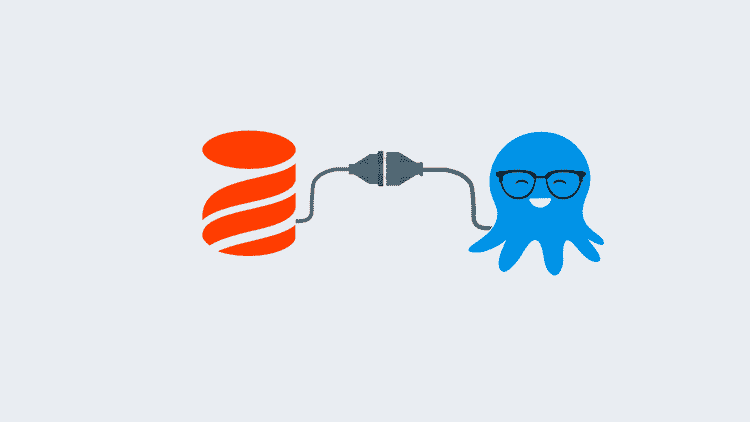
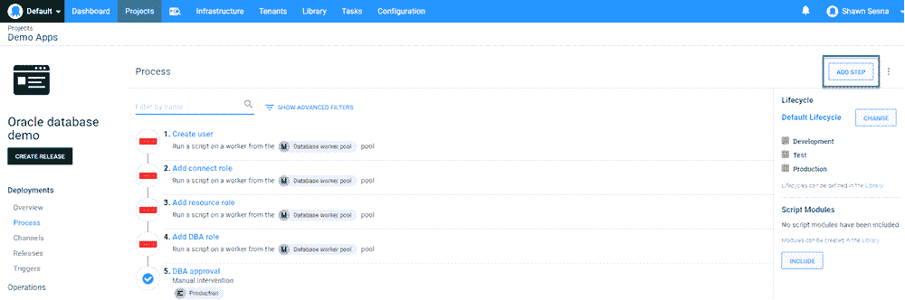
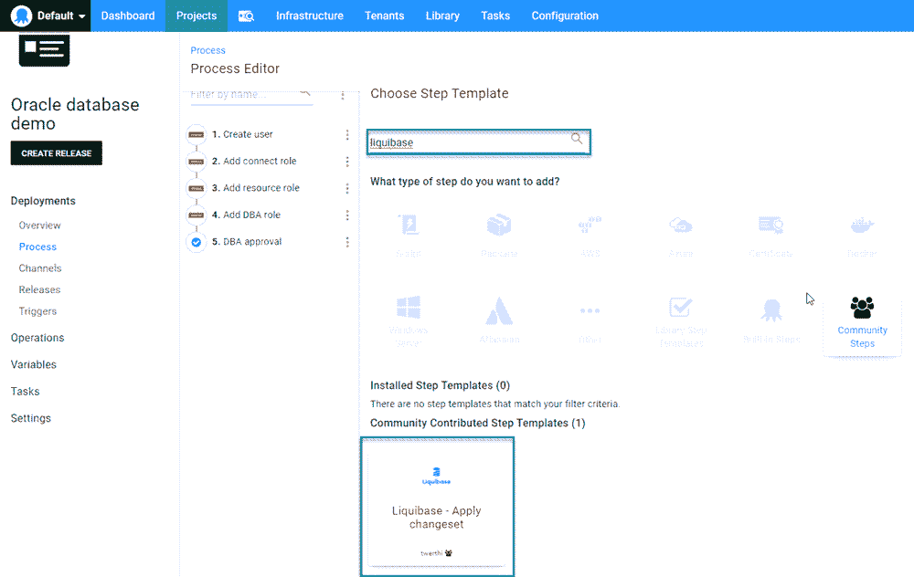
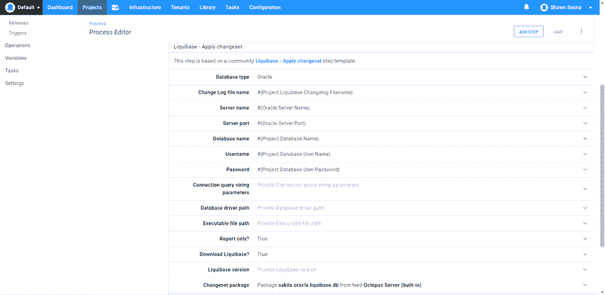
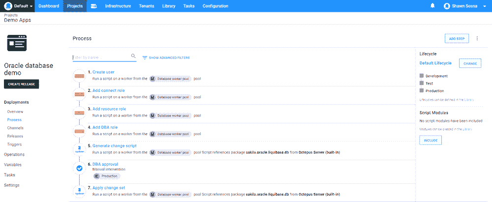
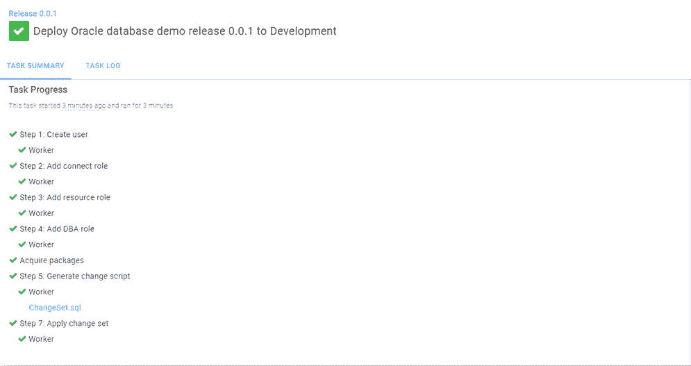
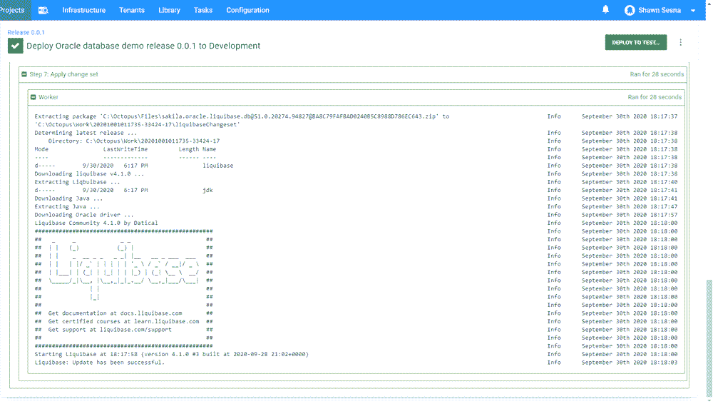
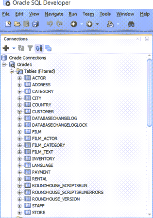

# 使用 Octopus Deploy 和 Liquibase - Octopus Deploy 部署到 Oracle

> 原文：<https://octopus.com/blog/octopus-oracle-liquibase>

数据库部署通常是部署中最困难的部分。在本文中，我将向您展示如何使用 Octopus Deploy 通过 Liquibase 部署 Oracle 数据库。

## 液态碱

[Liquibase](https://www.liquibase.org/) 是一个基于迁移的数据库部署工具，类似于 [Flyway](https://flywaydb.org/) 、 [DbUp](https://dbup.readthedocs.io/en/latest/) 和 [RoundhousE](https://github.com/chucknorris/roundhouse) 。Liquibase 的独特之处在于您如何定义迁移。

Flyway、DbUp 和 RoundhousE 依赖于用户自己编写 SQL 脚本，而 Liquibase 允许用户用 XML、JSON、YAML 以及所谓的`changelog`中的 SQL 来定义迁移。Liquibase 会在部署过程中将 changelog 转换为 SQL 语句。

### 示例项目:Sakila

Sakila 是一个最初为 MySQL 开发的示例数据库。这个项目包含许多不同的数据库对象，包括表、视图、存储过程和函数。这使它成为一个全面的例子。

为了支持其他数据库技术，我在我们的 [Samples BitBucket 实例](https://bitbucket.org/octopussamples/sakila/src/master/)中创建了一个 repo，它包含了许多不同数据库技术和方法的 Sakila 项目。

### 变更日志

Octopus Deploy 中 Liquibase 的[步骤模板以两种方式之一工作:](https://library.octopus.com/step-templates/6a276a58-d082-425f-a77a-ff7b3979ce2e/actiontemplate-liquibase-apply-changeset)

*   包装中包含 Liquibase。
*   只有变更日志文件。

在这篇文章中，我们打包了 changelog 文件:

dbchangelog.xml

章鱼部署

## 使用 Octopus Deploy，您可以包含 Liquibase 步骤模板来自动部署到 Oracle。这篇文章假设你已经熟悉了在 Octopus Deploy 中创建项目的[,并且将涵盖 Liquibase 特有的步骤。](https://octopus.com/docs/projects#add-a-project)

Liquibase 步骤模板

### 要添加 Liquibase 模板，请在 Octopus 项目的**流程**选项卡中单击**添加步骤**按钮:

【T2 

然后按`liquibase`过滤。该模板将出现在**社区贡献的步骤模板**部分。点击**安装并添加**(或者**添加**如果已经安装):

Liquibase 模板是专门为支持在能够下载运行所需的一切(包括 Java)的工作人员上运行而设计的。添加模板后，填写模板的字段。

数据库类型

#### 选择要部署到的数据库类型。当前支持的类型有:

MariaDB

*   MongoDB
*   关系型数据库
*   神谕
*   一种数据库系统
*   SqlServer
*   Liquibase 本身支持[更多类型](https://www.liquibase.org/get-started/databases)，但是它们还没有包含在模板中。

变更日志文件名

#### 这是 changelog 文件的名称和/或在包中的相对位置。例如:

dbchangelog.xml

*   /子文件夹/mychangelog。JSON
*   服务器名称

#### 要部署到的服务器的名称、DNS 或 IP 地址。

服务器端口

#### 数据库服务器监听的端口号。

数据库名称

#### 要部署到的数据库的名称。

用户名

#### 有权访问数据库的帐户的用户名。

密码

#### 有权访问数据库的帐户的密码。

连接查询字符串参数

#### 为连接字符串指定任何附加的查询字符串参数。比如:`?useUnicode=true`。

数据库驱动程序路径

#### 包中用于连接数据库服务器的数据库驱动程序 jar 文件的路径。勾选**下载 Liquibase** 选项时不使用。

可执行文件路径

#### 包中 Liquibase 可执行文件的路径。勾选**下载 Liquibase** 选项时不使用。

仅报告？

#### 当您只想查看将用于部署的 SQL 时，使用此复选框。

步骤模板将自动附加。sql 文件作为部署的工件。当您需要有人在部署前检查更改时，这很有用。

下载 Liquibase？

#### 如果您的部署包中不包含 Liquibase，请使用此选项。

该选项将下载社区版本的 Liquibase、Java 和数据库类型。执行部署所需的 jar 文件。这篇文章使用了这个选项。

Liquibase 版本

#### 该选项仅用于**下载 Liquibase** 选项。

这指定了要下载的 Liquibase 的版本。留空以使用最新版本。

变更集包

#### 这是用于部署的包选择器。

完成后，它应该看起来像这样:

部署流程

### 在这篇文章中，我添加了一些其他步骤来模拟真实世界的部署:

**创建用户**:如果数据库用户不存在，则创建该用户。

*   **添加连接角色**:为上述用户添加连接角色。
*   **添加资源角色**:为上述用户添加资源角色。
*   **添加 DBA 角色**:为上述用户添加 DBA 角色。
*   **生成更改脚本**:仅检查报告的 Liquibase 步骤，以生成将要运行的内容。
*   **DBA 批准**:仅在生产中请求 DBA 批准。
*   **应用变更集**:应用变更的 Liquibase 步骤。
*   

部署

### 执行时，部署结果将如下所示:

正如您所看到的，Report Only 步骤将`ChangeSet.sql`文件作为工件附加，可以在批准之前进行审查。展开`Apply changeset`步骤显示:

神谕

### 如果我们登录 Oracle，我们可以看到我们的数据库更新已被应用:

结论

## Octopus Deploy 支持部署到许多数据库技术(Microsoft SQL Server、MariaDB、MySQL、Oracle、PostgreSQL 等。)以及许多不同的部署方法(DACPAC、DbUp、Flyway、Liquibase、RoundhousE 等。).我希望这篇文章能帮助您理解如何使用 Octopus 通过 Liquibase 部署到 Oracle 数据库。

愉快的部署！

愉快的部署！