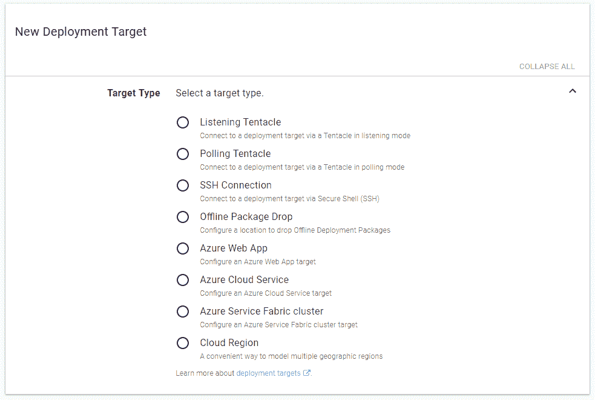
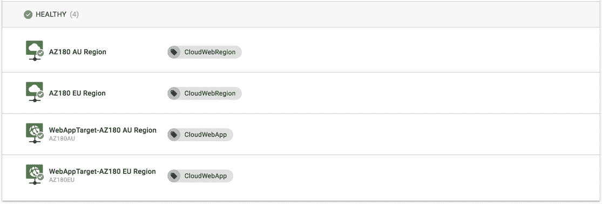
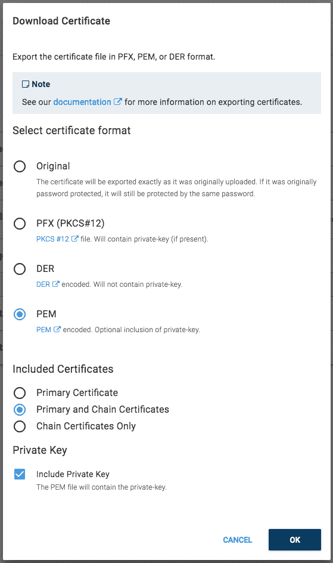

# 八达通可能发布 2018.5 -八达通部署

> 原文：<https://octopus.com/blog/octopus-release-2018.5>

[](#)

这个月，我们发布了下一代 Azure support。Octopus `2018.5`捆绑了最新的 Azure SDK 和 Powershell 模块，为 Azure Web 应用程序、云服务和服务结构集群引入了新的部署目标，并添加了使用 PowerShell Cmdlets 在 Octopus 中动态管理它们的能力。

## 在这篇文章中

## 发布之旅

[https://www.youtube.com/embed/raepkFD7kx8](https://www.youtube.com/embed/raepkFD7kx8)

VIDEO

## Azure 的 PaaS 目标

[](#)

该版本重新引入了被建模为部署目标的 **Azure Web 应用**和 **Azure 云服务**，并将 **Azure 服务架构集群**引入部署目标家族。这提高了您的基础架构和环境的可见性，使您能够轻松部署到多个目标/区域，并开启新的侧重运营的任务，如服务运行状况检查等。

[](#)

有关 PaaS 目标的更多信息，请阅读介绍这些想法的[博客文章](https://octopus.com/blog/paas-targets)。

## 管理八达通基础设施

我们最初实现 Azure Web App 目标的一个问题是没有简单的方法来根据需要动态创建它们。你可以很容易地创建 Azure Web 应用程序，但是 Octopus 需要手动步骤来用 Octopus 表示它们。

现在，使用我们新的内置 PowerShell Cmdlets，您可以像创建 Azure 资源一样轻松地创建这些新的 PaaS 目标。

这些 cmdlets 的初始版本将允许您创建 **Azure 帐户**和所有新的 Azure 部署目标。例如:

```
# Octopus variables
$serviceName = "MyNewServiceName"
$accountName = "Developer Playground"
$roleNames = "web"

# Create new target in Octopus
New-OctopusAzureWebAppTarget -Name $serviceName -AzureWebApp $serviceName -AzureResourceGroupName $serviceName -OctopusAccountIdOrName $accountName -OctopusRoles $roleNames 
```

有关更多信息，请参见我们的 PaaS targets [博客文章](https://octopus.com/blog/paas-targets)和我们的动态基础设施[文档](https://octopus.com/docs/infrastructure/dynamic-infrastructure)。

## Azure 账户作为变量

现在，您可以将 Azure 帐户设置为变量，包括项目变量、租户变量和库变量集。

这将使您能够跨每个环境或租户确定不同客户的范围。你仍然可以在 Azure PowerShell 步骤上直接选择一个帐户，就像你一直做的那样，但现在你也可以将它绑定到 Azure Account 变量。

Azure 帐户的属性(客户端 Id、订阅 Id、租户 Id 等。)也可以在您的脚本中使用。只需打开`OctopusPrintVariables`选项到[查看所有可用的变量](https://octopus.com/docs/support/debug-problems-with-octopus-variables#DebugproblemswithOctopusvariables-Writethevariablestothedeploymentlog)。

## 改进了对 PEM 证书链的支持

以前，证书链(即一个主要证书加上一个或多个中间或权威证书)只能以 PFX 格式上传，而 PFX 是唯一包含证书链的出口格式。

截至 2018.5 版:

*   可以上传包含证书链的 PEM 文件。
*   增加了一个新的扩展的[证书变量](https://octopus.com/docs/deployment-process/variables/certificate-variables#expanded-properties):`MyCertificate.ChainPem`(假设证书变量名为`MyCertificate`)，允许访问 PEM 格式的链证书
*   当[导出包含链的证书](https://octopus.com/docs/deployments/certificates/export-certificate)时，可以选择包含各种证书组件(见下图)

[](#)

## 许可变更

Octopus 2018.5 将有一些重要的许可更改:

*   您现有的 Azure **步骤**将不会计入您的许可限制，就像以前一样。这里什么都没变。
*   就像 Octopus 中的其他目标一样，Azure 目标将开始增加你的许可限制。
    *   任何现有的“旧”Azure 目标都将升级到新的格式，并将开始计入您的许可限制。
*   **离线掉落**目标将会像 Octopus 中的其他目标一样开始影响你的许可限制。

如果您大量使用“旧的”Azure 目标或离线 Drop 目标，请花时间确保您的 Octopus 服务器在升级后仍然符合您的许可证。八达通将在升级过程中为您检查这一点。如果你遇到麻烦，请联系我们的[支持团队](https://octopus.com/support)寻求帮助！

## 重大变化

如前所述，我们已经升级了 Azure SDK 库和 Azure PowerShell 模块，以支持最新的 Azure 功能。最值得注意的是缺少对嵌套 ARM 模板的支持，现在可以开箱即用了。

这些升级也迫使 Octopus 服务器的最低支持环境转向微软。NET 4.5.2 和 **PowerShell 5.0** ，所以你需要相应地计划你的升级。 **PowerShell 5.0** 的要求只有在你运行 Azure PowerShell 脚本的情况下才有。

Azure [最近宣布](https://blogs.msdn.microsoft.com/appserviceteam/2018/03/12/deprecating-service-management-apis-support-for-azure-app-services/)从 2018 年 6 月 30 日起，他们将停止对服务管理 API 的支持(注:管理证书使用服务管理 API)。这会影响 Azure 应用服务的部署。

**请转而使用八达通 Azure 账户的服务原则**:[https://g.octopushq.com/AzureServicePrincipalAccount](https://g.octopushq.com/AzureServicePrincipalAccount)

## 升级

像往常一样，升级 Octopus Deploy 的步骤[适用。更多信息请参见](https://octopus.com/docs/administration/upgrading)[发行说明](https://octopus.com/downloads/compare?to=2018.5.0)。

## 包裹

这个月到此为止。欢迎给我们留下评论，让我们知道你的想法！前进并展开！