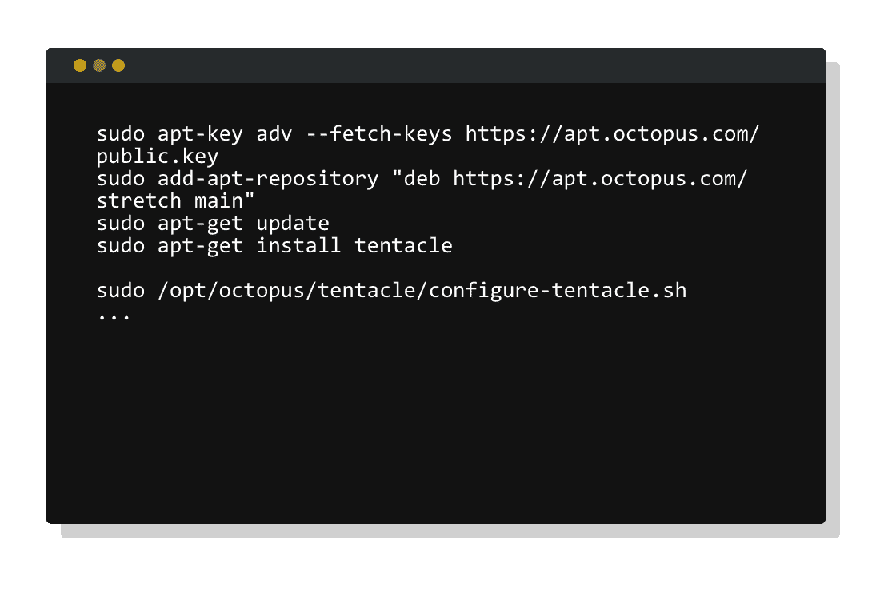
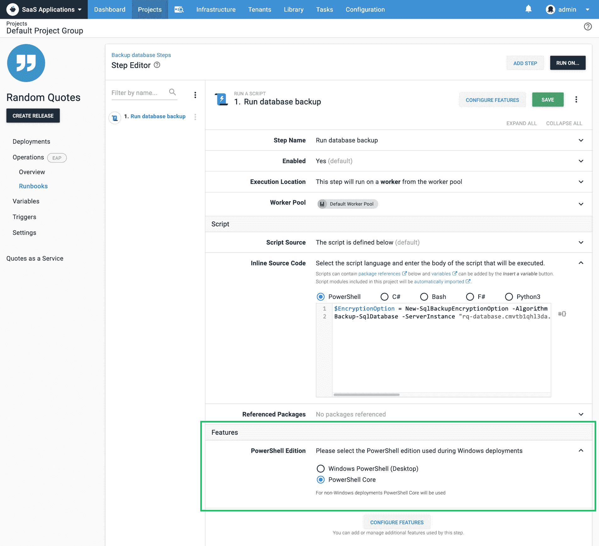
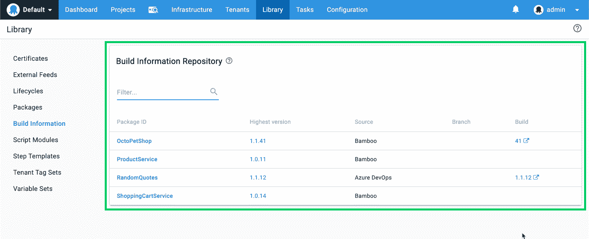
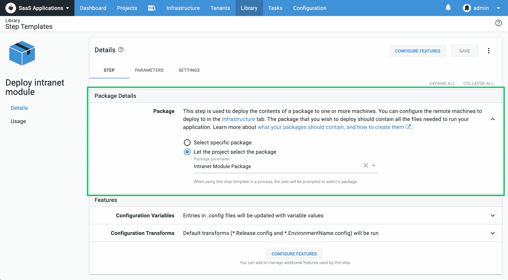
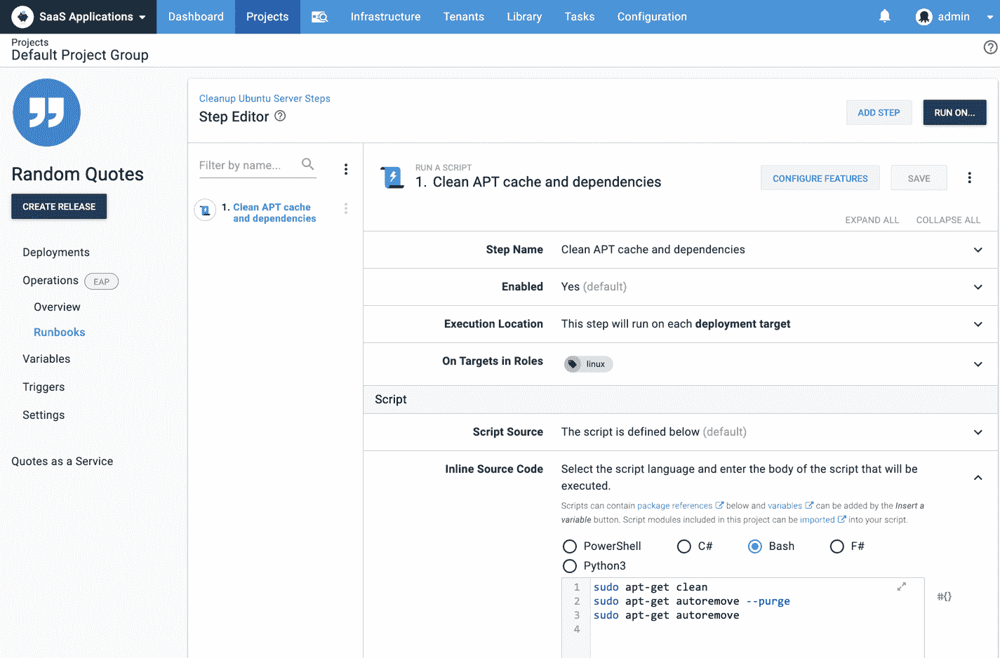

# Octopus Deploy 2019.10 -灵活的 Linux 部署、PowerShell 核心支持、操作手册 EAP - Octopus Deploy

> 原文：<https://octopus.com/blog/octopus-release-2019.10>

[https://www.youtube.com/embed/pBW_gypiS6w](https://www.youtube.com/embed/pBW_gypiS6w)

VIDEO

我们很高兴推出 **Octopus Deploy 2019.10** 。这是一个功能丰富的版本，有很多好处。头条新闻是触手 Linux 版。这个非常受欢迎的特性为部署到 Linux 的团队提供了更大的灵活性，并且能够在不打开端口 22 的情况下部署到高度安全的服务器。Tentacle for Linux 和基于 SSH 的 Linux 部署与 Bash、PowerShell Core 或 Python 中的脚本相结合，以及将您的 web 应用和服务部署到 NGINX 的第一步，使 Octopus 成为 Linux 部署的一个很好的选择。

## 在这篇文章中

## 用于 Linux 的触手

Octopus 在 3.0 版本中首次引入了对基于安全外壳(SSH)的 Linux 部署的支持，这是一个流行的部署选项。然而，一些公司在高度安全的环境中运行，在这种环境中不可能在生产服务器上打开端口 22，例如，当 web 应用程序在它们自己的 dmz 中运行时，除了 web 流量的 HTTPS 之外，不允许任何传入连接。

令人欣慰的是，这种场景现在可以用 Linux 的触手来实现了。我们的触手代理是一个轻量级的服务，它支持 Octopus 服务器和部署目标之间在监听和轮询模式下的安全通信。在轮询模式中，目标自己呼叫总部并联系 Octopus 服务器，查看是否有任何部署工作要做，如果有，则执行它。

[了解更多信息](https://octopus.com/docs/infrastructure/deployment-targets/linux/tentacle)

## PowerShell 核心支持

该版本增加了内置的 PowerShell 核心支持，使团队能够使用微软积极维护的自动化框架编写跨平台脚本。我们的 PowerShell 核心支持工作正常，它与我们对 Linux 部署的扩展支持配合得非常好。许多开发和运营团队都乐于编写 PowerShell 脚本，PowerShell Core 使具有 PowerShell 技能的人能够为 Linux 平台编写丰富的脚本。

**Windows 平台**

Octopus 将默认使用 Windows PowerShell，并在需要时提供使用 PowerShell 核心的选项。您可以通过为支持自定义脚本的步骤配置 PowerShell edition 来对此进行自定义。

**Linux 平台**

如果安装了 PowerShell Core，Octopus 将自动执行脚本。

[了解更多](https://octopus.com/docs/deployment-examples/custom-scripts/powershell-core)

## 改进的构建信息和工作项跟踪

Octopus 2019.4 引入了构建信息和工作项跟踪。这是一个受欢迎的特性，但是我们收到反馈说包元数据功能很难找到，因为它被隐藏在内置包库中的包细节之下，很难理解。因此，我们在 Octopus 库中将这一功能提升为名为**构建信息**的顶级特性，使其更易于访问和理解。我们还更新了构建服务器插件套件，以反映名称的变化。

这个特性集为团队提供了对 CI/CD 管道更好的端到端可见性，并允许快速访问构建和提交细节。这在许多方面都是显而易见的:

*   发布说明
*   部署变更

我们以前在项目设置中提供了定制发行说明模板的支持。在此版本中，我们引入了部署更改模板，因此您可以对部署更改的结构进行同样的控制。这使团队能够定制显示以满足他们的需求。

[了解更多信息](https://octopus.com/docs/packaging-applications/build-servers/build-information)

## 更简单的基于包的步骤模板

步骤模板是团队创建跨多个项目使用的可重用步骤的一种流行方式。我们做了一个小但重要的更新，通过引入包参数，使跨项目共享基于包的步骤模板变得更加容易。以前，您需要创建参数来公开基于包的属性。有了包参数，这就不再需要了，因为现在当步骤模板被添加到项目中时，我们会自动显示我们的包选择器。这使得创建基于包的步骤模板更加容易，并且让团队以更简单的方式绑定这些参数。

[了解更多](https://octopus.com/docs/deployment-process/steps/custom-step-templates)

## 为运营团队介绍操作手册

此版本还包括对我们新的操作手册功能的早期访问。到目前为止，Octopus 一直是一个部署自动化工具，使团队能够部署其软件的新版本，但是一旦软件被部署，还有许多其他过程需要团队自动化。这些包括文件清理、夜间备份、灾难恢复以及其他脚本和手动过程。有了 Runbooks，团队可以使用 Octopus 来自动化保持现代软件在生产中运行所涉及的一切。

我们很喜欢这个功能的反馈，所以请在`#runbooks`频道加入我们的[社区 slack](https://octopus.com/slack) 的讨论。我们的文档涵盖了如何开始的所有细节。

[了解更多信息](/blog/introducing-operations-runbooks)

## 重大变化

这个版本包括两个小的突破性变化。

**PowerShell 内核**

PowerShell 核心支持引入了一项更改，即针对非 Windows 目标运行 PowerShell 脚本不再静默忽略`.ps1`文件。Octopus 现在将尝试在部署目标上执行`.ps1`文件。如果 PowerShell Core 安装在这些目标上，这可能会改变您的部署行为。如果 PowerShell 核心未安装在这些目标上，部署将会失败。

**构建信息**

我们的构建信息变更涉及到从 API 到数据库的资源重命名。这通常是向后兼容的，然而任何使用我们 GitHub 问题跟踪器的人都需要确保他们升级他们的 Octopus 服务器，如果他们升级他们的 [Azure DevOps 扩展](https://marketplace.visualstudio.com/items?itemName=octopusdeploy.octopus-deploy-build-release-tasks)、 [TeamCity 插件](https://plugins.jetbrains.com/plugin/9038-octopus-deploy-integration)或 [Bamboo 插件](https://marketplace.atlassian.com/apps/1217235/octopus-deploy-bamboo-add-on)。

## 升级

升级 Octopus Deploy 的[步骤照常适用。更多信息，请参见](https://octopus.com/docs/administration/upgrading)[发行说明](https://octopus.com/downloads/compare?to=2019.10.0)。自托管 Octopus 客户现在可以[下载](https://octopus.com/downloads/2019.10.0)最新版本。对于章鱼云，您将在下周的维护窗口期间开始接收最新的 bits。

## 包裹

这就是本次发布的全部内容。欢迎给我们留下评论，让我们知道你的想法！愉快的部署！