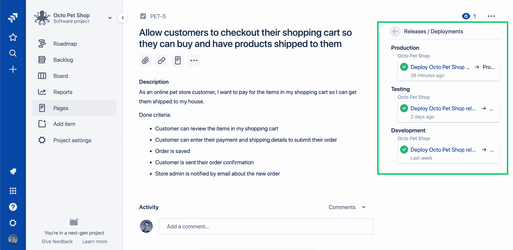

# 八达通服务器 2019.6 与长期支持(LTS) -八达通部署

> 原文：<https://octopus.com/blog/octopus-release-2019.6-lts>

## 八达通部署 2019.6 LTS

Octopus Deploy `2019.6 LTS`现在可用于运行 Octopus Deploy 自托管的团队，我们向我们的自托管客户推荐此版本。我们的[长期支持(LTS)计划](https://octopus.com/docs/administration/upgrading/long-term-support)包括提供六个月支持的版本，包括关键错误修复和安全补丁。它们不包括新功能、次要增强或次要错误修复；这些都包含在下一个 LTS 版本中。

[立即下载](https://octopus.com/downloads)

这是我们提供六个月长期支持的第三个版本，下表显示了我们当前的 LTS 版本。

| 释放；排放；发布 | 长期支持 |
| --- | --- |
| 八达通 2019.6 | 是 |
| 章鱼 2019.3 | 是 |
| 章鱼 2018.10 | 期满 |

请继续阅读，了解此版本中的内容以及任何重大变化。

## 在这篇文章中

## 吉拉一体化

完成意味着部署到生产中。我们针对吉拉云的新 Octopus 插件使团队能够直接在他们的吉拉问题中查看他们的发布和部署状态，并返回到 Octopus 以获得进一步的详细信息。这一功能使您的团队和公司能够在他们最熟悉的工具中获得更大的可见性和洞察力。

[了解更多信息](https://octopus.com/blog/octopus-jira-integration)

## 从创意到生产全程跟踪您的工作

此版本引入了构建信息和工作项跟踪。现在可以直接在 Octopus 中查看构建、提交和发布细节。该功能允许团队查看问题并构建有助于发布的细节，从而提供从问题到生产的端到端可追溯性。你甚至可以点击深层链接了解更多信息。我们支持 GitHub 问题，吉拉问题，对 Azure DevOps 的支持即将推出。

[了解更多](https://octopus.com/blog/metadata-and-work-items)

## 自动生成和共享发行说明

Octopus 现在可以通过利用来自源代码提交和构建过程的元数据来确定环境中的新内容，从而生成发行说明。它可以向您显示自上次部署以来哪些问题和更改是新的。你甚至可以在 Slack 上与你的团队分享，或者通过电子邮件发送给你的客户。与工作项跟踪一样，我们支持 GitHub 问题、吉拉问题，对 Azure DevOps 的支持即将推出。

[了解更多信息](https://octopus.com/blog/release-notes-templates)

## 对 C#、F#、Bash 和 Python 的脚本模块支持

我们在所有支持语言中增加了对脚本模块的支持。现在，您可以集中管理常见的 Bash、C#、F#和 Python 脚本函数，甚至可以看到哪些项目正在使用这些脚本模块。

[了解更多信息](https://octopus.com/blog/script-modules)

## Linux 触手早期访问

这个版本还包括我们即将推出的 Linux 触手的早期访问。 [Octopus 3.0](https://octopus.com/blog/deployment-targets-in-octopus-3) 引入了对 SSH 上的 Linux 部署的支持；但是，在高度安全的环境中，不能在生产服务器上打开入站端口。我们的 Linux 触手代理解决了这个安全问题，它支持 Octopus 服务器和 Linux 部署目标之间在监听和轮询模式下的通信。轮询模式特别消除了对开放端口的需求，因为轮询触手与 Octopus 服务器建立了通信。

我们喜欢反馈，所以请在`#linux-tentacle`频道中加入我们的[社区松弛](https://octopus.com/slack)的讨论。

[了解更多信息](https://octopus.com/docs/infrastructure/deployment-targets/linux/tentacle)

## 重大变化

此版本包括一些小的突破性变化:

*   由`Octopus.Server.exe` `show-configuration`命令返回的输出格式有一些[的细微变化](https://github.com/OctopusDeploy/Issues/issues/5392)。这不太可能影响团队，但是如果您使用它来驱动自动化，请在升级之前测试新版本。
*   为了支持一些拥有用户共享电子邮件地址的活动目录配置的客户，我们已经[取消了对用户电子邮件的唯一性限制](https://github.com/OctopusDeploy/Issues/issues/5549)。
*   机器策略的健康检查属性已经[改变](https://github.com/OctopusDeploy/Issues/issues/5544)以适应 Linux 触手。`TentacleEndpointHealthCheckPolicy`更名为`PowerShellHealthCheckPolicy`,`SshEndpointHealthCheckPolicy`更名为`BashHealthCheckPolicy`。任何创建机器策略的自定义工具都应该使用新的属性名称。
*   在 SSH 健康检查策略上配置的`OnlyConnectivity`选项现在是一个[策略范围的设置](https://github.com/OctopusDeploy/Issues/issues/5544)。该设置通常用于 SSH 目标上的原始脚本。如果您使用此设置，将在 Octopus 服务器升级期间创建新的机器策略。

## 包扎

八达通服务器 2019.6 已经到来，你可以指望它。长期部署愉快！