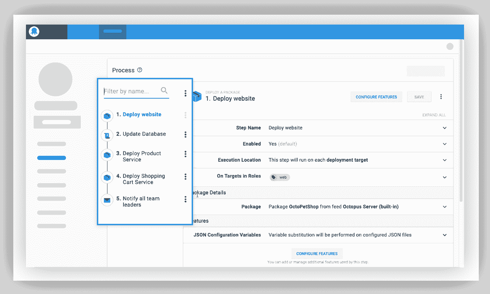
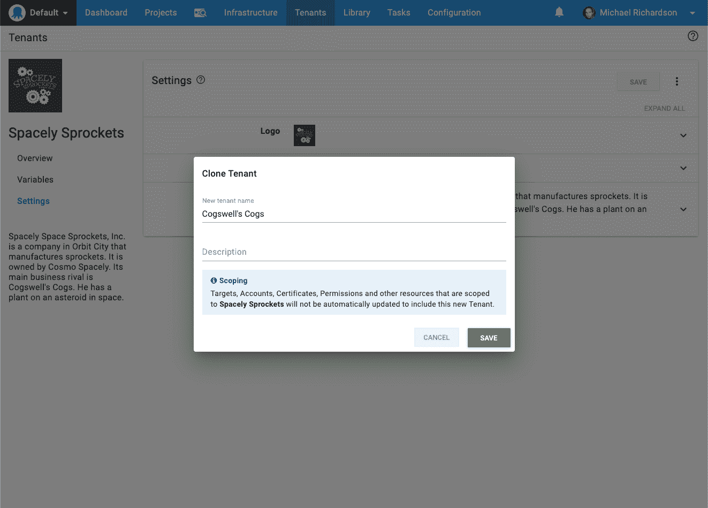

# 八达通服务器 2019.9 与长期支持(LTS) -八达通部署

> 原文：<https://octopus.com/blog/octopus-release-2019.9-lts>

Octopus Deploy `2019.9 LTS`现在可用于运行 Octopus Deploy 自托管的团队，我们向这些客户推荐这个版本。我们的[长期支持(LTS)计划](https://octopus.com/docs/administration/upgrading/long-term-support)包括提供六个月支持的版本，包括关键错误修复和安全补丁。LTS 版本不包括新功能、次要增强或次要错误修复；这些都包含在下一个 LTS 版本中。

[立即下载](https://octopus.com/downloads)

下表显示了我们当前的 LTS 版本。不再支持 Octopus 2019.3，我们建议该版本的客户升级到较新的版本。

| 释放；排放；发布 | 长期支持 |
| --- | --- |
| 章鱼 2019.9 | 是 |
| 八达通 2019.6 | 是 |
| 章鱼 2019.3 | 期满 |

请继续阅读，了解此版本中的内容以及任何重大变化。

## 在这篇文章中

## 简化的部署流程编辑器

我们改进了部署流程编辑器，以更好的可视性简化编辑流程。现在您可以看到整个部署过程，这在引用脚本和变量中的其他步骤名称时非常有用。这也应该使浏览步骤更快，点击更少，滚动更少。

[了解更多信息](https://github.com/OctopusDeploy/Issues/issues/5804)

## 用于 Linux 的触手

这个版本包括对我们 Linux 本地触手代理的支持。这使得团队能够在不可能打开端口 22 的安全环境中部署 Linux 服务器。触手支持 Octopus 服务器和部署目标之间在监听和轮询模式下的安全通信。在轮询模式下，触手代理联系 Octopus 服务器并根据需要执行部署工作，包括检索应用程序包和部署脚本。

Tentacle for Linux 为在高度安全的环境中部署 Linux 的团队提供了更大的灵活性。

[了解更多信息](https://octopus.com/docs/infrastructure/deployment-targets/linux/tentacle)

## 租户克隆

创建和配置租户可能非常耗时，因为它涉及到链接项目和环境、添加标记以及输入所有必需的变量值等多个步骤。幸运的是，这个过程现在简单多了，因为您可以克隆一个租户，而不是手动执行所有这些步骤。然后，您可以根据需要更新新租户。

[了解更多信息](https://github.com/OctopusDeploy/Issues/issues/5727)

## 其他改进

*   添加了**健康检查计划选项**，以便它们可以配置为在 cron 表达式上运行，或者从不运行。
*   增加了对 Kubernetes 步骤中**覆盖名称空间的支持。**
*   **新增变量过滤表达式**，包括`Trim`、`Substring`、`Truncate`、`UriEscape`、`UriDataEscape`。
*   添加了对**作为文本粘贴到证书的支持**以直接在门户中添加证书。

[了解更多](https://octopus.com/blog/octopus-release-2019.8)

## 重大变化

这个版本包括一个突破性的变化，因为 [Octopus 服务器不再支持 Windows Server 2008 SP2](https://octopus.com/blog/windows-server-2008-eol-hello-linux) 。

## 包扎

Octopus Server 2019.9 现已推出，您可以依赖它。长期部署愉快！