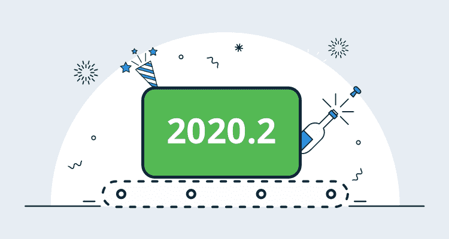
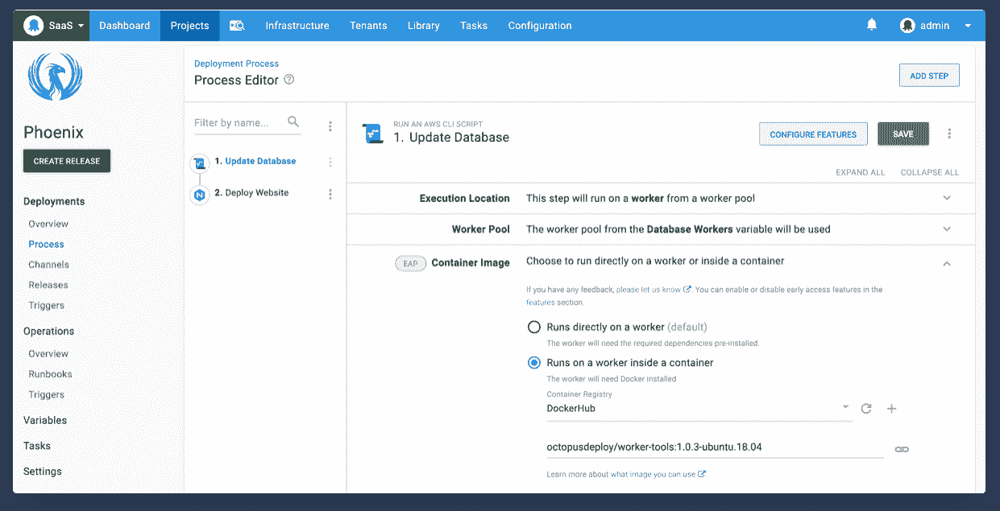
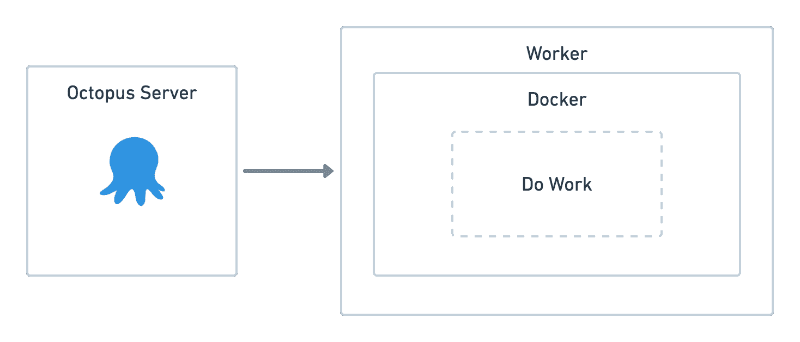
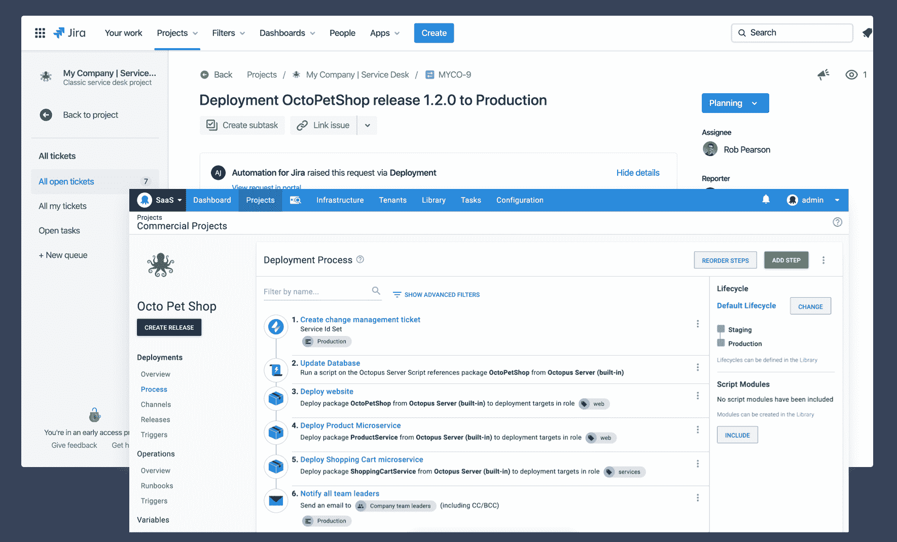
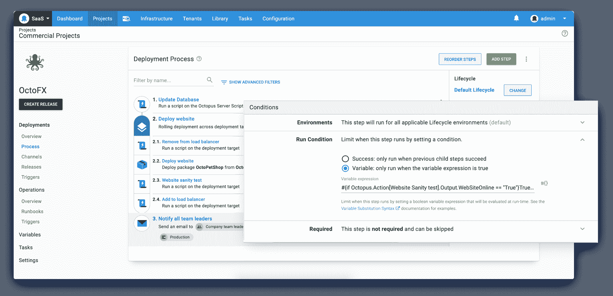
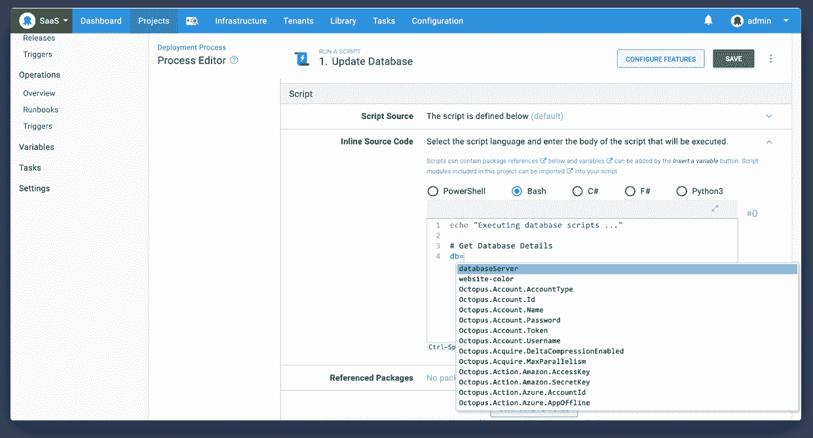

# Octopus 2020.2:工人的执行容器- Octopus Deploy

> 原文：<https://octopus.com/blog/octopus-release-2020-2>

[](#)

我们很高兴推出 Octopus 2020.2，这是我们今年的第二个版本。以下是此版本中包含的有用更新和优势:

该版本是 2020 年六个版本中的第二个版本，包括六个月的长期支持。下表显示了我们当前提供长期支持的版本。

| 释放；排放；发布 | 长期支持 |
| --- | --- |
| 章鱼 2020.2 | 是 |
| 八达通 2020.1 | 是 |
| 章鱼 2019.12 | 是 |
| 章鱼 2019.9 | 期满 |
| 八达通 2019.6 | 期满 |

请继续阅读，了解更多更新信息。

## 工人的执行容器

[](#)

Octopus 2018.7 引入了工人，他们帮助团队将部署工作从 Octopus 服务器转移到工人池中运行的其他机器上。工作人员的常见场景包括数据库部署和云部署，在这些场景中，您可以为特定目的创建一个工作人员池。工作池还可以根据您的需求确定环境的范围。

在这个版本中，我们添加了对在 workers 上的隔离容器中执行部署工作的支持，并且我们提供了一组用标准部署工具引导的官方容器映像。

以前，您需要确保工作池(包括内置工作池)中的计算机拥有部署所需的必要工具，并且您需要维护它们的操作系统和工具版本。如果不同的团队需要不同版本的特定工具，而这些工具又不能同时安装，那么这种方法也会有问题。此外，Octopus 捆绑了一些工具，但让它们保持最新仍然是一个挑战。

[](#)

**工人的执行容器**解决了这个问题以及更多问题。

*   **隔离并快速执行部署工作。** Octopus 正在使用 [Docker](https://docker.com) 在容器的上下文中执行您的脚本或其他部署工作。该方法在完全隔离的情况下提供快速有效的执行。
*   **通过预建的 [Octopus 工具容器映像](https://hub.docker.com/r/octopusdeploy/worker-tools)** 简化依赖管理。现在，确保您使用部署所需的工具的正确版本所需的摩擦少得多。

我们预先构建的映像包括对 Windows 2019 和 Ubuntu 18.04 的跨平台支持，您可以根据主要版本、次要版本或特定补丁版本选择`latest`映像标签或特定版本。我们正在启动预装了以下工具的映像。

*   Powershell 核心
*   。NET Core SDK (3.1 LTS 版)
*   Java SDK
*   Azure CLI
*   Az Powershell 核心模块
*   AWS CLI
*   节点. js
*   库贝特尔
*   舵 3
*   将（行星）地球化（以适合人类居住）
*   计算机编程语言
*   Azure 功能核心工具
*   谷歌云 CLI
*   脚本(仅窗口)
*   F#(仅限 Windows)

还可以根据您团队的确切需求构建容器映像。例如，您可以使用以下命令用特定版本的 kubectl 构建一个定制的映像:

```
docker build -t my-company/worker-tools --build-arg Kubectl_Version=X.Y.Z MyDockerFile 
```

[了解更多信息](https://octopus.com/docs/deployment-process/execution-containers-for-workers)

## 与吉拉服务台集成的变更管理

[](#)

在 Octopus 2020.2 中，我们通过吉拉服务台云提供了对集成变更管理的初始支持。现在，通过我们新的吉拉服务台变更请求步骤，可以在部署期间自动创建变更请求。

这种集成与我们的 [Octopus Deploy for 吉拉插件](https://marketplace.atlassian.com/apps/1220376/octopus-deploy-for-jira)一起工作，并需要 [ITSM 早期访问](https://support.atlassian.com/jira-service-desk-cloud/docs/set-up-an-itsm-project/)。有关在您的 ITSM 项目中配置 Octopus Deploy 集成的更多信息，请参见 [Atlassian 的文档](https://support.atlassian.com/jira-service-desk-cloud/docs/set-up-change-management-for-your-service-desk/)。

这个特性是一个更重要的变更管理特性集的第一部分，所以我建议在我们的[公共路线图](https://octopus.com/roadmap#change-management)上注册更新，以获得关于这个特性的更多信息。

注意:Octopus Deploy 插件仅兼容吉拉云和吉拉服务台云，因为我们所依赖的 API 仅在吉拉云中可用。当这些 API 在吉拉服务器中可用时，这个扩展也可以在那里工作。

[了解更多](https://octopus.com/jira)

## 更好的运行条件

[](#)

运行条件允许您自定义部署过程中的每个步骤，以便更好地控制步骤的执行。此版本增加了对滚动部署和机器级运行条件的支持。

### 滚动部署可变运行条件

现在可以在滚动部署中向子步骤添加可变的运行条件。此更新为滚动部署增加了更大的灵活性，并允许您根据自己的特定需求自定义部署过程。

例如，如果您在滚动部署中将 web 服务更新部署到 web 场，您可以在更新步骤之后对服务进行完整性测试，并将服务状态设置为输出变量。在后续步骤中，如果服务状态为正，运行条件可变，则可以将其添加回 web 场。以前，这是不可能的。

[了解更多信息](https://octopus.com/docs/deployment-process/conditions)

### 机器级可变运行条件

变量运行条件的另一个新特性是支持机器级变量。上面的滚动部署示例也强调了这一改进。在本例中，服务状态输出变量是一个机器级别的变量，因为它特定于单个机器。可以在标准(线性)或滚动部署中设置和解析机器级别的变量。

[了解更多信息](https://octopus.com/docs/deployment-process/conditions#machine-level-variable-expressions)

## 在我们更新的代码编辑器中快速查找变量

[](#)

我们还添加了一个方便的快捷方式来快速插入变量，而不需要单击变量查找按钮。

键入`Control` + `Space`获得一个支持模糊搜索的快速变量查找菜单。使用箭头键选择合适的变量，然后按下`Enter`。一旦你习惯了，这个简单的更新是非常有用的。

今天就试试吧！

## 重大变化

Octopus 2020.1 引入了[更新了运行 Octopus Server 到 Windows Server 2012 R2 和 SQL Server 2017 的最低要求](https://octopus.com/blog/raising-minimum-requirements-for-octopus-server)。此版本现在强制执行 SQL Server 的最低要求。

## 升级

八达通云用户已经在运行这个版本，自主托管的八达通客户现在可以[下载](https://octopus.com/downloads/2020.2.0)最新版本。

像往常一样，升级 Octopus Deploy 的[步骤](https://octopus.com/docs/administration/upgrading)适用。更多信息请参见[发行说明](https://octopus.com/downloads/compare?to=2020.2.0)。

## 章鱼 2020.3 里会有什么？

查看我们的[公共路线图](https://octopus.com/roadmap)，了解接下来的内容并注册更新。我们已经在开发我们的 Config as Code 特性集，看起来不错。

## 结论

章鱼 2020.2 来了，它带来了一些不错的改进。面向员工的执行容器和与吉拉服务台集成的变更管理是这些简化部署和发布管理的功能集的第一步。

欢迎给我们留下评论，让我们知道你的想法！愉快的部署！

## 相关职位