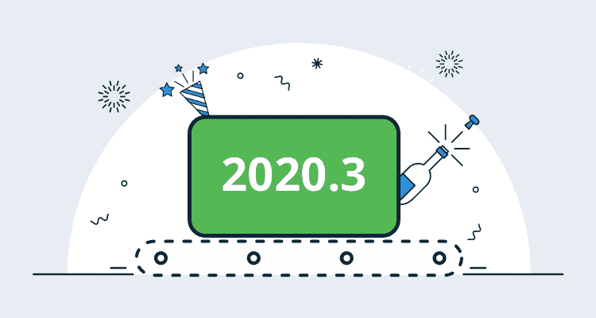
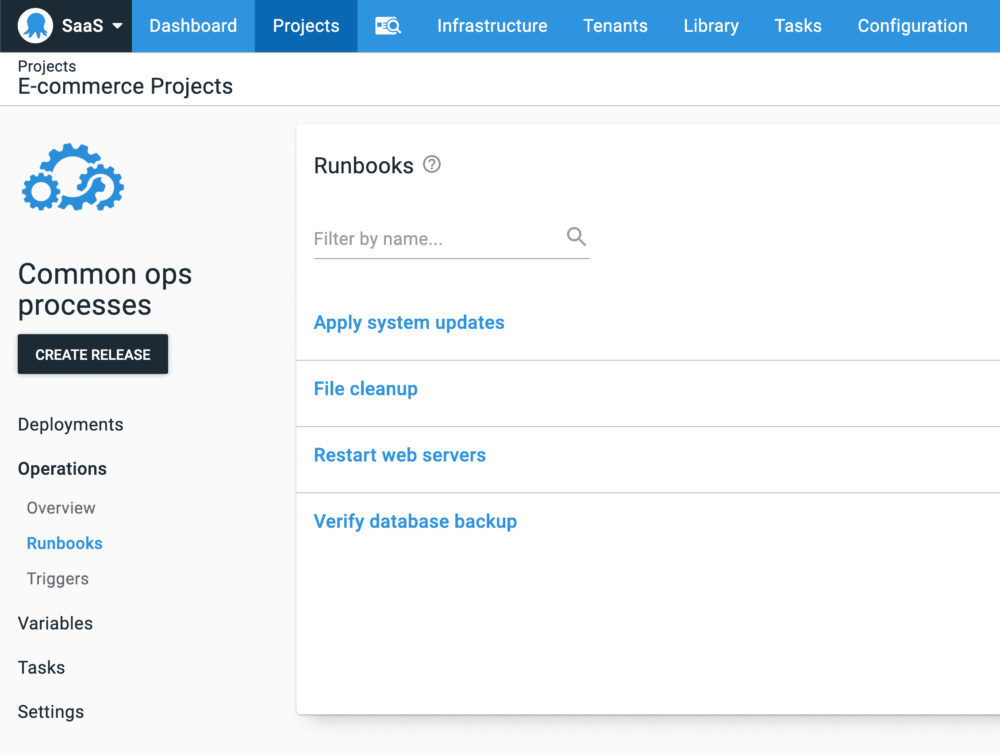
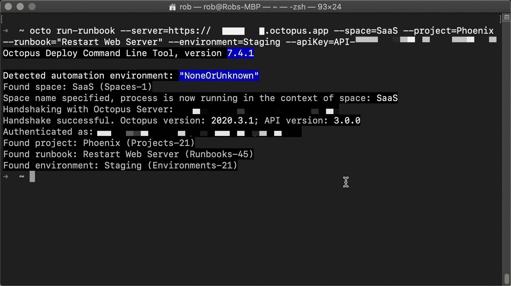
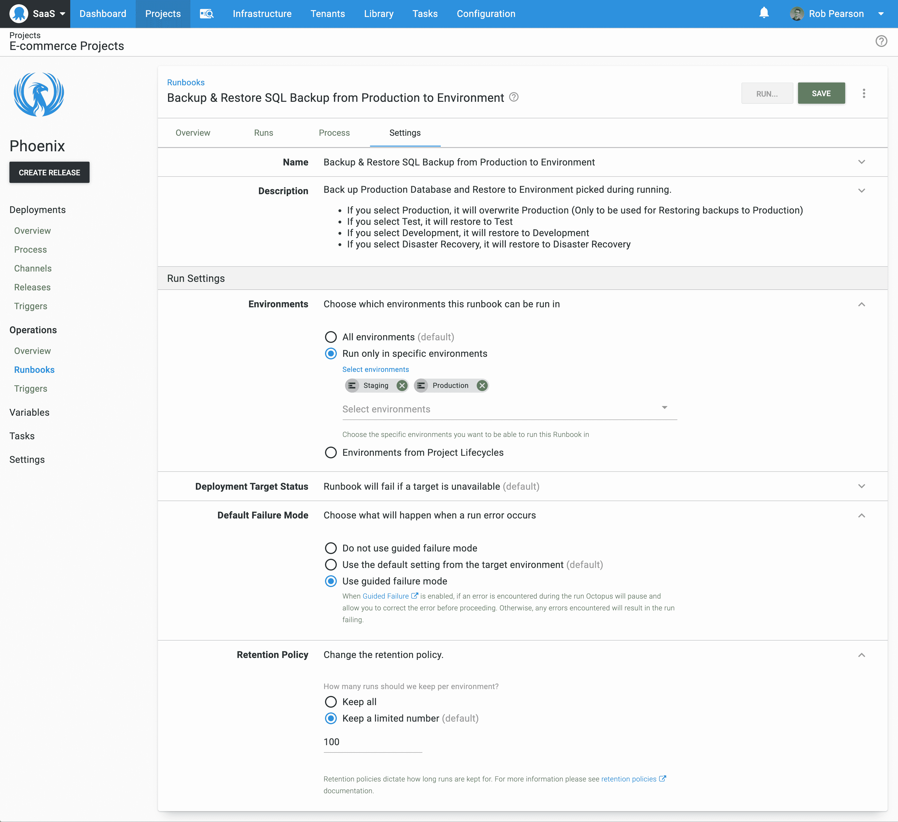
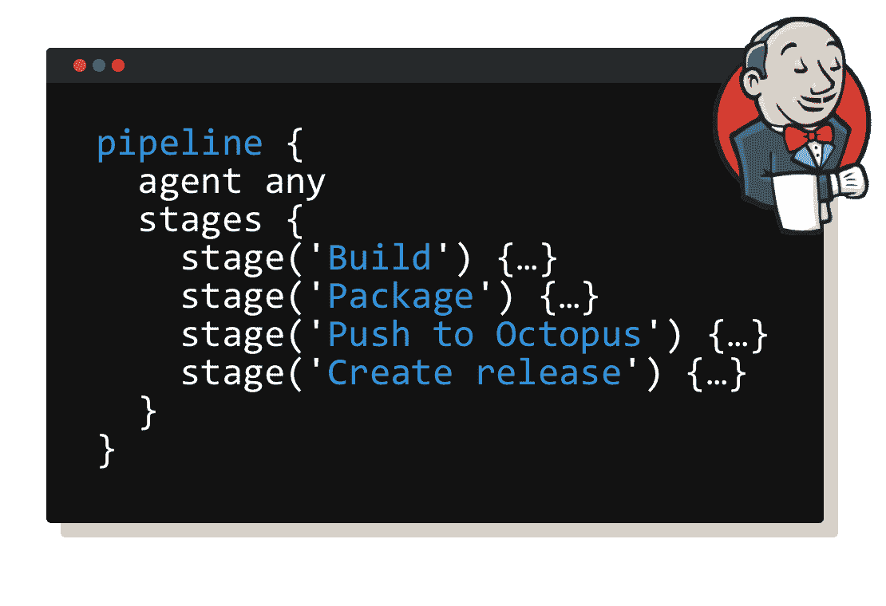
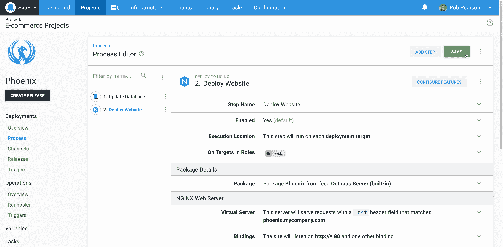

# Octopus 2020.3: Runbooks++、Jenkins Pipelines 和 Octopus Linux Docker image-Octopus Deploy

> 原文：<https://octopus.com/blog/octopus-release-2020-3>

我们很高兴推出 Octopus 2020.3，这是我们今年的第三个版本。这个版本包括一些伟大的更新，以改善您的日常八达通体验。

*   [runbook 改进](/blog/octopus-release-2020-3#runbooks):该版本包括一批客户驱动的改进，包括 runbook 专用项目、Octopus CLI 支持、环境范围界定、每个 runbook 的指导性故障模式，以及添加 run book 保留策略。
*   [Jenkins Pipelines](/blog/octopus-release-2020-3#jenkins-pipelines) 支持使您能够从您的`Jenkinsfile`与 Octopus 集成。
*   [Streamlined process editor](/blog/octopus-release-2020-3#streamlined-process-editor) 允许您一次编辑多个步骤，并通过一次更新保存您的更改。
*   [Octopus Linux Docker 镜像(早期访问)](/blog/octopus-release-2020-3#octopus-linux-docker-image)现已可用，使得在 Linux Docker 容器中运行 Octopus 成为可能。

这个版本是 2020 年六个版本中的第三个，包括六个月的长期支持。下表显示了我们长期支持的当前版本:

| 释放；排放；发布 | 长期支持 | LTS 结束日期 |
| --- | --- | --- |
| 八达通 2020.3 | 是 | 2021-01-20 |
| 章鱼 2020.2 | 是 | 2020-09-31 |
| 八达通 2020.1 | 是 | 2020-08-24 |
| 章鱼 2019.12 | 期满 | 2020-07-14 |

请继续阅读，了解更多更新信息。

## 运行手册

我们在 Octopus 2019.11 中首次提供了 Runbook 自动化支持，这是我们有史以来增长最快的功能之一！我们对使用水平感到兴奋，并积极听取您的反馈。在这个版本中，我们发布了几项客户驱动的改进，以更好地使用 runbooks。

### 仅 Runbook 项目

Octopus 现在支持更干净的 runbook-only 项目风格，并且 UI 反映了这一点。以后仍然有可能将部署添加到项目中，但是这使得更关注操作的项目变得更容易。如果您的项目只包含 runbooks，则应用此样式。

要激活仅运行手册项目样式，请创建一个新项目，并添加至少包含一个步骤的运行手册。那么项目的部署部分将会折叠。

### Octopus CLI 支持

【T2 

我们已经更新了 Octopus CLI，添加了一个`run-runbook`命令，以便在您选择的平台上从命令行和脚本执行您的操作手册。

### Runbook 运行设置

我们添加了新的 runbook 运行设置，以实现对 runbook 执行的更高级控制:

*   环境范围:你可以选择运行手册的环境。
*   每个操作手册的引导故障:您可以自定义每个操作手册的引导故障设置。这意味着您可以选择是否使用引导式故障模式，使用目标环境中的默认设置，或者始终使用引导式故障模式。
*   Runbook 保留策略:您还可以控制您的 runbook 保留，以便更好地管理它们的执行工件和清理。

[了解更多信息](https://octopus.com/docs/runbooks)

## 詹金斯管道公司

我们已经更新了我们的 Jenkins 插件，增加了对从您的`Jenkinsfile`集成 Octopus 的支持。以前，您需要使用 Octopus CLI 自动完成这项工作，但是现在已经支持开箱即用了。语法更加简洁明了。

[了解更多信息](/blog/using-jenkins-pipelines)

## 简化流程编辑器

作为我们的 [Config as Code](https://octopus.com/roadmap#pipeline-as-code) 特性的一部分，我们已经更新了我们的流程编辑器，使您的部署和操作手册更容易自动化。现在，您可以编辑整个流程，包括更新多个步骤，并通过单击保存所有更改。以前，您需要一次保存一个更改，这对于较大的更新来说是令人沮丧的。这是不再需要的，因为八达通现在跟踪你所有的变化，并允许你只保存一次。

亲自尝试一下，我想你会发现这是一种自然得多的编辑体验。

## Octopus Linux Docker 映像(早期访问)

【T2 

去年，我们将 Octopus 云服务从基于 Windows 的虚拟机转移到运行在 Kubernetes 上的基于 Linux 的容器中。我们进行这种改变是为了降低运行成本，提高服务的性能和可伸缩性。这个解决方案已经运行了将近 12 个月，我们对结果非常满意。

我们为自己做了这种转变，但我们也设想我们的客户用我们的 Docker 图像自托管 Octopus。因此，我们很高兴地宣布提前访问我们的 Octopus Deploy Docker 映像，这些映像基于支持 Octopus Cloud 的相同代码。这些映像允许 Linux 用户在他们选择的操作系统上自托管 Octopus。

查看我们的 [DockerHub 库](https://hub.docker.com/r/octopusdeploy/octopusdeploy)开始吧，我强烈推荐您点击**了解更多**链接，找到更详细的说明和完整的示例。

**注意**:我们的 Docker 图片是早期版本；我们预计会有一些错误和粗糙的边缘，我们不支持这个版本用于生产部署。也就是说，我们渴望得到反馈，因此如果有任何意见或问题，请耐心等待并联系我们的[支持团队](https://octopus.com/support)。

[了解更多信息](/blog/introducing-linux-docker-image)

## 重大变化

这个版本包括两个突破性的变化。

*   我们已经否决了我们的 Azure VM 扩展，我们建议使用 PowerShell DSC 作为替代。我们的文档介绍了这一决定，并链接到关于如何使用 PowerShell DSC 实现这一点的更多文章。参见下面的[相关文章](/blog/octopus-release-2020-3#related-posts)了解如何使用 Amazon Web Services 完成这项工作。
*   我们已经更新了我们的[部署到 IIS 步骤](https://octopus.com/docs/deployment-examples/iis-websites-and-application-pools)，删除了对部署到 Azure 应用服务的支持。我们建议使用我们的 [Azure support](https://octopus.com/docs/deployment-examples/azure-deployments) 来代替。

## 升级

章鱼云用户已经在运行这个版本，自主托管的章鱼客户现在可以[下载](https://octopus.com/downloads/2020.3.0)最新版本。

像往常一样，升级 Octopus Deploy 的[步骤适用。更多信息，请参见](https://octopus.com/docs/administration/upgrading)[发行说明](https://octopus.com/downloads/compare?to=2020.3.0)。

## 章鱼 2020.4 有什么新内容？

查看我们的[公共路线图](https://octopus.com/roadmap)看看接下来会有什么，并注册更新。随着代码进展顺利，我们正在增加对 YAML、XML 和 application.properties 配置文件更新的更好支持，并且我们正在增加对 Octopus Cloud 上内置 Linux Workers 的支持。

## 结论

Octopus 2020.3 现已正式发布，它包括一些改进，使团队更容易构建自动化部署和 runbook 流程、Jenkins 管道支持等。我们希望你喜欢它！

欢迎发表评论，让我们知道你的想法！愉快的部署！

## 相关职位