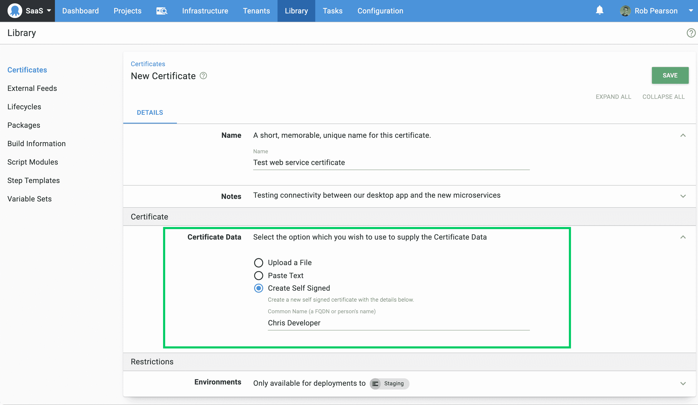
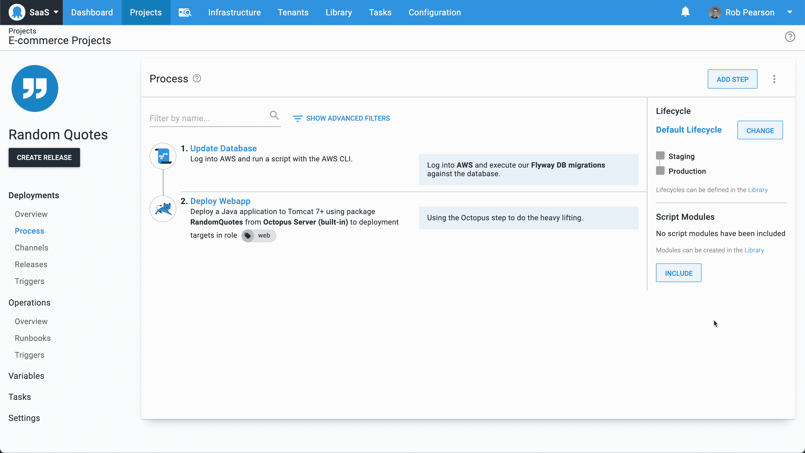
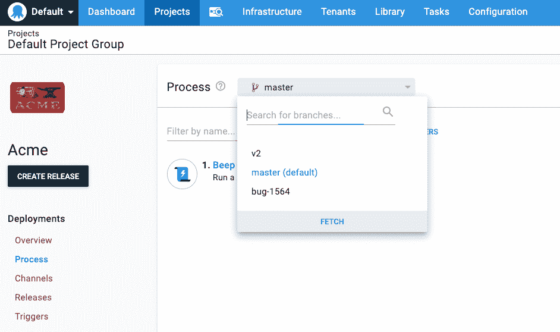

# 八达通 2020.5:坚实的改进和配置作为代码更新-八达通部署

> 原文：<https://octopus.com/blog/octopus-release-2020-5>

我很高兴地告诉大家，八达通 2020.5 现已推出。这个版本有一些坚实的改进；然而，这是一个更安静的版本，因为我们正在为我们的 Config as Code 特性做大量的幕后工作。

Octopus 2020.5 是 2020 年六个版本中的[第五个，它包括六个月的长期支持。下表显示了我们长期支持的当前版本:](/blog/releases-and-lts)

| 释放；排放；发布 | 长期支持 | LTS 结束日期 |
| --- | --- | --- |
| 章鱼 2020.5 | 是 | 2021-05-30 |
| 八达通 2020.4 | 是 | 2021-03-21 |
| 八达通 2020.3 | 是 | 2021-01-20 |
| 章鱼 2020.2 | 期满 | 2020-09-30 |
| 八达通 2020.1 | 期满 | 2020-08-24 |

## 在证书库中创建自签名证书

创建用于开发和测试目的的自签名证书并不复杂，但是 Octopus 现在让这变得快速而简单。现在，您可以在证书库( **库➜证书** )中创建自签名证书，并在您的自动化流程中利用它。此更新使得测试涉及证书的新的或更新的部署和操作手册的执行更加方便。如果您需要将证书用于命令行界面(CLI)、桌面应用程序或其他任务，也可以下载证书。

[了解更多信息](https://octopus.com/docs/deployment-examples/certificates)

## GitHub 容器注册支持

Octopus 现在支持[GitHub container registry(GHCR)](https://docs.github.com/en/free-pro-team@latest/packages/getting-started-with-github-container-registry/about-github-container-registry)作为自动化部署和 runbook 流程的包源。我们在技术上已经支持 GHCR，但是，GitHub 没有实现 Docker 目录 API 来允许搜索产生混淆错误的存储库。我们现在更加优雅地处理这些不一致，因此您可以毫无问题地利用 GHCR 源。

[了解更多信息](https://github.com/octopusdeploy/issues/issues/6567)

## Kubernetes 更新

这个版本包括两个小的更新，以改善我们的 Kubernetes 支持驱动的客户反馈。

**在部署 Kubernetes 容器步骤中公开 envFrom 字段**

Kubernetes 1.16 公开了`envFrom`属性，允许将 secret 或 configmap 的内容创建为环境变量。Octopus 现在支持`envFrom`字段，为部署中包含多个值提供了一种方式。

[了解更多信息](/blog/k8s-envfrom)

**允许创建和部署 DaemonSets 和 stateful set**

部署 Kubernetes 容器步骤允许 Octopus 在集群中创建 Kubernetes 部署。我们已经在 Octopus 门户网站中更新了这一步骤，以支持`DaemonSets`和`StatefulSets`，使其更加有用。

[了解更多信息](https://github.com/octopusdeploy/issues/issues/6551)

## Terraform 更新

Octopus 现在支持 HCL2 和 Terraform 0.12+的内联脚本。这次更新意味着你可以在 Octopus 门户网站中获得丰富的现代 Terraform 脚本语法高亮显示。

[了解更多信息](https://github.com/octopusdeploy/issues/issues/6562)

## 向自动化步骤添加标记注释

现在，您可以使用 markdown 注释来注释您的 DevOps 自动化流程。向任何部署或操作手册步骤添加基于文本的注释，并提供 markdown 格式支持，流程摘要将显示该注释。

这种改变有助于您的未来自己和其他团队成员快速理解复杂的自动化过程。

[了解更多信息](https://github.com/octopusdeploy/issues/issues/6608)

## 配置为代码更新

我们想在 2020 年 11 月分享我们的 Config as Code 功能的预览，但它还没有准备好。我们低估了一些核心组件需要多长时间来构建，而且这个特性是一个非常棘手的增量发布特性。

幸运的是，我们正在取得出色的进展，我们已经完成了整体特性的一些重要部分。

*   配置项目以使用 git 存储库。
*   在 Octopus 门户网站中切换分支，查看和编辑不同分支上的部署流程。
*   可以提交更改，包括添加提交消息。
*   生成的配置以基于 HCL 的格式存储在 git 中。
*   可以在创建发布时指定分支，选择要使用的部署过程的版本。这将最终支持选择标签或提交。

有什么突出的？简短的回答是很多小事。从数据库中移走一大块 Octopus，它有单一版本、索引、外键等。，到一个带有文本文件和无限分支的 git 存储库，留下了许多遗留问题。

单击下面的“了解更多”链接，了解更多关于设计和构建我们的 config as 代码支持的因素。我们明确地指出了几个我们有意避免的反模式。

[了解更多](https://octopus.com/blog/shaping-config-as-code)

## 重大变化

这个版本包括两个突破性的变化。

*   导入带有文件包引用的操作模板现在将验证提要 Id。这一变化意味着需要 [Feed 查看权限](https://github.com/OctopusDeploy/issues/issues/6582)才能导入带有包引用的操作模板。
*   Octopus Cloud 增加了记录一些指标的能力，这样我们就可以进行性能调优。这项功能已经不再使用，我们已经删除了这一支持。我们已经更新了 [Octopus DSC](https://github.com/OctopusDeploy/OctopusDSC/pull/266) ，不再使用`LogTaskMetrics`和`LogRequestMetrics`属性来反映这一点。

## 升级

章鱼云用户已经在运行这个版本，自托管章鱼客户现在就可以[下载](https://octopus.com/downloads/2020.5.0)最新版本。

像往常一样，升级 Octopus Deploy 的[步骤适用。更多信息请参见](https://octopus.com/docs/administration/upgrading)[发行说明](https://octopus.com/downloads/compare?to=2020.5.0)。

## 章鱼 2020.6 里会有什么？

查看我们的[公共路线图](https://octopus.com/roadmap)以了解接下来的内容并注册更新。

## 结论

Octopus 2020.5 现已正式推出，它包括一系列支持自签名证书的改进、Terraform 更新、Kubernetes 更新、自动化步骤注释，以及大量支持我们即将推出的 Config as Code 功能的幕后更改。

欢迎发表评论，让我们知道你的想法！愉快的部署！

## 相关职位