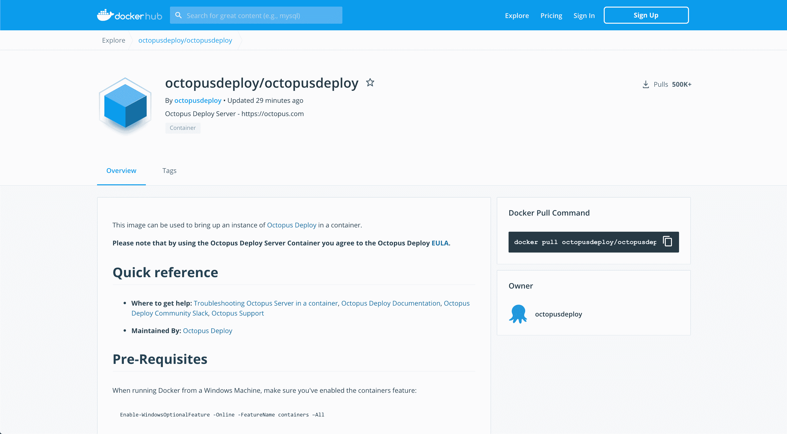
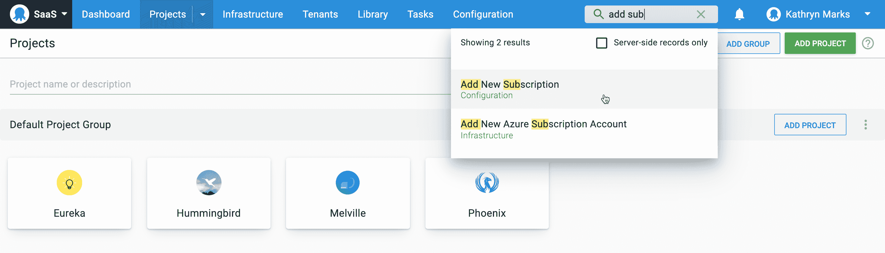
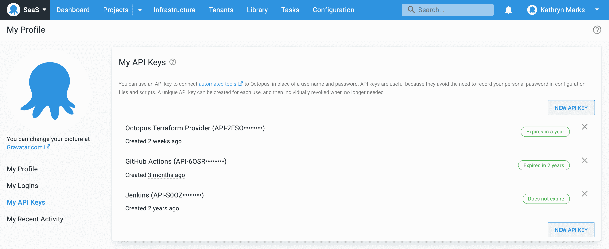
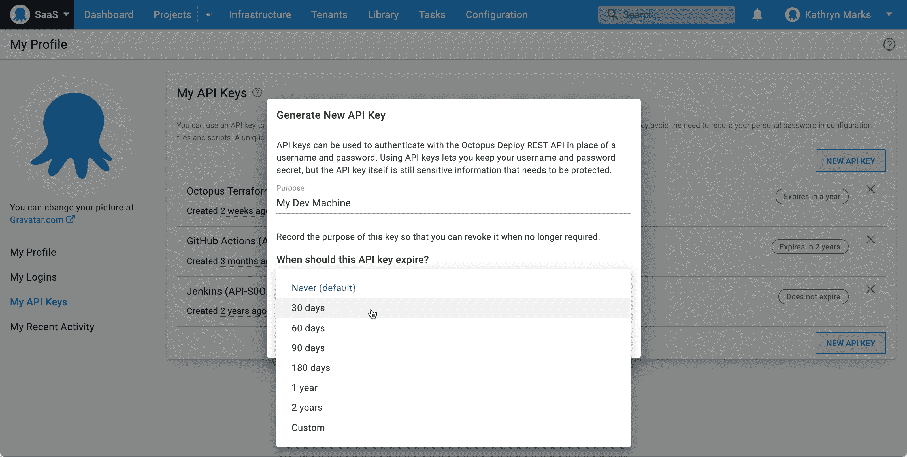

# 章鱼 2021 Q1:Linux 上的自宿主章鱼-章鱼部署

> 原文：<https://octopus.com/blog/octopus-release-2021-q1>

我们很高兴地宣布我们的第一个版本 2021。今年，我们将转变为季度节奏，发布四个 Octopus 服务器，而不是六个。

今年发布的产品有:

*   Q1:八达通服务器 2020.6
*   Q2:八达通服务器 2021.1
*   Q3:八达通服务器 2021.2
*   Q4:八达通服务器 2021.3

这次更新为 Linux 用户带来了两个激动人心的特性，允许您:

*   在 Linux 上自托管 Octopus 服务器。
*   在 ARM 和 ARM64 硬件上运行触手代理。

我们在 2020 年加入了 [Linux 基金会](https://www.linuxfoundation.org)，我们非常关心让 DevOps 自动化在 Windows 和 Linux 平台上都非常出色。Octopus Cloud 使用我们的 Linux Docker 映像为成千上万的客户提供部署支持。对于您的所有部署和 runbook 自动化来说，它是一个稳定而安全的平台，现在它也可供自主托管的客户使用。

这一版本还包括新的全球搜索和 API 密钥管理功能，使八达通服务器的所有用户受益。

## 包括在 Q1 版本中

*   八达通服务器 2020.6
*   触手 6.0.490
*   Octopus 服务器 Docker 图像:`latest`或`octopusdeploy/octopusdeploy:2020.6`

## 长期支持

下表显示了具有长期支持的 Octopus 服务器版本。

| 释放；排放；发布 | 长期支持 |
| --- | --- |
| 八达通 2020.6 | 是 |
| 章鱼 2020.5 | 是 |
| 八达通 2020.4 | 期满 |

## 发布之旅

[https://www.youtube.com/embed/RlpyOqjQffo](https://www.youtube.com/embed/RlpyOqjQffo)

VIDEO

## Octopus 服务器 Linux 坞站映像

Octopus 服务器 Docker 镜像允许您在自己选择的 Linux 操作系统上自托管 Octopus。它们也使得首次尝试 Octopus 变得更加容易，因为只需一个简单的 Docker Compose 文件就可以在几分钟内启动并运行。

我们很自豪地宣布，这项功能在章鱼 2020.3 的[早期访问](https://octopus.com/blog/octopus-release-2020-3)后，已经达到了*发布到网络* (RTW)的状态。我们已经删除了预发布标签，因此它现在完全支持我们所有客户的生产工作负载。

特别感谢八达通社区的成员，他们在公开预览和报告问题期间测试了我们的 Docker 图像。这帮助我们满怀信心地获得了环球旅行的身份。

查看我们的 [Docker Hub 库](https://hub.docker.com/r/octopusdeploy/octopusdeploy)开始吧。关于更详细的说明和完整的例子，你可以阅读介绍章鱼服务器 Linux Docker 镜像的博文[。](https://octopus.com/blog/introducing-linux-docker-image)

## 手臂的触手/手臂 64

Octopus 触手代理现在支持 ARM 和 ARM64 硬件。此次更新可以将您的应用和服务部署到 Raspberry Pi 3 和 4、AWS A1 EC2 实例以及任何可以运行[的 ARM 硬件。网芯 3.0 或更高版本](https://devblogs.microsoft.com/dotnet/announcing-net-core-3-0/#platform-support)。

在我们的博客文章中了解更多信息:[章鱼触手 on ARM/ARM64](https://octopus.com/blog/tentacle-on-arm) 。

## 全局搜索

我们在 Octopus 门户网站中引入了一个搜索字段，以帮助您:

*   更快地导航章鱼。
*   通过几次击键找到并调用动作。
*   在一个空间内快速找到服务器端资源，并轻松地直接找到它们。

全球搜索惠及所有八达通用户。它帮助初次使用 Octopus 的用户获得信心，即使在他们不知道去哪里找的时候也能找到他们需要的东西，它还允许高级用户比以前更快地导航。

请让我们知道您对新的全球搜索有何看法，以及我们如何改进它。

你也可以通过阅读 GitHub 上的[问题来了解更多。](https://github.com/OctopusDeploy/Issues/issues/6703)

## API 密钥管理的改进

Octopus API 是我们最受欢迎的特性之一，但是我们发现了改进 API 密钥管理的机会。在此版本中，我们有:

*   为 API 密钥引入了可选的到期日期。
*   添加了 API 密钥订阅事件。
*   改进了 API 关键事件的审计日志记录。

此更新使得跟踪谁创建了给定的 API 键变得更加容易。

### API 密钥过期

API 密钥到期日期是可选的，默认值是`Never`。过期在密钥创建期间设置，并在每次使用密钥时检查。

生成新密钥时，您可以选择一个时间段，例如:

*   30 天、60 天、90 天或 180 天。
*   1 年或 2 年。
*   自定义日期。

到期日期作为 API 密钥创建事件的一部分出现在审核日志中。

### 审核日志过滤

我们改进了 API 密钥文档类型的过滤器，以确保包含 API 密钥创建和删除事件。当按服务帐户和/或 API 密钥文档类型过滤日志时，包括为服务帐户创建的 API 密钥。

### API 密钥订阅事件

您现在可以订阅 API 密钥过期事件的通知。在问题出现之前收到事件通知，并相应地更新密钥，避免集成意外中断带来的挫败感。

新的 API 密钥订阅事件包括:

*   密钥已过期。
*   过期 10 天内的密钥。
*   过期 20 天内的密钥。

### API 键的显示

从现在开始，API 密钥的前四个字符将显示在 Octopus 中，包括审计日志和给定用户的 API 密钥列表。比如`API-WXYZ••••••••`。这确保了 API 键可以在用户界面中匹配。

请注意，此更改仅适用于新密钥。现有的键已经被散列，所以前四个字符不可用。

在我们的文档中了解如何创建 API 密钥。

## 重大变化

此版本包括两个突破性的变化:

1.  **[频道现在需要`ProjectView`权限](https://github.com/OctopusDeploy/Issues/issues/6690)** 。在频道上执行操作，除了现有的权限外，还需要`ProjectView`权限。
2.  **[更改为支持 Windows Server 2008](https://octopus.com/docs/infrastructure/deployment-targets/windows-targets/requirements)** 。微软不再支持 Windows 2008。因此，Octopus 不会针对 Windows 2008 进行主动测试，某些特定于操作系统的问题可能不会得到解决。

## 升级

章鱼云用户已经在运行这个版本，自托管章鱼客户现在可以[下载最新版本](https://octopus.com/downloads/2020.6.0)。

像往常一样，我们鼓励您回顾升级 Octopus 服务器的[步骤。更多信息请参见](https://octopus.com/docs/administration/upgrading)[发布说明](https://octopus.com/downloads/compare?to=2020.6.0)。

## 未来的版本中会有什么？

查看我们的[公共路线图](https://octopus.com/roadmap),了解最新消息并注册更新。

## 结论

Octopus 2021 Q1 提供了 Linux Docker 图像、对 ARM/ARM64 的触手支持、全局搜索以及对 API 密钥管理的改进。我们期待在下一个版本中发布更多优秀的特性。

欢迎留下评论，让我们知道你的想法！

愉快的部署！

## 相关职位