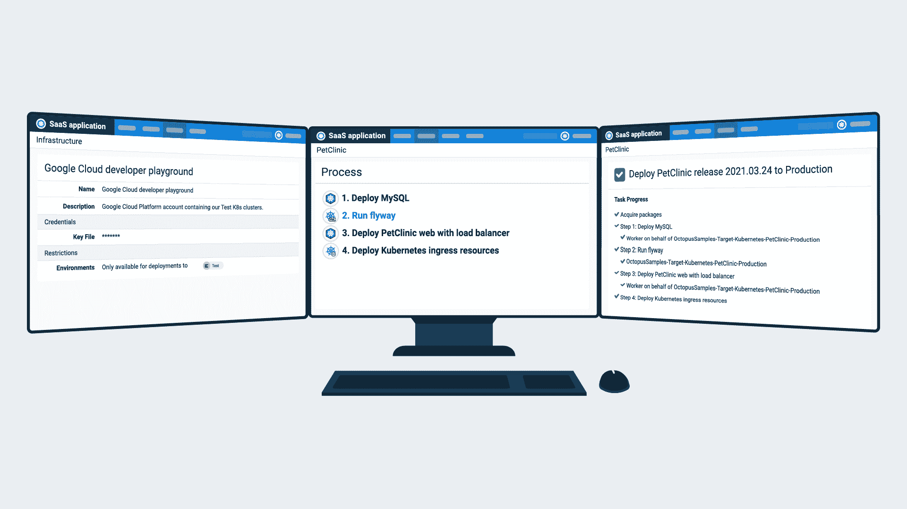

# Octopus 2021 Q3: Google Cloud 支持集中式 Kubernetes 部署和 run book-Octopus 部署

> 原文：<https://octopus.com/blog/octopus-release-2021-q3>

Octopus 2021 第三季度发布现已推出。

对谷歌云的内置支持使得在谷歌基础设施上管理部署和运行图书自动化变得更加容易——包括使用 Kubernetes 的容器化应用程序。

其他功能允许您:

*   使用我们的无代码 Workato 连接器将 Octopus 部署与业务工作流程集成
*   当您在 Linux 上自托管 Octopus 时，通过 LDAP 认证到 Active Directory
*   使用新的变量替换(八进制)过滤器创建更加动态的运行条件

## 包括在第 3 季度发行版中

*   章鱼服务器 2021.2 ( [发布说明](https://octopus.com/downloads/whatsnew/2021.2))
*   Octopus Deploy 5 的 Workato 连接器
*   触手 6.1.736
*   Octopus 部署 0.7.58 的平台提供程序

## 长期支持

下表显示了具有长期支持的 Octopus 服务器版本。

| 释放；排放；发布 | 长期支持 |
| --- | --- |
| 章鱼 2021.2 | 是 |
| 八达通 2021.1 | 是 |
| 八达通 2020.6 | 是(至 2021 年 9 月 30 日) |
| 章鱼 2020.5 | 期满 |

## 发布之旅

[https://www.youtube.com/embed/j3jTawfQuJo](https://www.youtube.com/embed/j3jTawfQuJo)

VIDEO

## 谷歌云平台

与谷歌云平台(GCP)的专门集成意味着您可以:

*   通过专用帐户类型连接 GCP 并进行身份验证
*   使用 GCP 命令行工具 gcloud
*   用地形创建和拆除 GCP 的基础设施
*   在谷歌容器注册表中存储和保护你的 Docker 图片(GCR)
*   使用 Octopus 和 Kubernetes 在 GCP 部署、扩展和管理容器化应用程序

在我们的帖子[中，了解如何开始为 Octopus Deploy](https://octopus.com/blog/google-cloud-platform-integration) 介绍 Google 云平台集成。

## Kubernetes 在谷歌云上的部署和操作手册

Octopus Deploy 使管理您的 Kubernetes 资源变得容易，无论您是从简单开始还是想要完全控制复杂的设置。

我们已经支持 Kubernetes 部署 3 年，并在 2020 年添加了 Runbooks。2021.2 对 GCP 的全功能支持为工程师和运营专业人员提供了终极的 Kubernetes 体验。

*   将您的 Kubernetes 集群和资源集中在一个地方，以便您可以专注于您的应用程序和客户
*   使用内置服务帐户进行简单安全的身份验证
*   利用共享变量简化您的部署和操作手册
*   实施蓝/绿、淡黄色和滚动部署等部署模式
*   使用预先批准的 kubectl 脚本
*   自动化日常维护并更快地响应紧急情况

我们的 Kubernetes 自动化支持三种方法:

1.  一个结构化的 UI 步骤，引导您完成配置，无需任何 YAML 输入
2.  用原始 YAML 配置的完全灵活的步骤
3.  舵图自动化步骤

在我们的文档中了解更多关于我们的 [Kubernetes 支持](https://octopus.com/docs/deployments/kubernetes)的信息。

### 注册参加网络研讨会:Kubernetes on Google Cloud with Octopus

加入我们下个月的网络研讨会，了解 Google Cloud、Octopus Deploy 和 Octopus Runbooks 如何提供终极 Kubernetes 体验。[立即注册](https://octopus.com/events/gcp-kubernetes-deployments-and-provisioning-with-octopus)。

## 章鱼工作头连接器

Workato 是一个集成平台即服务(iPaaS)，用于集成应用程序和自动化业务工作流。它连接了跨越不同行业和工作职能的庞大应用程序库。

我们的新型 Workato 连接器使您可以轻松:

*   包括 Octopus 部署在 Workato 工作流中，无需编写代码
*   对 Octopus Deploy 执行操作，例如创建和部署发布
*   创建通过触发器响应 Octopus 中事件的食谱

以下是让你开始的一些想法:

*   从其他系统(如 Slack、微软团队或吉拉)触发部署
*   在开发、测试或生产部署后，将更新发布到其他系统:
    *   将通知推送到宽限时间
    *   在吉拉、Zendesk 和 ServiceNow 等其他系统中自动更新票证

在我们的文章[介绍 Octopus Deploy 的 Workato 连接器](https://octopus.com/blog/introducing-workato-connector)中了解如何开始。

## LDAP 提供者

Octopus 2021.2 包括对轻量级目录访问协议(LDAP)的支持。LDAP 是一种与目录服务器交互的协议。

我们的 LDAP 身份验证提供商为 Octopus 客户提供了更多使用案例:

*   在 Windows 或 Linux 容器中自托管 Octopus 时，向微软的活动目录进行身份验证
*   与 OpenLDAP 等其他目录服务器交互
*   支持使用非 Windows 客户端的用户，包括 macOS

了解如何[开始使用用于 Octopus Deploy](https://octopus.com/blog/getting-started-with-ldap-auth-provider) 的 LDAP 身份验证提供者。

## 新的变量替换过滤器

Octopus 允许您定义变量，并在部署步骤、操作手册和文件中引用它们。

在 2021.2 中，我们将比较过滤器`Contains`、`Match`、`EndsWith`和`StartsWith`添加到 Octostache 中，Octopus Deploy 的变量替换语法。

这些过滤器对指定`#{if}`块中的条件很有用。它们根据比较结果返回`true`或`false`。

在我们的文档中了解更多关于变量替换[比较过滤器](https://octopus.com/docs/projects/variables/variable-filters#VariableSubstitutionSyntax-ComparisonFilters)的信息，或者查看我们的帖子[使用新的八进制过滤器](https://octopus.com/blog/variable-run-conditions-with-octostache)创建动态运行条件。

## 重大变化

这个版本包括一个突破性的变化。

对于使用执行容器的步骤，新的升级脚本将`OctopusUseBundledTooling`属性设置为`False`。否则，脚本会将属性设置为`True`或考虑遗留变量。这种变化只影响使用定制 Windows 执行容器的用户，他们依赖 Octopus 来注入 Azure 或 AWS 工具。在 GitHub 问题中阅读该用例[的解决方法。](https://github.com/OctopusDeploy/Issues/issues/6999)

## 升级或开始

八达通云用户已经在运行这个版本，自托管八达通客户现在可以下载最新版本。

[下载最新版本](https://octopus.com/downloads/2021.2.0)

我们鼓励你回顾升级八达通服务器的[步骤。更多信息请参见](https://octopus.com/docs/administration/upgrading)[发行说明](https://octopus.com/downloads/whatsnew/2021.2)。

如果你以前从未使用过 Octopus，[注册](https://octopus.com/start)进行免费试用，或者[发送电子邮件给我们的客户成功团队](mailto:customersuccess@octopus.com)观看演示并了解更多信息。

## 未来的版本中会有什么？

查看我们的[公共路线图](https://octopus.com/roadmap)以了解最新消息并注册更新。

## 结论

Octopus 2021 Q3 通过集中式 Kubernetes 部署和 runbooks 提供谷歌云支持。

这个版本还包括 Octopus 的 Workato 连接器，我们的新 LDAP 提供者，以及 Octopus che 的新变量替换过滤器。

我们期待在下一个版本中发布更多优秀的特性。

我们欢迎您提出任何问题或意见。你可以在下面留下评论或者加入我们的[章鱼社区 Slack](https://octopus.com/slack) 的对话。

愉快的部署！